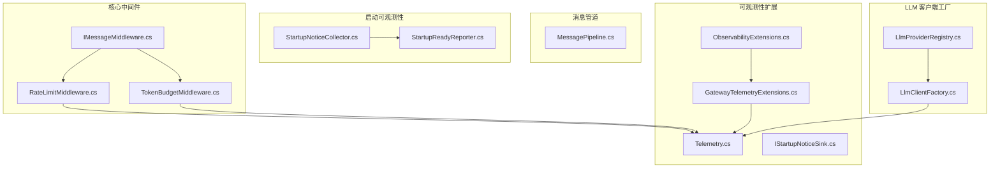
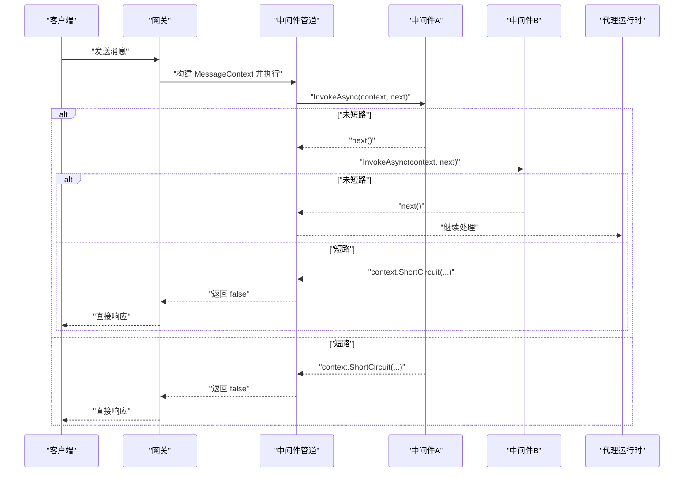
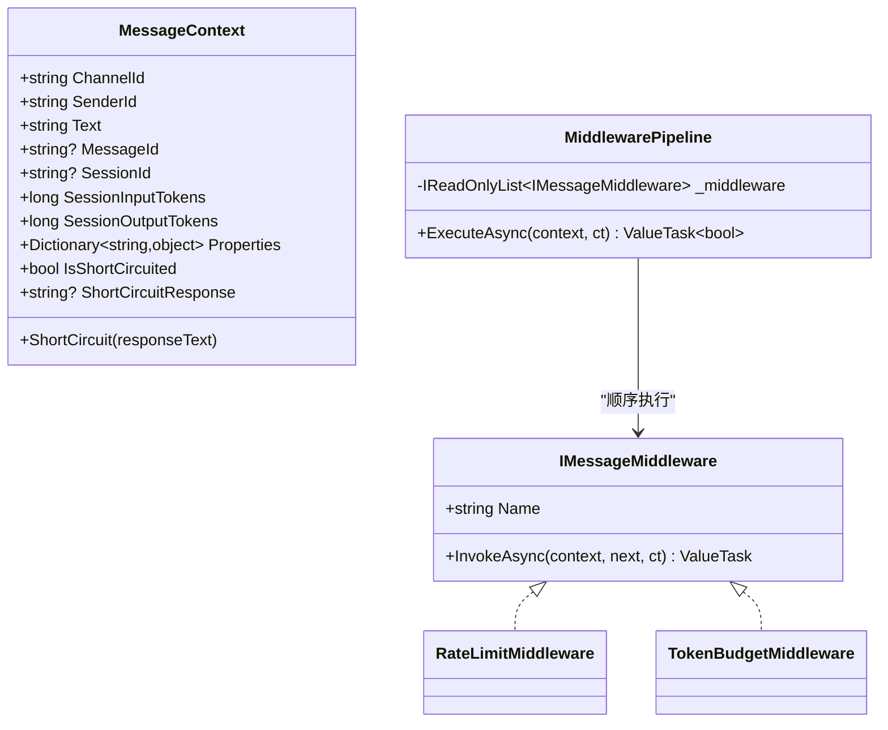
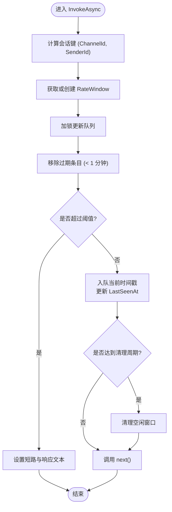
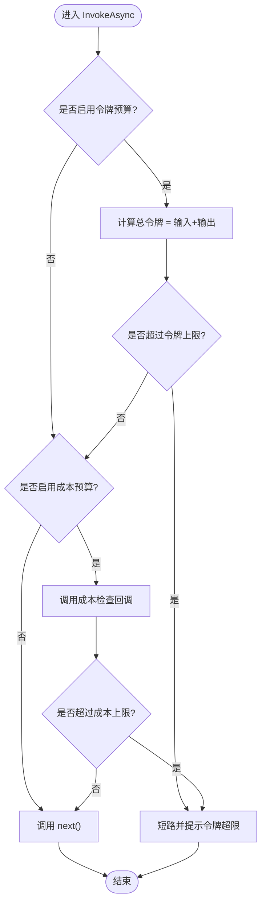
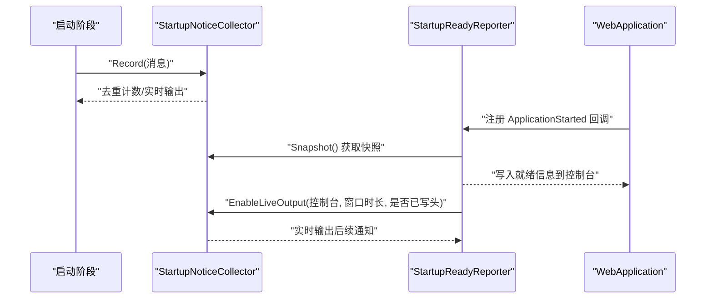
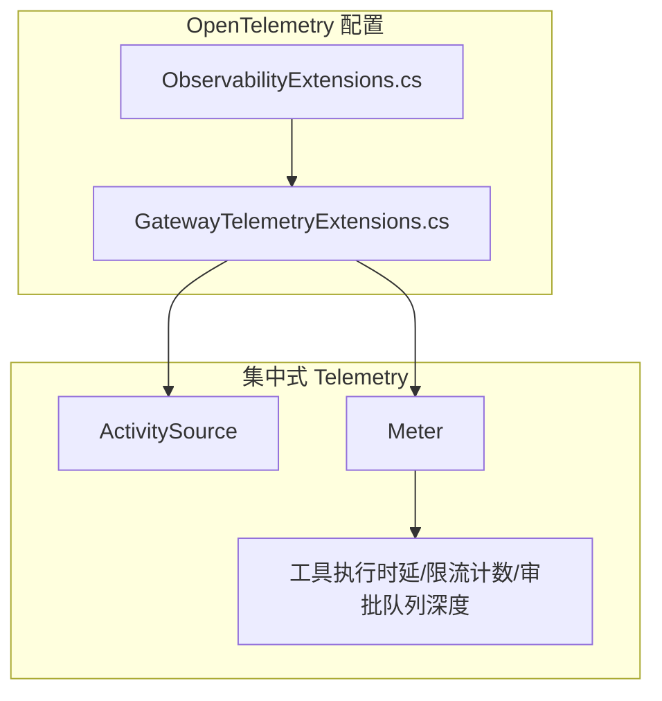
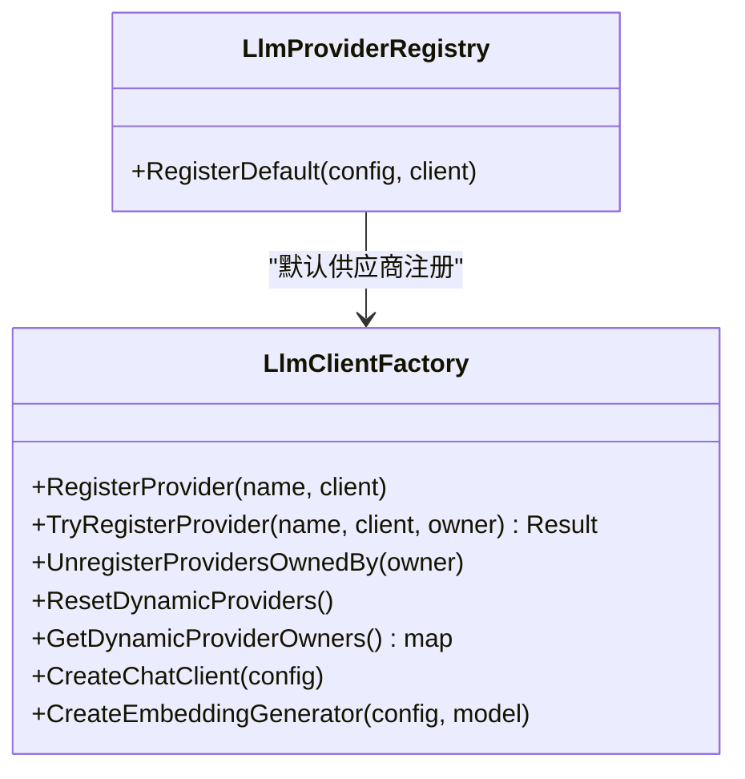
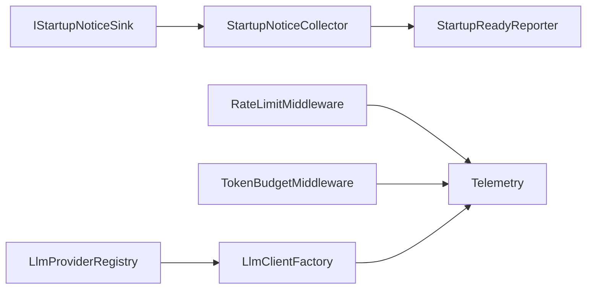

# 中间件管道

<cite>
**本文引用的文件**
- [IMessageMiddleware.cs](file://src/OpenClaw.Core/Middleware/IMessageMiddleware.cs)
- [RateLimitMiddleware.cs](file://src/OpenClaw.Core/Middleware/RateLimitMiddleware.cs)
- [TokenBudgetMiddleware.cs](file://src/OpenClaw.Core/Middleware/TokenBudgetMiddleware.cs)
- [MessagePipeline.cs](file://src/OpenClaw.Core/Pipeline/MessagePipeline.cs)
- [StartupNoticeCollector.cs](file://src/OpenClaw.Gateway/Pipeline/StartupNoticeCollector.cs)
- [StartupReadyReporter.cs](file://src/OpenClaw.Gateway/Pipeline/StartupReadyReporter.cs)
- [GatewayTelemetryExtensions.cs](file://src/OpenClaw.Gateway/Extensions/GatewayTelemetryExtensions.cs)
- [ObservabilityExtensions.cs](file://src/OpenClaw.Gateway/Composition/ObservabilityExtensions.cs)
- [LlmClientFactory.cs](file://src/OpenClaw.Gateway/Extensions/LlmClientFactory.cs)
- [Telemetry.cs](file://src/OpenClaw.Core/Observability/Telemetry.cs)
- [IStartupNoticeSink.cs](file://src/OpenClaw.Core/Observability/IStartupNoticeSink.cs)
- [LlmProviderRegistry.cs](file://src/OpenClaw.Gateway/LlmProviderRegistry.cs)
- [BeyondBaseTests.cs](file://src/OpenClaw.Tests/BeyondBaseTests.cs)
</cite>

## 目录
1. [简介](#简介)
2. [项目结构](#项目结构)
3. [核心组件](#核心组件)
4. [架构总览](#架构总览)
5. [详细组件分析](#详细组件分析)
6. [依赖关系分析](#依赖关系分析)
7. [性能考量](#性能考量)
8. [故障排查指南](#故障排查指南)
9. [结论](#结论)
10. [附录：中间件开发与调试指南](#附录中间件开发与调试指南)

## 简介
本文件系统化阐述中间件管道的设计与实现，覆盖以下主题：
- 中间件架构与执行顺序
- 请求处理流程与短路机制
- 可观测性中间件与指标体系
- LLM 客户端工厂与认证策略
- 启动通知收集与就绪状态报告
- 中间件注册、配置管理、性能监控与错误传播
- 自定义中间件开发步骤与调试技巧

## 项目结构
中间件与消息处理相关的核心位置如下：
- 核心中间件与上下文：src/OpenClaw.Core/Middleware
- 消息通道与流水线：src/OpenClaw.Core/Pipeline
- 启动可观测性与就绪报告：src/OpenClaw.Gateway/Pipeline
- 可观测性扩展与指标：src/OpenClaw.Gateway/Extensions, src/OpenClaw.Core/Observability
- LLM 客户端工厂与注册表：src/OpenClaw.Gateway/Extensions, src/OpenClaw.Gateway

**图表来源**
- [IMessageMiddleware.cs:1-97](file://src/OpenClaw.Core/Middleware/IMessageMiddleware.cs#L1-L97)
- [RateLimitMiddleware.cs:1-93](file://src/OpenClaw.Core/Middleware/RateLimitMiddleware.cs#L1-L93)
- [TokenBudgetMiddleware.cs:1-71](file://src/OpenClaw.Core/Middleware/TokenBudgetMiddleware.cs#L1-L71)
- [MessagePipeline.cs:1-56](file://src/OpenClaw.Core/Pipeline/MessagePipeline.cs#L1-L56)
- [StartupNoticeCollector.cs:1-72](file://src/OpenClaw.Gateway/Pipeline/StartupNoticeCollector.cs#L1-L72)
- [StartupReadyReporter.cs:1-151](file://src/OpenClaw.Gateway/Pipeline/StartupReadyReporter.cs#L1-L151)
- [GatewayTelemetryExtensions.cs:1-52](file://src/OpenClaw.Gateway/Extensions/GatewayTelemetryExtensions.cs#L1-L52)
- [ObservabilityExtensions.cs:1-14](file://src/OpenClaw.Gateway/Composition/ObservabilityExtensions.cs#L1-L14)
- [Telemetry.cs:1-54](file://src/OpenClaw.Core/Observability/Telemetry.cs#L1-L54)
- [IStartupNoticeSink.cs:1-20](file://src/OpenClaw.Core/Observability/IStartupNoticeSink.cs#L1-L20)
- [LlmClientFactory.cs:1-454](file://src/OpenClaw.Gateway/Extensions/LlmClientFactory.cs#L1-L454)
- [LlmProviderRegistry.cs:1-38](file://src/OpenClaw.Gateway/LlmProviderRegistry.cs#L1-L38)

**章节来源**
- [IMessageMiddleware.cs:1-97](file://src/OpenClaw.Core/Middleware/IMessageMiddleware.cs#L1-L97)
- [MessagePipeline.cs:1-56](file://src/OpenClaw.Core/Pipeline/MessagePipeline.cs#L1-L56)
- [StartupNoticeCollector.cs:1-72](file://src/OpenClaw.Gateway/Pipeline/StartupNoticeCollector.cs#L1-L72)
- [StartupReadyReporter.cs:1-151](file://src/OpenClaw.Gateway/Pipeline/StartupReadyReporter.cs#L1-L151)
- [GatewayTelemetryExtensions.cs:1-52](file://src/OpenClaw.Gateway/Extensions/GatewayTelemetryExtensions.cs#L1-L52)
- [ObservabilityExtensions.cs:1-14](file://src/OpenClaw.Gateway/Composition/ObservabilityExtensions.cs#L1-L14)
- [Telemetry.cs:1-54](file://src/OpenClaw.Core/Observability/Telemetry.cs#L1-L54)
- [IStartupNoticeSink.cs:1-20](file://src/OpenClaw.Core/Observability/IStartupNoticeSink.cs#L1-L20)
- [LlmClientFactory.cs:1-454](file://src/OpenClaw.Gateway/Extensions/LlmClientFactory.cs#L1-L454)
- [LlmProviderRegistry.cs:1-38](file://src/OpenClaw.Gateway/LlmProviderRegistry.cs#L1-L38)

## 核心组件
- 中间件接口与上下文
  - MessageContext：承载通道标识、发送者、消息文本、会话令牌计数、可传递属性、短路控制等。
  - IMessageMiddleware：定义中间件契约（名称与异步调用）。
  - MiddlewarePipeline：按序执行中间件链，支持短路与返回布尔结果。
- 速率限制中间件：基于会话窗口的每分钟消息上限控制，带空闲清理。
- 令牌预算中间件：基于会话输入/输出令牌总量与可选美元成本预算进行短路。
- 消息通道：使用有界通道进行入站/出站消息背压，避免内存溢出。
- 启动通知收集与就绪报告：在应用启动完成后汇总并打印启动提示，同时支持实时输出窗口。
- 可观测性：集中式 OpenTelemetry 配置、指标与分布式追踪。
- LLM 客户端工厂：统一创建与注册不同供应商的聊天客户端，支持动态注册与认证策略。

**章节来源**
- [IMessageMiddleware.cs:7-38](file://src/OpenClaw.Core/Middleware/IMessageMiddleware.cs#L7-L38)
- [IMessageMiddleware.cs:44-54](file://src/OpenClaw.Core/Middleware/IMessageMiddleware.cs#L44-L54)
- [IMessageMiddleware.cs:59-96](file://src/OpenClaw.Core/Middleware/IMessageMiddleware.cs#L59-L96)
- [RateLimitMiddleware.cs:10-93](file://src/OpenClaw.Core/Middleware/RateLimitMiddleware.cs#L10-L93)
- [TokenBudgetMiddleware.cs:12-71](file://src/OpenClaw.Core/Middleware/TokenBudgetMiddleware.cs#L12-L71)
- [MessagePipeline.cs:11-56](file://src/OpenClaw.Core/Pipeline/MessagePipeline.cs#L11-L56)
- [StartupNoticeCollector.cs:7-72](file://src/OpenClaw.Gateway/Pipeline/StartupNoticeCollector.cs#L7-L72)
- [StartupReadyReporter.cs:7-151](file://src/OpenClaw.Gateway/Pipeline/StartupReadyReporter.cs#L7-L151)
- [GatewayTelemetryExtensions.cs:12-52](file://src/OpenClaw.Gateway/Extensions/GatewayTelemetryExtensions.cs#L12-L52)
- [Telemetry.cs:9-54](file://src/OpenClaw.Core/Observability/Telemetry.cs#L9-L54)
- [LlmClientFactory.cs:17-454](file://src/OpenClaw.Gateway/Extensions/LlmClientFactory.cs#L17-L454)

## 架构总览
中间件管道位于“消息进入网关后、进入代理运行时前”的关键路径上，负责：
- 顺序执行一组可插拔中间件
- 在任意节点短路请求（例如限流/预算超限）
- 通过可观测性扩展记录指标与日志
- 通过 LLM 客户端工厂统一接入多供应商模型服务

**图表来源**
- [IMessageMiddleware.cs:59-96](file://src/OpenClaw.Core/Middleware/IMessageMiddleware.cs#L59-L96)
- [RateLimitMiddleware.cs:39-68](file://src/OpenClaw.Core/Middleware/RateLimitMiddleware.cs#L39-L68)
- [TokenBudgetMiddleware.cs:36-69](file://src/OpenClaw.Core/Middleware/TokenBudgetMiddleware.cs#L36-L69)

## 详细组件分析

### 中间件接口与管道执行模型
- 设计要点
  - MessageContext 提供短路能力与属性透传，便于中间件协作。
  - MiddlewarePipeline 使用尾递归风格的 Next 函数，保证顺序与可组合性。
  - 返回值表示是否继续进入代理运行时，便于上层统一处理。
- 性能特性
  - 管道无额外分配，Next 为局部函数，减少闭包开销。
  - 测试验证每消息分配极低，适合高吞吐场景。

**图表来源**
- [IMessageMiddleware.cs:7-38](file://src/OpenClaw.Core/Middleware/IMessageMiddleware.cs#L7-L38)
- [IMessageMiddleware.cs:44-54](file://src/OpenClaw.Core/Middleware/IMessageMiddleware.cs#L44-L54)
- [IMessageMiddleware.cs:59-96](file://src/OpenClaw.Core/Middleware/IMessageMiddleware.cs#L59-L96)

**章节来源**
- [IMessageMiddleware.cs:7-38](file://src/OpenClaw.Core/Middleware/IMessageMiddleware.cs#L7-L38)
- [IMessageMiddleware.cs:59-96](file://src/OpenClaw.Core/Middleware/IMessageMiddleware.cs#L59-L96)
- [BeyondBaseTests.cs:315-433](file://src/OpenClaw.Tests/BeyondBaseTests.cs#L315-L433)

### 速率限制中间件
- 功能
  - 基于会话维度维护最近一分钟的消息时间戳队列。
  - 超限时短路并返回用户友好提示。
  - 定期清理空闲窗口，降低内存占用。
- 关键参数
  - 最大每分钟消息数、空闲 TTL、清理频率。
- 指标联动
  - 可结合 Telemetry 的速率限制计数器进行观测。

**图表来源**
- [RateLimitMiddleware.cs:39-91](file://src/OpenClaw.Core/Middleware/RateLimitMiddleware.cs#L39-L91)

**章节来源**
- [RateLimitMiddleware.cs:10-93](file://src/OpenClaw.Core/Middleware/RateLimitMiddleware.cs#L10-L93)
- [Telemetry.cs:34-40](file://src/OpenClaw.Core/Observability/Telemetry.cs#L34-L40)

### 令牌预算中间件
- 功能
  - 基于会话累计输入/输出令牌总量判断是否超限。
  - 支持可选的美元成本预算回调，按通道/发送者维度检查。
- 错误传播
  - 超限时短路并设置响应文本，由上层直接返回给客户端。

**图表来源**
- [TokenBudgetMiddleware.cs:36-69](file://src/OpenClaw.Core/Middleware/TokenBudgetMiddleware.cs#L36-L69)

**章节来源**
- [TokenBudgetMiddleware.cs:12-71](file://src/OpenClaw.Core/Middleware/TokenBudgetMiddleware.cs#L12-L71)

### 启动通知收集与就绪报告
- 启动通知收集器
  - 记录重复消息并统计次数；支持实时输出窗口，首条消息写入控制台并可追加后续消息。
- 就绪报告器
  - 应用启动完成后，汇总通知并渲染就绪信息，包括监听地址、UI 链接、诊断命令等；可开启实时输出窗口以持续展示后续通知。

**图表来源**
- [StartupNoticeCollector.cs:34-70](file://src/OpenClaw.Gateway/Pipeline/StartupNoticeCollector.cs#L34-L70)
- [StartupReadyReporter.cs:11-50](file://src/OpenClaw.Gateway/Pipeline/StartupReadyReporter.cs#L11-L50)

**章节来源**
- [StartupNoticeCollector.cs:7-72](file://src/OpenClaw.Gateway/Pipeline/StartupNoticeCollector.cs#L7-L72)
- [StartupReadyReporter.cs:7-151](file://src/OpenClaw.Gateway/Pipeline/StartupReadyReporter.cs#L7-L151)
- [IStartupNoticeSink.cs:3-19](file://src/OpenClaw.Core/Observability/IStartupNoticeSink.cs#L3-L19)

### 可观测性中间件与指标体系
- OpenTelemetry 集成
  - 日志、指标、追踪三者统一配置，OTLP 导出默认启用。
  - 通过集中式 Telemetry 提供 ActivitySource 与 Meter，便于跨模块共享。
- 关键指标
  - 工具执行时延直方图、速率限制触发计数、审批队列深度可观测量等。
- 实践建议
  - 在中间件中使用 Telemetry.ActivitySource 追踪关键路径。
  - 对限流/预算等策略事件打点，便于告警与容量规划。

**图表来源**
- [GatewayTelemetryExtensions.cs:18-51](file://src/OpenClaw.Gateway/Extensions/GatewayTelemetryExtensions.cs#L18-L51)
- [ObservabilityExtensions.cs:7-13](file://src/OpenClaw.Gateway/Composition/ObservabilityExtensions.cs#L7-L13)
- [Telemetry.cs:17-52](file://src/OpenClaw.Core/Observability/Telemetry.cs#L17-L52)

**章节来源**
- [GatewayTelemetryExtensions.cs:12-52](file://src/OpenClaw.Gateway/Extensions/GatewayTelemetryExtensions.cs#L12-L52)
- [ObservabilityExtensions.cs:5-14](file://src/OpenClaw.Gateway/Composition/ObservabilityExtensions.cs#L5-L14)
- [Telemetry.cs:9-54](file://src/OpenClaw.Core/Observability/Telemetry.cs#L9-L54)

### LLM 客户端工厂与认证策略
- 统一工厂
  - 支持多种供应商（OpenAI、Anthropic、Gemini、Ollama、Azure OpenAI、兼容接口等），优先动态注册，其次内置映射。
  - 提供嵌入生成器创建能力，按供应商差异处理。
- 认证与元数据
  - 对兼容接口提供请求策略，支持移除 Authorization 头并注入安全的请求元数据头。
  - 支持 tailnet-identity 等认证模式的特殊处理。
- 注册表
  - 内置注册表用于默认供应商与模型清单管理，便于选择与回退。

**图表来源**
- [LlmClientFactory.cs:36-77](file://src/OpenClaw.Gateway/Extensions/LlmClientFactory.cs#L36-L77)
- [LlmClientFactory.cs:78-163](file://src/OpenClaw.Gateway/Extensions/LlmClientFactory.cs#L78-L163)
- [LlmClientFactory.cs:412-453](file://src/OpenClaw.Gateway/Extensions/LlmClientFactory.cs#L412-L453)
- [LlmProviderRegistry.cs:21-38](file://src/OpenClaw.Gateway/LlmProviderRegistry.cs#L21-L38)

**章节来源**
- [LlmClientFactory.cs:17-454](file://src/OpenClaw.Gateway/Extensions/LlmClientFactory.cs#L17-L454)
- [LlmProviderRegistry.cs:7-38](file://src/OpenClaw.Gateway/LlmProviderRegistry.cs#L7-L38)

## 依赖关系分析
- 中间件对可观测性的依赖
  - 速率限制与令牌预算中间件可通过日志与 Telemetry 指标进行观测。
- 启动阶段的依赖
  - StartupNoticeCollector 作为 IStartupNoticeSink 的具体实现，被 StartupReadyReporter 读取并渲染。
- LLM 客户端与中间件的协作
  - 中间件可基于 MessageContext 的属性与令牌计数影响后续 LLM 调用策略（如预算控制）。

**图表来源**
- [RateLimitMiddleware.cs:39-68](file://src/OpenClaw.Core/Middleware/RateLimitMiddleware.cs#L39-L68)
- [TokenBudgetMiddleware.cs:36-69](file://src/OpenClaw.Core/Middleware/TokenBudgetMiddleware.cs#L36-L69)
- [Telemetry.cs:28-52](file://src/OpenClaw.Core/Observability/Telemetry.cs#L28-L52)
- [StartupNoticeCollector.cs:34-70](file://src/OpenClaw.Gateway/Pipeline/StartupNoticeCollector.cs#L34-L70)
- [StartupReadyReporter.cs:22-32](file://src/OpenClaw.Gateway/Pipeline/StartupReadyReporter.cs#L22-L32)
- [IStartupNoticeSink.cs:3-19](file://src/OpenClaw.Core/Observability/IStartupNoticeSink.cs#L3-L19)
- [LlmClientFactory.cs:17-454](file://src/OpenClaw.Gateway/Extensions/LlmClientFactory.cs#L17-L454)
- [LlmProviderRegistry.cs:21-38](file://src/OpenClaw.Gateway/LlmProviderRegistry.cs#L21-L38)

**章节来源**
- [IMessageMiddleware.cs:1-97](file://src/OpenClaw.Core/Middleware/IMessageMiddleware.cs#L1-L97)
- [StartupNoticeCollector.cs:1-72](file://src/OpenClaw.Gateway/Pipeline/StartupNoticeCollector.cs#L1-L72)
- [StartupReadyReporter.cs:1-151](file://src/OpenClaw.Gateway/Pipeline/StartupReadyReporter.cs#L1-L151)
- [Telemetry.cs:1-54](file://src/OpenClaw.Core/Observability/Telemetry.cs#L1-L54)
- [LlmClientFactory.cs:1-454](file://src/OpenClaw.Gateway/Extensions/LlmClientFactory.cs#L1-L454)
- [LlmProviderRegistry.cs:1-38](file://src/OpenClaw.Gateway/LlmProviderRegistry.cs#L1-L38)

## 性能考量
- 中间件管道
  - 采用轻量级 Next 局部函数，避免闭包捕获与分配。
  - 单次执行仅在必要时分配，测试覆盖每消息分配上限。
- 消息通道
  - 有界通道与等待模式防止内存压力，适合高并发场景。
- LLM 客户端
  - 传输层禁用隐藏重试，降低抖动；按需注入请求元数据，避免敏感头泄露。
- 可观测性
  - 使用直方图与计数器记录关键指标，便于容量与性能分析。

**章节来源**
- [BeyondBaseTests.cs:357-379](file://src/OpenClaw.Tests/BeyondBaseTests.cs#L357-L379)
- [MessagePipeline.cs:17-28](file://src/OpenClaw.Core/Pipeline/MessagePipeline.cs#L17-L28)
- [LlmClientFactory.cs:313-335](file://src/OpenClaw.Gateway/Extensions/LlmClientFactory.cs#L313-L335)
- [Telemetry.cs:28-52](file://src/OpenClaw.Core/Observability/Telemetry.cs#L28-L52)

## 故障排查指南
- 中间件短路
  - 若请求被短路，检查 MessageContext.ShortCircuitResponse 与 IsShortCircuited 标记，定位触发中间件（速率限制/令牌预算）。
- 启动通知
  - 使用 StartupReadyReporter 渲染的就绪信息核对监听地址与 UI 链接；若无就绪输出，检查 ApplicationStarted 回调是否执行。
- LLM 客户端
  - 动态注册冲突：确认 TryRegisterProvider 返回值与所有者列表；必要时使用 UnregisterProvidersOwnedBy 清理。
  - 兼容接口认证：当 AuthMode 为 tailnet-identity 时，确保不向嵌入模型发送该认证模式。
- 可观测性
  - 确认 OpenTelemetry 已正确添加到服务构建器；检查 OTLP 导出器配置与网络可达性。

**章节来源**
- [IMessageMiddleware.cs:28-37](file://src/OpenClaw.Core/Middleware/IMessageMiddleware.cs#L28-L37)
- [StartupReadyReporter.cs:18-49](file://src/OpenClaw.Gateway/Pipeline/StartupReadyReporter.cs#L18-L49)
- [LlmClientFactory.cs:45-77](file://src/OpenClaw.Gateway/Extensions/LlmClientFactory.cs#L45-L77)
- [LlmClientFactory.cs:256-280](file://src/OpenClaw.Gateway/Extensions/LlmClientFactory.cs#L256-L280)
- [GatewayTelemetryExtensions.cs:18-51](file://src/OpenClaw.Gateway/Extensions/GatewayTelemetryExtensions.cs#L18-L51)

## 结论
中间件管道以简洁、可组合的方式实现了请求前置治理与可观测性集成，配合有界通道与统一的 LLM 客户端工厂，形成从“入口校验—指标可观测—模型接入”的完整闭环。通过速率限制与令牌预算中间件，系统在高负载下仍能保持稳定与可控；通过启动通知与就绪报告，提升了运维可见性与效率。

## 附录：中间件开发与调试指南
- 开发步骤
  - 实现 IMessageMiddleware 接口，定义 Name 与 InvokeAsync。
  - 在 InvokeAsync 中决定调用 next() 或设置 context.ShortCircuit(...)。
  - 在 MessageContext.Properties 中传递必要上下文，避免紧耦合。
- 注册与顺序
  - 将中间件实例按期望顺序构造 MiddlewarePipeline。
  - 顺序即执行顺序，短路将阻止后续中间件执行。
- 配置管理
  - 速率限制与令牌预算参数通过构造函数注入；可在服务注册阶段集中配置。
- 性能监控
  - 使用 Telemetry.ActivitySource 记录关键跨度；使用 Meter 发布直方图/计数器。
- 错误传播
  - 短路时设置 ShortCircuitResponse，由上层统一返回；避免抛出异常穿透中间件链。
- 自定义中间件示例思路
  - 输入清洗：在 InvokeAsync 中修改 context.Text，并调用 next()。
  - 策略拦截：根据上下文属性判断是否短路。
  - 会话增强：在 Properties 中写入下游所需信息。
- 调试技巧
  - 利用测试用例模式（参考测试文件中的断言与顺序验证）快速验证执行顺序与短路行为。
  - 在关键节点打印日志并结合 Telemetry 指标进行回归对比。

**章节来源**
- [IMessageMiddleware.cs:44-54](file://src/OpenClaw.Core/Middleware/IMessageMiddleware.cs#L44-L54)
- [IMessageMiddleware.cs:59-96](file://src/OpenClaw.Core/Middleware/IMessageMiddleware.cs#L59-L96)
- [BeyondBaseTests.cs:315-433](file://src/OpenClaw.Tests/BeyondBaseTests.cs#L315-L433)
- [Telemetry.cs:17-52](file://src/OpenClaw.Core/Observability/Telemetry.cs#L17-L52)