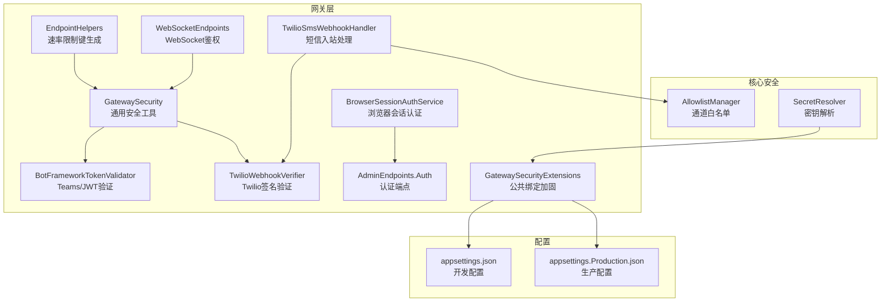
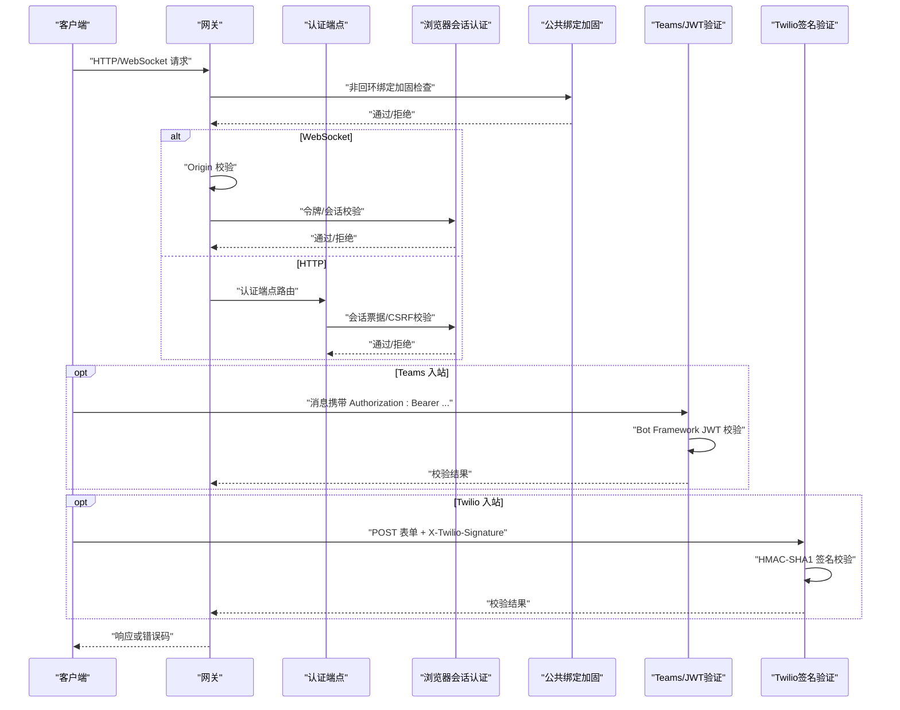
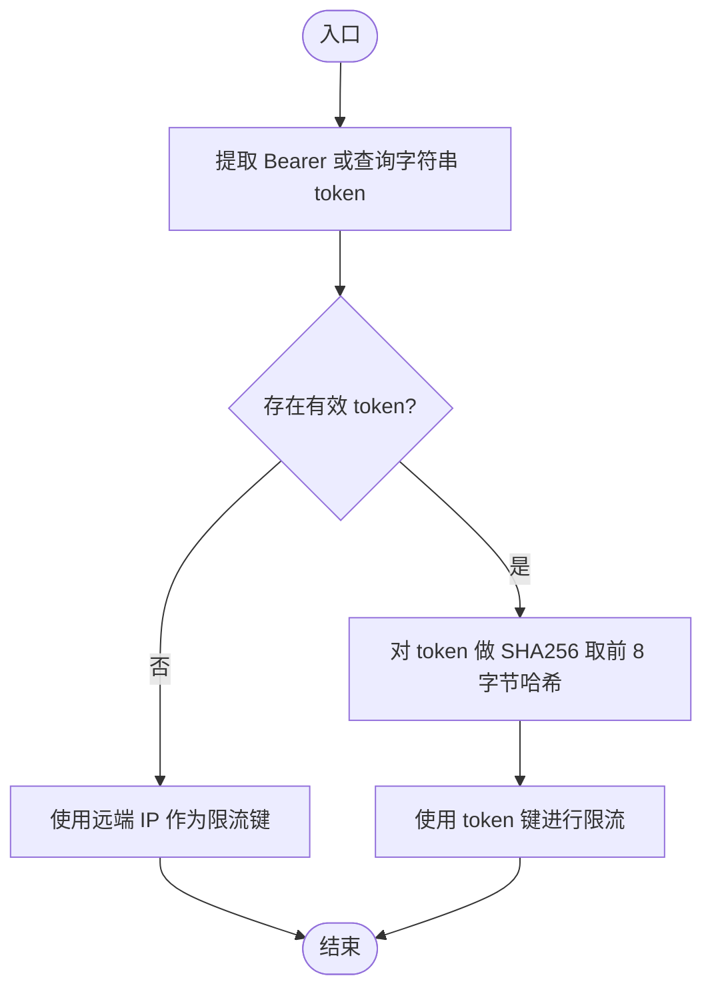
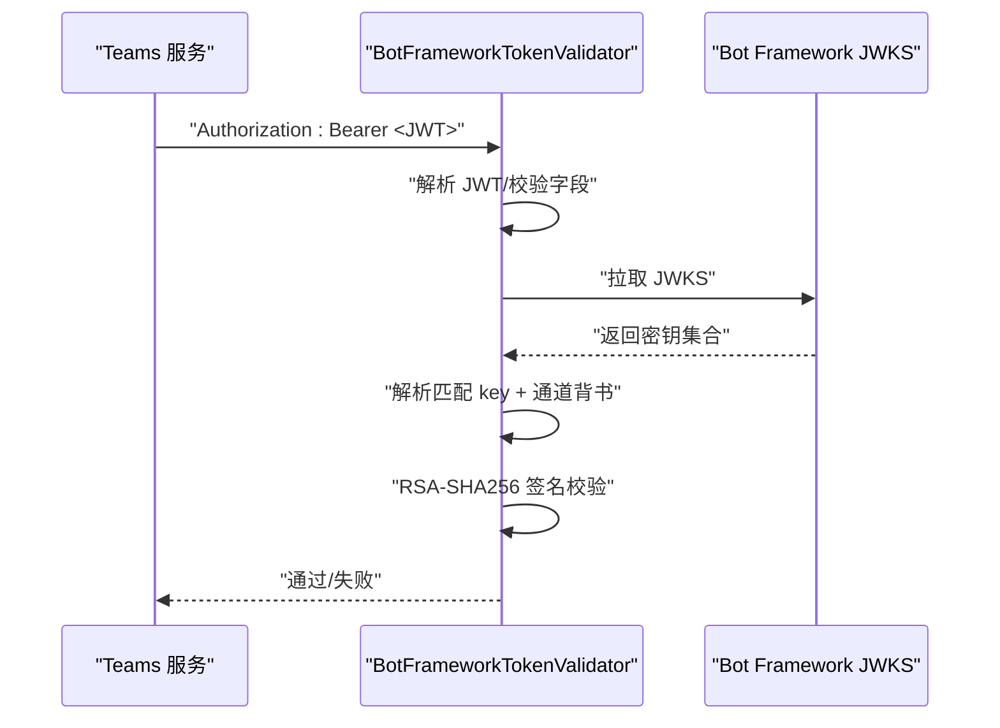
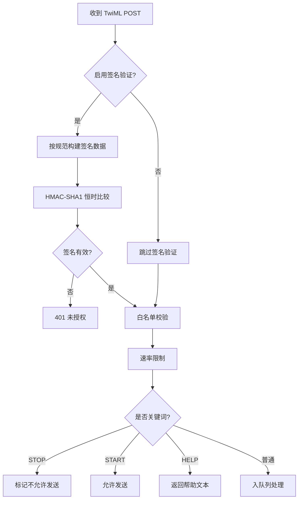
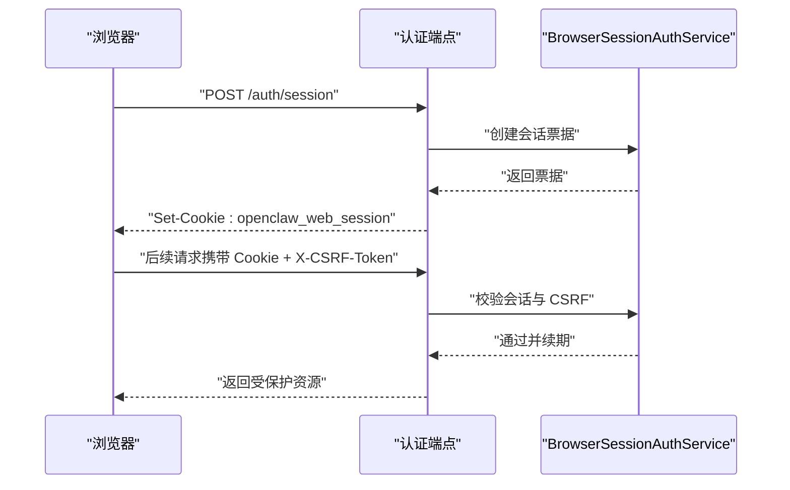
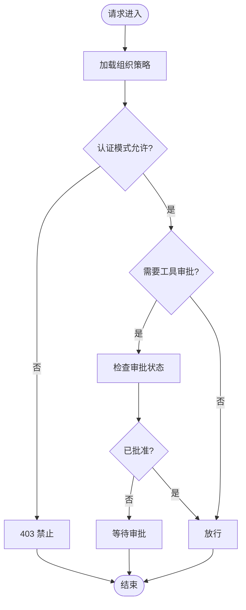
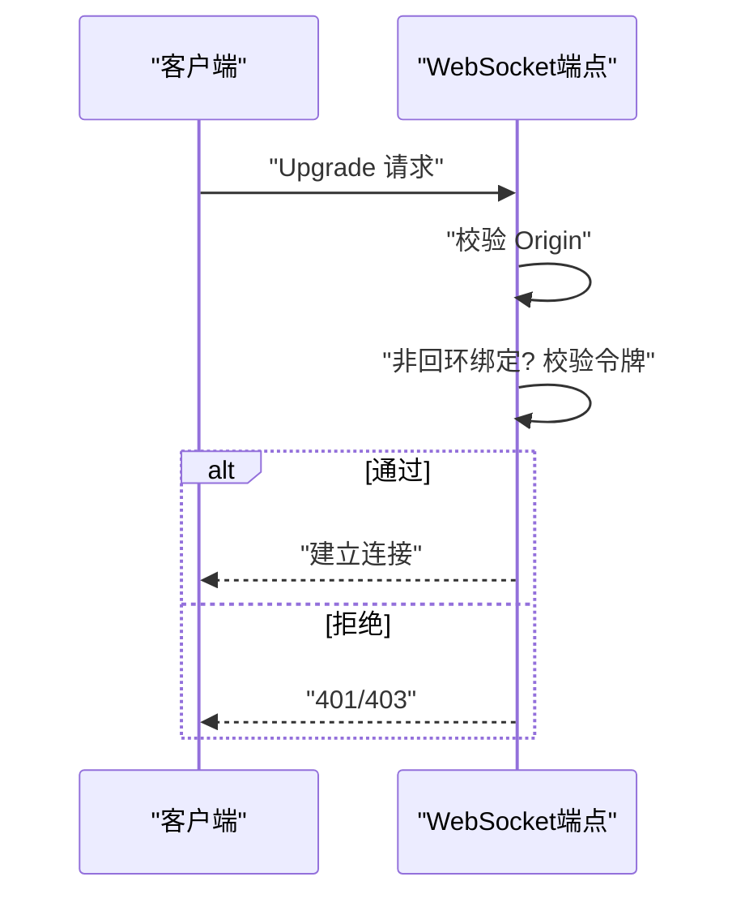
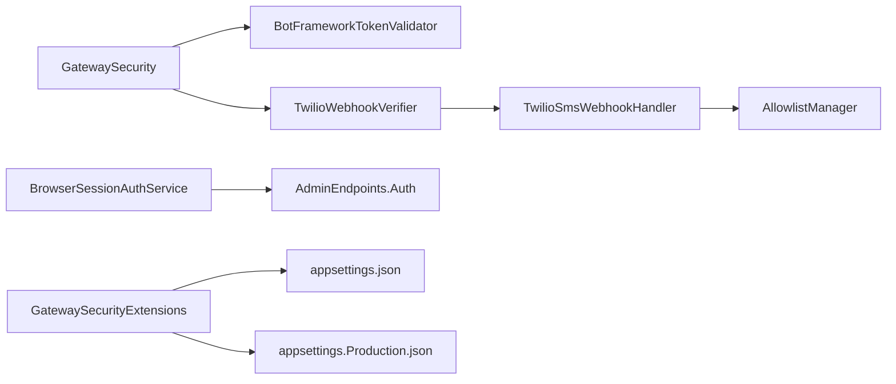

# 安全与认证

<cite>
**本文引用的文件**
- [GatewaySecurity.cs](file://src/OpenClaw.Gateway/GatewaySecurity.cs)
- [BotFrameworkTokenValidator.cs](file://src/OpenClaw.Gateway/BotFrameworkTokenValidator.cs)
- [TwilioWebhookVerifier.cs](file://src/OpenClaw.Gateway/TwilioWebhookVerifier.cs)
- [TwilioSmsWebhookHandler.cs](file://src/OpenClaw.Gateway/TwilioSmsWebhookHandler.cs)
- [BrowserSessionAuthService.cs](file://src/OpenClaw.Gateway/BrowserSessionAuthService.cs)
- [AdminEndpoints.Auth.cs](file://src/OpenClaw.Gateway/Endpoints/AdminEndpoints.Auth.cs)
- [GatewaySecurityExtensions.cs](file://src/OpenClaw.Gateway/Extensions/GatewaySecurityExtensions.cs)
- [SecurityServicesExtensions.cs](file://src/OpenClaw.Gateway/Composition/SecurityServicesExtensions.cs)
- [AllowlistManager.cs](file://src/OpenClaw.Core/Security/AllowlistManager.cs)
- [SecretResolver.cs](file://src/OpenClaw.Core/Security/SecretResolver.cs)
- [appsettings.json](file://src/OpenClaw.Gateway/appsettings.json)
- [appsettings.Production.json](file://src/OpenClaw.Gateway/appsettings.Production.json)
- [EndpointHelpers.cs](file://src/OpenClaw.Gateway/Endpoints/EndpointHelpers.cs)
- [WebSocketEndpoints.cs](file://src/OpenClaw.Gateway/Endpoints/WebSocketEndpoints.cs)
- [OperatorApiModels.cs](file://src/OpenClaw.Core/Models/OperatorApiModels.cs)
</cite>

## 目录
1. [简介](#简介)
2. [项目结构](#项目结构)
3. [核心组件](#核心组件)
4. [架构总览](#架构总览)
5. [详细组件分析](#详细组件分析)
6. [依赖关系分析](#依赖关系分析)
7. [性能考量](#性能考量)
8. [故障排查指南](#故障排查指南)
9. [结论](#结论)
10. [附录](#附录)

## 简介
本文件面向网关的安全与认证体系，系统性阐述以下内容：
- 认证机制：API 密钥验证、浏览器会话认证、Bot Framework JWT 验证、Twilio 签名验证
- 授权策略与权限控制：基于组织策略、操作员账户与角色、工具审批流程
- 访问令牌管理与会话管理：浏览器会话票据、CSRF 保护、过期与续期
- 安全中间件与请求拦截：速率限制、来源校验、公共绑定加固
- 威胁防护与审计日志：签名验证、白名单策略、审计记录与合规检查
- 安全配置示例、最佳实践与漏洞防护指南

## 项目结构
安全与认证相关代码主要分布在以下模块：
- 网关层（Gateway）：认证端点、会话服务、通道验证器、安全扩展
- 核心安全（Core.Security）：白名单管理、密钥解析、输入清理等
- 配置（appsettings.*.json）：安全策略、通道参数、默认行为

图表来源
- [GatewaySecurity.cs:1-109](file://src/OpenClaw.Gateway/GatewaySecurity.cs#L1-L109)
- [BotFrameworkTokenValidator.cs:1-410](file://src/OpenClaw.Gateway/BotFrameworkTokenValidator.cs#L1-L410)
- [TwilioWebhookVerifier.cs:1-40](file://src/OpenClaw.Gateway/TwilioWebhookVerifier.cs#L1-L40)
- [TwilioSmsWebhookHandler.cs:1-246](file://src/OpenClaw.Gateway/TwilioSmsWebhookHandler.cs#L1-L246)
- [BrowserSessionAuthService.cs:1-180](file://src/OpenClaw.Gateway/BrowserSessionAuthService.cs#L1-L180)
- [AdminEndpoints.Auth.cs:1-399](file://src/OpenClaw.Gateway/Endpoints/AdminEndpoints.Auth.cs#L1-L399)
- [GatewaySecurityExtensions.cs:1-317](file://src/OpenClaw.Gateway/Extensions/GatewaySecurityExtensions.cs#L1-L317)
- [EndpointHelpers.cs:137-173](file://src/OpenClaw.Gateway/Endpoints/EndpointHelpers.cs#L137-L173)
- [WebSocketEndpoints.cs:68-138](file://src/OpenClaw.Gateway/Endpoints/WebSocketEndpoints.cs#L68-L138)
- [AllowlistManager.cs:1-126](file://src/OpenClaw.Core/Security/AllowlistManager.cs#L1-L126)
- [SecretResolver.cs:1-66](file://src/OpenClaw.Core/Security/SecretResolver.cs#L1-L66)
- [appsettings.json:1-908](file://src/OpenClaw.Gateway/appsettings.json#L1-L908)
- [appsettings.Production.json:1-65](file://src/OpenClaw.Gateway/appsettings.Production.json#L1-L65)

章节来源
- [appsettings.json:82-102](file://src/OpenClaw.Gateway/appsettings.json#L82-L102)
- [appsettings.Production.json:22-30](file://src/OpenClaw.Gateway/appsettings.Production.json#L22-L30)

## 核心组件
- 通用安全工具（GatewaySecurity）
  - 提供 Bearer Token 解析、查询字符串令牌支持、恒时比较、HMAC-SHA256 计算与验证等基础能力
- Bot Framework JWT 验证（BotFrameworkTokenValidator）
  - 支持 RS256 算法、issuer/auidience/serviceUrl 校验、JWKS 拉取与缓存、通道背书校验
- Twilio 签名验证（TwilioWebhookVerifier + TwilioSmsWebhookHandler）
  - HMAC-SHA1 签名校验、速率限制、允许列表、关键词处理、自动回复
- 浏览器会话认证（BrowserSessionAuthService）
  - 会话票据生成、Cookie 写入与清理、CSRF 校验、过期与续期
- 认证端点（AdminEndpoints.Auth）
  - 会话查询、登录、登出、操作员账户与令牌管理
- 公共绑定加固（GatewaySecurityExtensions）
  - 非回环绑定下的强制策略、通道签名验证要求、密钥引用限制
- 白名单与密钥解析（AllowlistManager、SecretResolver）
  - 动态白名单持久化、环境变量/明文密钥解析

章节来源
- [GatewaySecurity.cs:13-76](file://src/OpenClaw.Gateway/GatewaySecurity.cs#L13-L76)
- [BotFrameworkTokenValidator.cs:40-134](file://src/OpenClaw.Gateway/BotFrameworkTokenValidator.cs#L40-L134)
- [TwilioWebhookVerifier.cs:8-37](file://src/OpenClaw.Gateway/TwilioWebhookVerifier.cs#L8-L37)
- [TwilioSmsWebhookHandler.cs:86-162](file://src/OpenClaw.Gateway/TwilioSmsWebhookHandler.cs#L86-L162)
- [BrowserSessionAuthService.cs:32-107](file://src/OpenClaw.Gateway/BrowserSessionAuthService.cs#L32-L107)
- [AdminEndpoints.Auth.cs:40-124](file://src/OpenClaw.Gateway/Endpoints/AdminEndpoints.Auth.cs#L40-L124)
- [GatewaySecurityExtensions.cs:29-218](file://src/OpenClaw.Gateway/Extensions/GatewaySecurityExtensions.cs#L29-L218)
- [AllowlistManager.cs:32-51](file://src/OpenClaw.Core/Security/AllowlistManager.cs#L32-L51)
- [SecretResolver.cs:24-54](file://src/OpenClaw.Core/Security/SecretResolver.cs#L24-L54)

## 架构总览
下图展示从请求进入网关到完成认证与授权的关键路径。

图表来源
- [GatewaySecurityExtensions.cs:29-218](file://src/OpenClaw.Gateway/Extensions/GatewaySecurityExtensions.cs#L29-L218)
- [BrowserSessionAuthService.cs:68-107](file://src/OpenClaw.Gateway/BrowserSessionAuthService.cs#L68-L107)
- [AdminEndpoints.Auth.cs:40-124](file://src/OpenClaw.Gateway/Endpoints/AdminEndpoints.Auth.cs#L40-L124)
- [BotFrameworkTokenValidator.cs:40-134](file://src/OpenClaw.Gateway/BotFrameworkTokenValidator.cs#L40-L134)
- [TwilioWebhookVerifier.cs:27-37](file://src/OpenClaw.Gateway/TwilioWebhookVerifier.cs#L27-L37)
- [WebSocketEndpoints.cs:68-118](file://src/OpenClaw.Gateway/Endpoints/WebSocketEndpoints.cs#L68-L118)

## 详细组件分析

### 组件一：API 密钥与访问令牌管理
- 令牌提取与校验
  - 支持 Authorization: Bearer 头与可选查询字符串 token 参数
  - 使用恒时比较防止时序攻击
- 速率限制键生成
  - 优先使用 token 的哈希作为限流键；否则回退到远端 IP
- 会话与 CSRF
  - 浏览器会话包含 CSRF Token，跨站请求需携带对应头部进行校验

图表来源
- [GatewaySecurity.cs:27-37](file://src/OpenClaw.Gateway/GatewaySecurity.cs#L27-L37)
- [EndpointHelpers.cs:145-157](file://src/OpenClaw.Gateway/Endpoints/EndpointHelpers.cs#L145-L157)

章节来源
- [GatewaySecurity.cs:13-76](file://src/OpenClaw.Gateway/GatewaySecurity.cs#L13-L76)
- [EndpointHelpers.cs:145-157](file://src/OpenClaw.Gateway/Endpoints/EndpointHelpers.cs#L145-L157)

### 组件二：Bot Framework 验证（Teams）
- 核心流程
  - 解析 JWT，校验算法、issuer、audience、exp/nbf、serviceUrl
  - 拉取 JWKS 并解析匹配 key，校验通道背书
  - 使用公钥验证签名
- 缓存与并发
  - JWKS 快照带过期时间，使用信号量避免并发刷新

图表来源
- [BotFrameworkTokenValidator.cs:40-134](file://src/OpenClaw.Gateway/BotFrameworkTokenValidator.cs#L40-L134)
- [BotFrameworkTokenValidator.cs:147-180](file://src/OpenClaw.Gateway/BotFrameworkTokenValidator.cs#L147-L180)

章节来源
- [BotFrameworkTokenValidator.cs:1-410](file://src/OpenClaw.Gateway/BotFrameworkTokenValidator.cs#L1-L410)

### 组件三：Twilio 签名验证与短信入站
- 签名计算
  - 按参数键排序拼接 URL 与键值，使用 HMAC-SHA1 计算签名
- 入站处理
  - 校验签名、白名单、速率限制、关键词处理（STOP/START/HELP）、自动回复
- 配置要点
  - 需要公网回调地址用于签名计算
  - 建议开启签名验证与允许列表

图表来源
- [TwilioWebhookVerifier.cs:8-37](file://src/OpenClaw.Gateway/TwilioWebhookVerifier.cs#L8-L37)
- [TwilioSmsWebhookHandler.cs:86-162](file://src/OpenClaw.Gateway/TwilioSmsWebhookHandler.cs#L86-L162)

章节来源
- [TwilioWebhookVerifier.cs:1-40](file://src/OpenClaw.Gateway/TwilioWebhookVerifier.cs#L1-L40)
- [TwilioSmsWebhookHandler.cs:1-246](file://src/OpenClaw.Gateway/TwilioSmsWebhookHandler.cs#L1-L246)

### 组件四：浏览器会话认证与会话管理
- 会话票据
  - 包含会话 ID、CSRF Token、过期时间、角色与身份信息
- 登录与续期
  - 登录成功写入 HttpOnly Cookie，携带 SameSite/Lax/Secure 等策略
  - 校验 CSRF 头部，成功后刷新过期时间
- 注销
  - 清理 Cookie 并移除内存中的会话状态

图表来源
- [AdminEndpoints.Auth.cs:51-124](file://src/OpenClaw.Gateway/Endpoints/AdminEndpoints.Auth.cs#L51-L124)
- [BrowserSessionAuthService.cs:32-107](file://src/OpenClaw.Gateway/BrowserSessionAuthService.cs#L32-L107)

章节来源
- [BrowserSessionAuthService.cs:1-180](file://src/OpenClaw.Gateway/BrowserSessionAuthService.cs#L1-L180)
- [AdminEndpoints.Auth.cs:40-124](file://src/OpenClaw.Gateway/Endpoints/AdminEndpoints.Auth.cs#L40-L124)

### 组件五：授权策略与权限控制
- 组织策略
  - 控制允许的认证模式（浏览器会话、账户令牌等）
  - 影响端点可用性与功能开关
- 工具审批
  - 对高风险工具（如 shell/write_file）需要审批
- 公共绑定加固
  - 非回环绑定下强制开启严格策略，禁止不安全配置

图表来源
- [AdminEndpoints.Auth.cs:64-98](file://src/OpenClaw.Gateway/Endpoints/AdminEndpoints.Auth.cs#L64-L98)
- [GatewaySecurityExtensions.cs:29-218](file://src/OpenClaw.Gateway/Extensions/GatewaySecurityExtensions.cs#L29-L218)

章节来源
- [AdminEndpoints.Auth.cs:126-175](file://src/OpenClaw.Gateway/Endpoints/AdminEndpoints.Auth.cs#L126-L175)
- [GatewaySecurityExtensions.cs:11-27](file://src/OpenClaw.Gateway/Extensions/GatewaySecurityExtensions.cs#L11-L27)

### 组件六：安全中间件与请求拦截
- 来源校验（WebSocket）
  - 校验 Origin 是否在允许列表中
- 令牌校验（WebSocket）
  - 非回环绑定时要求有效令牌（引导令牌或账户令牌）
- 速率限制
  - 基于 token 或 IP 的限流键，防止滥用

图表来源
- [WebSocketEndpoints.cs:68-118](file://src/OpenClaw.Gateway/Endpoints/WebSocketEndpoints.cs#L68-L118)
- [EndpointHelpers.cs:145-157](file://src/OpenClaw.Gateway/Endpoints/EndpointHelpers.cs#L145-L157)

章节来源
- [WebSocketEndpoints.cs:68-138](file://src/OpenClaw.Gateway/Endpoints/WebSocketEndpoints.cs#L68-L138)
- [EndpointHelpers.cs:145-157](file://src/OpenClaw.Gateway/Endpoints/EndpointHelpers.cs#L145-L157)

### 组件七：威胁防护与审计日志
- 威胁防护
  - 恒时比较、固定窗口速率限制、白名单策略、签名验证
- 审计日志
  - 操作员审计、工具使用审计、外部 CLI 审计等
- 合规检查
  - 公共绑定下禁止明文密钥引用、限制插件桥接与不安全工具执行

章节来源
- [TwilioSmsWebhookHandler.cs:164-200](file://src/OpenClaw.Gateway/TwilioSmsWebhookHandler.cs#L164-L200)
- [GatewaySecurityExtensions.cs:238-292](file://src/OpenClaw.Gateway/Extensions/GatewaySecurityExtensions.cs#L238-L292)
- [OperatorApiModels.cs:700-709](file://src/OpenClaw.Core/Models/OperatorApiModels.cs#L700-L709)

## 依赖关系分析
- 组件耦合
  - GatewaySecurity 是通用工具，被多个验证器与端点复用
  - BotFrameworkTokenValidator 依赖 JWKS 获取与缓存，避免频繁网络请求
  - TwilioSmsWebhookHandler 依赖 AllowlistManager 与 SecretResolver
  - 浏览器会话认证与认证端点强关联
- 外部依赖
  - HTTP 客户端用于 JWKS 拉取
  - 配置系统提供密钥与策略

图表来源
- [GatewaySecurity.cs:1-109](file://src/OpenClaw.Gateway/GatewaySecurity.cs#L1-L109)
- [BotFrameworkTokenValidator.cs:1-410](file://src/OpenClaw.Gateway/BotFrameworkTokenValidator.cs#L1-L410)
- [TwilioWebhookVerifier.cs:1-40](file://src/OpenClaw.Gateway/TwilioWebhookVerifier.cs#L1-L40)
- [TwilioSmsWebhookHandler.cs:1-246](file://src/OpenClaw.Gateway/TwilioSmsWebhookHandler.cs#L1-L246)
- [AllowlistManager.cs:1-126](file://src/OpenClaw.Core/Security/AllowlistManager.cs#L1-L126)
- [BrowserSessionAuthService.cs:1-180](file://src/OpenClaw.Gateway/BrowserSessionAuthService.cs#L1-L180)
- [AdminEndpoints.Auth.cs:1-399](file://src/OpenClaw.Gateway/Endpoints/AdminEndpoints.Auth.cs#L1-L399)
- [GatewaySecurityExtensions.cs:1-317](file://src/OpenClaw.Gateway/Extensions/GatewaySecurityExtensions.cs#L1-L317)
- [appsettings.json:1-908](file://src/OpenClaw.Gateway/appsettings.json#L1-L908)
- [appsettings.Production.json:1-65](file://src/OpenClaw.Gateway/appsettings.Production.json#L1-L65)

章节来源
- [SecurityServicesExtensions.cs:11-83](file://src/OpenClaw.Gateway/Composition/SecurityServicesExtensions.cs#L11-L83)

## 性能考量
- JWT 验证
  - JWKS 快照缓存与并发门控减少重复拉取
- 签名验证
  - 固定时间比较避免时序泄漏，但增加 CPU 开销
- 速率限制
  - 基于 token/IP 的限流键设计兼顾公平与性能
- 配置加载
  - 生产配置默认收紧工具执行范围与插件启用，降低运行时开销与风险

## 故障排查指南
- Teams/JWT 验证失败
  - 检查 appid/tenantId/appPassword 是否正确配置
  - 确认 serviceUrl 与活动中的 serviceUrl 一致
  - 查看 JWKS 拉取是否成功
- Twilio 签名验证失败
  - 确认 WebhookPublicBaseUrl 正确且可访问
  - 检查 AuthTokenRef 是否解析为真实值
  - 核对参数排序与签名计算逻辑
- 浏览器会话无效
  - 检查 Cookie 是否随请求发送
  - 确认 CSRF 头部与票据中的 CSRF Token 一致
  - 查看会话是否过期
- 公共绑定启动失败
  - 按错误提示开启签名验证或禁用不安全配置
  - 替换明文密钥为 env: 引用

章节来源
- [BotFrameworkTokenValidator.cs:67-104](file://src/OpenClaw.Gateway/BotFrameworkTokenValidator.cs#L67-L104)
- [TwilioSmsWebhookHandler.cs:107-114](file://src/OpenClaw.Gateway/TwilioSmsWebhookHandler.cs#L107-L114)
- [BrowserSessionAuthService.cs:68-107](file://src/OpenClaw.Gateway/BrowserSessionAuthService.cs#L68-L107)
- [GatewaySecurityExtensions.cs:29-218](file://src/OpenClaw.Gateway/Extensions/GatewaySecurityExtensions.cs#L29-L218)

## 结论
该安全体系以“最小暴露面、强校验、可观测”为核心原则：
- 通过多因子认证（API 密钥、浏览器会话、第三方 JWT/签名）提升入口安全性
- 借助白名单、速率限制与公共绑定加固降低滥用风险
- 以审计日志与合规检查保障可追溯性与合规性
建议在生产环境中默认启用所有签名验证、严格白名单与最小权限工具集，并定期轮换密钥与审查策略。

## 附录

### 安全配置示例与最佳实践
- 开发环境（appsettings.json）
  - 默认允许查询字符串 token，便于调试
  - 允许本地工具执行与插件桥接，便于开发
- 生产环境（appsettings.Production.json）
  - 关闭查询字符串 token，仅允许 HTTPS 下的浏览器会话
  - 严格限制工具根目录、关闭插件启用
  - 开启信任转发头与代理配置，确保 IP 准确性

章节来源
- [appsettings.json:82-102](file://src/OpenClaw.Gateway/appsettings.json#L82-L102)
- [appsettings.Production.json:22-50](file://src/OpenClaw.Gateway/appsettings.Production.json#L22-L50)

### 最佳实践清单
- 通道安全
  - 所有外部通道均启用签名验证或 JWT 校验
  - 使用动态白名单并定期审查
- 令牌与会话
  - 优先使用 env: 引用密钥，避免明文存储
  - 设置合理的会话过期时间与 CSRF 保护
- 运行时安全
  - 非回环绑定下禁用不安全工具与插件桥接
  - 启用速率限制与来源校验
- 审计与合规
  - 记录关键操作与异常事件
  - 定期巡检密钥引用与策略变更