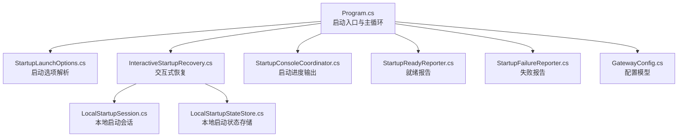
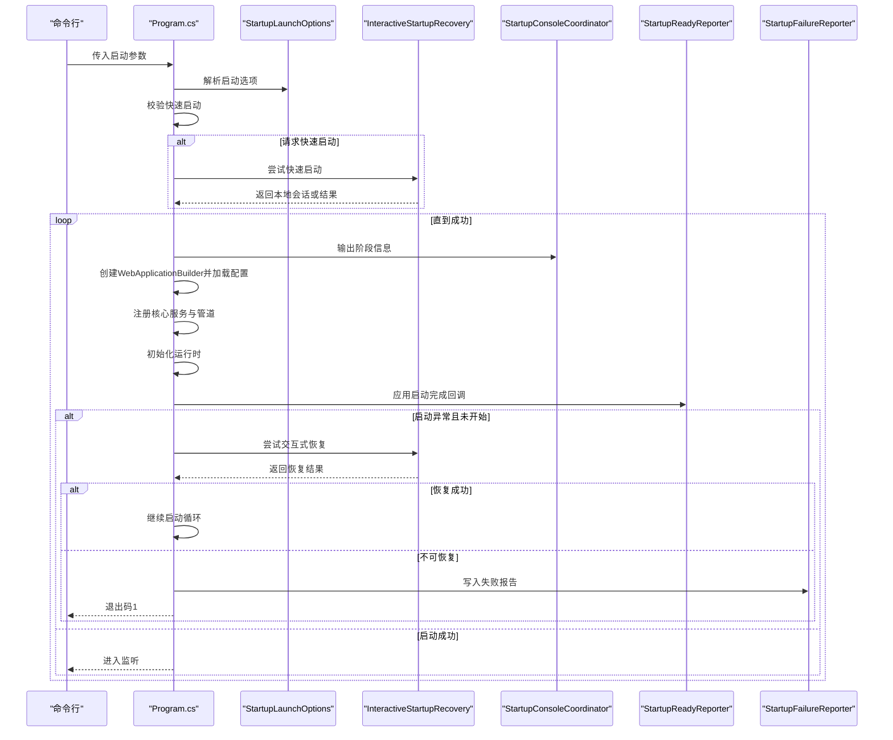
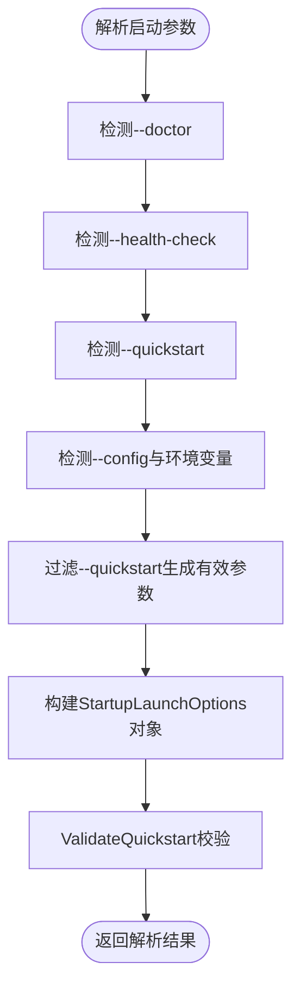
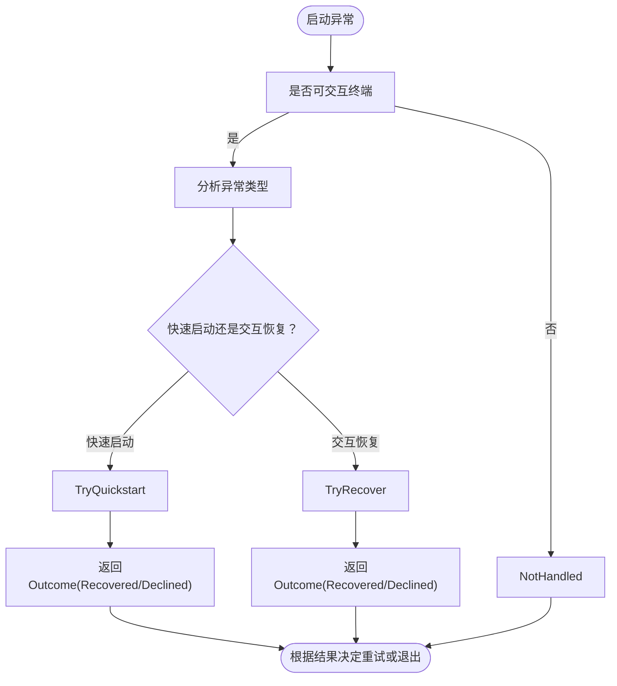
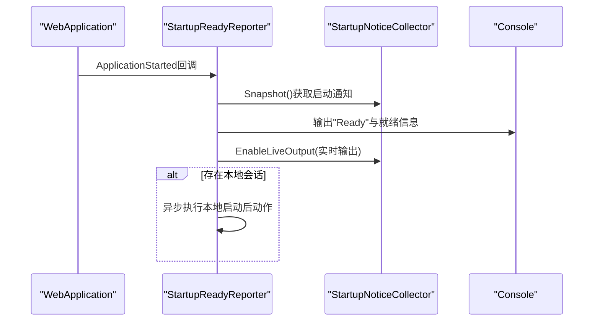
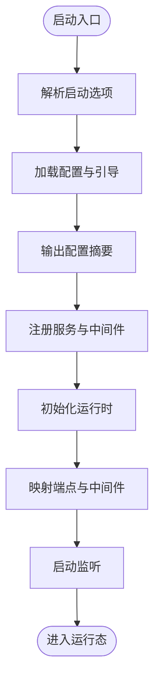
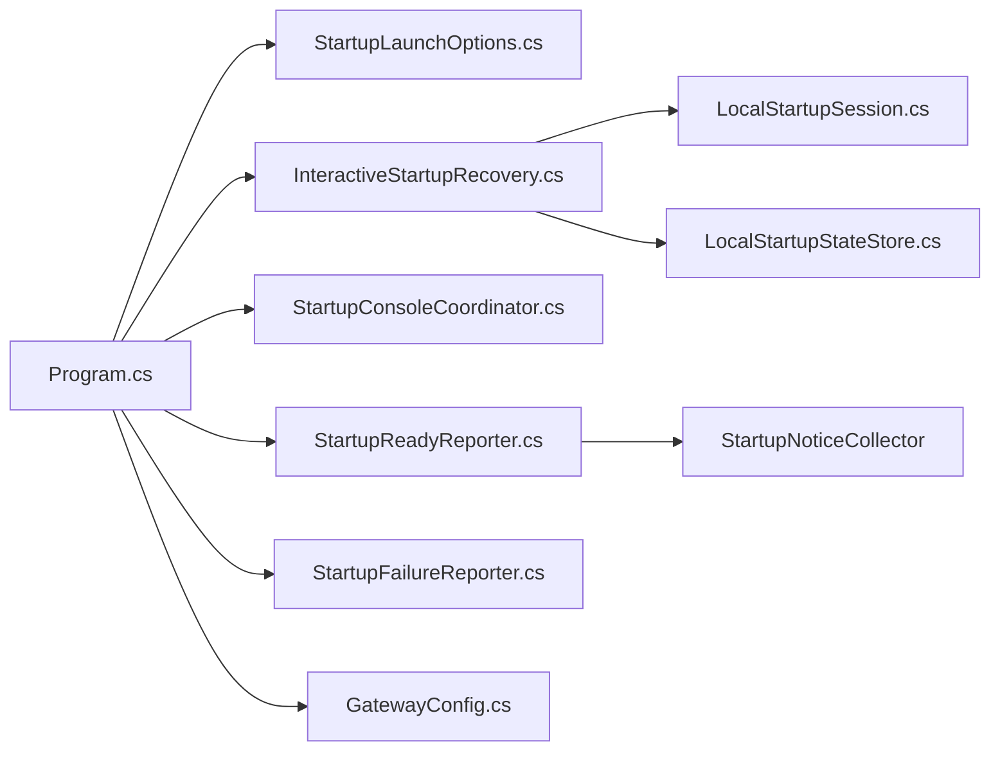

# 网关启动流程

<cite>
**本文档引用的文件**
- [Program.cs](file://src/OpenClaw.Gateway/Program.cs)
- [StartupLaunchOptions.cs](file://src/OpenClaw.Gateway/Bootstrap/StartupLaunchOptions.cs)
- [InteractiveStartupRecovery.cs](file://src/OpenClaw.Gateway/Bootstrap/InteractiveStartupRecovery.cs)
- [StartupConsoleCoordinator.cs](file://src/OpenClaw.Gateway/Bootstrap/StartupConsoleCoordinator.cs)
- [StartupFailureReporter.cs](file://src/OpenClaw.Gateway/Bootstrap/StartupFailureReporter.cs)
- [StartupReadyReporter.cs](file://src/OpenClaw.Gateway/Pipeline/StartupReadyReporter.cs)
- [GatewayConfig.cs](file://src/OpenClaw.Core/Models/GatewayConfig.cs)
- [LocalStartupStateStore.cs](file://src/OpenClaw.Gateway/Bootstrap/LocalStartupStateStore.cs)
- [LocalStartupSession.cs](file://src/OpenClaw.Gateway/Bootstrap/LocalStartupSession.cs)
- [StartupRecoveryOutcome.cs](file://src/OpenClaw.Gateway/Bootstrap/StartupRecoveryOutcome.cs)
- [StartupRecoveryResult.cs](file://src/OpenClaw.Gateway/Bootstrap/StartupRecoveryResult.cs)
</cite>

## 目录
1. [简介](#简介)
2. [项目结构](#项目结构)
3. [核心组件](#核心组件)
4. [架构总览](#架构总览)
5. [详细组件分析](#详细组件分析)
6. [依赖关系分析](#依赖关系分析)
7. [性能考虑](#性能考虑)
8. [故障排除指南](#故障排除指南)
9. [结论](#结论)
10. [附录](#附录)

## 简介
本文件系统性阐述 Kingcrab 项目中网关（Gateway）的启动流程，覆盖从命令行参数解析到配置加载、环境初始化、服务注册、运行时构建与启动的完整序列。重点包括：
- 启动选项解析与快速启动模式
- 交互式恢复机制与启动状态管理
- 启动失败处理、异常恢复策略与启动进度报告
- 启动配置要点与故障排除建议

## 项目结构
网关启动流程主要集中在以下模块：
- 启动入口与主循环：Program.cs
- 启动选项解析：StartupLaunchOptions.cs
- 交互式恢复与本地会话：InteractiveStartupRecovery.cs、LocalStartupSession.cs、LocalStartupStateStore.cs
- 启动进度与状态报告：StartupConsoleCoordinator.cs、StartupReadyReporter.cs、StartupFailureReporter.cs
- 配置模型：GatewayConfig.cs

**图表来源**
- [Program.cs:1-124](file://src/OpenClaw.Gateway/Program.cs#L1-L124)
- [StartupLaunchOptions.cs:1-122](file://src/OpenClaw.Gateway/Bootstrap/StartupLaunchOptions.cs#L1-L122)
- [InteractiveStartupRecovery.cs:1-336](file://src/OpenClaw.Gateway/Bootstrap/InteractiveStartupRecovery.cs#L1-L336)
- [StartupConsoleCoordinator.cs:1-53](file://src/OpenClaw.Gateway/Bootstrap/StartupConsoleCoordinator.cs#L1-L53)
- [StartupReadyReporter.cs:1-151](file://src/OpenClaw.Gateway/Pipeline/StartupReadyReporter.cs#L1-L151)
- [StartupFailureReporter.cs:1-332](file://src/OpenClaw.Gateway/Bootstrap/StartupFailureReporter.cs#L1-L332)
- [GatewayConfig.cs:1-898](file://src/OpenClaw.Core/Models/GatewayConfig.cs#L1-L898)
- [LocalStartupSession.cs](file://src/OpenClaw.Gateway/Bootstrap/LocalStartupSession.cs)
- [LocalStartupStateStore.cs](file://src/OpenClaw.Gateway/Bootstrap/LocalStartupStateStore.cs)

**章节来源**
- [Program.cs:1-124](file://src/OpenClaw.Gateway/Program.cs#L1-L124)

## 核心组件
- 启动入口与主循环：负责解析启动选项、加载配置、构建服务、初始化运行时、注册中间件与端点，并在异常时进入交互式恢复或失败报告。
- 启动选项解析器：解析命令行参数，识别 doctor 模式、健康检查模式、快速启动请求等，并生成有效参数集合。
- 交互式恢复：在启动失败时，根据错误类型引导用户进行最小化本地设置，支持快速启动与恢复两种模式。
- 启动进度与状态报告：提供阶段化输出、配置摘要、就绪报告与失败诊断。
- 配置模型：集中定义网关所有可配置项，包括绑定地址、端口、认证令牌、LLM 提供商、内存、安全、工具集、通道、插件、技能等。

**章节来源**
- [StartupLaunchOptions.cs:57-122](file://src/OpenClaw.Gateway/Bootstrap/StartupLaunchOptions.cs#L57-L122)
- [InteractiveStartupRecovery.cs:17-150](file://src/OpenClaw.Gateway/Bootstrap/InteractiveStartupRecovery.cs#L17-L150)
- [StartupConsoleCoordinator.cs:6-53](file://src/OpenClaw.Gateway/Bootstrap/StartupConsoleCoordinator.cs#L6-L53)
- [StartupReadyReporter.cs:7-50](file://src/OpenClaw.Gateway/Pipeline/StartupReadyReporter.cs#L7-L50)
- [StartupFailureReporter.cs:5-50](file://src/OpenClaw.Gateway/Bootstrap/StartupFailureReporter.cs#L5-L50)
- [GatewayConfig.cs:9-80](file://src/OpenClaw.Core/Models/GatewayConfig.cs#L9-L80)

## 架构总览
下图展示网关启动的高层流程：从命令行参数到配置加载、服务注册、运行时初始化、监听启动，以及异常时的交互式恢复路径。

**图表来源**
- [Program.cs:14-124](file://src/OpenClaw.Gateway/Program.cs#L14-L124)
- [StartupLaunchOptions.cs:57-88](file://src/OpenClaw.Gateway/Bootstrap/StartupLaunchOptions.cs#L57-L88)
- [InteractiveStartupRecovery.cs:72-150](file://src/OpenClaw.Gateway/Bootstrap/InteractiveStartupRecovery.cs#L72-L150)
- [StartupConsoleCoordinator.cs:8-37](file://src/OpenClaw.Gateway/Bootstrap/StartupConsoleCoordinator.cs#L8-L37)
- [StartupReadyReporter.cs:18-50](file://src/OpenClaw.Gateway/Pipeline/StartupReadyReporter.cs#L18-L50)
- [StartupFailureReporter.cs:7-50](file://src/OpenClaw.Gateway/Bootstrap/StartupFailureReporter.cs#L7-L50)

## 详细组件分析

### 启动选项解析（StartupLaunchOptions）
- 职责：解析命令行参数，识别 doctor 模式、健康检查模式、快速启动请求；处理 --config 与环境变量 OPENCLAW_CONFIG_PATH 的优先级；过滤无效参数（如 --quickstart）以生成有效参数集合。
- 关键点：
  - 通过静态 Parse 方法统一解析，返回包含原始参数、有效参数、模式标志与配置来源信息的对象。
  - ValidateQuickstart 对快速启动的组合约束进行校验，确保与 doctor/health-check/config 环境变量不冲突且需要交互终端。

**图表来源**
- [StartupLaunchOptions.cs:57-122](file://src/OpenClaw.Gateway/Bootstrap/StartupLaunchOptions.cs#L57-L122)

**章节来源**
- [StartupLaunchOptions.cs:57-122](file://src/OpenClaw.Gateway/Bootstrap/StartupLaunchOptions.cs#L57-L122)

### 快速启动与交互式恢复（InteractiveStartupRecovery）
- 快速启动（TryQuickstart）：
  - 在交互终端中应用最小化本地配置（仅本次进程生效），默认绑定到 127.0.0.1，使用文件内存，端口为 18789，工作区与内存目录自动准备。
  - 自动推断 API Key 与 Endpoint，必要时提示输入。
- 交互式恢复（TryRecover）：
  - 基于错误类型与当前配置，引导用户选择工作区、内存路径、端口、API Key 与 Endpoint。
  - 支持端口占用场景的自动递增尝试。
  - 将本地覆盖写入环境变量，临时生效，不修改持久配置。
- 恢复结果：
  - 使用 StartupRecoveryOutcome 表示“已恢复/未处理/拒绝”，配合 StartupRecoveryResult 作为枚举结果。

**图表来源**
- [InteractiveStartupRecovery.cs:17-150](file://src/OpenClaw.Gateway/Bootstrap/InteractiveStartupRecovery.cs#L17-L150)
- [StartupRecoveryOutcome.cs](file://src/OpenClaw.Gateway/Bootstrap/StartupRecoveryOutcome.cs)
- [StartupRecoveryResult.cs](file://src/OpenClaw.Gateway/Bootstrap/StartupRecoveryResult.cs)

**章节来源**
- [InteractiveStartupRecovery.cs:17-150](file://src/OpenClaw.Gateway/Bootstrap/InteractiveStartupRecovery.cs#L17-L150)

### 启动进度与状态管理（StartupConsoleCoordinator、StartupReadyReporter、StartupFailureReporter）
- StartupConsoleCoordinator：
  - 输出阶段信息（如“加载配置”、“构建服务”、“初始化运行时”、“启动监听”）。
  - 输出配置摘要：列出 JSON 配置源、会话覆盖状态、最终生效配置项。
- StartupReadyReporter：
  - 在应用启动完成后输出“Ready”与就绪信息，包含监听地址、UI 与健康检查链接、后续命令提示。
  - 可启用实时通知输出窗口，聚合启动期间的告警与提示。
- StartupFailureReporter：
  - 针对不同异常类型（认证令牌缺失、端口占用、提供商配置错误、存储不可写等）生成结构化报告。
  - 提供修复建议与下一步操作指引（doctor 检查、setup verify、模型诊断等）。

**图表来源**
- [StartupReadyReporter.cs:11-50](file://src/OpenClaw.Gateway/Pipeline/StartupReadyReporter.cs#L11-L50)

**章节来源**
- [StartupConsoleCoordinator.cs:6-53](file://src/OpenClaw.Gateway/Bootstrap/StartupConsoleCoordinator.cs#L6-L53)
- [StartupReadyReporter.cs:7-151](file://src/OpenClaw.Gateway/Pipeline/StartupReadyReporter.cs#L7-L151)
- [StartupFailureReporter.cs:52-332](file://src/OpenClaw.Gateway/Bootstrap/StartupFailureReporter.cs#L52-L332)

### 配置加载与运行时构建（Program.cs）
- 配置加载：
  - 使用 WebApplication.CreateSlimBuilder 加载配置（appsettings.* 与环境变量），随后调用 AddOpenClawBootstrapAsync 完成网关引导。
  - 输出配置摘要，显示环境名称、配置源与生效配置项。
- 服务注册：
  - 注册 OpenAPI、可观测性、核心服务、通道、工具、后端、安全、MCP、A2A 等服务。
  - 应用运行时配置文件（runtime profile）与 Microsoft Agent Framework。
- 运行时初始化与监听：
  - Build 后调用 InitializeOpenClawRuntimeAsync 初始化运行时。
  - 注册 MCP/A2A 认证中间件与端点映射。
  - RunAsync 绑定到 BindAddress:Port 开始监听。

**图表来源**
- [Program.cs:47-97](file://src/OpenClaw.Gateway/Program.cs#L47-L97)

**章节来源**
- [Program.cs:14-124](file://src/OpenClaw.Gateway/Program.cs#L14-L124)

## 依赖关系分析
- 入口依赖：
  - Program.cs 依赖 StartupLaunchOptions、InteractiveStartupRecovery、StartupConsoleCoordinator、StartupReadyReporter、StartupFailureReporter 与 GatewayConfig。
- 恢复与状态：
  - InteractiveStartupRecovery 依赖 LocalStartupSession 与 LocalStartupStateStore，用于本地覆盖与状态持久化。
- 报告与诊断：
  - StartupReadyReporter 依赖 StartupNoticeCollector 与 GatewayStartupContext，用于就绪输出与后续动作。
  - StartupFailureReporter 依赖 GatewayStartupContext 与环境信息，用于生成结构化诊断。

**图表来源**
- [Program.cs:1-124](file://src/OpenClaw.Gateway/Program.cs#L1-L124)
- [InteractiveStartupRecovery.cs:1-336](file://src/OpenClaw.Gateway/Bootstrap/InteractiveStartupRecovery.cs#L1-L336)
- [StartupReadyReporter.cs:1-151](file://src/OpenClaw.Gateway/Pipeline/StartupReadyReporter.cs#L1-L151)

**章节来源**
- [Program.cs:1-124](file://src/OpenClaw.Gateway/Program.cs#L1-L124)

## 性能考虑
- 启动阶段的 I/O 与磁盘访问（如内存目录创建、SQLite 文件初始化）可能成为瓶颈，建议：
  - 使用本地 SSD 或 RAM 盘作为内存存储根路径。
  - 避免在启动时加载大型模型或过多插件，按需延迟初始化。
  - 合理设置会话超时与并发限制，避免资源争用。
- 交互式恢复涉及多次用户输入与文件系统操作，建议：
  - 在 CI/CD 环境禁用交互模式，使用非交互式 doctor/health-check 模式进行预检。
  - 将配置文件与密钥注入到环境变量，减少运行时询问次数。

## 故障排除指南
常见启动失败与处理建议：
- 绑定到非回环地址但缺少认证令牌：
  - 建议：将 BindAddress 设为 127.0.0.1，或将 ASPNETCORE_ENVIRONMENT 设为 Development 以使用仓库本地默认；或设置 OPENCLAW_AUTH_TOKEN。
- 端口被占用：
  - 建议：停止占用进程或修改 OpenClaw__Port；交互恢复会自动尝试端口递增。
- LLM 提供商凭据或端点缺失：
  - 建议：设置 MODEL_PROVIDER_KEY 或 MODEL_PROVIDER_ENDPOINT；Azure OpenAI 使用资源端点。
- 内存存储路径不可写或只读文件系统：
  - 建议：设置 OpenClaw__Memory__StoragePath 到可写目录；若启用 SQLite，同时设置 DbPath；若启用归档，设置 ArchivePath。
- doctor/health-check 模式：
  - 建议：使用 doctor 模式进行预检，或使用 health 接口验证运行状态。

**章节来源**
- [StartupFailureReporter.cs:82-233](file://src/OpenClaw.Gateway/Bootstrap/StartupFailureReporter.cs#L82-L233)
- [InteractiveStartupRecovery.cs:296-322](file://src/OpenClaw.Gateway/Bootstrap/InteractiveStartupRecovery.cs#L296-L322)

## 结论
网关启动流程通过清晰的阶段划分、完善的交互式恢复与结构化报告，实现了从配置加载到运行时就绪的稳健路径。结合 doctor/health-check 模式与本地覆盖能力，既保证了开发体验，也提供了生产环境下的可诊断性与可恢复性。

## 附录

### 启动配置示例（关键字段）
- 基本绑定：BindAddress、Port
- 认证：AuthToken
- LLM 提供商：Llm.Provider、Llm.Model、Llm.ApiKey、Llm.Endpoint
- 内存：Memory.Provider、Memory.StoragePath、Memory.Sqlite.DbPath、Memory.Retention.Enabled/ArchivePath
- 工作区与工具：WorkspaceRoot、Tooling.*
- 安全：Security.StrictPublicBindProfile、Security.AllowUnsafeToolingOnPublicBind 等
- 插件与技能：Plugins.*、Skills.*

**章节来源**
- [GatewayConfig.cs:9-898](file://src/OpenClaw.Core/Models/GatewayConfig.cs#L9-L898)