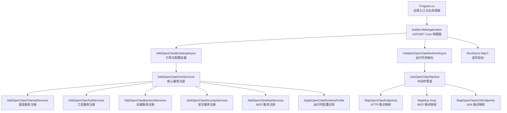
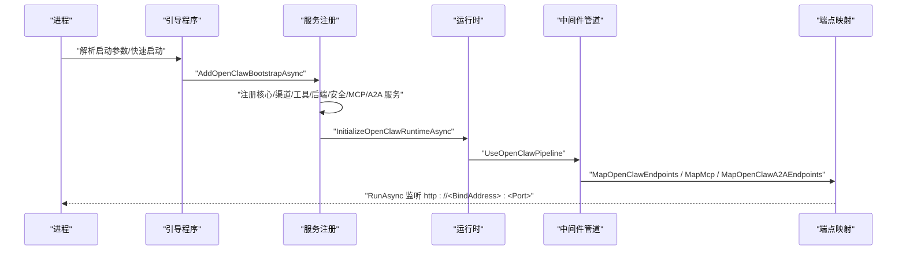
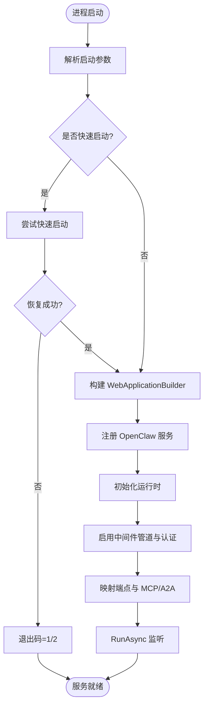
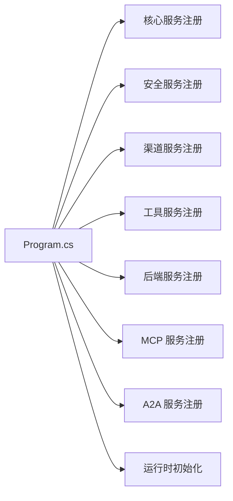

# 网关服务

<cite>
**本文引用的文件**
- [Program.cs](file://src/OpenClaw.Gateway/Program.cs)
- [appsettings.json](file://src/OpenClaw.Gateway/appsettings.json)
- [appsettings.Production.json](file://src/OpenClaw.Gateway/appsettings.Production.json)
- [GatewayStartupContext.cs](file://src/OpenClaw.Core/Models/GatewayConfig.cs)
</cite>

## 目录
1. [简介](#简介)
2. [项目结构](#项目结构)
3. [核心组件](#核心组件)
4. [架构总览](#架构总览)
5. [详细组件分析](#详细组件分析)
6. [依赖关系分析](#依赖关系分析)
7. [性能考虑](#性能考虑)
8. [故障排查指南](#故障排查指南)
9. [结论](#结论)
10. [附录](#附录)

## 简介
本文件系统性阐述网关服务的启动流程、服务注册、配置管理、安全策略与运行时行为，覆盖以下能力域：
- HTTP API 端点：OpenAI 兼容接口、自定义 API
- WebSocket 实时通信
- Webhook 处理（多渠道）
- 认证授权机制
- 中间件管道
- 健康检查与监控接口
- 性能优化策略与部署最佳实践

网关基于 ASP.NET Core 构建，采用可插拔的服务注册与运行时初始化模式，支持 MCP（Model Context Protocol）集成、A2A（Agent-to-Agent）通道、多渠道消息通道（短信、电报、WhatsApp、Teams、Slack、Discord、飞书、企业微信等），并内置工具执行沙箱与多模态能力。

## 项目结构
网关服务位于 src/OpenClaw.Gateway，核心入口为 Program.cs；配置由 appsettings.json 与环境特定的 appsettings.Production.json 提供；运行时上下文类型定义在 OpenClaw.Core 的 GatewayConfig.cs 中。

图表来源
- [Program.cs:47-97](file://src/OpenClaw.Gateway/Program.cs#L47-L97)

章节来源
- [Program.cs:14-97](file://src/OpenClaw.Gateway/Program.cs#L14-L97)

## 核心组件
- 启动与引导
  - 解析启动参数，按需进入快速启动或交互恢复流程
  - 构建 WebApplicationBuilder，注册 OpenClaw 引导与可观测性
  - 注册核心、渠道、工具、后端、安全、MCP、A2A 等服务
  - 初始化运行时，启用认证中间件与管道，映射端点并启动监听
- 配置管理
  - 绑定地址、端口、令牌、运行时模式、LLM 提供商与模型、内存存储、安全策略、WebSocket 限制、工具执行策略、插件与技能配置等
  - 生产环境默认绑定到 0.0.0.0，启用信任转发头，收紧工具执行与插件开关
- 安全策略
  - 跨域白名单、是否允许查询字符串令牌、OIDC 配置、浏览器会话策略、公共绑定下的安全限制
- 运行时与中间件
  - 应用 OpenClaw 中间件管道，实现请求预处理、限流、预算控制、A2A/MCP 认证等
- 监控与可观测性
  - 注册 OpenClaw 观测指标与日志级别

章节来源
- [Program.cs:47-97](file://src/OpenClaw.Gateway/Program.cs#L47-L97)
- [appsettings.json:1-908](file://src/OpenClaw.Gateway/appsettings.json#L1-L908)
- [appsettings.Production.json:1-65](file://src/OpenClaw.Gateway/appsettings.Production.json#L1-L65)

## 架构总览
下图展示从进程启动到服务就绪的关键步骤与模块交互：

图表来源
- [Program.cs:47-97](file://src/OpenClaw.Gateway/Program.cs#L47-L97)

## 详细组件分析

### 启动流程与服务注册
- 启动阶段
  - 参数解析与快速启动校验
  - 配置加载与摘要输出
  - 服务构建与注册
  - 运行时初始化与 MCP/A2A 认证中间件启用
  - 管道与端点映射
  - 监听启动
- 可恢复启动
  - 启动失败时进入交互式恢复流程，支持快速启动会话重试与诊断输出

图表来源
- [Program.cs:14-124](file://src/OpenClaw.Gateway/Program.cs#L14-L124)

章节来源
- [Program.cs:14-124](file://src/OpenClaw.Gateway/Program.cs#L14-L124)

### HTTP API 端点与 OpenAI 兼容接口
- 端点映射
  - 自定义 API：通过 MapOpenClawEndpoints 映射
  - OpenAI 兼容接口：通常作为自定义 API 的一部分提供
- 请求与响应
  - 支持流式与非流式响应
  - 错误响应遵循统一格式（见“错误处理机制”）
- 认证
  - 默认要求鉴权（AlwaysRequireAuth），支持 Bearer Token 或查询字符串（受 AllowQueryStringToken 控制）

章节来源
- [Program.cs:91-91](file://src/OpenClaw.Gateway/Program.cs#L91-L91)
- [appsettings.json:82-102](file://src/OpenClaw.Gateway/appsettings.json#L82-L102)

### WebSocket 实时通信
- 速率与容量限制
  - 最大消息字节、最大连接数、每 IP 最大连接、每连接每分钟消息数、接收超时
- 使用场景
  - 实时对话、流式输出、事件推送

章节来源
- [appsettings.json:103-109](file://src/OpenClaw.Gateway/appsettings.json#L103-L109)
- [appsettings.Production.json:32-38](file://src/OpenClaw.Gateway/appsettings.Production.json#L32-L38)

### Webhook 处理（多渠道）
- 已支持渠道
  - 短信（Twilio）、电报、WhatsApp（云与自有 Worker）、Teams、Slack、Discord、Signal、飞书、企业微信
- 关键配置
  - Webhook 路径、公有基地址、签名验证、配额与大小限制、允许列表策略
- 安全
  - 多数渠道支持签名验证与来源白名单

章节来源
- [appsettings.json:362-532](file://src/OpenClaw.Gateway/appsettings.json#L362-L532)

### 认证授权机制
- OIDC 集成
  - Authority、Audience、HTTPS 元数据要求、是否始终要求鉴权
- 令牌策略
  - 是否允许查询字符串传参、跨域来源白名单
- 浏览器会话
  - 空闲时间、记住登录天数
- 公共绑定安全
  - 在 0.0.0.0 绑定时对不安全工具、插件桥接、明文密钥引用的限制

章节来源
- [appsettings.json:82-102](file://src/OpenClaw.Gateway/appsettings.json#L82-L102)
- [appsettings.Production.json:22-30](file://src/OpenClaw.Gateway/appsettings.Production.json#L22-L30)

### 中间件管道与安全中间件
- 已知中间件
  - OpenClaw 中间件管道（限流、预算控制、预处理）
  - MCP 认证中间件
  - A2A 认证中间件
- 执行顺序
  - 认证中间件 → 中间件管道 → 端点映射

章节来源
- [Program.cs:86-89](file://src/OpenClaw.Gateway/Program.cs#L86-L89)

### 健康检查与监控接口
- OpenAPI 文档映射
  - 通过 MapOpenApi 映射 /openapi/{documentName}.json
- 观测性
  - AddOpenClawObservability 注册指标与日志
- 日志级别
  - Production 中设置默认日志级别与关键组件日志等级

章节来源
- [Program.cs:65-66](file://src/OpenClaw.Gateway/Program.cs#L65-L66)
- [Program.cs:90-90](file://src/OpenClaw.Gateway/Program.cs#L90-L90)
- [appsettings.Production.json:56-63](file://src/OpenClaw.Gateway/appsettings.Production.json#L56-L63)

### 配置管理与运行时上下文
- 运行时上下文
  - GatewayStartupContext（来自 OpenClaw.Core 的 GatewayConfig.cs）承载启动配置与运行时状态
- 关键配置项
  - 绑定地址与端口、令牌、运行时模式（AOT/JIT）、LLM 提供商与模型、内存存储、安全策略、WebSocket、工具执行策略、插件与技能、多模态、渠道等
- 环境差异
  - Development 默认绑定 127.0.0.1，Production 默认绑定 0.0.0.0 并收紧安全与工具策略

章节来源
- [GatewayStartupContext.cs](file://src/OpenClaw.Core/Models/GatewayConfig.cs)
- [appsettings.json:1-908](file://src/OpenClaw.Gateway/appsettings.json#L1-L908)
- [appsettings.Production.json:1-65](file://src/OpenClaw.Gateway/appsettings.Production.json#L1-L65)

## 依赖关系分析
- 模块耦合
  - Program.cs 作为编排者，依赖各服务注册扩展方法与运行时初始化扩展
  - 配置通过 appsettings.*.json 下发至各模块
- 外部依赖
  - ASP.NET Core、MCP、OIDC、各渠道 SDK/服务端点
- 循环依赖
  - 无直接循环依赖迹象；服务注册与运行时初始化分层清晰

图表来源
- [Program.cs:67-78](file://src/OpenClaw.Gateway/Program.cs#L67-L78)

章节来源
- [Program.cs:67-78](file://src/OpenClaw.Gateway/Program.cs#L67-L78)

## 性能考虑
- 连接与速率限制
  - WebSocket 最大连接、每 IP 连接上限、每连接每分钟消息数、消息体大小限制
- 工具执行
  - 工具超时、只读模式、根路径白名单、并行执行开关
- 内存与缓存
  - 历史轮次上限、缓存会话数量、压缩阈值与保留策略
- LLM 与电路保护
  - 超时、重试次数、断路器阈值与冷却时间
- 生产建议
  - 绑定 0.0.0.0 时开启 TrustForwardedHeaders，限制工具执行范围，启用压缩与缓存清理

章节来源
- [appsettings.json:103-144](file://src/OpenClaw.Gateway/appsettings.json#L103-L144)
- [appsettings.json:49-81](file://src/OpenClaw.Gateway/appsettings.json#L49-L81)
- [appsettings.json:22-44](file://src/OpenClaw.Gateway/appsettings.json#L22-L44)
- [appsettings.Production.json:32-46](file://src/OpenClaw.Gateway/appsettings.Production.json#L32-L46)

## 故障排查指南
- 启动失败
  - 查看启动恢复输出与诊断报告；确认配置文件语法与必需字段
- 认证失败
  - 检查 OIDC 配置、令牌传递方式（Header vs 查询字符串）、跨域来源白名单
- WebSocket 连接被拒
  - 检查最大连接、每 IP 上限、消息速率与消息体大小限制
- 渠道 Webhook 不工作
  - 校验 Webhook 路径、公有基地址、签名验证开关与配额设置
- 工具执行异常
  - 检查工具超时、根路径白名单、只读模式与并行执行策略

章节来源
- [Program.cs:99-122](file://src/OpenClaw.Gateway/Program.cs#L99-L122)
- [appsettings.json:82-102](file://src/OpenClaw.Gateway/appsettings.json#L82-L102)
- [appsettings.json:103-144](file://src/OpenClaw.Gateway/appsettings.json#L103-L144)

## 结论
该网关服务以清晰的启动与引导流程为基础，通过模块化服务注册与运行时初始化，实现了 HTTP API、WebSocket、Webhook、MCP、A2A 等能力的统一接入，并内置了完善的认证授权与安全策略。结合生产环境的配置与性能参数，可在保证安全的前提下提供高可用的实时与异步通信能力。

## 附录

### API 端点规范（概要）
- HTTP
  - 自定义 API：通过 MapOpenClawEndpoints 映射
  - OpenAI 兼容接口：作为自定义 API 的一部分提供
  - 认证：默认要求鉴权，支持 Bearer Token 或查询字符串（受 AllowQueryStringToken 控制）
- WebSocket
  - 速率与容量限制详见“WebSocket 实时通信”
- Webhook
  - 各渠道 Webhook 路径与配置详见“Webhook 处理（多渠道）”

章节来源
- [Program.cs:91-91](file://src/OpenClaw.Gateway/Program.cs#L91-L91)
- [appsettings.json:82-102](file://src/OpenClaw.Gateway/appsettings.json#L82-L102)
- [appsettings.json:362-532](file://src/OpenClaw.Gateway/appsettings.json#L362-L532)

### 配置示例与部署最佳实践
- 开发环境
  - 绑定 127.0.0.1，启用本地调试与完整功能
- 生产环境
  - 绑定 0.0.0.0，启用 TrustForwardedHeaders，收紧工具执行与插件开关，设置日志级别
- 安全加固
  - 严格跨域白名单、关闭查询字符串令牌（除非必要）、启用 OIDC、限制公共绑定下的危险能力

章节来源
- [appsettings.json:1-908](file://src/OpenClaw.Gateway/appsettings.json#L1-L908)
- [appsettings.Production.json:1-65](file://src/OpenClaw.Gateway/appsettings.Production.json#L1-L65)