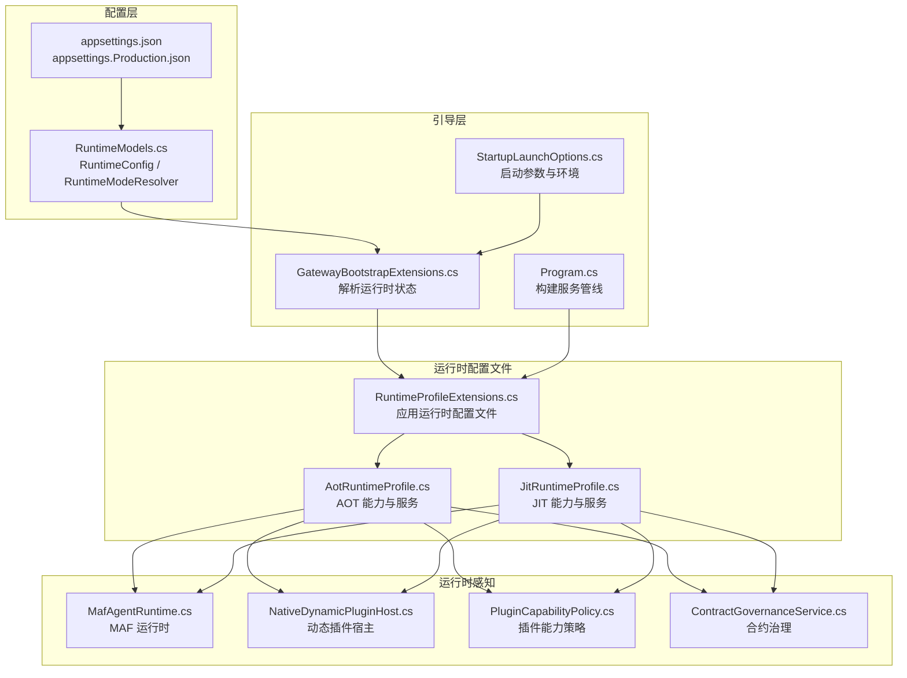
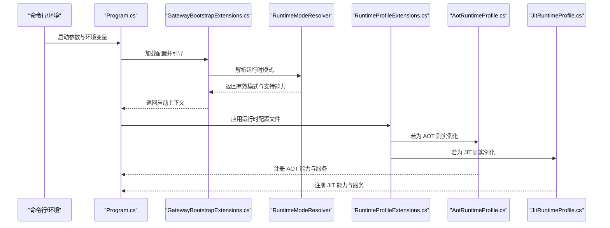
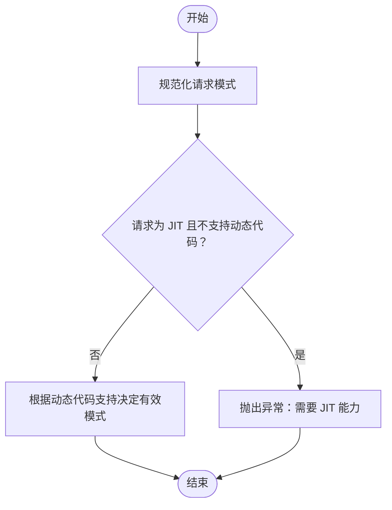
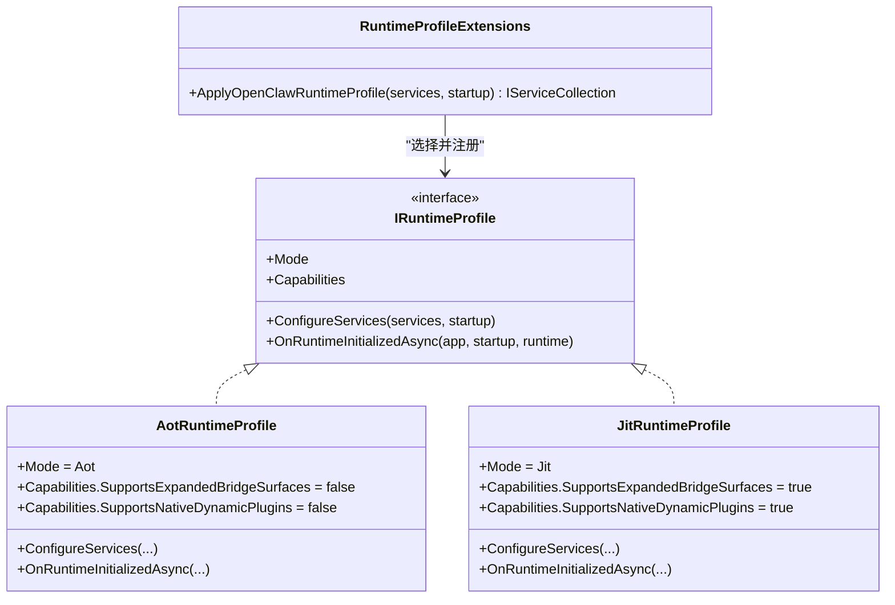
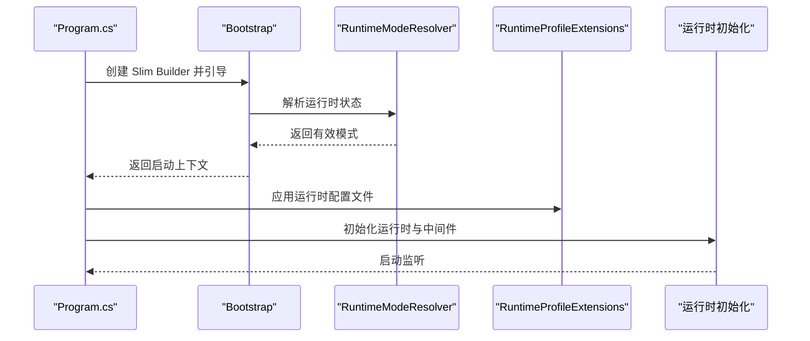
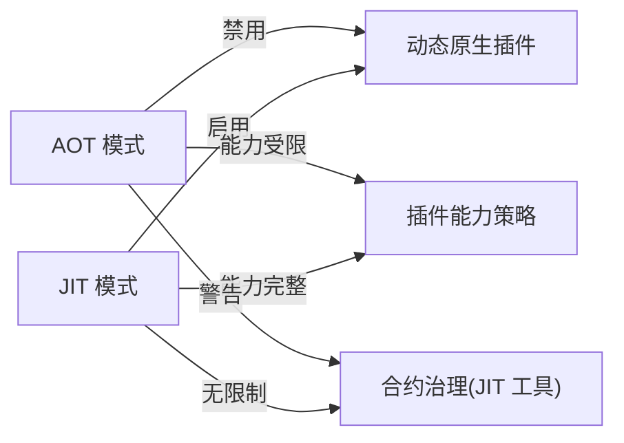
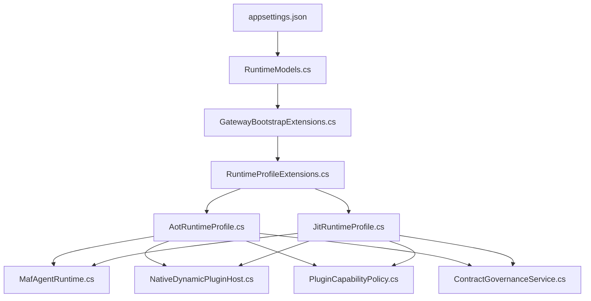

# 运行时配置文件

<cite>
**本文引用的文件**
- [RuntimeProfileExtensions.cs](file://src/OpenClaw.Gateway/Profiles/RuntimeProfileExtensions.cs)
- [AotRuntimeProfile.cs](file://src/OpenClaw.Gateway/Profiles/AotRuntimeProfile.cs)
- [JitRuntimeProfile.cs](file://src/OpenClaw.Gateway/Profiles/JitRuntimeProfile.cs)
- [RuntimeModels.cs](file://src/OpenClaw.Core/Models/RuntimeModels.cs)
- [Program.cs](file://src/OpenClaw.Gateway/Program.cs)
- [appsettings.json](file://src/OpenClaw.Gateway/appsettings.json)
- [appsettings.Production.json](file://src/OpenClaw.Gateway/appsettings.Production.json)
- [GatewayBootstrapExtensions.cs](file://src/OpenClaw.Gateway/Bootstrap/GatewayBootstrapExtensions.cs)
- [StartupLaunchOptions.cs](file://src/OpenClaw.Gateway/Bootstrap/StartupLaunchOptions.cs)
- [MafAgentRuntime.cs](file://src/OpenClaw.Agent/MafAgentRuntime.cs)
- [MafAgentRuntimeFactory.cs](file://src/OpenClaw.Agent/MafAgentRuntimeFactory.cs)
- [MafServiceCollectionExtensions.cs](file://src/OpenClaw.Agent/MafServiceCollectionExtensions.cs)
- [MafCapabilities.cs](file://src/OpenClaw.Agent/MafCapabilities.cs)
- [NativeDynamicPluginHost.cs](file://src/OpenClaw.Agent/Plugins/NativeDynamicPluginHost.cs)
- [ContractGovernanceService.cs](file://src/OpenClaw.Gateway/ContractGovernanceService.cs)
- [PluginCapabilityPolicy.cs](file://src/OpenClaw.Core/Plugins/PluginCapabilityPolicy.cs)
- [StartupFailureReporterTests.cs](file://src/OpenClaw.Tests/StartupFailureReporterTests.cs)
</cite>

## 目录
1. [简介](#简介)
2. [项目结构](#项目结构)
3. [核心组件](#核心组件)
4. [架构总览](#架构总览)
5. [详细组件分析](#详细组件分析)
6. [依赖关系分析](#依赖关系分析)
7. [性能考量](#性能考量)
8. [故障排查指南](#故障排查指南)
9. [结论](#结论)
10. [附录](#附录)

## 简介
本文件系统化阐述 OpenClaw 的运行时配置体系，重点解析 AOT 与 JIT 两种运行时模式的差异、选择标准、性能影响与兼容性约束，并详细说明配置文件的应用方式、服务注册差异、资源使用情况，以及在实际部署中的切换策略、性能调优与兼容性注意事项。文档同时提供不同场景下的配置建议与性能对比分析，帮助读者在开发与生产环境中做出合理决策。

## 项目结构
运行时配置相关的核心代码分布在以下模块：
- 配置模型与解析：位于 Core 模块，定义运行时模式枚举、配置对象与解析器
- 运行时配置文件：位于 Gateway 模块，通过 appsettings.*.json 提供默认值与覆盖项
- 启动与引导：位于 Gateway 模块，负责加载配置、解析运行时模式、应用运行时配置文件
- 运行时配置文件实现：位于 Gateway 模块 Profiles 子目录，分别针对 AOT 与 JIT 提供能力与服务注册
- 运行时模式感知的服务与插件：位于 Agent 与 Core 模块，依据有效运行时模式启用或限制功能

**图表来源**
- [RuntimeModels.cs:1-69](file://src/OpenClaw.Core/Models/RuntimeModels.cs#L1-L69)
- [GatewayBootstrapExtensions.cs:67-112](file://src/OpenClaw.Gateway/Bootstrap/GatewayBootstrapExtensions.cs#L67-L112)
- [StartupLaunchOptions.cs:1-48](file://src/OpenClaw.Gateway/Bootstrap/StartupLaunchOptions.cs#L1-L48)
- [Program.cs:1-124](file://src/OpenClaw.Gateway/Program.cs#L1-L124)
- [RuntimeProfileExtensions.cs:1-23](file://src/OpenClaw.Gateway/Profiles/RuntimeProfileExtensions.cs#L1-L23)
- [AotRuntimeProfile.cs:1-22](file://src/OpenClaw.Gateway/Profiles/AotRuntimeProfile.cs#L1-L22)
- [JitRuntimeProfile.cs:1-22](file://src/OpenClaw.Gateway/Profiles/JitRuntimeProfile.cs#L1-L22)
- [MafAgentRuntime.cs](file://src/OpenClaw.Agent/MafAgentRuntime.cs)
- [NativeDynamicPluginHost.cs:86-127](file://src/OpenClaw.Agent/Plugins/NativeDynamicPluginHost.cs#L86-L127)
- [PluginCapabilityPolicy.cs](file://src/OpenClaw.Core/Plugins/PluginCapabilityPolicy.cs#L36)
- [ContractGovernanceService.cs:69-95](file://src/OpenClaw.Gateway/ContractGovernanceService.cs#L69-L95)

**章节来源**
- [Program.cs:1-124](file://src/OpenClaw.Gateway/Program.cs#L1-L124)
- [appsettings.json:1-908](file://src/OpenClaw.Gateway/appsettings.json#L1-L908)
- [appsettings.Production.json:1-65](file://src/OpenClaw.Gateway/appsettings.Production.json#L1-L65)

## 核心组件
- 运行时模式与配置
  - 枚举与配置对象：定义运行时模式（AOT/JIT）与 Orchestrator（native/maf），并提供规范化方法
  - 解析器：根据请求模式与运行时能力确定有效模式，必要时抛出异常提示
- 运行时配置文件
  - AOT 配置文件：禁用扩展桥接面与原生动态插件，适合严格静态编译环境
  - JIT 配置文件：启用扩展桥接面与原生动态插件，适合需要动态能力的场景
- 引导与应用
  - 引导阶段：加载配置、校验、解析运行时状态、执行诊断
  - 应用阶段：按有效模式注入对应配置文件，注册服务与能力

**章节来源**
- [RuntimeModels.cs:1-69](file://src/OpenClaw.Core/Models/RuntimeModels.cs#L1-L69)
- [AotRuntimeProfile.cs:1-22](file://src/OpenClaw.Gateway/Profiles/AotRuntimeProfile.cs#L1-L22)
- [JitRuntimeProfile.cs:1-22](file://src/OpenClaw.Gateway/Profiles/JitRuntimeProfile.cs#L1-L22)
- [RuntimeProfileExtensions.cs:1-23](file://src/OpenClaw.Gateway/Profiles/RuntimeProfileExtensions.cs#L1-L23)
- [GatewayBootstrapExtensions.cs:67-112](file://src/OpenClaw.Gateway/Bootstrap/GatewayBootstrapExtensions.cs#L67-L112)

## 架构总览
下图展示了从配置到运行时能力落地的关键流程，包括配置加载、模式解析、配置文件应用与服务注册。

**图表来源**
- [Program.cs:47-98](file://src/OpenClaw.Gateway/Program.cs#L47-L98)
- [GatewayBootstrapExtensions.cs:86-105](file://src/OpenClaw.Gateway/Bootstrap/GatewayBootstrapExtensions.cs#L86-L105)
- [RuntimeModels.cs:29-59](file://src/OpenClaw.Core/Models/RuntimeModels.cs#L29-L59)
- [RuntimeProfileExtensions.cs:8-21](file://src/OpenClaw.Gateway/Profiles/RuntimeProfileExtensions.cs#L8-L21)
- [AotRuntimeProfile.cs:7-21](file://src/OpenClaw.Gateway/Profiles/AotRuntimeProfile.cs#L7-L21)
- [JitRuntimeProfile.cs:7-21](file://src/OpenClaw.Gateway/Profiles/JitRuntimeProfile.cs#L7-L21)

## 详细组件分析

### 组件一：运行时模式与配置模型
- 关键点
  - 模式枚举与配置对象：区分 AOT/JIT 与 Orchestrator 类型
  - 规范化函数：统一大小写与空白字符处理
  - 解析逻辑：优先遵循请求模式；当请求为 JIT 但不支持动态代码时抛出异常；否则根据是否支持动态代码决定默认模式
- 复杂度与性能
  - 解析为 O(1)，字符串处理开销极低
  - 建议在引导阶段一次性完成，避免重复计算

**图表来源**
- [RuntimeModels.cs:29-59](file://src/OpenClaw.Core/Models/RuntimeModels.cs#L29-L59)

**章节来源**
- [RuntimeModels.cs:1-69](file://src/OpenClaw.Core/Models/RuntimeModels.cs#L1-L69)

### 组件二：运行时配置文件应用
- 关键点
  - 通过扩展方法按有效模式选择 AOT 或 JIT 配置文件
  - 将配置文件与能力对象注册到服务容器
  - 保持最小差异化：AOT 与 JIT 在能力上存在显著差异
- 服务注册差异
  - AOT：禁用扩展桥接面与原生动态插件
  - JIT：启用扩展桥接面与原生动态插件

**图表来源**
- [RuntimeProfileExtensions.cs:8-21](file://src/OpenClaw.Gateway/Profiles/RuntimeProfileExtensions.cs#L8-L21)
- [AotRuntimeProfile.cs:7-21](file://src/OpenClaw.Gateway/Profiles/AotRuntimeProfile.cs#L7-L21)
- [JitRuntimeProfile.cs:7-21](file://src/OpenClaw.Gateway/Profiles/JitRuntimeProfile.cs#L7-L21)

**章节来源**
- [RuntimeProfileExtensions.cs:1-23](file://src/OpenClaw.Gateway/Profiles/RuntimeProfileExtensions.cs#L1-L23)
- [AotRuntimeProfile.cs:1-22](file://src/OpenClaw.Gateway/Profiles/AotRuntimeProfile.cs#L1-L22)
- [JitRuntimeProfile.cs:1-22](file://src/OpenClaw.Gateway/Profiles/JitRuntimeProfile.cs#L1-L22)

### 组件三：引导与启动流程
- 关键点
  - 加载配置与环境，解析启动选项
  - 执行引导与诊断，解析运行时状态
  - 构建服务容器，应用运行时配置文件
  - 初始化运行时、MCP 与 A2A 等子系统
- 错误处理
  - 启动前异常会触发交互式恢复或输出诊断信息

**图表来源**
- [Program.cs:47-98](file://src/OpenClaw.Gateway/Program.cs#L47-L98)
- [GatewayBootstrapExtensions.cs:86-105](file://src/OpenClaw.Gateway/Bootstrap/GatewayBootstrapExtensions.cs#L86-L105)
- [RuntimeProfileExtensions.cs:8-21](file://src/OpenClaw.Gateway/Profiles/RuntimeProfileExtensions.cs#L8-L21)

**章节来源**
- [Program.cs:1-124](file://src/OpenClaw.Gateway/Program.cs#L1-L124)
- [GatewayBootstrapExtensions.cs:67-112](file://src/OpenClaw.Gateway/Bootstrap/GatewayBootstrapExtensions.cs#L67-L112)
- [StartupLaunchOptions.cs:1-48](file://src/OpenClaw.Gateway/Bootstrap/StartupLaunchOptions.cs#L1-L48)

### 组件四：运行时模式对服务与插件的影响
- MAF 运行时
  - MAF 运行时在 AOT/JIT 下均可用，但具体行为受运行时能力影响
- 动态原生插件
  - AOT 模式下禁止启用动态原生插件；JIT 模式下允许
- 插件能力策略
  - 插件能力策略仅在非 AOT 模式下允许启用某些能力
- 合约治理
  - 合约治理会检查工具所需的运行时模式与当前有效模式是否匹配，AOT 下对 JIT 工具有警告

**图表来源**
- [MafCapabilities.cs](file://src/OpenClaw.Agent/MafCapabilities.cs#L9)
- [NativeDynamicPluginHost.cs:86-127](file://src/OpenClaw.Agent/Plugins/NativeDynamicPluginHost.cs#L86-L127)
- [PluginCapabilityPolicy.cs](file://src/OpenClaw.Core/Plugins/PluginCapabilityPolicy.cs#L36)
- [ContractGovernanceService.cs:69-95](file://src/OpenClaw.Gateway/ContractGovernanceService.cs#L69-L95)

**章节来源**
- [MafAgentRuntime.cs](file://src/OpenClaw.Agent/MafAgentRuntime.cs)
- [MafAgentRuntimeFactory.cs](file://src/OpenClaw.Agent/MafAgentRuntimeFactory.cs)
- [MafServiceCollectionExtensions.cs](file://src/OpenClaw.Agent/MafServiceCollectionExtensions.cs)
- [MafCapabilities.cs](file://src/OpenClaw.Agent/MafCapabilities.cs#L9)
- [NativeDynamicPluginHost.cs:86-127](file://src/OpenClaw.Agent/Plugins/NativeDynamicPluginHost.cs#L86-L127)
- [PluginCapabilityPolicy.cs](file://src/OpenClaw.Core/Plugins/PluginCapabilityPolicy.cs#L36)
- [ContractGovernanceService.cs:69-95](file://src/OpenClaw.Gateway/ContractGovernanceService.cs#L69-L95)

## 依赖关系分析
- 组件耦合
  - 引导层依赖配置模型与解析器
  - 配置文件扩展依赖运行时状态
  - 运行时配置文件实现依赖能力接口
  - 运行时感知组件依赖运行时状态进行条件启用
- 外部依赖
  - .NET 运行时特性（动态代码支持）
  - ASP.NET Core 服务容器与生命周期管理

**图表来源**
- [appsettings.json:1-908](file://src/OpenClaw.Gateway/appsettings.json#L1-L908)
- [RuntimeModels.cs:1-69](file://src/OpenClaw.Core/Models/RuntimeModels.cs#L1-L69)
- [GatewayBootstrapExtensions.cs:86-105](file://src/OpenClaw.Gateway/Bootstrap/GatewayBootstrapExtensions.cs#L86-L105)
- [RuntimeProfileExtensions.cs:8-21](file://src/OpenClaw.Gateway/Profiles/RuntimeProfileExtensions.cs#L8-L21)
- [AotRuntimeProfile.cs:7-21](file://src/OpenClaw.Gateway/Profiles/AotRuntimeProfile.cs#L7-L21)
- [JitRuntimeProfile.cs:7-21](file://src/OpenClaw.Gateway/Profiles/JitRuntimeProfile.cs#L7-L21)
- [MafAgentRuntime.cs](file://src/OpenClaw.Agent/MafAgentRuntime.cs)
- [NativeDynamicPluginHost.cs:86-127](file://src/OpenClaw.Agent/Plugins/NativeDynamicPluginHost.cs#L86-L127)
- [PluginCapabilityPolicy.cs](file://src/OpenClaw.Core/Plugins/PluginCapabilityPolicy.cs#L36)
- [ContractGovernanceService.cs:69-95](file://src/OpenClaw.Gateway/ContractGovernanceService.cs#L69-L95)

**章节来源**
- [Program.cs:1-124](file://src/OpenClaw.Gateway/Program.cs#L1-L124)
- [RuntimeModels.cs:1-69](file://src/OpenClaw.Core/Models/RuntimeModels.cs#L1-L69)
- [RuntimeProfileExtensions.cs:1-23](file://src/OpenClaw.Gateway/Profiles/RuntimeProfileExtensions.cs#L1-L23)

## 性能考量
- AOT 模式
  - 启动时间短、内存占用低、发布包体积小
  - 不支持动态代码生成，限制了部分运行时扩展能力
- JIT 模式
  - 支持动态代码生成，灵活性高
  - 启动时间略长、内存占用略高
- 实际部署建议
  - 开发与本地调试：JIT 更灵活，便于快速迭代
  - 生产与容器化：AOT 更稳定，利于安全与资源控制
  - 对于需要动态插件或扩展桥接面的场景，优先选择 JIT

[本节为通用性能讨论，无需特定文件来源]

## 故障排查指南
- 常见问题
  - 请求模式为 JIT 但运行时不支持动态代码：解析器会抛出异常，提示需要 JIT 能力
  - AOT 模式下启用动态原生插件：动态插件宿主会记录警告并拒绝启用
  - 合约治理对 JIT 工具在 AOT 下发出警告：需调整工具或切换到 JIT
- 排查步骤
  - 检查配置文件中运行时模式设置
  - 查看引导阶段日志与诊断输出
  - 使用 doctor 模式获取更详细的诊断信息
  - 参考测试用例中的运行时状态示例进行比对

**章节来源**
- [RuntimeModels.cs:36-40](file://src/OpenClaw.Core/Models/RuntimeModels.cs#L36-L40)
- [NativeDynamicPluginHost.cs:86-127](file://src/OpenClaw.Agent/Plugins/NativeDynamicPluginHost.cs#L86-L127)
- [ContractGovernanceService.cs:91-95](file://src/OpenClaw.Gateway/ContractGovernanceService.cs#L91-L95)
- [StartupFailureReporterTests.cs:77-97](file://src/OpenClaw.Tests/StartupFailureReporterTests.cs#L77-L97)

## 结论
运行时配置文件是 OpenClaw 在不同部署场景下实现能力与性能平衡的关键机制。AOT 与 JIT 在能力与资源使用上存在显著差异，应基于实际需求与约束进行选择。通过规范化的配置模型、严格的引导与诊断流程，以及对运行时感知组件的合理设计，系统能够在保证稳定性的同时提供必要的灵活性。

[本节为总结性内容，无需特定文件来源]

## 附录

### AOT 与 JIT 运行时配置文件对比
- 能力对比
  - AOT：禁用扩展桥接面与原生动态插件
  - JIT：启用扩展桥接面与原生动态插件
- 适用场景
  - AOT：生产容器化、安全敏感、资源受限
  - JIT：开发调试、需要动态扩展、复杂插件生态
- 配置要点
  - 在配置文件中设置运行时模式
  - 引导阶段解析并应用对应配置文件
  - 运行时感知组件据此启用或限制功能

**章节来源**
- [AotRuntimeProfile.cs:11-13](file://src/OpenClaw.Gateway/Profiles/AotRuntimeProfile.cs#L11-L13)
- [JitRuntimeProfile.cs:11-13](file://src/OpenClaw.Gateway/Profiles/JitRuntimeProfile.cs#L11-L13)
- [appsettings.json:6-9](file://src/OpenClaw.Gateway/appsettings.json#L6-L9)
- [appsettings.Production.json:1-65](file://src/OpenClaw.Gateway/appsettings.Production.json#L1-L65)