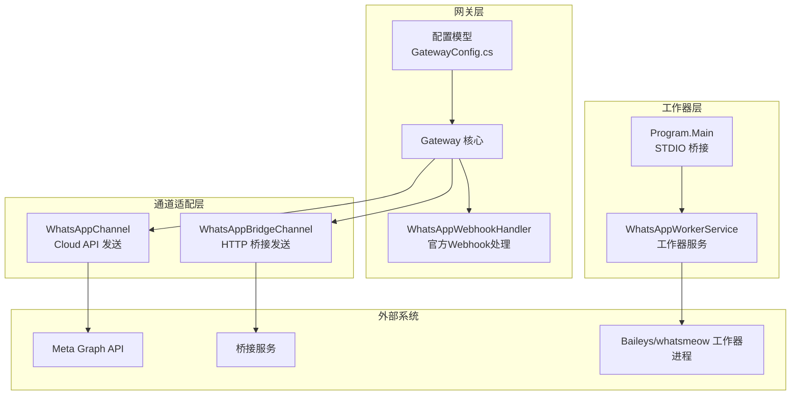
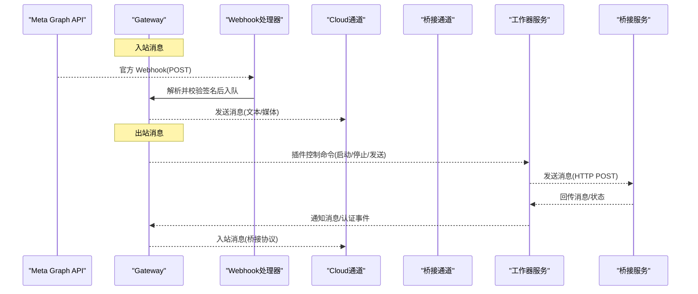
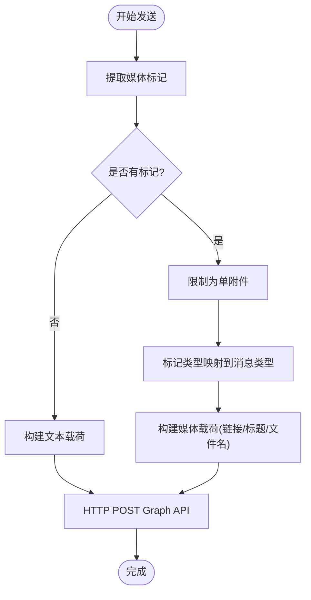
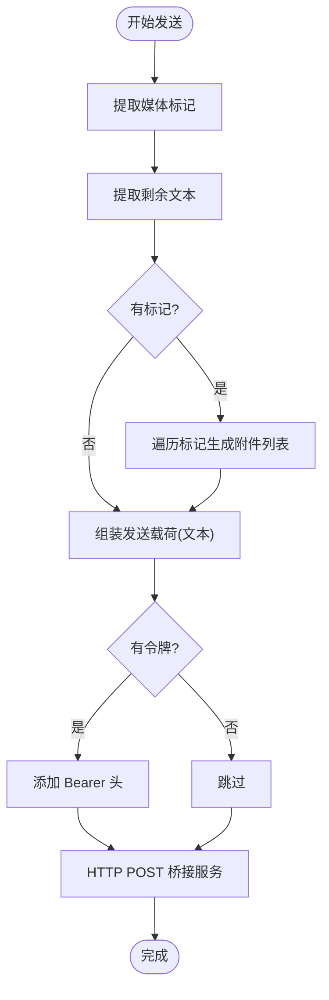
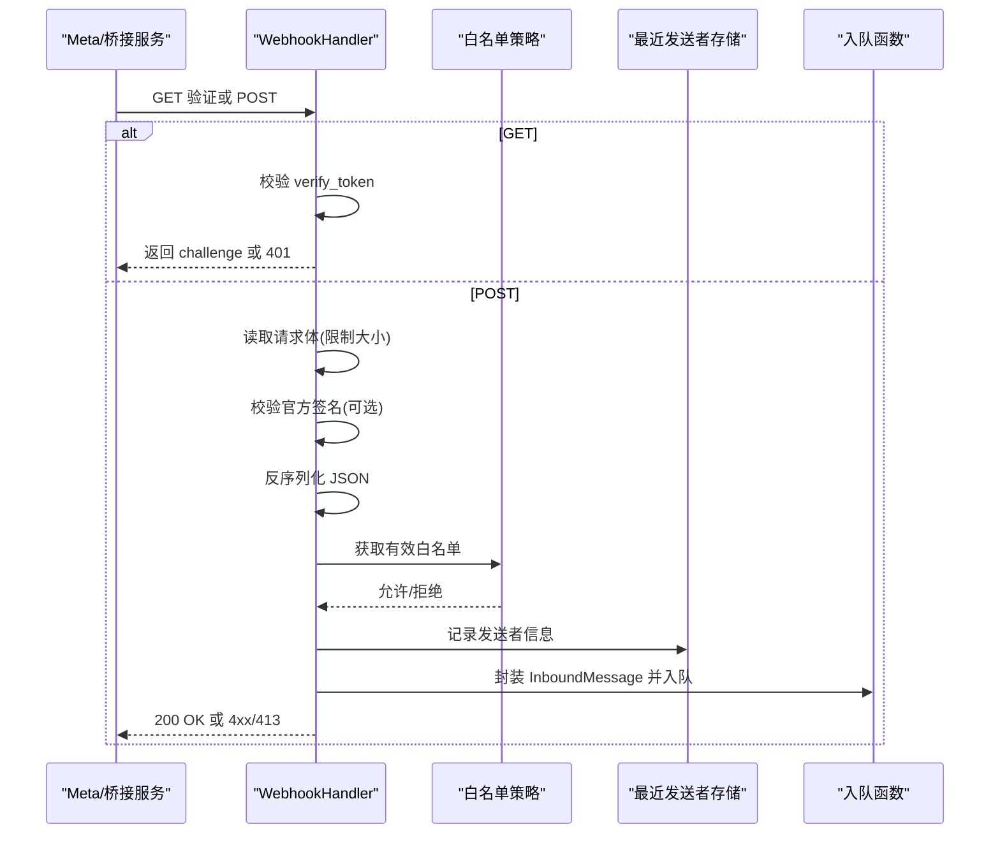
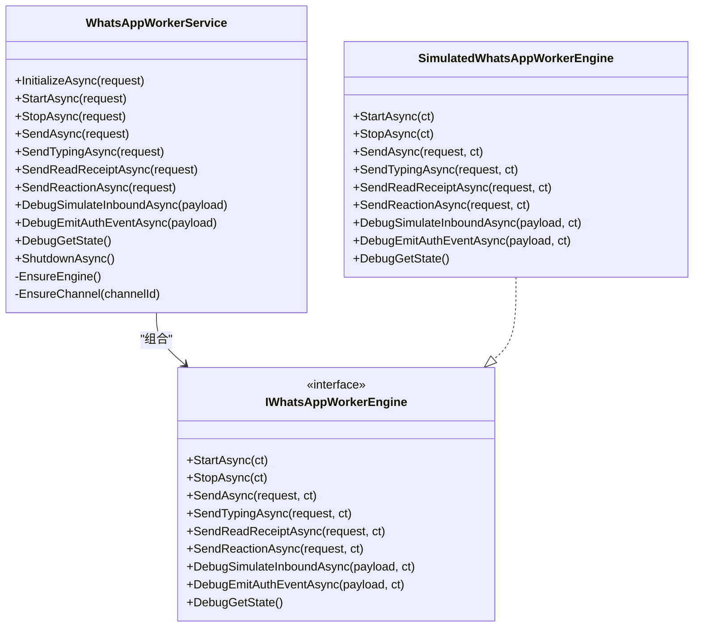
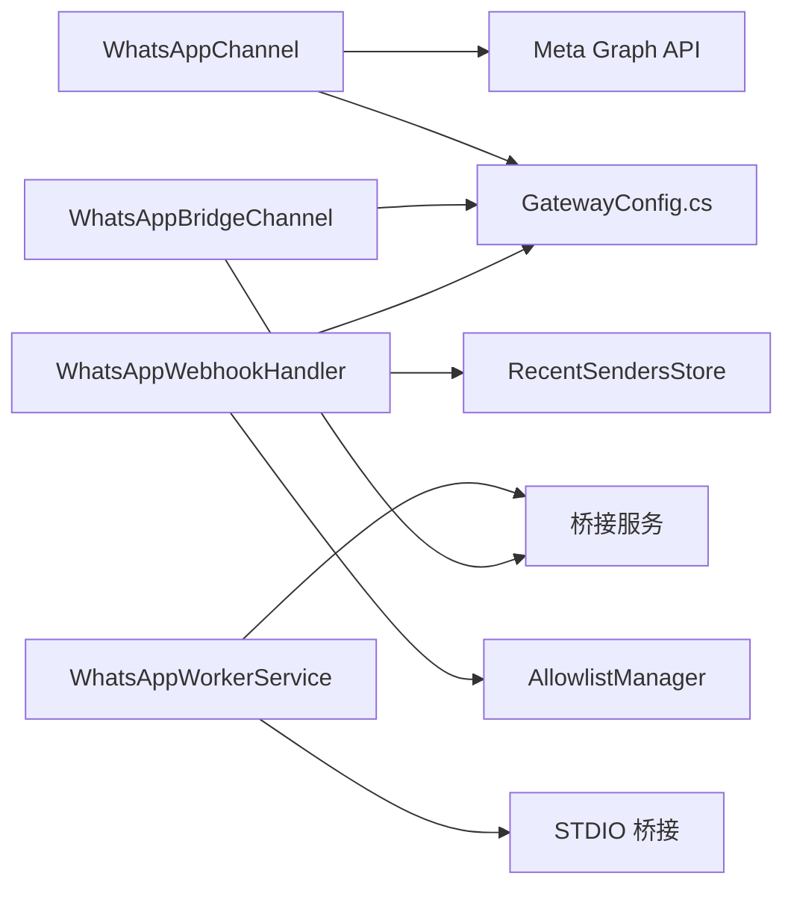

# WhatsApp 集成

<cite>
**本文档引用的文件**
- [WhatsAppChannel.cs](file://src/OpenClaw.Channels/WhatsAppChannel.cs)
- [WhatsAppBridgeChannel.cs](file://src/OpenClaw.Channels/WhatsAppBridgeChannel.cs)
- [WhatsAppWebhookHandler.cs](file://src/OpenClaw.Gateway/WhatsAppWebhookHandler.cs)
- [WhatsAppWorkerService.cs](file://src/OpenClaw.WhatsApp.BaileysWorker/WhatsAppWorkerService.cs)
- [Program.cs](file://src/OpenClaw.WhatsApp.BaileysWorker/Program.cs)
- [WHATSAPP_SETUP.md](file://docs/WHATSAPP_SETUP.md)
- [GatewayConfig.cs](file://src/OpenClaw.Core/Models/GatewayConfig.cs)
- [KingcrabChannelConfigs.cs](file://src/OpenClaw.Core/Models/KingcrabChannelConfigs.cs)
- [AdminEndpoints.Support.cs](file://src/OpenClaw.Gateway/Endpoints/AdminEndpoints.Support.cs)
- [ChannelReadinessEvaluator.cs](file://src/OpenClaw.Gateway/ChannelReadinessEvaluator.cs)
- [Channels.razor](file://src/OpenClaw.Dashboard/Pages/Channels.razor)
- [admin.html](file://src/OpenClaw.Gateway/wwwroot/admin.html)
</cite>

## 目录
1. [简介](#简介)
2. [项目结构](#项目结构)
3. [核心组件](#核心组件)
4. [架构总览](#架构总览)
5. [详细组件分析](#详细组件分析)
6. [依赖关系分析](#依赖关系分析)
7. [性能考量](#性能考量)
8. [故障排除指南](#故障排除指南)
9. [结论](#结论)
10. [附录](#附录)

## 简介
本文件系统性阐述 OpenClaw 中的 WhatsApp 渠道集成方案，覆盖以下方面：
- WhatsApp Business Cloud API 集成架构与官方 Webhook 处理
- Baileys Worker 实现与桥接通道（Bridge Channel）
- Webhook 配置、签名验证与消息路由机制
- 认证流程（Meta 应用配置、API 密钥管理）
- 消息格式转换（文本、媒体、位置、联系人）
- 状态回调处理与错误重试策略
- 部署配置、安全考虑、速率限制、消息大小限制、最佳实践与故障排除

## 项目结构
WhatsApp 集成由三大类模块构成：
- 官方 Cloud API 通道：通过 Meta Graph API 发送消息，使用官方 Webhook 接收消息
- 桥接通道：通过 HTTP 协议向桥接服务发送/接收消息，支持简单令牌鉴权
- 第三方工作器（Baileys Worker）：以插件形式运行，负责多设备连接、QR/配对码认证、消息收发与状态通知

图表来源
- [WhatsAppWebhookHandler.cs:1-370](file://src/OpenClaw.Gateway/WhatsAppWebhookHandler.cs#L1-370)
- [WhatsAppChannel.cs:1-320](file://src/OpenClaw.Channels/WhatsAppChannel.cs#L1-320)
- [WhatsAppBridgeChannel.cs:1-219](file://src/OpenClaw.Channels/WhatsAppBridgeChannel.cs#L1-219)
- [WhatsAppWorkerService.cs:1-421](file://src/OpenClaw.WhatsApp.BaileysWorker/WhatsAppWorkerService.cs#L1-421)
- [Program.cs:1-41](file://src/OpenClaw.WhatsApp.BaileysWorker/Program.cs#L1-41)
- [GatewayConfig.cs:549-632](file://src/OpenClaw.Core/Models/GatewayConfig.cs#L549-L632)

章节来源
- [WhatsAppChannel.cs:1-320](file://src/OpenClaw.Channels/WhatsAppChannel.cs#L1-L320)
- [WhatsAppBridgeChannel.cs:1-219](file://src/OpenClaw.Channels/WhatsAppBridgeChannel.cs#L1-L219)
- [WhatsAppWebhookHandler.cs:1-370](file://src/OpenClaw.Gateway/WhatsAppWebhookHandler.cs#L1-L370)
- [WhatsAppWorkerService.cs:1-421](file://src/OpenClaw.WhatsApp.BaileysWorker/WhatsAppWorkerService.cs#L1-L421)
- [Program.cs:1-41](file://src/OpenClaw.WhatsApp.BaileysWorker/Program.cs#L1-L41)
- [GatewayConfig.cs:549-632](file://src/OpenClaw.Core/Models/GatewayConfig.cs#L549-L632)

## 核心组件
- 官方 Cloud API 通道（WhatsAppChannel）
  - 负责通过 Meta Graph API 发送消息，支持文本与单附件（图片/视频/音频/文档/贴图），自动提取媒体标记并构建请求载荷
  - 读取配置中的 API 令牌与电话号码标识，进行授权与发送
- 桥接通道（WhatsAppBridgeChannel）
  - 通过 HTTP POST 将消息发送至桥接服务，支持多附件；可选 Bearer 令牌鉴权
  - 支持从桥接服务接收简化格式的入站消息
- 官方 Webhook 处理器（WhatsAppWebhookHandler）
  - 支持 GET 验证与 POST 入站消息处理
  - 支持两种类型：official（官方 Webhook，带 HMAC-SHA256 签名验证）与 bridge（桥接协议）
  - 基于白名单策略过滤来源，记录最近发送者，截断超长文本
- 第三方工作器（WhatsAppWorkerService + Program）
  - 作为插件运行，提供多设备连接、QR/配对码认证、消息收发与状态通知
  - 通过 STDIO 与宿主通信，使用桥接通知协议向上游传递消息与认证事件

章节来源
- [WhatsAppChannel.cs:1-320](file://src/OpenClaw.Channels/WhatsAppChannel.cs#L1-L320)
- [WhatsAppBridgeChannel.cs:1-219](file://src/OpenClaw.Channels/WhatsAppBridgeChannel.cs#L1-L219)
- [WhatsAppWebhookHandler.cs:1-370](file://src/OpenClaw.Gateway/WhatsAppWebhookHandler.cs#L1-L370)
- [WhatsAppWorkerService.cs:1-421](file://src/OpenClaw.WhatsApp.BaileysWorker/WhatsAppWorkerService.cs#L1-L421)
- [Program.cs:1-41](file://src/OpenClaw.WhatsApp.BaileysWorker/Program.cs#L1-L41)

## 架构总览
下图展示 WhatsApp 集成的整体交互流程，包括官方 Webhook、桥接通道与工作器三种接入方式。

图表来源
- [WhatsAppWebhookHandler.cs:35-167](file://src/OpenClaw.Gateway/WhatsAppWebhookHandler.cs#L35-L167)
- [WhatsAppChannel.cs:40-70](file://src/OpenClaw.Channels/WhatsAppChannel.cs#L40-L70)
- [WhatsAppBridgeChannel.cs:39-94](file://src/OpenClaw.Channels/WhatsAppBridgeChannel.cs#L39-L94)
- [WhatsAppWorkerService.cs:15-99](file://src/OpenClaw.WhatsApp.BaileysWorker/WhatsAppWorkerService.cs#L15-L99)

## 详细组件分析

### 官方 Cloud API 通道（WhatsAppChannel）
- 功能要点
  - 从消息文本中提取媒体标记，支持图片、视频、音频、文档、贴图等
  - 仅支持单附件发送（若存在多个标记，仅使用第一个）
  - 自动为文档类型设置文件名（基于 URL）
  - 文本内容支持预览链接开关
- 关键实现
  - 构建发送载荷：根据标记类型映射到对应字段（image/video/audio/document/sticker）
  - 使用 Bearer 令牌进行授权
  - 异常处理：记录错误日志并抛出异常（便于上层重试）

图表来源
- [WhatsAppChannel.cs:85-138](file://src/OpenClaw.Channels/WhatsAppChannel.cs#L85-L138)

章节来源
- [WhatsAppChannel.cs:1-320](file://src/OpenClaw.Channels/WhatsAppChannel.cs#L1-L320)

### 桥接通道（WhatsAppBridgeChannel）
- 功能要点
  - 将消息文本与媒体标记转换为桥接服务期望的载荷格式
  - 支持多附件，每个附件包含类型、URL、MIME 类型、文件名等
  - 可选 Bearer 令牌鉴权
  - 可抑制发送异常，避免影响上游流程
- 关键实现
  - 标记到媒体类型的映射
  - 组装发送载荷并发起 HTTP 请求

图表来源
- [WhatsAppBridgeChannel.cs:39-94](file://src/OpenClaw.Channels/WhatsAppBridgeChannel.cs#L39-L94)

章节来源
- [WhatsAppBridgeChannel.cs:1-219](file://src/OpenClaw.Channels/WhatsAppBridgeChannel.cs#L1-L219)

### 官方 Webhook 处理器（WhatsAppWebhookHandler）
- 功能要点
  - GET 验证：校验 hub.mode 与 hub.verify_token
  - POST 处理：解析官方 Webhook JSON，校验签名（可选），过滤白名单，截断超长文本，封装为 InboundMessage 并入队
  - 桥接协议：支持桥接令牌校验，解析简化载荷，注入媒体信息
  - 限流与安全：限制请求体大小，基于配置启用签名验证
- 关键实现
  - 官方签名验证：使用 App Secret 对请求体进行 HMAC-SHA256 校验
  - 桥接令牌校验：支持 Authorization Bearer 与自定义头 X-Bridge-Token
  - 白名单策略：结合允许的发送者 ID 进行过滤

图表来源
- [WhatsAppWebhookHandler.cs:35-167](file://src/OpenClaw.Gateway/WhatsAppWebhookHandler.cs#L35-L167)
- [WhatsAppWebhookHandler.cs:169-238](file://src/OpenClaw.Gateway/WhatsAppWebhookHandler.cs#L169-L238)

章节来源
- [WhatsAppWebhookHandler.cs:1-370](file://src/OpenClaw.Gateway/WhatsAppWebhookHandler.cs#L1-L370)

### Baileys Worker 实现（WhatsAppWorkerService + Program）
- 功能要点
  - 初始化工作器引擎（当前版本仅支持 simulated 驱动）
  - 提供启动/停止/发送/输入状态/已读回执/反应等操作接口
  - 通过 STDIO 与宿主通信，使用桥接通知协议向上游推送消息与认证事件
  - 支持调试模拟入站消息与认证事件
- 关键实现
  - 桥接通知：channel_message 与 channel_auth_event
  - 工作器状态：记录启动/停止次数与待处理操作

图表来源
- [WhatsAppWorkerService.cs:7-174](file://src/OpenClaw.WhatsApp.BaileysWorker/WhatsAppWorkerService.cs#L7-L174)
- [WhatsAppWorkerService.cs:200-373](file://src/OpenClaw.WhatsApp.BaileysWorker/WhatsAppWorkerService.cs#L200-L373)

章节来源
- [WhatsAppWorkerService.cs:1-421](file://src/OpenClaw.WhatsApp.BaileysWorker/WhatsAppWorkerService.cs#L1-L421)
- [Program.cs:1-41](file://src/OpenClaw.WhatsApp.BaileysWorker/Program.cs#L1-L41)

### 配置模型与部署
- 配置项概览
  - 官方 Cloud API：PhoneNumberId、CloudApiToken/CloudApiTokenRef、WebhookVerifyToken/WebhookAppSecret、签名验证开关、入站字符限制等
  - 桥接通道：BridgeUrl、BridgeToken/BridgeTokenRef、SuppressSendExceptions
  - 第三方工作器：Driver、ExecutablePath、WorkingDirectory、StoragePath、MediaCachePath、HistorySync、Proxy、Accounts[]
- 配置持久化与校验
  - 管理端提供可视化界面与 JSON Schema 校验
  - 非环回绑定时对敏感令牌进行缺失检查与修复指引

章节来源
- [GatewayConfig.cs:549-632](file://src/OpenClaw.Core/Models/GatewayConfig.cs#L549-L632)
- [KingcrabChannelConfigs.cs:1-126](file://src/OpenClaw.Core/Models/KingcrabChannelConfigs.cs#L1-L126)
- [AdminEndpoints.Support.cs:1349-1383](file://src/OpenClaw.Gateway/Endpoints/AdminEndpoints.Support.cs#L1349-L1383)
- [ChannelReadinessEvaluator.cs:153-185](file://src/OpenClaw.Gateway/ChannelReadinessEvaluator.cs#L153-L185)
- [Channels.razor:118-239](file://src/OpenClaw.Dashboard/Pages/Channels.razor#L118-L239)
- [admin.html:1880-1898](file://src/OpenClaw.Gateway/wwwroot/admin.html#L1880-L1898)

## 依赖关系分析
- 组件耦合
  - 通道适配器依赖配置模型与安全工具（令牌解析、HMAC 校验）
  - Webhook 处理器依赖白名单策略、最近发送者存储与 JSON 上下文
  - 工作器服务通过 STDIO 与宿主解耦，仅依赖桥接通知协议
- 外部依赖
  - Meta Graph API（官方 Cloud API）
  - 桥接服务（第三方 HTTP 接口）
  - Baileys/whatsmeow 工作器进程（可选）

图表来源
- [WhatsAppChannel.cs:16-31](file://src/OpenClaw.Channels/WhatsAppChannel.cs#L16-L31)
- [WhatsAppBridgeChannel.cs:17-30](file://src/OpenClaw.Channels/WhatsAppBridgeChannel.cs#L17-L30)
- [WhatsAppWebhookHandler.cs:15-33](file://src/OpenClaw.Gateway/WhatsAppWebhookHandler.cs#L15-L33)
- [WhatsAppWorkerService.cs:8-29](file://src/OpenClaw.WhatsApp.BaileysWorker/WhatsAppWorkerService.cs#L8-L29)

章节来源
- [WhatsAppChannel.cs:1-320](file://src/OpenClaw.Channels/WhatsAppChannel.cs#L1-L320)
- [WhatsAppBridgeChannel.cs:1-219](file://src/OpenClaw.Channels/WhatsAppBridgeChannel.cs#L1-L219)
- [WhatsAppWebhookHandler.cs:1-370](file://src/OpenClaw.Gateway/WhatsAppWebhookHandler.cs#L1-L370)
- [WhatsAppWorkerService.cs:1-421](file://src/OpenClaw.WhatsApp.BaileysWorker/WhatsAppWorkerService.cs#L1-L421)

## 性能考量
- 请求体大小限制
  - Webhook 处理器对入站请求体大小进行限制，防止过大负载
- 媒体处理
  - Cloud API 通道仅支持单附件发送；桥接通道支持多附件但需注意网络与存储开销
- 连接稳定性
  - 工作器层建议使用 whatsmeow 驱动以获得更稳定的连接与更低资源占用
- 日志与可观测性
  - 各组件均记录关键事件与错误，便于定位性能瓶颈与异常

## 故障排除指南
- 官方 Webhook 未通过验证
  - 检查 verify_token 是否正确配置，确认签名验证开关与 App Secret 设置
- 桥接通道发送失败
  - 确认 BridgeUrl 与 BridgeToken 配置；如为非环回绑定，确保令牌已设置
- 工作器不可用
  - 当前版本仅支持 simulated 驱动；生产环境请使用 baileys 或 whatsmeow，并按文档完成安装与路径配置
- 连接频繁断开
  - 检查网络连通性、代理设置与手机端 WhatsApp 在线状态
- 会话损坏
  - 删除 SessionPath 下的会话目录后重新配对

章节来源
- [WHATSAPP_SETUP.md:163-207](file://docs/WHATSAPP_SETUP.md#L163-L207)
- [WhatsAppWebhookHandler.cs:328-347](file://src/OpenClaw.Gateway/WhatsAppWebhookHandler.cs#L328-L347)
- [ChannelReadinessEvaluator.cs:165-185](file://src/OpenClaw.Gateway/ChannelReadinessEvaluator.cs#L165-L185)

## 结论
本集成方案提供了三种接入 WhatsApp 的路径：官方 Cloud API、HTTP 桥接与第三方工作器。官方 Webhook 处理器与通道适配器共同保证了消息的双向流转与安全校验；工作器服务则为多设备场景提供了扩展能力。通过完善的配置模型、可视化管理界面与严格的安全策略，用户可以在不同部署环境下稳定地使用 WhatsApp 渠道。

## 附录

### 认证流程（Meta 应用配置、API 密钥管理）
- Meta 应用配置
  - 在 Meta 开发者平台创建应用与页面，获取访问令牌与应用密钥
- API 密钥管理
  - Cloud API 令牌可通过直接值或密钥引用配置；Webhook 验证令牌与 App Secret 同样支持密钥引用
- 管理界面
  - 通过管理端设置验证令牌、App Secret、Cloud API 令牌与令牌引用

章节来源
- [Channels.razor:228-239](file://src/OpenClaw.Dashboard/Pages/Channels.razor#L228-L239)
- [admin.html:1880-1898](file://src/OpenClaw.Gateway/wwwroot/admin.html#L1880-L1898)

### 消息格式转换
- 文本消息
  - 官方通道：text.body 字段；桥接通道：text 字段
- 媒体消息
  - 官方通道：image/video/audio/document/sticker 字段；支持 caption 与 filename
  - 桥接通道：attachments 数组，包含 type/url/mime/type 等
- 位置与联系人
  - 当前实现主要覆盖文本与媒体；位置与联系人消息需在上游进行扩展

章节来源
- [WhatsAppChannel.cs:172-242](file://src/OpenClaw.Channels/WhatsAppChannel.cs#L172-L242)
- [WhatsAppBridgeChannel.cs:121-160](file://src/OpenClaw.Channels/WhatsAppBridgeChannel.cs#L121-L160)

### 状态回调与错误重试
- 状态回调
  - 工作器通过 channel_auth_event 通知认证状态变化；通过 channel_message 通知入站消息
- 错误重试
  - Cloud API 发送失败会抛出异常；桥接通道可选择抑制异常以避免阻塞
  - 建议在上游实现指数退避与死信队列策略

章节来源
- [WhatsAppWorkerService.cs:101-152](file://src/OpenClaw.WhatsApp.BaileysWorker/WhatsAppWorkerService.cs#L101-L152)
- [WhatsAppBridgeChannel.cs:86-94](file://src/OpenClaw.Channels/WhatsAppBridgeChannel.cs#L86-L94)

### 部署配置与最佳实践
- 部署配置
  - 官方 Cloud API：配置 PhoneNumberId 与 Cloud API 令牌
  - 桥接通道：配置 BridgeUrl 与 BridgeToken
  - 工作器：选择驱动（baileys/whatsmeow/simulated），设置存储路径与账户信息
- 最佳实践
  - 生产环境优先使用 whatsmeow 驱动
  - 对外暴露的网关应启用 Webhook 签名验证与令牌校验
  - 控制入站消息长度，避免超长文本导致性能问题

章节来源
- [WHATSAPP_SETUP.md:32-88](file://docs/WHATSAPP_SETUP.md#L32-L88)
- [AdminEndpoints.Support.cs:1349-1383](file://src/OpenClaw.Gateway/Endpoints/AdminEndpoints.Support.cs#L1349-L1383)