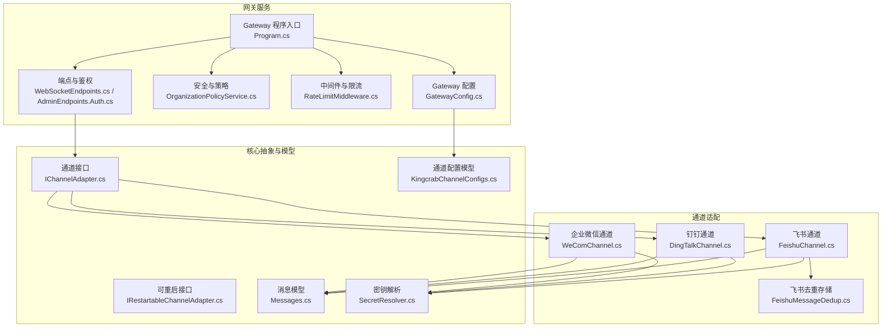
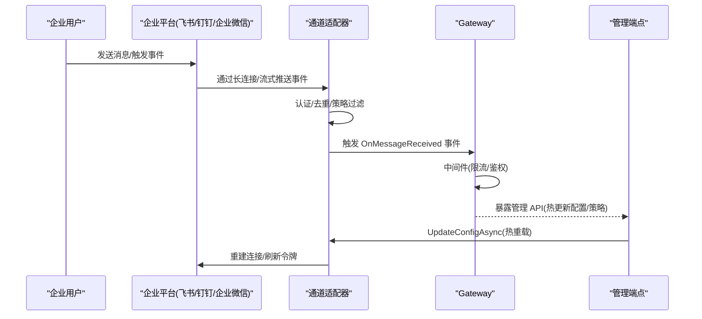
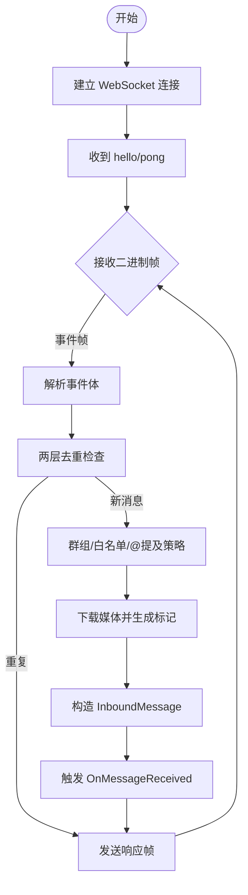
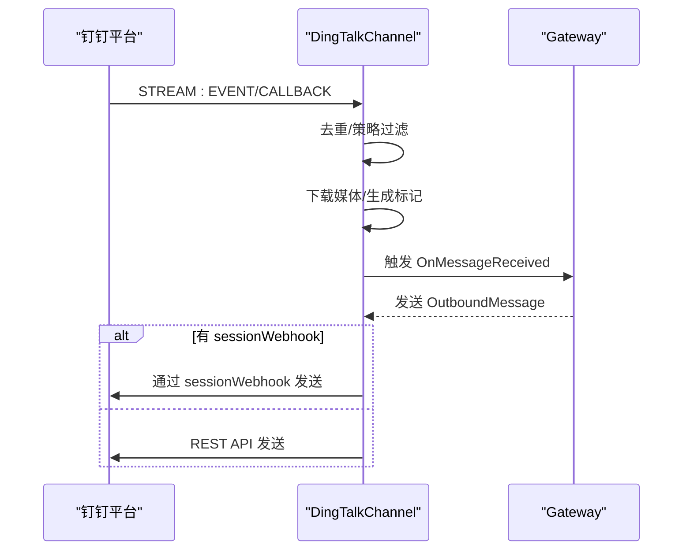
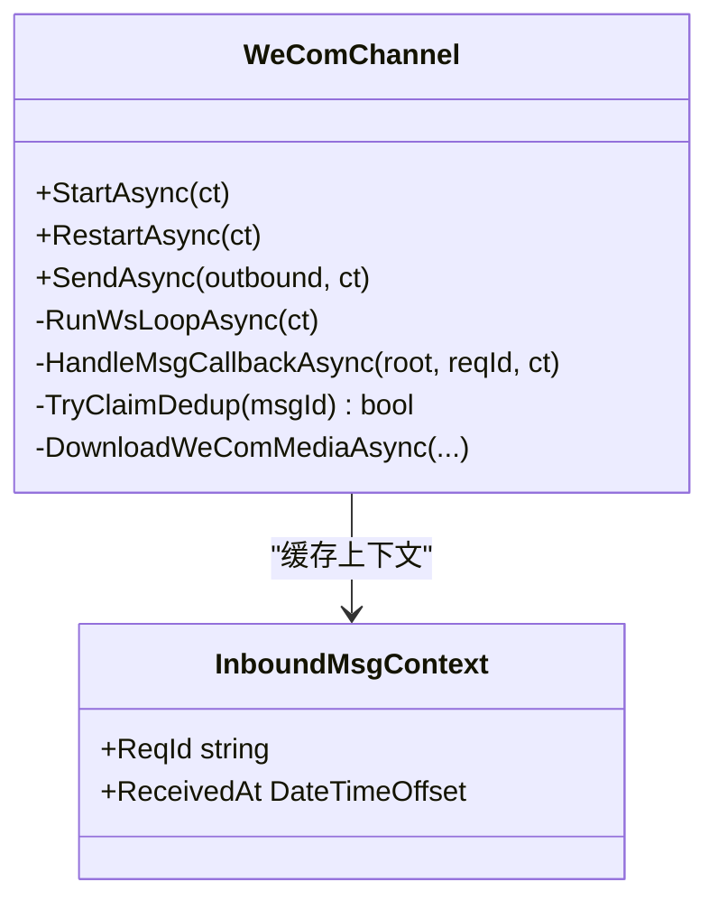
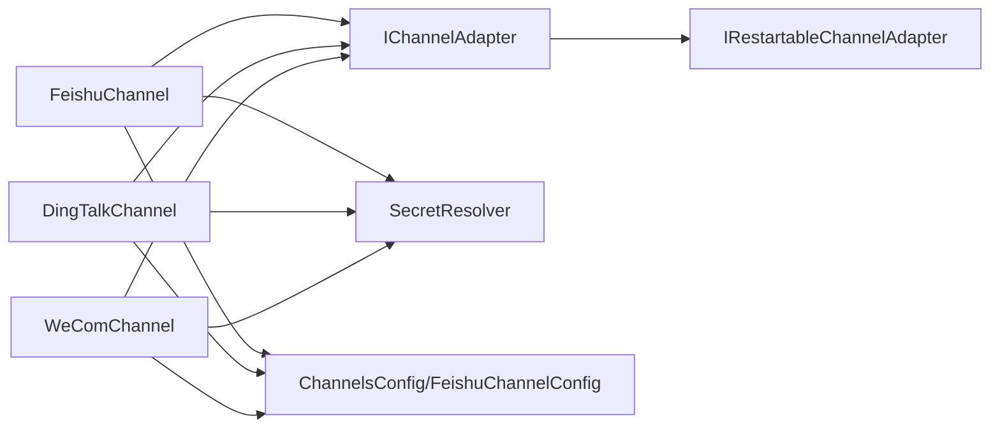

# 企业级渠道

<cite>
**本文档引用的文件**
- [FeishuChannel.cs](file://src/OpenClaw.Channels/FeishuChannel.cs)
- [DingTalkChannel.cs](file://src/OpenClaw.Channels/DingTalkChannel.cs)
- [WeComChannel.cs](file://src/OpenClaw.Channels/WeComChannel.cs)
- [FeishuMessageDedup.cs](file://src/OpenClaw.Channels/FeishuMessageDedup.cs)
- [KingcrabChannelConfigs.cs](file://src/OpenClaw.Core/Models/KingcrabChannelConfigs.cs)
- [IChannelAdapter.cs](file://src/OpenClaw.Core/Abstractions/IChannelAdapter.cs)
- [IRestartableChannelAdapter.cs](file://src/OpenClaw.Core/Abstractions/IRestartableChannelAdapter.cs)
- [Messages.cs](file://src/OpenClaw.Core/Models/Messages.cs)
- [SecretResolver.cs](file://src/OpenClaw.Core/Security/SecretResolver.cs)
- [GatewayConfig.cs](file://src/OpenClaw.Core/Models/GatewayConfig.cs)
- [Program.cs](file://src/OpenClaw.Gateway/Program.cs)
- [RateLimitMiddleware.cs](file://src/OpenClaw.Core/Middleware/RateLimitMiddleware.cs)
- [EndpointHelpers.cs](file://src/OpenClaw.Gateway/Endpoints/EndpointHelpers.cs)
- [WebSocketEndpoints.cs](file://src/OpenClaw.Gateway/Endpoints/WebSocketEndpoints.cs)
- [AdminEndpoints.Auth.cs](file://src/OpenClaw.Gateway/Endpoints/AdminEndpoints.Auth.cs)
- [OpenClawHttpClient.cs](file://src/OpenClaw.Client/OpenClawHttpClient.cs)
- [OrganizationPolicyService.cs](file://src/OpenClaw.Gateway/OrganizationPolicyService.cs)
- [OperatorGovernanceModels.cs](file://src/OpenClaw.Core/Models/OperatorGovernanceModels.cs)
- [AppHost.cs](file://Kingcrab.AppHost/AppHost.cs)
</cite>

## 目录
1. [简介](#简介)
2. [项目结构](#项目结构)
3. [核心组件](#核心组件)
4. [架构总览](#架构总览)
5. [详细组件分析](#详细组件分析)
6. [依赖关系分析](#依赖关系分析)
7. [性能与可扩展性](#性能与可扩展性)
8. [故障排查指南](#故障排查指南)
9. [结论](#结论)
10. [附录](#附录)

## 简介
本文件面向企业级通信渠道集成场景，系统性梳理飞书、钉钉、企业微信三大国内企业平台的接入实现，涵盖认证机制、组织架构集成、权限控制、消息推送策略、安全合规、大规模部署优化、API 限流与幂等、以及多租户与混合云部署实践。目标是帮助读者在不深入源码的前提下，也能高效理解并落地企业级集成方案。

## 项目结构
本项目采用分层与模块化设计：
- 通道适配层：分别实现飞书、钉钉、企业微信的长连接/流式接收与消息发送逻辑
- 核心模型与抽象：定义通道接口、入出站消息模型、重启能力等
- 安全与配置：集中式密钥解析、组织策略、访问控制
- 网关与端点：统一启动、中间件、限流、认证与管理端点
- 客户端与编排：提供管理客户端与分布式编排入口

图示来源
- [Program.cs:1-124](file://src/OpenClaw.Gateway/Program.cs#L1-L124)
- [GatewayConfig.cs:534-548](file://src/OpenClaw.Core/Models/GatewayConfig.cs#L534-L548)
- [IChannelAdapter.cs:1-22](file://src/OpenClaw.Core/Abstractions/IChannelAdapter.cs#L1-L22)
- [IRestartableChannelAdapter.cs:1-10](file://src/OpenClaw.Core/Abstractions/IRestartableChannelAdapter.cs#L1-L10)
- [Messages.cs:6-62](file://src/OpenClaw.Core/Models/Messages.cs#L6-L62)
- [KingcrabChannelConfigs.cs:13-126](file://src/OpenClaw.Core/Models/KingcrabChannelConfigs.cs#L13-L126)
- [SecretResolver.cs:14-66](file://src/OpenClaw.Core/Security/SecretResolver.cs#L14-L66)
- [FeishuChannel.cs:21-123](file://src/OpenClaw.Channels/FeishuChannel.cs#L21-L123)
- [DingTalkChannel.cs:24-148](file://src/OpenClaw.Channels/DingTalkChannel.cs#L24-L148)
- [WeComChannel.cs:21-172](file://src/OpenClaw.Channels/WeComChannel.cs#L21-L172)
- [FeishuMessageDedup.cs:19-165](file://src/OpenClaw.Channels/FeishuMessageDedup.cs#L19-L165)

章节来源
- [Program.cs:1-124](file://src/OpenClaw.Gateway/Program.cs#L1-L124)
- [GatewayConfig.cs:534-548](file://src/OpenClaw.Core/Models/GatewayConfig.cs#L534-L548)

## 核心组件
- 通道接口与生命周期
  - IChannelAdapter：统一的通道适配器接口，定义 StartAsync、SendAsync、OnMessageReceived 事件
  - IRestartableChannelAdapter：可热重启能力，支持运行时更新配置并自动重连
- 消息模型
  - InboundMessage/OutboundMessage：标准化入站/出站消息，包含 SenderId、MessageId、GroupId、MentionedIds、MediaType 等字段
- 配置模型
  - FeishuChannelConfig、DingTalkChannelConfig、WeComChannelConfig：分别描述三大平台的凭据、策略、限额等
- 安全与密钥
  - SecretResolver：支持 env:、raw:、裸环境变量名三种解析方式，集中化密钥管理
- 中间件与限流
  - RateLimitMiddleware：基于会话的时间窗口限流，防止滥用
- 网关与端点
  - Program.cs：统一构建与启动流程
  - WebSocketEndpoints/AdminEndpoints：鉴权、速率限制、组织策略校验

章节来源
- [IChannelAdapter.cs:1-22](file://src/OpenClaw.Core/Abstractions/IChannelAdapter.cs#L1-L22)
- [IRestartableChannelAdapter.cs:1-10](file://src/OpenClaw.Core/Abstractions/IRestartableChannelAdapter.cs#L1-L10)
- [Messages.cs:6-62](file://src/OpenClaw.Core/Models/Messages.cs#L6-L62)
- [KingcrabChannelConfigs.cs:13-126](file://src/OpenClaw.Core/Models/KingcrabChannelConfigs.cs#L13-L126)
- [SecretResolver.cs:14-66](file://src/OpenClaw.Core/Security/SecretResolver.cs#L14-L66)
- [RateLimitMiddleware.cs:1-40](file://src/OpenClaw.Core/Middleware/RateLimitMiddleware.cs#L1-L40)
- [Program.cs:1-124](file://src/OpenClaw.Gateway/Program.cs#L1-L124)

## 架构总览
三大企业平台均采用“长连接/流式接收 + REST API 发送”的组合模式：
- 飞书：WebSocket 长连接接收事件，REST API 获取资源与媒体；内置两层去重（内存+持久化）
- 钉钉：官方 Stream 模式 WebSocket 接收事件，REST API 发送消息与上传媒体；内存去重
- 企业微信：WebSocket 长连接接收消息，REST API 发送消息与上传媒体；内存去重与上下文缓存

图示来源
- [FeishuChannel.cs:126-193](file://src/OpenClaw.Channels/FeishuChannel.cs#L126-L193)
- [DingTalkChannel.cs:85-148](file://src/OpenClaw.Channels/DingTalkChannel.cs#L85-L148)
- [WeComChannel.cs:113-172](file://src/OpenClaw.Channels/WeComChannel.cs#L113-L172)
- [IChannelAdapter.cs:9-22](file://src/OpenClaw.Core/Abstractions/IChannelAdapter.cs#L9-L22)
- [IRestartableChannelAdapter.cs:6-9](file://src/OpenClaw.Core/Abstractions/IRestartableChannelAdapter.cs#L6-L9)

## 详细组件分析

### 飞书（Lark）通道
- 认证与凭据
  - 使用 AppId/AppSecret 获取应用级访问令牌；支持 SecretResolver 的 env/raw 解析
  - 启动时预加载磁盘去重状态，提升重连后的幂等性
- 长连接与事件处理
  - WebSocket 接收二进制帧，按 pbbp2 协议解析；支持 ping/pong 心跳
  - 事件类型 im.message.receive_v1：解析消息体、@提及过滤、媒体下载与标记注入
- 去重与幂等
  - 两层去重：内存 TTL(5 分钟) + 磁盘持久化(24 小时)，命名空间为 app_id
- 策略与权限
  - GroupPolicy 支持 open/allowlist/disabled；支持 RequireMentionInGroup
  - 白名单 Allowlist：AllowedFromUserIds、AllowedGroupIds
- 发送策略
  - 通过 REST API 发送文本/媒体；媒体下载后以 [IMAGE_PATH:...] 形式注入文本

图示来源
- [FeishuChannel.cs:213-411](file://src/OpenClaw.Channels/FeishuChannel.cs#L213-L411)
- [FeishuMessageDedup.cs:81-165](file://src/OpenClaw.Channels/FeishuMessageDedup.cs#L81-L165)

章节来源
- [FeishuChannel.cs:21-123](file://src/OpenClaw.Channels/FeishuChannel.cs#L21-L123)
- [FeishuChannel.cs:415-607](file://src/OpenClaw.Channels/FeishuChannel.cs#L415-L607)
- [FeishuMessageDedup.cs:19-165](file://src/OpenClaw.Channels/FeishuMessageDedup.cs#L19-L165)
- [KingcrabChannelConfigs.cs:13-52](file://src/OpenClaw.Core/Models/KingcrabChannelConfigs.cs#L13-L52)

### 钉钉通道
- 认证与凭据
  - AppKey/AppSecret 获取 access_token；支持 SecretResolver
  - 通过 Open Stream Connection 获取 WebSocket 端点与票据
- 流式接收
  - SYSTEM/PING、EVENT、CALLBACK 三类消息；CALLBACK 用于机器人回调
  - 会话级 webhook 缓存，优先使用 sessionWebhook 快速回复
- 去重与幂等
  - 内存去重（5 分钟 TTL，最多 2000 条）
- 策略与权限
  - GroupPolicy、白名单、RequireMentionInGroup
- 发送策略
  - 优先 sessionWebhook；否则 REST API 发送文本或上传媒体

图示来源
- [DingTalkChannel.cs:169-316](file://src/OpenClaw.Channels/DingTalkChannel.cs#L169-L316)
- [DingTalkChannel.cs:318-456](file://src/OpenClaw.Channels/DingTalkChannel.cs#L318-L456)
- [DingTalkChannel.cs:584-740](file://src/OpenClaw.Channels/DingTalkChannel.cs#L584-L740)

章节来源
- [DingTalkChannel.cs:24-148](file://src/OpenClaw.Channels/DingTalkChannel.cs#L24-L148)
- [DingTalkChannel.cs:458-581](file://src/OpenClaw.Channels/DingTalkChannel.cs#L458-L581)
- [KingcrabChannelConfigs.cs:54-78](file://src/OpenClaw.Core/Models/KingcrabChannelConfigs.cs#L54-L78)

### 企业微信通道
- 认证与凭据
  - WebSocket 长连接：BotId/BotSecret
  - REST API：CorpId/AgentId/CorpSecret
- 长连接与事件处理
  - aibot_subscribe 鉴权；aibot_msg_callback/aibot_event_callback
  - 24 小时上下文缓存，支持 WebSocket 快速回复
- 去重与幂等
  - 内存去重（5 分钟 TTL，最多 2000 条）
- 策略与权限
  - GroupPolicy、白名单、RequireMentionInGroup
- 发送策略
  - 优先 WebSocket 快速回复；否则使用自建应用 REST API

图示来源
- [WeComChannel.cs:21-172](file://src/OpenClaw.Channels/WeComChannel.cs#L21-L172)
- [WeComChannel.cs:380-503](file://src/OpenClaw.Channels/WeComChannel.cs#L380-L503)
- [WeComChannel.cs:607-629](file://src/OpenClaw.Channels/WeComChannel.cs#L607-L629)

章节来源
- [WeComChannel.cs:21-172](file://src/OpenClaw.Channels/WeComChannel.cs#L21-L172)
- [WeComChannel.cs:505-530](file://src/OpenClaw.Channels/WeComChannel.cs#L505-L530)
- [KingcrabChannelConfigs.cs:84-126](file://src/OpenClaw.Core/Models/KingcrabChannelConfigs.cs#L84-L126)

## 依赖关系分析
- 组件耦合
  - 通道适配器依赖 IChannelAdapter/IRestartableChannelAdapter 抽象，降低平台差异
  - 依赖 SecretResolver 进行集中式密钥解析，避免硬编码
  - 依赖 GatewayConfig 中 ChannelsConfig 与具体平台配置模型
- 外部依赖
  - 企业平台 API：飞书、钉钉、企业微信的 REST/WS 端点
  - 管理端点：通过 AdminEndpoints 与 OpenClawHttpClient 进行配置热更新与策略管理

图示来源
- [IChannelAdapter.cs:9-22](file://src/OpenClaw.Core/Abstractions/IChannelAdapter.cs#L9-L22)
- [IRestartableChannelAdapter.cs:6-9](file://src/OpenClaw.Core/Abstractions/IRestartableChannelAdapter.cs#L6-L9)
- [SecretResolver.cs:14-66](file://src/OpenClaw.Core/Security/SecretResolver.cs#L14-L66)
- [GatewayConfig.cs:534-548](file://src/OpenClaw.Core/Models/GatewayConfig.cs#L534-L548)

章节来源
- [GatewayConfig.cs:534-548](file://src/OpenClaw.Core/Models/GatewayConfig.cs#L534-L548)

## 性能与可扩展性
- 连接与重连
  - 指数退避重连（最大 60 秒），降低平台压力
  - 飞书 WebSocket 心跳（120 秒）与企业微信心跳（30 秒）保障长连稳定
- 去重与幂等
  - 飞书双层去重（内存+磁盘），确保事件重放与重启后不重复处理
  - 钉钉/企业微信内存去重，结合平台消息 ID 实现幂等
- 限流与节流
  - RateLimitMiddleware 基于会话的时间窗口限流
  - 网关端点层按 IP/token 维度限流
- 媒体处理
  - 通道侧下载媒体至本地临时目录，减少对外部资源依赖
  - 通过标记注入（如 [IMAGE_PATH:...]）降低二次网络请求

章节来源
- [FeishuChannel.cs:213-262](file://src/OpenClaw.Channels/FeishuChannel.cs#L213-L262)
- [WeComChannel.cs:207-255](file://src/OpenClaw.Channels/WeComChannel.cs#L207-L255)
- [DingTalkChannel.cs:169-210](file://src/OpenClaw.Channels/DingTalkChannel.cs#L169-L210)
- [RateLimitMiddleware.cs:10-40](file://src/OpenClaw.Core/Middleware/RateLimitMiddleware.cs#L10-L40)
- [EndpointHelpers.cs:145-173](file://src/OpenClaw.Gateway/Endpoints/EndpointHelpers.cs#L145-L173)
- [WebSocketEndpoints.cs:68-106](file://src/OpenClaw.Gateway/Endpoints/WebSocketEndpoints.cs#L68-L106)

## 故障排查指南
- 通道无法启动
  - 检查 SecretResolver 是否正确解析 AppId/AppSecret/CorpId/AgentId 等
  - 查看通道 StartAsync 日志，确认凭据校验与连接建立
- 消息重复/丢失
  - 飞书：检查磁盘去重目录与权限；确认 Warmup 是否成功
  - 钉钉/企业微信：检查内存去重表大小与 TTL
- 限流与鉴权
  - 网关端点层 429/401/403：核对组织策略、令牌、IP 白名单
- 管理端点与热更新
  - 通过管理端点调用 UpdateConfigAsync，观察通道 RestartAsync 行为
  - 管理客户端 OpenClawHttpClient 可查询/更新组织策略

章节来源
- [SecretResolver.cs:14-66](file://src/OpenClaw.Core/Security/SecretResolver.cs#L14-L66)
- [FeishuMessageDedup.cs:81-104](file://src/OpenClaw.Channels/FeishuMessageDedup.cs#L81-L104)
- [WebSocketEndpoints.cs:68-106](file://src/OpenClaw.Gateway/Endpoints/WebSocketEndpoints.cs#L68-L106)
- [AdminEndpoints.Auth.cs:120-148](file://src/OpenClaw.Gateway/Endpoints/AdminEndpoints.Auth.cs#L120-L148)
- [OpenClawHttpClient.cs:1113-1124](file://src/OpenClaw.Client/OpenClawHttpClient.cs#L1113-L1124)

## 结论
本项目在企业级通信渠道集成方面提供了高可用、可扩展、可审计的实现路径：
- 三大平台统一抽象与差异化适配，满足复杂企业场景
- 安全与合规：集中密钥、组织策略、访问控制、审计日志
- 可靠性：长连接、心跳、指数退避、多层去重
- 可运维：热重载、管理端点、限流与可观测性

## 附录

### 企业级安全与合规要点
- 数据合规
  - 媒体下载至本地临时目录，避免泄露平台资源 URL
  - 组织策略可强制关闭公网绑定风险项（如 raw: 密钥、插件桥）
- 访问控制
  - 管理端点鉴权：支持浏览器会话、账户令牌、引导令牌
  - 网关端点鉴权：非回环绑定时强制令牌校验
- 审计与治理
  - 管理端点暴露策略查询/更新接口
  - 运行时审计与操作日志

章节来源
- [OrganizationPolicyService.cs:72-97](file://src/OpenClaw.Gateway/OrganizationPolicyService.cs#L72-L97)
- [OperatorGovernanceModels.cs:111-119](file://src/OpenClaw.Core/Models/OperatorGovernanceModels.cs#L111-L119)
- [AdminEndpoints.Auth.cs:120-148](file://src/OpenClaw.Gateway/Endpoints/AdminEndpoints.Auth.cs#L120-L148)
- [OpenClawHttpClient.cs:1113-1124](file://src/OpenClaw.Client/OpenClawHttpClient.cs#L1113-L1124)

### 大规模部署与多租户
- 多租户
  - 通道配置独立命名空间（飞书以 app_id 为命名空间）
  - 管理端点按租户维度隔离策略与凭据
- 混合云
  - 通道适配器与网关解耦，可在不同区域/云厂商部署
  - 使用分布式编排（AppHost）统一编排 Keycloak、网关与客户端

章节来源
- [FeishuMessageDedup.cs:66-72](file://src/OpenClaw.Channels/FeishuMessageDedup.cs#L66-L72)
- [AppHost.cs:1-24](file://Kingcrab.AppHost/AppHost.cs#L1-L24)