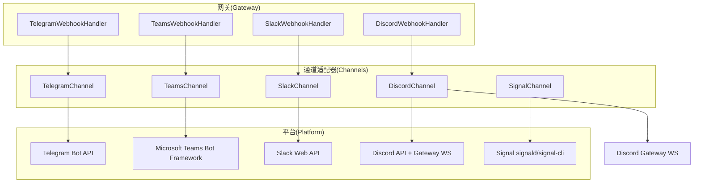
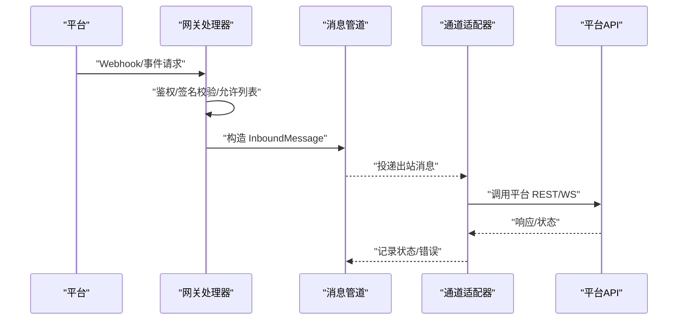
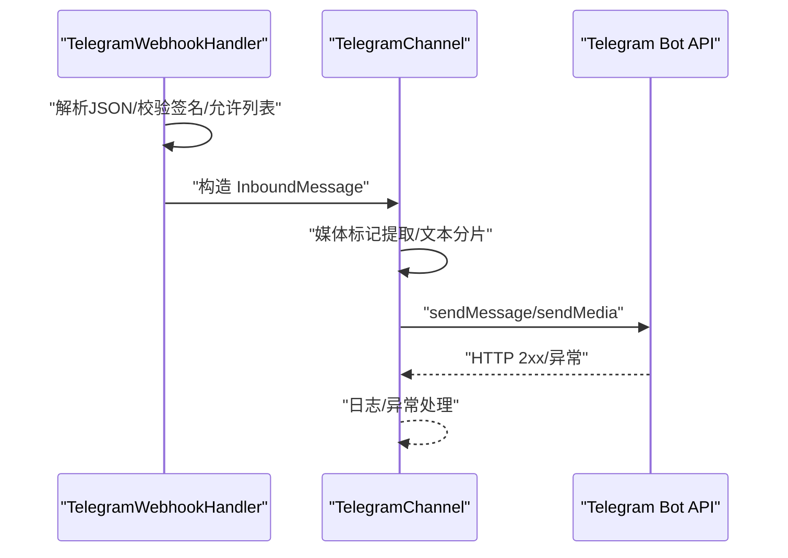
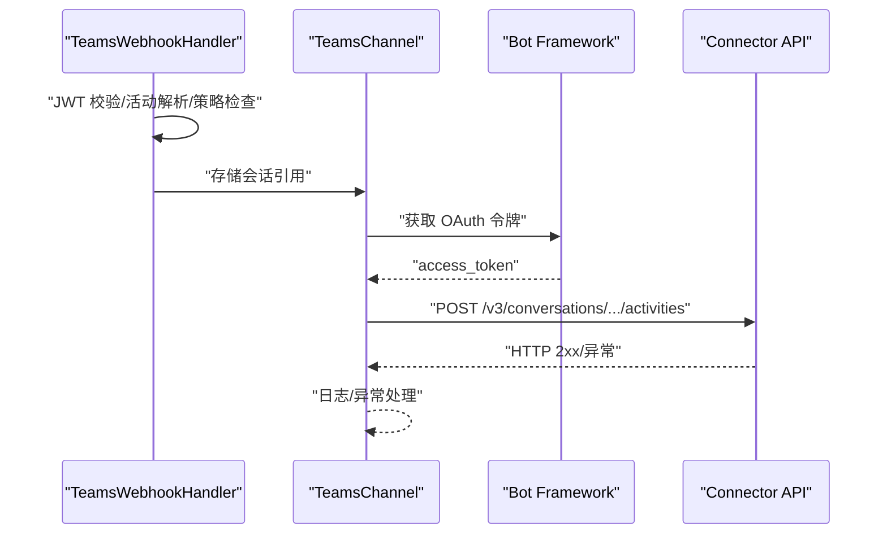
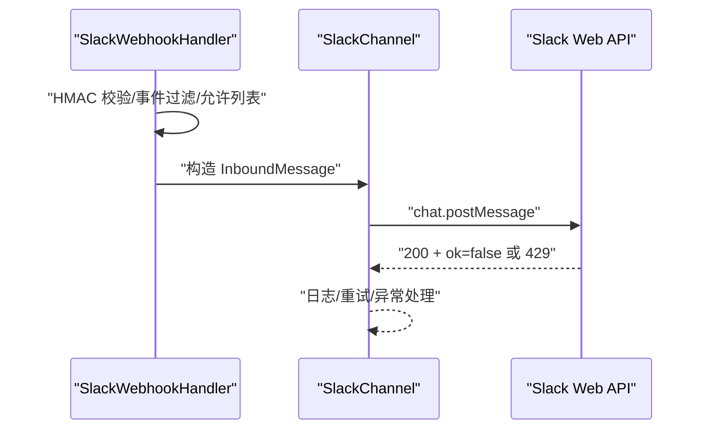
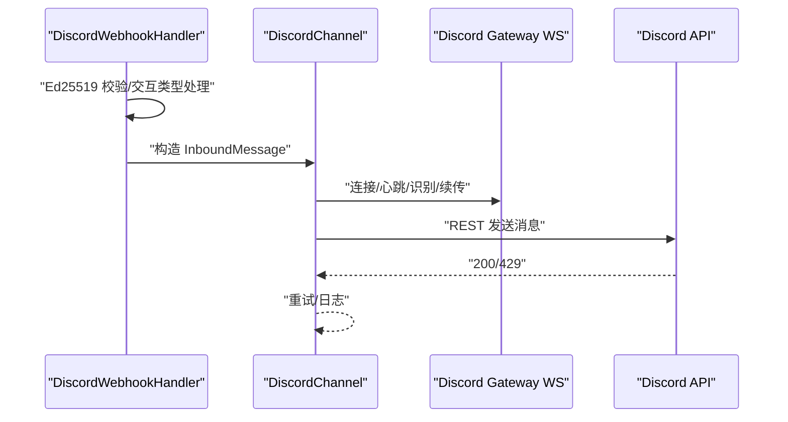
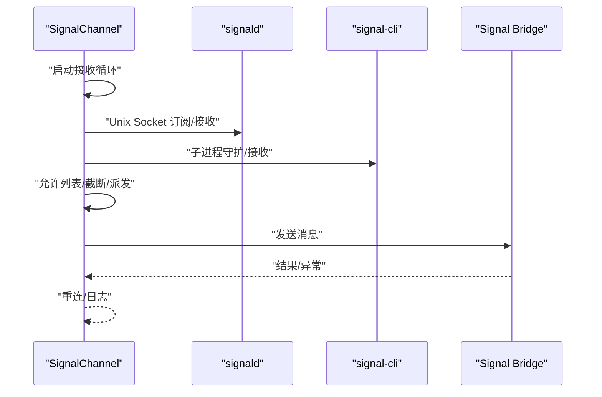
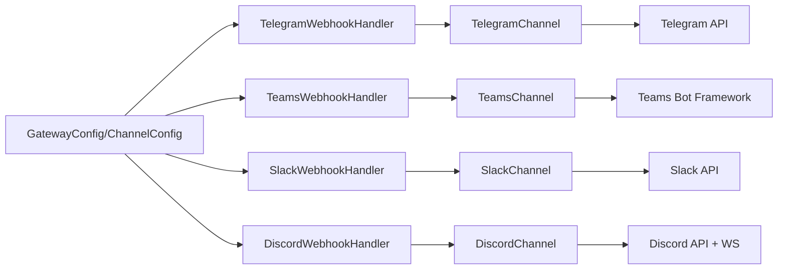

# 消息平台集成

<cite>
**本文引用的文件**
- [TelegramChannel.cs](file://src/OpenClaw.Channels/TelegramChannel.cs)
- [TelegramWebhookHandler.cs](file://src/OpenClaw.Gateway/TelegramWebhookHandler.cs)
- [TelegramChannelConfig:713-733](file://src/OpenClaw.Core/Models/GatewayConfig.cs#L713-L733)
- [TeamsChannel.cs](file://src/OpenClaw.Channels/TeamsChannel.cs)
- [TeamsWebhookHandler.cs](file://src/OpenClaw.Gateway/TeamsWebhookHandler.cs)
- [TeamsChannelConfig:635-686](file://src/OpenClaw.Core/Models/GatewayConfig.cs#L635-L686)
- [SlackChannel.cs](file://src/OpenClaw.Channels/SlackChannel.cs)
- [SlackWebhookHandler.cs](file://src/OpenClaw.Gateway/SlackWebhookHandler.cs)
- [SlackChannelConfig:735-751](file://src/OpenClaw.Core/Models/GatewayConfig.cs#L735-L751)
- [DiscordChannel.cs](file://src/OpenClaw.Channels/DiscordChannel.cs)
- [DiscordWebhookHandler.cs](file://src/OpenClaw.Gateway/DiscordWebhookHandler.cs)
- [DiscordChannelConfig:753-772](file://src/OpenClaw.Core/Models/GatewayConfig.cs#L753-L772)
- [SignalChannel.cs](file://src/OpenClaw.Channels/SignalChannel.cs)
- [ChannelConfig.cs](file://src/OpenClaw.Dashboard/Models/ChannelConfig.cs)
- [GatewayConfig.cs:713-787](file://src/OpenClaw.Core/Models/GatewayConfig.cs#L713-L787)
</cite>

## 目录
1. [简介](#简介)
2. [项目结构](#项目结构)
3. [核心组件](#核心组件)
4. [架构总览](#架构总览)
5. [详细组件分析](#详细组件分析)
6. [依赖关系分析](#依赖关系分析)
7. [性能考量](#性能考量)
8. [故障排查指南](#故障排查指南)
9. [结论](#结论)
10. [附录](#附录)

## 简介
本文件系统性梳理了 OpenClaw 在主流消息平台（Telegram、Teams、Slack、Discord、Signal）上的集成方案，覆盖认证与安全、消息路由、平台特性支持、消息格式转换、状态同步与错误处理、速率限制策略以及最佳实践。目标是帮助开发者快速理解并部署多平台消息通道，同时在不同平台能力差异下实现一致的业务体验。

## 项目结构
围绕“网关-通道适配器-平台”的分层组织：
- 网关层负责接收平台 Webhook/事件，进行鉴权与入站消息解析，并将消息投递到统一管道。
- 通道适配器负责与具体平台 API 交互，实现发送与部分入站处理（如 Discord WebSocket）。
- 配置模型集中定义各平台的启用开关、鉴权参数、限流与策略等。

图表来源
- [TelegramWebhookHandler.cs:1-252](file://src/OpenClaw.Gateway/TelegramWebhookHandler.cs#L1-L252)
- [TeamsWebhookHandler.cs:1-272](file://src/OpenClaw.Gateway/TeamsWebhookHandler.cs#L1-L272)
- [SlackWebhookHandler.cs:1-276](file://src/OpenClaw.Gateway/SlackWebhookHandler.cs#L1-L276)
- [DiscordWebhookHandler.cs:1-198](file://src/OpenClaw.Gateway/DiscordWebhookHandler.cs#L1-L198)
- [TelegramChannel.cs:1-338](file://src/OpenClaw.Channels/TelegramChannel.cs#L1-L338)
- [TeamsChannel.cs:1-355](file://src/OpenClaw.Channels/TeamsChannel.cs#L1-L355)
- [SlackChannel.cs:1-184](file://src/OpenClaw.Channels/SlackChannel.cs#L1-L184)
- [DiscordChannel.cs:1-504](file://src/OpenClaw.Channels/DiscordChannel.cs#L1-L504)
- [SignalChannel.cs:1-375](file://src/OpenClaw.Channels/SignalChannel.cs#L1-L375)

章节来源
- [TelegramWebhookHandler.cs:1-252](file://src/OpenClaw.Gateway/TelegramWebhookHandler.cs#L1-L252)
- [TeamsWebhookHandler.cs:1-272](file://src/OpenClaw.Gateway/TeamsWebhookHandler.cs#L1-L272)
- [SlackWebhookHandler.cs:1-276](file://src/OpenClaw.Gateway/SlackWebhookHandler.cs#L1-L276)
- [DiscordWebhookHandler.cs:1-198](file://src/OpenClaw.Gateway/DiscordWebhookHandler.cs#L1-L198)
- [TelegramChannel.cs:1-338](file://src/OpenClaw.Channels/TelegramChannel.cs#L1-L338)
- [TeamsChannel.cs:1-355](file://src/OpenClaw.Channels/TeamsChannel.cs#L1-L355)
- [SlackChannel.cs:1-184](file://src/OpenClaw.Channels/SlackChannel.cs#L1-L184)
- [DiscordChannel.cs:1-504](file://src/OpenClaw.Channels/DiscordChannel.cs#L1-L504)
- [SignalChannel.cs:1-375](file://src/OpenClaw.Channels/SignalChannel.cs#L1-L375)

## 核心组件
- 渠道适配器（IChannelAdapter 实现）
  - TelegramChannel：基于 Bot API 的 Webhook 入站与 sendMessage/sendMedia 出站，支持媒体标记协议与分片发送。
  - TeamsChannel：Bot Framework Connector 出站，入站通过网关 Handler 解析 Activity 并缓存会话引用。
  - SlackChannel：Web API chat.postMessage 入站通过 Events API/Slash Commands，支持速率限制与应用级错误处理。
  - DiscordChannel：Gateway WebSocket 接收消息，REST API 发送；可注册 Slash 命令；支持 Ed25519 签名校验。
  - SignalChannel：支持 signald 与 signal-cli 两种驱动，Unix Domain Socket 或子进程通信，仅支持私聊。
- 网关处理器
  - TelegramWebhookHandler：校验签名、解析消息、去重、入站允许列表、会话映射与投递。
  - TeamsWebhookHandler：JWT 校验、活动解析、提及检测、租户/群组策略、会话映射与投递。
  - SlackWebhookHandler：HMAC-SHA256 签名校验、事件过滤、工作区/频道/用户允许列表、线程映射。
  - DiscordWebhookHandler：Ed25519 签名校验、交互类型处理、公有服务器鉴权、延迟响应。
- 配置模型
  - 各平台 ChannelConfig 定义启用、鉴权、路径、允许列表、最大字符数、请求大小限制、签名验证开关等。
  - GatewayConfig 提供全局 Webhook 路径、公共地址、速率限制等通用设置。

章节来源
- [TelegramChannel.cs:18-189](file://src/OpenClaw.Channels/TelegramChannel.cs#L18-L189)
- [TeamsChannel.cs:21-207](file://src/OpenClaw.Channels/TeamsChannel.cs#L21-L207)
- [SlackChannel.cs:19-116](file://src/OpenClaw.Channels/SlackChannel.cs#L19-L116)
- [DiscordChannel.cs:21-411](file://src/OpenClaw.Channels/DiscordChannel.cs#L21-L411)
- [SignalChannel.cs:17-358](file://src/OpenClaw.Channels/SignalChannel.cs#L17-L358)
- [TelegramWebhookHandler.cs:10-252](file://src/OpenClaw.Gateway/TelegramWebhookHandler.cs#L10-L252)
- [TeamsWebhookHandler.cs:15-272](file://src/OpenClaw.Gateway/TeamsWebhookHandler.cs#L15-L272)
- [SlackWebhookHandler.cs:12-276](file://src/OpenClaw.Gateway/SlackWebhookHandler.cs#L12-L276)
- [DiscordWebhookHandler.cs:16-198](file://src/OpenClaw.Gateway/DiscordWebhookHandler.cs#L16-L198)
- [GatewayConfig.cs:713-787](file://src/OpenClaw.Core/Models/GatewayConfig.cs#L713-L787)

## 架构总览
下图展示从平台到网关再到通道适配器的消息流向与关键控制点。

图表来源
- [TelegramWebhookHandler.cs:47-103](file://src/OpenClaw.Gateway/TelegramWebhookHandler.cs#L47-L103)
- [TeamsWebhookHandler.cs:42-188](file://src/OpenClaw.Gateway/TeamsWebhookHandler.cs#L42-L188)
- [SlackWebhookHandler.cs:42-154](file://src/OpenClaw.Gateway/SlackWebhookHandler.cs#L42-L154)
- [DiscordWebhookHandler.cs:52-158](file://src/OpenClaw.Gateway/DiscordWebhookHandler.cs#L52-L158)
- [TelegramChannel.cs:54-124](file://src/OpenClaw.Channels/TelegramChannel.cs#L54-L124)
- [TeamsChannel.cs:63-110](file://src/OpenClaw.Channels/TeamsChannel.cs#L63-L110)
- [SlackChannel.cs:44-91](file://src/OpenClaw.Channels/SlackChannel.cs#L44-L91)
- [DiscordChannel.cs:75-120](file://src/OpenClaw.Channels/DiscordChannel.cs#L75-L120)

## 详细组件分析

### Telegram 集成
- 认证与安全
  - 入站 Webhook 支持可选的 X-Telegram-Bot-Api-Secret-Token 校验。
  - 出站使用 Bot Token，按 API 方法选择 sendPhoto/sendVideo 等。
- 消息路由与格式
  - 支持媒体标记协议，自动识别图片/视频/音频/文档/贴纸并拆分为多段发送。
  - 文本超长自动分片，标题超长截断。
- 错误处理与速率限制
  - 统一异常日志；未显式处理 429。
- 平台特性
  - 支持回复到指定消息（reply_to_message_id）。
  - 支持聊天 ID 为数字或公开用户名。

图表来源
- [TelegramWebhookHandler.cs:47-103](file://src/OpenClaw.Gateway/TelegramWebhookHandler.cs#L47-L103)
- [TelegramChannel.cs:54-124](file://src/OpenClaw.Channels/TelegramChannel.cs#L54-L124)

章节来源
- [TelegramChannel.cs:18-189](file://src/OpenClaw.Channels/TelegramChannel.cs#L18-L189)
- [TelegramWebhookHandler.cs:10-252](file://src/OpenClaw.Gateway/TelegramWebhookHandler.cs#L10-L252)
- [TelegramChannelConfig:713-733](file://src/OpenClaw.Core/Models/GatewayConfig.cs#L713-L733)

### Teams 集成
- 认证与安全
  - 入站 Activity 通过 Bot Framework JWT 校验（可配置）。
  - 出站使用 OAuth 2.0 获取访问令牌，带并发令牌缓存与过期保护。
- 消息路由与格式
  - 通过会话引用（ServiceUrl/ConversationId）主动发送消息。
  - 支持线程回复（ReplyToId）。
- 错误处理与速率限制
  - 统一异常日志；未显式处理 429。
- 平台特性
  - 群组策略：禁用/白名单；提及检测；租户白名单；会话映射区分群组/频道。

图表来源
- [TeamsWebhookHandler.cs:42-188](file://src/OpenClaw.Gateway/TeamsWebhookHandler.cs#L42-L188)
- [TeamsChannel.cs:63-175](file://src/OpenClaw.Channels/TeamsChannel.cs#L63-L175)

章节来源
- [TeamsChannel.cs:21-207](file://src/OpenClaw.Channels/TeamsChannel.cs#L21-L207)
- [TeamsWebhookHandler.cs:15-272](file://src/OpenClaw.Gateway/TeamsWebhookHandler.cs#L15-L272)
- [TeamsChannelConfig:635-686](file://src/OpenClaw.Core/Models/GatewayConfig.cs#L635-L686)

### Slack 集成
- 认证与安全
  - 入站 Events API 与 Slash Commands 使用 HMAC-SHA256 签名校验（v0），含时间戳防重放。
- 消息路由与格式
  - 将 Markdown 转换为 mrkdwn；支持线程（thread_ts）。
- 错误处理与速率限制
  - 429 返回时读取 Retry-After 并跳过；应用级错误通过返回体中的 ok 字段判断。
- 平台特性
  - 工作区/频道/用户允许列表；线程映射；DM 策略。

图表来源
- [SlackWebhookHandler.cs:42-154](file://src/OpenClaw.Gateway/SlackWebhookHandler.cs#L42-L154)
- [SlackChannel.cs:44-91](file://src/OpenClaw.Channels/SlackChannel.cs#L44-L91)

章节来源
- [SlackChannel.cs:19-116](file://src/OpenClaw.Channels/SlackChannel.cs#L19-L116)
- [SlackWebhookHandler.cs:12-276](file://src/OpenClaw.Gateway/SlackWebhookHandler.cs#L12-L276)
- [SlackChannelConfig:735-751](file://src/OpenClaw.Core/Models/GatewayConfig.cs#L735-L751)

### Discord 集成
- 认证与安全
  - 交互端点使用 Ed25519 签名校验（v1），含时间戳防重放；可选禁用校验。
- 消息路由与格式
  - Gateway WebSocket 接收消息，支持私聊/群组/线程；REST API 发送消息。
  - 可注册 Slash 命令；延迟响应（type 5）改善用户体验。
- 错误处理与速率限制
  - 429 自动退避重试；心跳保活；断线重连与会话续传。
- 平台特性
  - 公有服务器鉴权；意图配置；允许列表（公会/频道/用户）。

图表来源
- [DiscordWebhookHandler.cs:52-158](file://src/OpenClaw.Gateway/DiscordWebhookHandler.cs#L52-L158)
- [DiscordChannel.cs:66-120](file://src/OpenClaw.Channels/DiscordChannel.cs#L66-L120)

章节来源
- [DiscordChannel.cs:21-411](file://src/OpenClaw.Channels/DiscordChannel.cs#L21-L411)
- [DiscordWebhookHandler.cs:16-198](file://src/OpenClaw.Gateway/DiscordWebhookHandler.cs#L16-L198)
- [DiscordChannelConfig:753-772](file://src/OpenClaw.Core/Models/GatewayConfig.cs#L753-L772)

### Signal 集成
- 认证与安全
  - 通过 signald 或 signal-cli 驱动；私聊模式（忽略群组消息）。
- 消息路由与格式
  - 支持允许列表（来电号码）；入站文本截断；出站发送。
- 错误处理与速率限制
  - 连接/进程异常自动重连；日志记录；内容可脱敏。
- 平台特性
  - 支持信任密钥（可选）；驱动选择；套接字路径/CLI 路径配置。

图表来源
- [SignalChannel.cs:40-180](file://src/OpenClaw.Channels/SignalChannel.cs#L40-L180)
- [SignalChannel.cs:190-312](file://src/OpenClaw.Channels/SignalChannel.cs#L190-L312)

章节来源
- [SignalChannel.cs:17-358](file://src/OpenClaw.Channels/SignalChannel.cs#L17-L358)
- [ChannelConfig.cs:1-16](file://src/OpenClaw.Dashboard/Models/ChannelConfig.cs#L1-L16)

## 依赖关系分析
- 组件耦合
  - 网关处理器与通道适配器通过统一消息模型（InboundMessage/OutboundMessage）解耦。
  - TeamsChannel 通过会话引用与网关 Handler 协作，实现主动消息发送。
- 外部依赖
  - Telegram/Slack/Discord/Signal 分别依赖各自官方 API；Teams 依赖 Bot Framework。
- 配置驱动
  - 所有平台均以 ChannelConfig 为中心，集中管理启用、鉴权、路径、策略与限额。

图表来源
- [GatewayConfig.cs:713-787](file://src/OpenClaw.Core/Models/GatewayConfig.cs#L713-L787)
- [TelegramWebhookHandler.cs:1-252](file://src/OpenClaw.Gateway/TelegramWebhookHandler.cs#L1-L252)
- [TeamsWebhookHandler.cs:1-272](file://src/OpenClaw.Gateway/TeamsWebhookHandler.cs#L1-L272)
- [SlackWebhookHandler.cs:1-276](file://src/OpenClaw.Gateway/SlackWebhookHandler.cs#L1-L276)
- [DiscordWebhookHandler.cs:1-198](file://src/OpenClaw.Gateway/DiscordWebhookHandler.cs#L1-L198)
- [TelegramChannel.cs:1-338](file://src/OpenClaw.Channels/TelegramChannel.cs#L1-L338)
- [TeamsChannel.cs:1-355](file://src/OpenClaw.Channels/TeamsChannel.cs#L1-L355)
- [SlackChannel.cs:1-184](file://src/OpenClaw.Channels/SlackChannel.cs#L1-L184)
- [DiscordChannel.cs:1-504](file://src/OpenClaw.Channels/DiscordChannel.cs#L1-L504)

章节来源
- [GatewayConfig.cs:713-787](file://src/OpenClaw.Core/Models/GatewayConfig.cs#L713-L787)

## 性能考量
- 速率限制
  - Slack/Discord 明确处理 429（Retry-After/退避重试）；Telegram/Teams 未显式处理，建议在上层中间件或平台侧配置。
- 文本与媒体分片
  - Telegram/Slack/Discord 对超长文本进行分片；Discord 截断至 2000 字符；Teams 支持按换行或固定长度分片。
- 连接与心跳
  - Discord 使用 Gateway WS 心跳与断线重连；Teams 使用 OAuth 缓存与并发门控。
- 日志与可观测性
  - 各适配器均记录成功/失败与异常，便于定位问题。

## 故障排查指南
- Telegram
  - 症状：入站被拒绝/重复/无响应
  - 排查：确认 Webhook 秘钥配置、允许列表、最大字符数；检查分片与媒体标记是否正确
- Teams
  - 症状：401/403、群组消息未触发
  - 排查：JWT 校验开关、租户/群组策略、提及检测、会话引用是否缓存
- Slack
  - 症状：429、应用级错误
  - 排查：签名时间戳窗口、Retry-After、ok=false 错误码
- Discord
  - 症状：Ed25519 校验失败、交互无响应
  - 排查：公钥十六进制、时间戳窗口、延迟响应、意图与命令注册
- Signal
  - 症状：无法接收/发送、进程退出
  - 排查：驱动选择、套接字路径/CLI 路径、允许列表、重连逻辑

章节来源
- [TelegramWebhookHandler.cs:32-103](file://src/OpenClaw.Gateway/TelegramWebhookHandler.cs#L32-L103)
- [TeamsWebhookHandler.cs:64-188](file://src/OpenClaw.Gateway/TeamsWebhookHandler.cs#L64-L188)
- [SlackWebhookHandler.cs:49-154](file://src/OpenClaw.Gateway/SlackWebhookHandler.cs#L49-L154)
- [DiscordWebhookHandler.cs:60-158](file://src/OpenClaw.Gateway/DiscordWebhookHandler.cs#L60-L158)
- [SignalChannel.cs:83-180](file://src/OpenClaw.Channels/SignalChannel.cs#L83-L180)

## 结论
该集成方案以统一的通道适配器与网关处理器为核心，实现了对 Telegram、Teams、Slack、Discord、Signal 的标准化接入。通过配置模型集中管理鉴权、策略与限额，结合平台特性的适配（如 Teams 会话引用、Discord Gateway WS、Slack 签名与线程、Telegram 媒体标记、Signal 驱动），可在保证安全性的同时提供一致的消息体验。建议在生产环境开启平台签名/令牌校验、合理设置允许列表与速率限制，并针对各平台的 429 场景完善重试与降级策略。

## 附录
- 配置要点速览
  - Telegram：启用开关、Bot Token、Webhook 路径、签名校验、最大字符数、允许列表
  - Teams：启用开关、AppId/AppPassword/TenantId、JWT 校验、群组策略、线程回复
  - Slack：启用开关、Bot Token、Signing Secret、事件/命令路径、允许列表、线程映射
  - Discord：启用开关、Bot Token/ApplicationId、PublicKey、交互路径、允许列表、命令注册
  - Signal：启用开关、Driver、SocketPath/SignalCliPath、账户手机号、允许列表

章节来源
- [GatewayConfig.cs:713-787](file://src/OpenClaw.Core/Models/GatewayConfig.cs#L713-L787)
- [ChannelConfig.cs:1-16](file://src/OpenClaw.Dashboard/Models/ChannelConfig.cs#L1-L16)