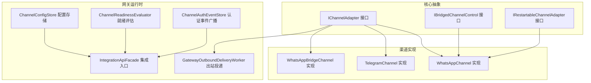
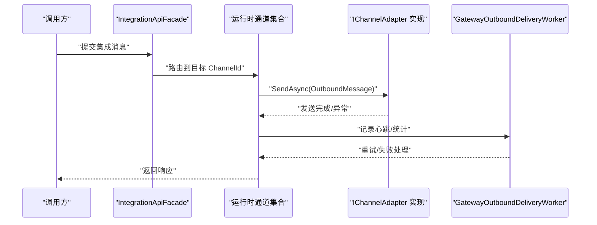
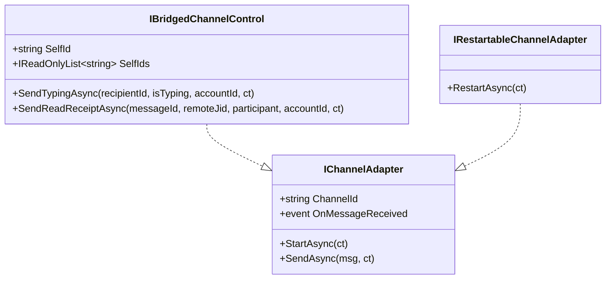
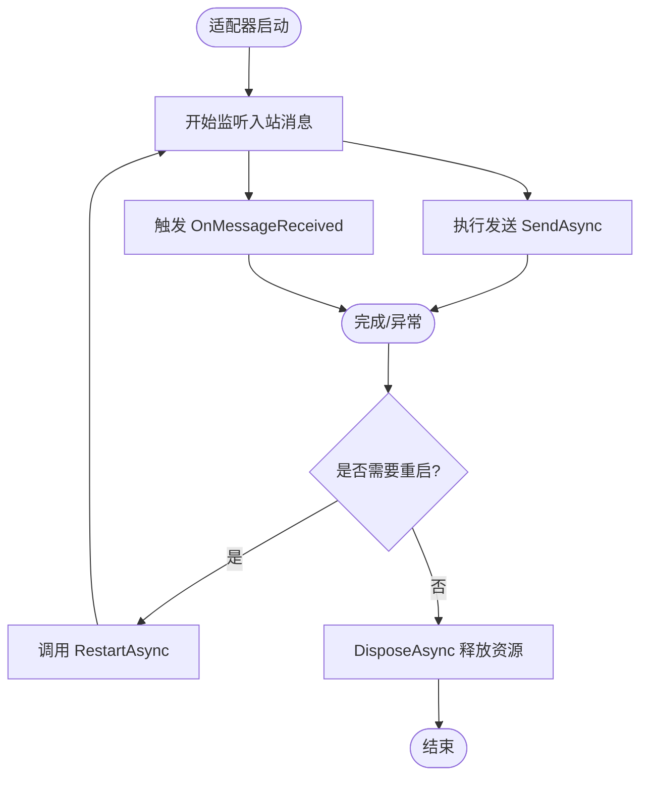
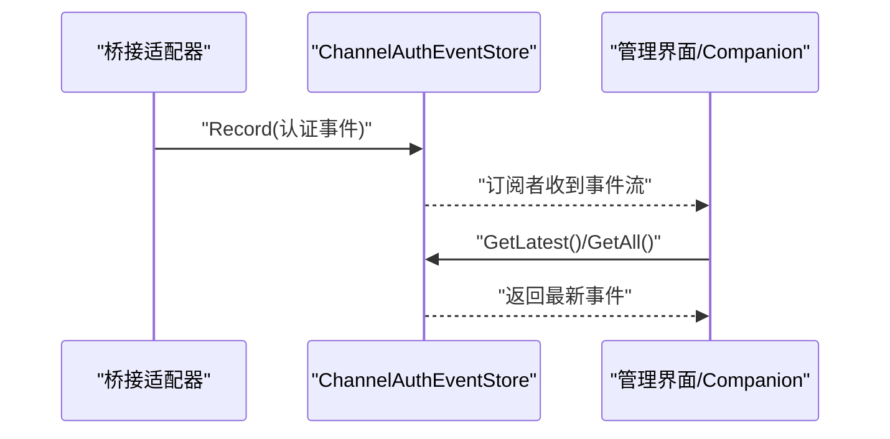
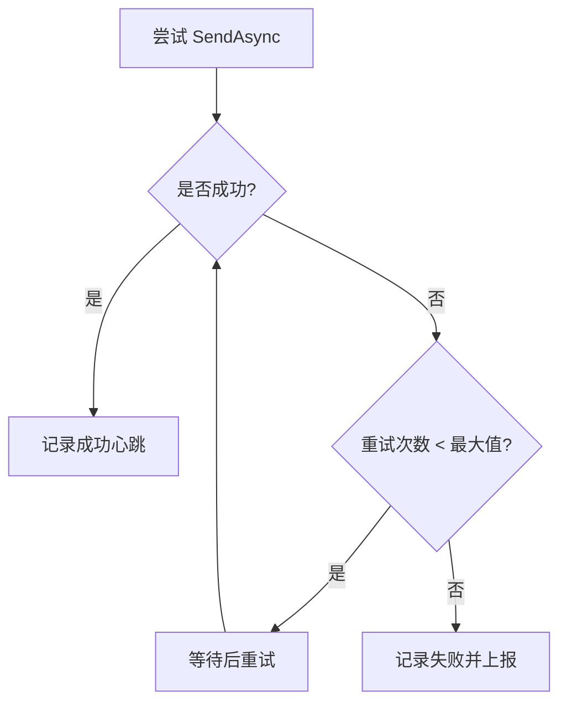
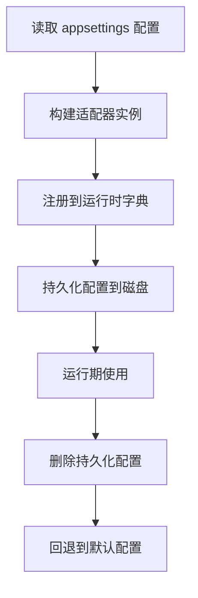
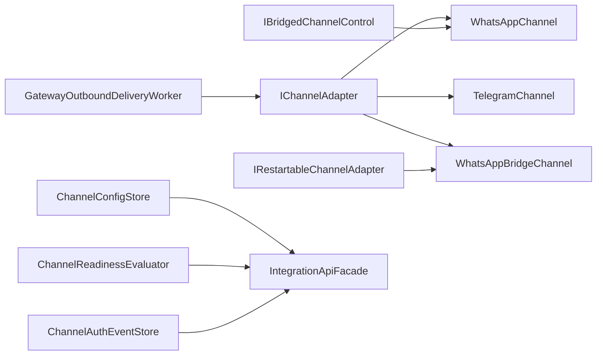

# 渠道架构设计

<cite>
**本文引用的文件**
- [IChannelAdapter.cs](file://src/OpenClaw.Core/Abstractions/IChannelAdapter.cs)
- [IBridgedChannelControl.cs](file://src/OpenClaw.Core/Abstractions/IBridgedChannelControl.cs)
- [IRestartableChannelAdapter.cs](file://src/OpenClaw.Core/Abstractions/IRestartableChannelAdapter.cs)
- [WhatsAppChannel.cs](file://src/OpenClaw.Channels/WhatsAppChannel.cs)
- [TelegramChannel.cs](file://src/OpenClaw.Channels/TelegramChannel.cs)
- [WhatsAppBridgeChannel.cs](file://src/OpenClaw.Channels/WhatsAppBridgeChannel.cs)
- [ChannelConfigStore.cs](file://src/OpenClaw.Gateway/Channels/ChannelConfigStore.cs)
- [ChannelReadinessEvaluator.cs](file://src/OpenClaw.Gateway/ChannelReadinessEvaluator.cs)
- [ChannelAuthEventStore.cs](file://src/OpenClaw.Gateway/ChannelAuthEventStore.cs)
- [GatewayOutboundDeliveryWorker.cs](file://src/OpenClaw.Gateway/Extensions/GatewayOutboundDeliveryWorker.cs)
- [IntegrationApiFacade.cs](file://src/OpenClaw.Gateway/Composition/IntegrationApiFacade.cs)
- [KingcrabChannelConfigs.cs](file://src/OpenClaw.Core/Models/KingcrabChannelConfigs.cs)
- [AdminSettingsService.cs](file://src/OpenClaw.Gateway/AdminSettingsService.cs)
- [GatewayWorkersTests.cs](file://src/OpenClaw.Tests/GatewayWorkersTests.cs)
- [ResilienceTests.cs](file://src/OpenClaw.Tests/ResilienceTests.cs)
- [CircuitBreaker.cs](file://src/OpenClaw.Agent/CircuitBreaker.cs)
</cite>

## 目录
1. [引言](#引言)
2. [项目结构](#项目结构)
3. [核心组件](#核心组件)
4. [架构总览](#架构总览)
5. [详细组件分析](#详细组件分析)
6. [依赖关系分析](#依赖关系分析)
7. [性能考量](#性能考量)
8. [故障排查指南](#故障排查指南)
9. [结论](#结论)
10. [附录](#附录)

## 引言
本文件系统化阐述 Kingcrab 的渠道架构设计，围绕 ChannelAdapter 抽象接口、桥接控制机制、可重启适配器模式展开，覆盖渠道适配器的生命周期管理、状态同步机制、错误恢复策略、负载均衡与故障转移、注册流程、配置管理、监控指标与性能优化，并提供自定义渠道适配器开发指南与最佳实践。

## 项目结构
渠道相关代码主要分布在以下模块：
- 核心抽象层：定义渠道适配器接口与桥接控制能力
- 渠道实现层：具体渠道（如 WhatsApp、Telegram、WhatsApp 桥接等）
- 网关运行时：负责适配器注册、配置持久化、就绪评估、可观测性汇总
- 测试与工具：验证弹性与恢复能力

图表来源
- [IChannelAdapter.cs:1-22](file://src/OpenClaw.Core/Abstractions/IChannelAdapter.cs#L1-L22)
- [IBridgedChannelControl.cs:1-12](file://src/OpenClaw.Core/Abstractions/IBridgedChannelControl.cs#L1-L12)
- [IRestartableChannelAdapter.cs:1-10](file://src/OpenClaw.Core/Abstractions/IRestartableChannelAdapter.cs#L1-L10)
- [WhatsAppChannel.cs:1-320](file://src/OpenClaw.Channels/WhatsAppChannel.cs#L1-L320)
- [TelegramChannel.cs:1-338](file://src/OpenClaw.Channels/TelegramChannel.cs#L1-L338)
- [WhatsAppBridgeChannel.cs:1-38](file://src/OpenClaw.Channels/WhatsAppBridgeChannel.cs#L1-L38)
- [ChannelConfigStore.cs:37-76](file://src/OpenClaw.Gateway/Channels/ChannelConfigStore.cs#L37-L76)
- [ChannelReadinessEvaluator.cs:577-611](file://src/OpenClaw.Gateway/ChannelReadinessEvaluator.cs#L577-L611)
- [ChannelAuthEventStore.cs:1-93](file://src/OpenClaw.Gateway/ChannelAuthEventStore.cs#L1-L93)
- [GatewayOutboundDeliveryWorker.cs:34-64](file://src/OpenClaw.Gateway/Extensions/GatewayOutboundDeliveryWorker.cs#L34-L64)
- [IntegrationApiFacade.cs:794-828](file://src/OpenClaw.Gateway/Composition/IntegrationApiFacade.cs#L794-L828)

章节来源
- [IChannelAdapter.cs:1-22](file://src/OpenClaw.Core/Abstractions/IChannelAdapter.cs#L1-L22)
- [IBridgedChannelControl.cs:1-12](file://src/OpenClaw.Core/Abstractions/IBridgedChannelControl.cs#L1-L12)
- [IRestartableChannelAdapter.cs:1-10](file://src/OpenClaw.Core/Abstractions/IRestartableChannelAdapter.cs#L1-L10)
- [WhatsAppChannel.cs:1-320](file://src/OpenClaw.Channels/WhatsAppChannel.cs#L1-L320)
- [TelegramChannel.cs:1-338](file://src/OpenClaw.Channels/TelegramChannel.cs#L1-L338)
- [WhatsAppBridgeChannel.cs:1-38](file://src/OpenClaw.Channels/WhatsAppBridgeChannel.cs#L1-L38)
- [ChannelConfigStore.cs:37-76](file://src/OpenClaw.Gateway/Channels/ChannelConfigStore.cs#L37-L76)
- [ChannelReadinessEvaluator.cs:577-611](file://src/OpenClaw.Gateway/ChannelReadinessEvaluator.cs#L577-L611)
- [ChannelAuthEventStore.cs:1-93](file://src/OpenClaw.Gateway/ChannelAuthEventStore.cs#L1-L93)
- [GatewayOutboundDeliveryWorker.cs:34-64](file://src/OpenClaw.Gateway/Extensions/GatewayOutboundDeliveryWorker.cs#L34-L64)
- [IntegrationApiFacade.cs:794-828](file://src/OpenClaw.Gateway/Composition/IntegrationApiFacade.cs#L794-L828)

## 核心组件
- IChannelAdapter：渠道适配器统一抽象，定义启动、发送、入站事件回调等契约；要求实现 AOT 友好与低分配。
- IBridgedChannelControl：桥接型渠道控制扩展，支持自标识、多自标识、输入态上报、已读回执等。
- IRestartableChannelAdapter：可重启能力接口，支持运行时重连或重启。
- 具体渠道实现：如 WhatsAppChannel、TelegramChannel、WhatsAppBridgeChannel，封装各自平台 API 与消息协议。
- 运行时支撑：ChannelConfigStore（配置持久化）、ChannelReadinessEvaluator（就绪评估）、ChannelAuthEventStore（认证事件广播）、GatewayOutboundDeliveryWorker（出站投递与重试）。

章节来源
- [IChannelAdapter.cs:1-22](file://src/OpenClaw.Core/Abstractions/IChannelAdapter.cs#L1-L22)
- [IBridgedChannelControl.cs:1-12](file://src/OpenClaw.Core/Abstractions/IBridgedChannelControl.cs#L1-L12)
- [IRestartableChannelAdapter.cs:1-10](file://src/OpenClaw.Core/Abstractions/IRestartableChannelAdapter.cs#L1-L10)
- [WhatsAppChannel.cs:1-320](file://src/OpenClaw.Channels/WhatsAppChannel.cs#L1-L320)
- [TelegramChannel.cs:1-338](file://src/OpenClaw.Channels/TelegramChannel.cs#L1-L338)
- [WhatsAppBridgeChannel.cs:1-38](file://src/OpenClaw.Channels/WhatsAppBridgeChannel.cs#L1-L38)
- [ChannelConfigStore.cs:37-76](file://src/OpenClaw.Gateway/Channels/ChannelConfigStore.cs#L37-L76)
- [ChannelReadinessEvaluator.cs:577-611](file://src/OpenClaw.Gateway/ChannelReadinessEvaluator.cs#L577-L611)
- [ChannelAuthEventStore.cs:1-93](file://src/OpenClaw.Gateway/ChannelAuthEventStore.cs#L1-L93)
- [GatewayOutboundDeliveryWorker.cs:34-64](file://src/OpenClaw.Gateway/Extensions/GatewayOutboundDeliveryWorker.cs#L34-L64)

## 架构总览
渠道架构以“抽象接口 + 多实现 + 运行时编排”为核心，通过统一的适配器接口屏蔽不同渠道差异，借助运行时组件完成配置、就绪、认证事件与出站投递的协同。

图表来源
- [IntegrationApiFacade.cs:794-828](file://src/OpenClaw.Gateway/Composition/IntegrationApiFacade.cs#L794-L828)
- [GatewayOutboundDeliveryWorker.cs:34-64](file://src/OpenClaw.Gateway/Extensions/GatewayOutboundDeliveryWorker.cs#L34-L64)
- [IChannelAdapter.cs:1-22](file://src/OpenClaw.Core/Abstractions/IChannelAdapter.cs#L1-L22)

## 详细组件分析

### 抽象接口设计与桥接控制
- IChannelAdapter：定义 ChannelId、StartAsync、SendAsync、OnMessageReceived 事件，确保所有适配器具备一致的生命周期与消息模型。
- IBridgedChannelControl：在 IChannelAdapter 基础上扩展 SelfId/SelfIds、输入态上报、已读回执等桥接能力，适用于需要与远端会话状态对齐的场景。
- IRestartableChannelAdapter：为桥接类适配器提供运行时重启能力，便于在凭据变更或网络波动后自动恢复。

图表来源
- [IChannelAdapter.cs:1-22](file://src/OpenClaw.Core/Abstractions/IChannelAdapter.cs#L1-L22)
- [IBridgedChannelControl.cs:1-12](file://src/OpenClaw.Core/Abstractions/IBridgedChannelControl.cs#L1-L12)
- [IRestartableChannelAdapter.cs:1-10](file://src/OpenClaw.Core/Abstractions/IRestartableChannelAdapter.cs#L1-L10)

章节来源
- [IChannelAdapter.cs:1-22](file://src/OpenClaw.Core/Abstractions/IChannelAdapter.cs#L1-L22)
- [IBridgedChannelControl.cs:1-12](file://src/OpenClaw.Core/Abstractions/IBridgedChannelControl.cs#L1-L12)
- [IRestartableChannelAdapter.cs:1-10](file://src/OpenClaw.Core/Abstractions/IRestartableChannelAdapter.cs#L1-L10)

### 可重启适配器模式
- 设计动机：桥接类适配器（如 WhatsAppBridgeChannel）常依赖外部服务（如代理/长连接），在凭据更新、网络抖动或服务重启后需要可编程的重启能力。
- 能力边界：IRestartableChannelAdapter 提供 RestartAsync，由具体适配器实现内部资源释放与重建逻辑。
- 运行时集成：网关侧可通过管理端点触发重启，并清理相关认证状态，确保重启后能重新建立会话。

章节来源
- [IRestartableChannelAdapter.cs:1-10](file://src/OpenClaw.Core/Abstractions/IRestartableChannelAdapter.cs#L1-L10)
- [WhatsAppBridgeChannel.cs:1-38](file://src/OpenClaw.Channels/WhatsAppBridgeChannel.cs#L1-L38)
- [GatewayWorkersTests.cs:6621-6636](file://src/OpenClaw.Tests/GatewayWorkersTests.cs#L6621-L6636)

### 渠道适配器生命周期管理
- 启动阶段：适配器实现 StartAsync（部分实现为无操作，由运行时统一调度）。
- 运行阶段：通过 OnMessageReceived 事件向网关管道传递入站消息；SendAsync 执行出站发送。
- 释放阶段：实现 IAsyncDisposable 或 ValueTask DisposeAsync，确保 HttpClient 等资源正确回收。
- 重启阶段：若实现 IRestartableChannelAdapter，则支持 RestartAsync。

图表来源
- [IChannelAdapter.cs:1-22](file://src/OpenClaw.Core/Abstractions/IChannelAdapter.cs#L1-L22)
- [IRestartableChannelAdapter.cs:1-10](file://src/OpenClaw.Core/Abstractions/IRestartableChannelAdapter.cs#L1-L10)
- [WhatsAppChannel.cs:79-83](file://src/OpenClaw.Channels/WhatsAppChannel.cs#L79-L83)

章节来源
- [IChannelAdapter.cs:1-22](file://src/OpenClaw.Core/Abstractions/IChannelAdapter.cs#L1-L22)
- [IRestartableChannelAdapter.cs:1-10](file://src/OpenClaw.Core/Abstractions/IRestartableChannelAdapter.cs#L1-L10)
- [WhatsAppChannel.cs:79-83](file://src/OpenClaw.Channels/WhatsAppChannel.cs#L79-L83)

### 状态同步机制与认证事件
- 认证事件广播：ChannelAuthEventStore 维护每个渠道/账号的最新认证事件，并通过有界通道广播给订阅者（如管理 UI、Companion）。
- 事件键空间：按 channelId\naccountId 组合维护最新事件，支持按渠道查询与清理。
- 与桥接适配器配合：桥接适配器在建立会话过程中产生 QR 码、登录状态等事件，经此存储与广播。

图表来源
- [ChannelAuthEventStore.cs:1-93](file://src/OpenClaw.Gateway/ChannelAuthEventStore.cs#L1-L93)

章节来源
- [ChannelAuthEventStore.cs:1-93](file://src/OpenClaw.Gateway/ChannelAuthEventStore.cs#L1-L93)

### 错误恢复策略与弹性设计
- 出站投递重试：GatewayOutboundDeliveryWorker 对发送失败进行有限次数重试，并记录成功/失败心跳，便于后续观测。
- 断路器：CircuitBreaker 在连续失败后打开，半开探测，指数退避，避免雪崩。
- 测试验证：ResilienceTests 验证断路器状态转换与行为；GatewayWorkersTests 展示适配器发送失败的重试路径。

图表来源
- [GatewayOutboundDeliveryWorker.cs:34-64](file://src/OpenClaw.Gateway/Extensions/GatewayOutboundDeliveryWorker.cs#L34-L64)
- [CircuitBreaker.cs:108-226](file://src/OpenClaw.Agent/CircuitBreaker.cs#L108-L226)
- [ResilienceTests.cs:1-118](file://src/OpenClaw.Tests/ResilienceTests.cs#L1-L118)

章节来源
- [GatewayOutboundDeliveryWorker.cs:34-64](file://src/OpenClaw.Gateway/Extensions/GatewayOutboundDeliveryWorker.cs#L34-L64)
- [CircuitBreaker.cs:108-226](file://src/OpenClaw.Agent/CircuitBreaker.cs#L108-L226)
- [ResilienceTests.cs:1-118](file://src/OpenClaw.Tests/ResilienceTests.cs#L1-L118)

### 负载均衡与故障转移
- 多实现并存：运行时可同时注册多个渠道适配器（如 telegram、discord、slack、signal 等），由路由选择目标适配器。
- 故障转移：当某渠道适配器不可用时，其他适配器仍可继续工作；结合断路器与重试，降低单点影响。
- 配置驱动：通过配置开关与策略（如 GroupPolicy、Allowlist）控制消息来源与路由行为。

章节来源
- [IntegrationApiFacade.cs:794-828](file://src/OpenClaw.Gateway/Composition/IntegrationApiFacade.cs#L794-L828)
- [TelegramChannel.cs:1-338](file://src/OpenClaw.Channels/TelegramChannel.cs#L1-L338)
- [KingcrabChannelConfigs.cs:1-126](file://src/OpenClaw.Core/Models/KingcrabChannelConfigs.cs#L1-L126)

### 注册流程与配置管理
- 注册流程：运行时根据配置动态构建适配器字典，按需注入短信、电邮、定时任务等适配器。
- 配置持久化：ChannelConfigStore 将渠道配置序列化到磁盘，容器重启后可恢复；支持删除回退到默认配置。
- 设置项同步：AdminSettingsService 将渠道启用/校验开关等变更记录为设置变更，便于审计与追踪。

图表来源
- [ChannelConfigStore.cs:37-76](file://src/OpenClaw.Gateway/Channels/ChannelConfigStore.cs#L37-L76)
- [AdminSettingsService.cs:423-434](file://src/OpenClaw.Gateway/AdminSettingsService.cs#L423-L434)

章节来源
- [ChannelConfigStore.cs:37-76](file://src/OpenClaw.Gateway/Channels/ChannelConfigStore.cs#L37-L76)
- [AdminSettingsService.cs:423-434](file://src/OpenClaw.Gateway/AdminSettingsService.cs#L423-L434)

### 监控指标与可观测性
- 就绪评估：ChannelReadinessEvaluator 基于配置检查缺失项与告警，输出各渠道就绪状态与修复建议。
- 观测汇总：AdminObservabilityService 汇总审批、运行事件、操作审计、死信等指标，并统计渠道漂移度量，辅助运营决策。
- 认证事件：ChannelAuthEventStore 提供认证事件流，支持实时展示 QR 码与连接状态。

章节来源
- [ChannelReadinessEvaluator.cs:577-611](file://src/OpenClaw.Gateway/ChannelReadinessEvaluator.cs#L577-L611)
- [AdminObservabilityService.cs:107-168](file://src/OpenClaw.Gateway/AdminObservabilityService.cs#L107-L168)
- [ChannelAuthEventStore.cs:1-93](file://src/OpenClaw.Gateway/ChannelAuthEventStore.cs#L1-L93)

### 自定义渠道适配器开发指南
- 接口实现规范
  - 必须实现 IChannelAdapter，提供 ChannelId、StartAsync、SendAsync、OnMessageReceived。
  - 若为桥接类，建议实现 IBridgedChannelControl 以支持输入态与已读回执。
  - 如需运行时重启，实现 IRestartableChannelAdapter 并在 RestartAsync 中完成资源重建。
  - 注意 AOT 友好与低分配，避免临时对象与装箱。
- 生命周期要点
  - StartAsync：准备入站监听（如注册 Webhook、建立长连接）。
  - SendAsync：解析消息内容与媒体标记，构造平台请求并发送；记录日志与异常。
  - DisposeAsync：释放 HttpClient 等资源。
- 配置与安全
  - 使用 SecretResolver 解析密钥引用，优先使用环境变量或密钥引用。
  - 支持配置热重载（如 Feishu/DingTalk/WeCom 配置说明）。
- 错误与重试
  - 对外发送失败应进行有限重试与退避；必要时结合断路器。
  - 记录详细日志以便诊断，区分取消与异常。
- 监控与可观测
  - 上报认证事件（QR 码、登录状态）至 ChannelAuthEventStore。
  - 输出就绪评估所需指标，确保 AdminObservabilityService 能正确统计。

章节来源
- [IChannelAdapter.cs:1-22](file://src/OpenClaw.Core/Abstractions/IChannelAdapter.cs#L1-L22)
- [IBridgedChannelControl.cs:1-12](file://src/OpenClaw.Core/Abstractions/IBridgedChannelControl.cs#L1-L12)
- [IRestartableChannelAdapter.cs:1-10](file://src/OpenClaw.Core/Abstractions/IRestartableChannelAdapter.cs#L1-L10)
- [WhatsAppChannel.cs:1-320](file://src/OpenClaw.Channels/WhatsAppChannel.cs#L1-L320)
- [TelegramChannel.cs:1-338](file://src/OpenClaw.Channels/TelegramChannel.cs#L1-L338)
- [ChannelAuthEventStore.cs:1-93](file://src/OpenClaw.Gateway/ChannelAuthEventStore.cs#L1-L93)
- [CircuitBreaker.cs:108-226](file://src/OpenClaw.Agent/CircuitBreaker.cs#L108-L226)

## 依赖关系分析
- 适配器依赖：各渠道实现依赖 Core.Abstractions 接口与 Core.Models 消息类型；部分实现依赖 Core.Security（密钥解析）与 Core.Http（HTTP 工厂）。
- 运行时依赖：Gateway 层通过 Composition 注册适配器，通过 ChannelConfigStore 管理配置，通过 ChannelReadinessEvaluator 与 AdminObservabilityService 提供可观测性。
- 测试依赖：测试覆盖断路器行为、适配器发送失败与重试路径。

图表来源
- [IChannelAdapter.cs:1-22](file://src/OpenClaw.Core/Abstractions/IChannelAdapter.cs#L1-L22)
- [IBridgedChannelControl.cs:1-12](file://src/OpenClaw.Core/Abstractions/IBridgedChannelControl.cs#L1-L12)
- [IRestartableChannelAdapter.cs:1-10](file://src/OpenClaw.Core/Abstractions/IRestartableChannelAdapter.cs#L1-L10)
- [WhatsAppChannel.cs:1-320](file://src/OpenClaw.Channels/WhatsAppChannel.cs#L1-L320)
- [TelegramChannel.cs:1-338](file://src/OpenClaw.Channels/TelegramChannel.cs#L1-L338)
- [WhatsAppBridgeChannel.cs:1-38](file://src/OpenClaw.Channels/WhatsAppBridgeChannel.cs#L1-L38)
- [ChannelConfigStore.cs:37-76](file://src/OpenClaw.Gateway/Channels/ChannelConfigStore.cs#L37-L76)
- [ChannelReadinessEvaluator.cs:577-611](file://src/OpenClaw.Gateway/ChannelReadinessEvaluator.cs#L577-L611)
- [ChannelAuthEventStore.cs:1-93](file://src/OpenClaw.Gateway/ChannelAuthEventStore.cs#L1-L93)
- [GatewayOutboundDeliveryWorker.cs:34-64](file://src/OpenClaw.Gateway/Extensions/GatewayOutboundDeliveryWorker.cs#L34-L64)
- [IntegrationApiFacade.cs:794-828](file://src/OpenClaw.Gateway/Composition/IntegrationApiFacade.cs#L794-L828)

章节来源
- [IChannelAdapter.cs:1-22](file://src/OpenClaw.Core/Abstractions/IChannelAdapter.cs#L1-L22)
- [IBridgedChannelControl.cs:1-12](file://src/OpenClaw.Core/Abstractions/IBridgedChannelControl.cs#L1-L12)
- [IRestartableChannelAdapter.cs:1-10](file://src/OpenClaw.Core/Abstractions/IRestartableChannelAdapter.cs#L1-L10)
- [WhatsAppChannel.cs:1-320](file://src/OpenClaw.Channels/WhatsAppChannel.cs#L1-L320)
- [TelegramChannel.cs:1-338](file://src/OpenClaw.Channels/TelegramChannel.cs#L1-L338)
- [WhatsAppBridgeChannel.cs:1-38](file://src/OpenClaw.Channels/WhatsAppBridgeChannel.cs#L1-L38)
- [ChannelConfigStore.cs:37-76](file://src/OpenClaw.Gateway/Channels/ChannelConfigStore.cs#L37-L76)
- [ChannelReadinessEvaluator.cs:577-611](file://src/OpenClaw.Gateway/ChannelReadinessEvaluator.cs#L577-L611)
- [ChannelAuthEventStore.cs:1-93](file://src/OpenClaw.Gateway/ChannelAuthEventStore.cs#L1-L93)
- [GatewayOutboundDeliveryWorker.cs:34-64](file://src/OpenClaw.Gateway/Extensions/GatewayOutboundDeliveryWorker.cs#L34-L64)
- [IntegrationApiFacade.cs:794-828](file://src/OpenClaw.Gateway/Composition/IntegrationApiFacade.cs#L794-L828)

## 性能考量
- 低分配与 AOT 友好：接口与数据模型采用源生成与值类型，减少 GC 压力。
- 出站批量与分片：如 TelegramChannel 对文本进行分片发送，避免超限；媒体与文本分离发送，提升吞吐。
- 重试与退避：有限重试与指数退避，避免对下游造成冲击。
- 有界通道与背压：认证事件订阅使用有界通道，防止内存膨胀。
- 配置热重载：部分渠道支持配置热重载，减少停机时间。

## 故障排查指南
- 发送失败
  - 检查适配器 SendAsync 日志与异常堆栈；确认凭据与目标 ID 是否有效。
  - 查看 GatewayOutboundDeliveryWorker 的重试记录与最终失败原因。
- 重启无效
  - 确认适配器是否实现 IRestartableChannelAdapter；检查 RestartAsync 内部资源重建逻辑。
  - 管理端点触发重启后，确认认证事件是否被清理并重新生成。
- 就绪状态异常
  - 使用 ChannelReadinessEvaluator 输出的缺失项与告警定位问题；参考修复建议调整配置。
- 断路器导致短路
  - 检查 CircuitBreaker 状态与冷却时间；观察半开探测是否成功恢复。

章节来源
- [GatewayOutboundDeliveryWorker.cs:34-64](file://src/OpenClaw.Gateway/Extensions/GatewayOutboundDeliveryWorker.cs#L34-L64)
- [GatewayWorkersTests.cs:1513-1555](file://src/OpenClaw.Tests/GatewayWorkersTests.cs#L1513-L1555)
- [ChannelReadinessEvaluator.cs:577-611](file://src/OpenClaw.Gateway/ChannelReadinessEvaluator.cs#L577-L611)
- [CircuitBreaker.cs:108-226](file://src/OpenClaw.Agent/CircuitBreaker.cs#L108-L226)

## 结论
本渠道架构通过统一抽象屏蔽渠道差异，结合运行时编排实现配置持久化、就绪评估、认证事件广播与弹性恢复，满足生产级可用性与可观测性需求。自定义适配器应遵循接口规范、生命周期与安全实践，充分利用断路器与重试机制，确保在复杂网络环境下稳定运行。

## 附录
- 关键接口与实现位置
  - IChannelAdapter：[接口定义:1-22](file://src/OpenClaw.Core/Abstractions/IChannelAdapter.cs#L1-L22)
  - IBridgedChannelControl：[接口定义:1-12](file://src/OpenClaw.Core/Abstractions/IBridgedChannelControl.cs#L1-L12)
  - IRestartableChannelAdapter：[接口定义:1-10](file://src/OpenClaw.Core/Abstractions/IRestartableChannelAdapter.cs#L1-L10)
  - WhatsAppChannel：[实现与发送逻辑:1-320](file://src/OpenClaw.Channels/WhatsAppChannel.cs#L1-L320)
  - TelegramChannel：[实现与发送逻辑:1-338](file://src/OpenClaw.Channels/TelegramChannel.cs#L1-L338)
  - WhatsAppBridgeChannel：[桥接实现:1-38](file://src/OpenClaw.Channels/WhatsAppBridgeChannel.cs#L1-L38)
  - ChannelConfigStore：[配置持久化:37-76](file://src/OpenClaw.Gateway/Channels/ChannelConfigStore.cs#L37-L76)
  - ChannelReadinessEvaluator：[就绪评估:577-611](file://src/OpenClaw.Gateway/ChannelReadinessEvaluator.cs#L577-L611)
  - ChannelAuthEventStore：[认证事件广播:1-93](file://src/OpenClaw.Gateway/ChannelAuthEventStore.cs#L1-L93)
  - GatewayOutboundDeliveryWorker：[出站投递与重试:34-64](file://src/OpenClaw.Gateway/Extensions/GatewayOutboundDeliveryWorker.cs#L34-L64)
  - IntegrationApiFacade：[集成入口:794-828](file://src/OpenClaw.Gateway/Composition/IntegrationApiFacade.cs#L794-L828)
  - KingcrabChannelConfigs：[企业渠道配置:1-126](file://src/OpenClaw.Core/Models/KingcrabChannelConfigs.cs#L1-L126)
  - AdminSettingsService：[设置项同步:423-434](file://src/OpenClaw.Gateway/AdminSettingsService.cs#L423-L434)
  - ResilienceTests：[断路器测试:1-118](file://src/OpenClaw.Tests/ResilienceTests.cs#L1-L118)
  - CircuitBreaker：[断路器实现:108-226](file://src/OpenClaw.Agent/CircuitBreaker.cs#L108-L226)