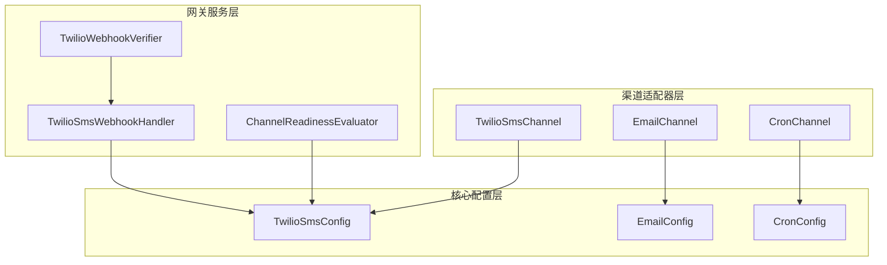
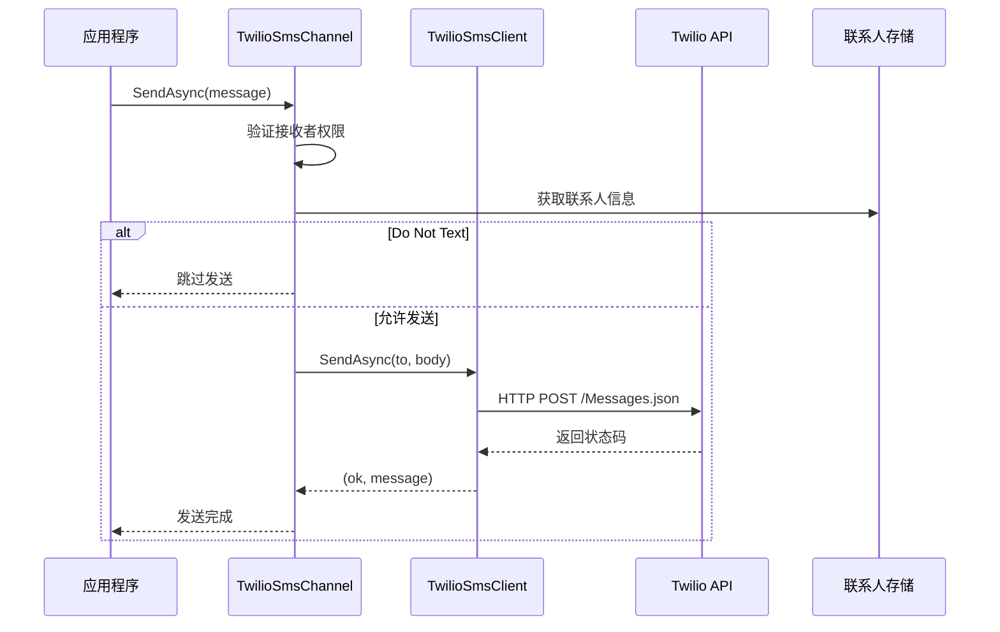
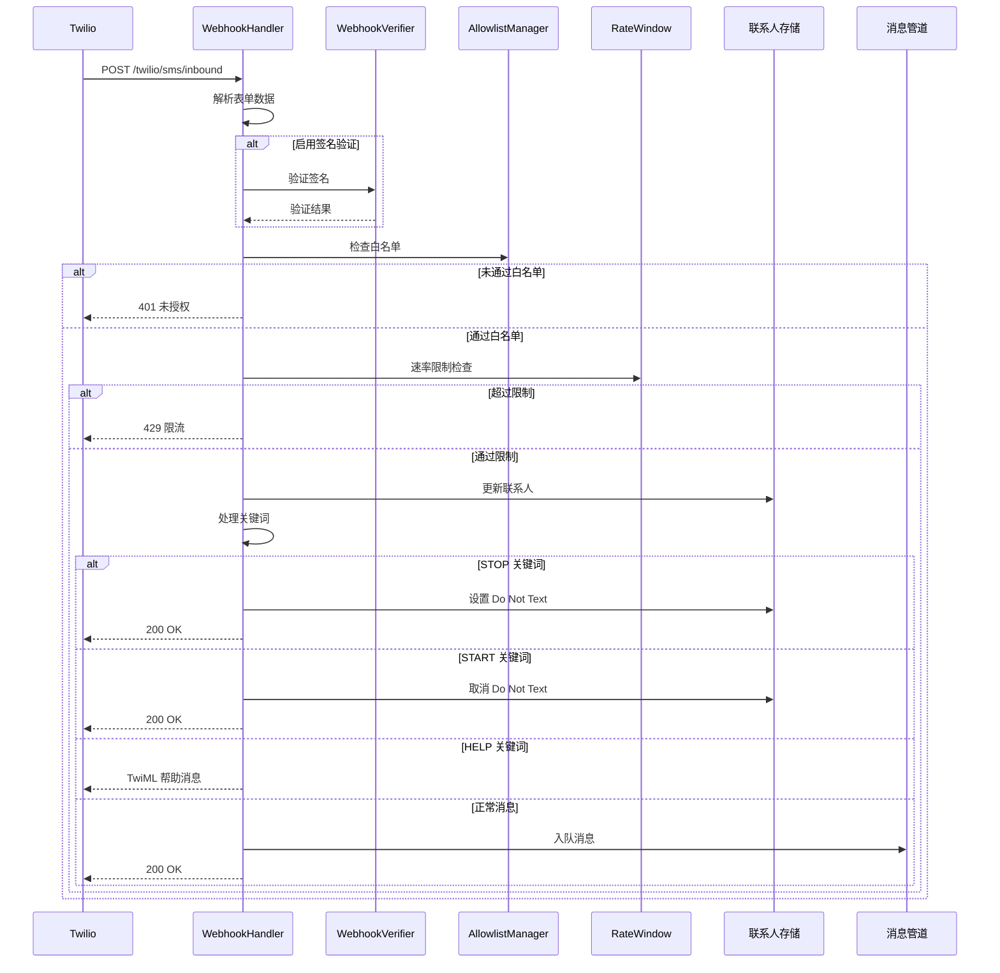
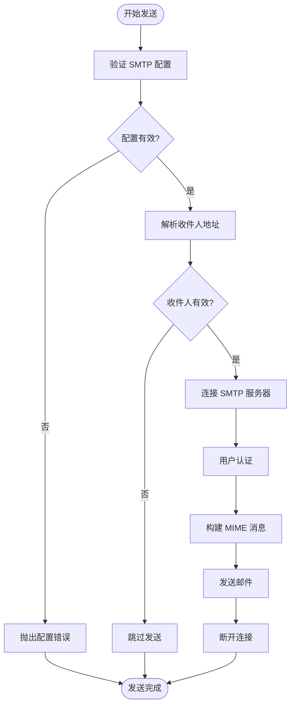
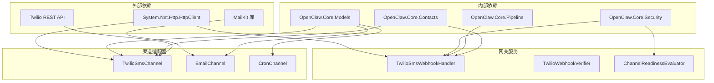

# 短信渠道集成

<cite>
**本文档引用的文件**
- [TwilioSmsChannel.cs](file://src/OpenClaw.Channels/TwilioSmsChannel.cs)
- [TwilioSmsClient.cs](file://src/OpenClaw.Channels/TwilioSmsClient.cs)
- [TwilioSmsWebhookHandler.cs](file://src/OpenClaw.Gateway/TwilioSmsWebhookHandler.cs)
- [TwilioWebhookVerifier.cs](file://src/OpenClaw.Gateway/TwilioWebhookVerifier.cs)
- [EmailChannel.cs](file://src/OpenClaw.Channels/EmailChannel.cs)
- [CronChannel.cs](file://src/OpenClaw.Channels/CronChannel.cs)
- [GatewayConfig.cs](file://src/OpenClaw.Core/Models/GatewayConfig.cs)
- [TwilioSmsTests.cs](file://src/OpenClaw.Tests/TwilioSmsTests.cs)
- [ChannelReadinessEvaluator.cs](file://src/OpenClaw.Gateway/ChannelReadinessEvaluator.cs)
- [AdminSettingsService.cs](file://src/OpenClaw.Gateway/AdminSettingsService.cs)
- [EmailTool.cs](file://src/OpenClaw.Agent/Tools/EmailTool.cs)
</cite>

## 目录
1. [简介](#简介)
2. [项目结构](#项目结构)
3. [核心组件](#核心组件)
4. [架构概览](#架构概览)
5. [详细组件分析](#详细组件分析)
6. [依赖关系分析](#依赖关系分析)
7. [性能考虑](#性能考虑)
8. [故障排除指南](#故障排除指南)
9. [结论](#结论)

## 简介

本文件详细介绍了 OpenClaw 项目中的短信渠道集成方案，重点涵盖 Twilio SMS 集成、Cron 定时任务、邮件通知等通信渠道的实现。文档深入说明了短信认证配置、消息发送流程、状态报告处理、国际短信支持，以及邮件集成的 SMTP 配置、模板系统、批量发送优化。同时提供了各渠道的费用计算、发送限制、质量保证和故障恢复策略。

## 项目结构

OpenClaw 的通信渠道主要分布在以下模块中：

- **OpenClaw.Channels**: 包含各种通信渠道的适配器实现，如 Twilio SMS、邮件、Cron 等
- **OpenClaw.Gateway**: 提供网关层功能，包括 Webhook 处理、签名验证、就绪状态评估等
- **OpenClaw.Core**: 核心模型和配置定义，包括短信配置模型
- **OpenClaw.Tests**: 单元测试，验证短信 Webhook 处理、签名验证等功能



**图表来源**
- [TwilioSmsChannel.cs:8-59](file://src/OpenClaw.Channels/TwilioSmsChannel.cs#L8-L59)
- [TwilioSmsWebhookHandler.cs:9-246](file://src/OpenClaw.Gateway/TwilioSmsWebhookHandler.cs#L9-L246)
- [GatewayConfig.cs:694-711](file://src/OpenClaw.Core/Models/GatewayConfig.cs#L694-L711)

**章节来源**
- [TwilioSmsChannel.cs:1-59](file://src/OpenClaw.Channels/TwilioSmsChannel.cs#L1-L59)
- [EmailChannel.cs:1-192](file://src/OpenClaw.Channels/EmailChannel.cs#L1-L192)
- [CronChannel.cs:1-74](file://src/OpenClaw.Channels/CronChannel.cs#L1-L74)

## 核心组件

### Twilio SMS 渠道

TwilioSmsChannel 是短信渠道的主要适配器，实现了 IChannelAdapter 接口，提供短信发送和接收功能。

**关键特性**:
- 支持基于 MessagingServiceSid 或 FromNumber 的发送方式
- 内置联系人管理，支持 Do Not Text 功能
- 允许号码白名单控制
- 错误处理和异常抛出机制

### Twilio SMS 客户端

TwilioSmsClient 负责与 Twilio API 的实际通信，封装了 HTTP 请求和认证逻辑。

**核心功能**:
- Basic 认证头生成
- 消息发送请求构建
- 响应状态码检查
- 错误信息返回

### Twilio Webhook 处理器

TwilioSmsWebhookHandler 处理来自 Twilio 的短信回调，实现安全验证和消息路由。

**主要功能**:
- 签名验证 (TwilioWebhookVerifier)
- 白名单控制 (AllowlistManager)
- 速率限制 (RateWindow)
- 关键词处理 (STOP/START/HELP)
- 最近发送者记录 (RecentSendersStore)

### 邮件渠道

EmailChannel 提供完整的邮件发送和接收功能，使用 MailKit 库实现。

**核心能力**:
- SMTP 发送 (支持 TLS/SSL)
- IMAP 接收轮询
- 邮件内容提取 (纯文本/HTML)
- 安全连接选项配置

### Cron 渠道

CronChannel 作为定时任务的默认输出通道，提供简单的文件存储功能。

**功能特点**:
- 文件系统输出存储
- 日志文件命名规范
- 安全的文件路径处理

**章节来源**
- [TwilioSmsChannel.cs:8-59](file://src/OpenClaw.Channels/TwilioSmsChannel.cs#L8-L59)
- [TwilioSmsClient.cs:7-62](file://src/OpenClaw.Channels/TwilioSmsClient.cs#L7-L62)
- [TwilioSmsWebhookHandler.cs:9-246](file://src/OpenClaw.Gateway/TwilioSmsWebhookHandler.cs#L9-L246)
- [EmailChannel.cs:15-192](file://src/OpenClaw.Channels/EmailChannel.cs#L15-L192)
- [CronChannel.cs:13-74](file://src/OpenClaw.Channels/CronChannel.cs#L13-L74)

## 架构概览

OpenClaw 的通信渠道采用分层架构设计，确保了模块间的松耦合和高内聚。

```mermaid
graph TB
subgraph "外部接口层"
TwilioAPI[Twilio API]
SMTPServer[SMTP 服务器]
IMAPServer[IMAP 服务器]
end
subgraph "适配器层"
TwilioAdapter[TwilioSmsChannel]
EmailAdapter[EmailChannel]
CronAdapter[CronChannel]
end
subgraph "网关服务层"
WebhookHandler[TwilioSmsWebhookHandler]
SignatureVerifier[TwilioWebhookVerifier]
RateLimiter[RateWindow]
ContactManager[IContactStore]
end
subgraph "配置管理层"
ConfigManager[TwilioSmsConfig]
EmailConfig[EmailConfig]
CronConfig[CronConfig]
end
TwilioAPI <- --> TwilioAdapter
SMTPServer <- --> EmailAdapter
IMAPServer <- --> EmailAdapter
TwilioAdapter --> WebhookHandler
WebhookHandler --> SignatureVerifier
WebhookHandler --> RateLimiter
WebhookHandler --> ContactManager
TwilioAdapter --> ConfigManager
EmailAdapter --> EmailConfig
CronAdapter --> CronConfig
```

**图表来源**
- [TwilioSmsChannel.cs:14-18](file://src/OpenClaw.Channels/TwilioSmsChannel.cs#L14-L18)
- [TwilioSmsWebhookHandler.cs:60-74](file://src/OpenClaw.Gateway/TwilioSmsWebhookHandler.cs#L60-L74)
- [EmailChannel.cs:20-24](file://src/OpenClaw.Channels/EmailChannel.cs#L20-L24)

## 详细组件分析

### Twilio SMS 发送流程

短信发送流程从适配器开始，经过客户端到 Twilio API 的完整链路。



**图表来源**
- [TwilioSmsChannel.cs:27-40](file://src/OpenClaw.Channels/TwilioSmsChannel.cs#L27-L40)
- [TwilioSmsClient.cs:20-53](file://src/OpenClaw.Channels/TwilioSmsClient.cs#L20-L53)

**发送流程关键点**:
1. **权限验证**: 检查接收者是否在允许列表中
2. **联系人检查**: 验证 Do Not Text 标记
3. **认证处理**: 使用 Basic 认证头进行身份验证
4. **发送决策**: 根据配置选择 MessagingServiceSid 或 FromNumber
5. **错误处理**: 统一的异常抛出机制

### Twilio Webhook 接收流程

Webhook 接收流程包含了安全验证、速率限制和关键词处理的完整逻辑。



**图表来源**
- [TwilioSmsWebhookHandler.cs:86-162](file://src/OpenClaw.Gateway/TwilioSmsWebhookHandler.cs#L86-L162)
- [TwilioWebhookVerifier.cs:27-37](file://src/OpenClaw.Gateway/TwilioWebhookVerifier.cs#L27-L37)

**Webhook 处理流程**:
1. **数据解析**: 提取 From、To、Body、MessageSid 等字段
2. **签名验证**: 使用 HMAC-SHA1 验证请求完整性
3. **白名单检查**: 支持严格模式和传统模式
4. **速率限制**: 每分钟每发送者计数器
5. **关键词处理**: 自动处理 STOP/START/HELP 等命令
6. **消息入队**: 将有效消息提交到消息管道

### 邮件发送流程

邮件发送流程展示了 SMTP 发送的完整实现，包括安全连接和认证。



**图表来源**
- [EmailChannel.cs:57-85](file://src/OpenClaw.Channels/EmailChannel.cs#L57-L85)

**邮件发送特性**:
- **安全连接**: 支持 SSL (465) 和 STARTTLS (587)
- **认证机制**: 用户名密码认证
- **内容处理**: 自动检测纯文本或 HTML 内容
- **错误处理**: 连接异常的安全处理

### Cron 定时任务处理

CronChannel 提供了简单而有效的定时任务输出机制。

**核心功能**:
- **文件存储**: 将任务输出写入指定目录
- **安全命名**: 使用 SHA256 哈希确保文件名唯一性
- **日志格式**: 标准化的日志格式输出
- **自动清理**: 周期性清理过期文件的能力

**章节来源**
- [TwilioSmsTests.cs:17-63](file://src/OpenClaw.Tests/TwilioSmsTests.cs#L17-L63)
- [TwilioSmsTests.cs:125-155](file://src/OpenClaw.Tests/TwilioSmsTests.cs#L125-L155)

## 依赖关系分析

OpenClaw 的通信渠道组件之间存在清晰的依赖关系，遵循依赖倒置原则。



**图表来源**
- [TwilioSmsChannel.cs:1-5](file://src/OpenClaw.Channels/TwilioSmsChannel.cs#L1-L5)
- [EmailChannel.cs:1-11](file://src/OpenClaw.Channels/EmailChannel.cs#L1-L11)
- [TwilioSmsWebhookHandler.cs:1-6](file://src/OpenClaw.Gateway/TwilioSmsWebhookHandler.cs#L1-L6)

**依赖关系特点**:
- **低耦合**: 各组件通过接口和抽象类解耦
- **可测试性**: 通过构造函数注入依赖，便于单元测试
- **扩展性**: 新增渠道只需实现 IChannelAdapter 接口

**章节来源**
- [GatewayConfig.cs:688-711](file://src/OpenClaw.Core/Models/GatewayConfig.cs#L688-L711)
- [ChannelReadinessEvaluator.cs:35-93](file://src/OpenClaw.Gateway/ChannelReadinessEvaluator.cs#L35-L93)

## 性能考虑

### 速率限制和并发控制

TwilioSmsWebhookHandler 实现了高效的速率限制机制：

- **每分钟计数器**: 使用原子操作确保线程安全
- **时间窗口管理**: 自动清理过期的速率窗口
- **内存优化**: 使用 ConcurrentDictionary 存储活跃会话

### 连接池和资源管理

- **HTTP 客户端复用**: TwilioSmsClient 复用 HttpClient 实例
- **邮件连接优化**: SMTP/IMAP 连接按需建立和断开
- **文件句柄管理**: CronChannel 使用异步文件操作避免阻塞

### 缓存和预热

- **联系人缓存**: IContactStore 提供内存级缓存
- **配置预加载**: 通过 ChannelReadinessEvaluator 预检配置
- **签名验证缓存**: TwilioWebhookVerifier 使用固定时间比较

## 故障排除指南

### Twilio 集成问题

**常见问题及解决方案**:

1. **签名验证失败**
   - 检查 WebhookPublicBaseUrl 配置
   - 验证 AuthTokenRef 设置
   - 确认签名算法正确性

2. **发送失败**
   - 验证 AccountSid 和 AuthToken
   - 检查 MessagingServiceSid 或 FromNumber 配置
   - 查看 Twilio API 返回的具体错误信息

3. **速率限制触发**
   - 调整 RateLimitPerFromPerMinute 参数
   - 检查是否有异常的流量峰值
   - 实施客户端重试策略

### 邮件集成问题

**故障诊断步骤**:

1. **SMTP 连接问题**
   - 验证 SMTP 主机和端口配置
   - 检查用户名和密码认证
   - 测试 TLS/SSL 连接设置

2. **IMAP 接收问题**
   - 确认 IMAP 服务器可达性
   - 验证邮箱凭据有效性
   - 检查邮箱文件夹名称

3. **邮件内容问题**
   - 检查邮件编码和字符集
   - 验证 MIME 类型设置
   - 测试附件处理功能

### Cron 任务问题

**调试建议**:

1. **检查存储权限**
   - 确认存储目录可写
   - 验证磁盘空间充足
   - 检查文件系统权限

2. **验证定时表达式**
   - 使用在线 Cron 表达式验证器
   - 检查时区配置
   - 确认任务执行时间

3. **监控输出结果**
   - 查看日志文件内容
   - 验证输出格式正确性
   - 检查文件命名规则

**章节来源**
- [ChannelReadinessEvaluator.cs:35-93](file://src/OpenClaw.Gateway/ChannelReadinessEvaluator.cs#L35-L93)
- [EmailTool.cs:92-105](file://src/OpenClaw.Agent/Tools/EmailTool.cs#L92-L105)

## 结论

OpenClaw 的通信渠道集成展现了现代消息传递系统的最佳实践。通过模块化设计、完善的错误处理和安全验证机制，系统能够可靠地处理多种通信渠道的需求。

**主要优势**:
- **安全性**: 多层安全验证，包括签名验证和白名单控制
- **可靠性**: 完善的错误处理和故障恢复机制
- **可扩展性**: 模块化架构支持新渠道的快速集成
- **可观测性**: 详细的日志记录和状态监控

**未来改进方向**:
- 增加更多的国际短信支持选项
- 实现更精细的费用计算和预算控制
- 添加更多的模板系统和批量发送优化
- 增强监控和告警功能

通过持续的优化和改进，OpenClaw 的通信渠道集成将成为企业级消息传递解决方案的优秀参考实现。