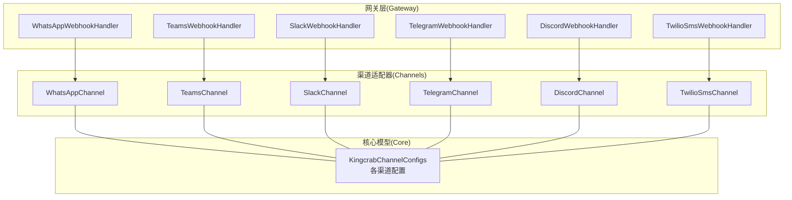
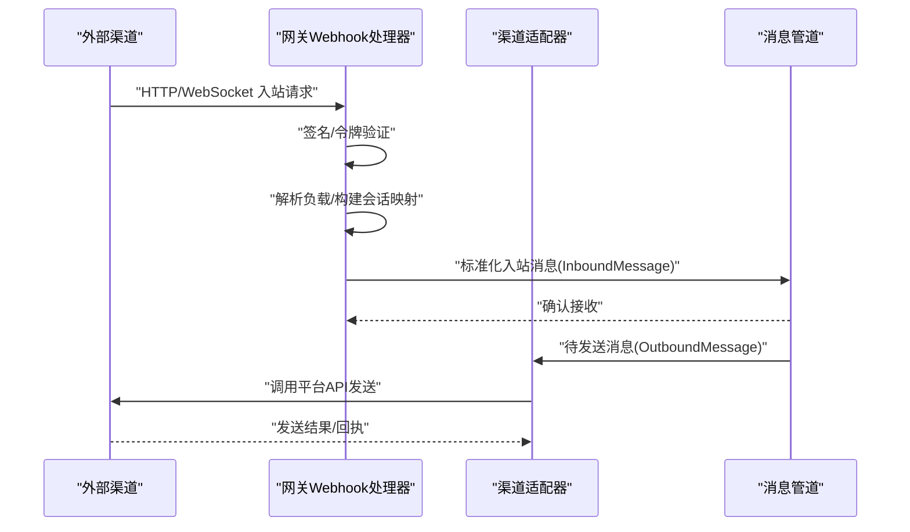
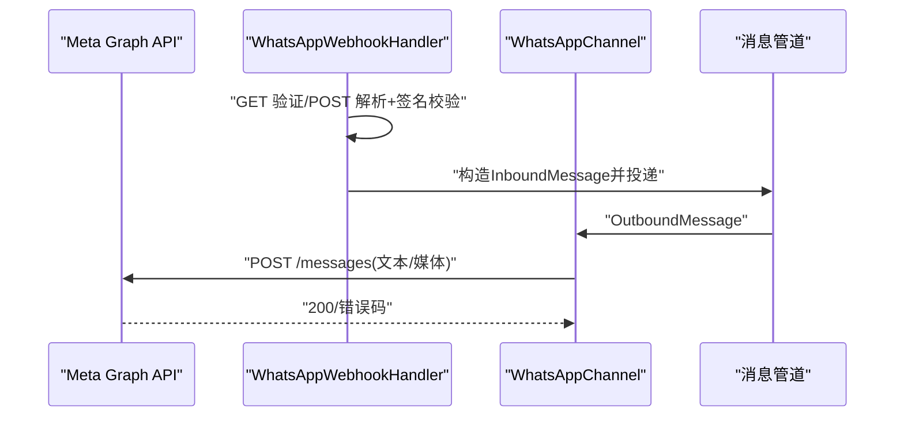
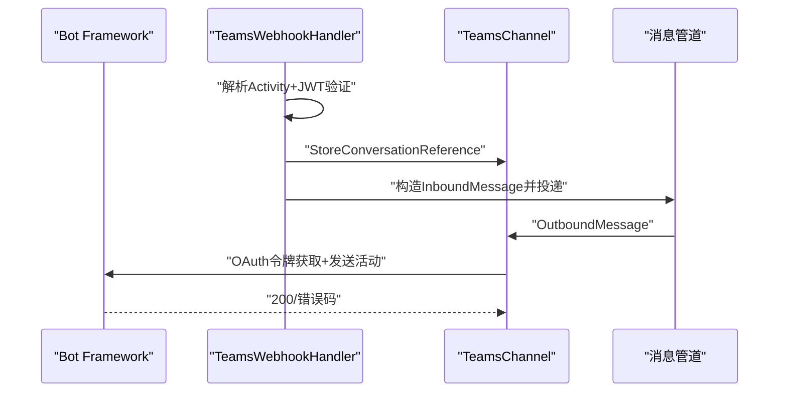
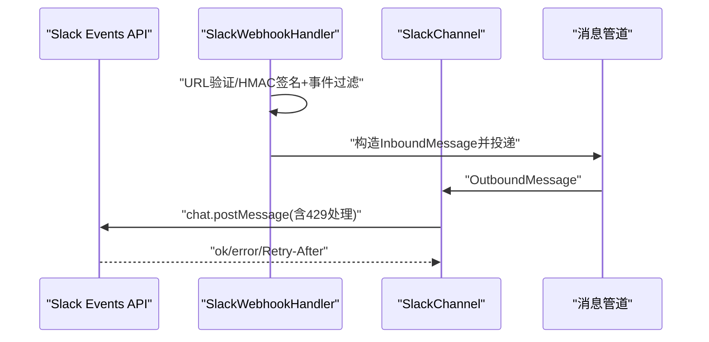
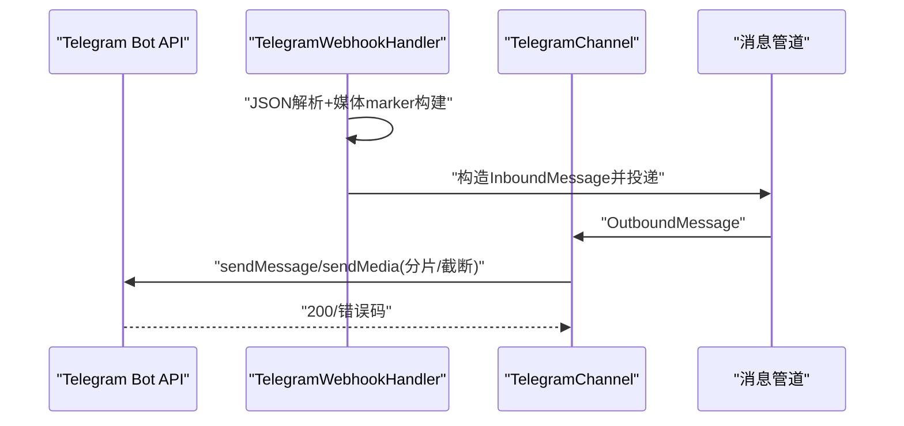
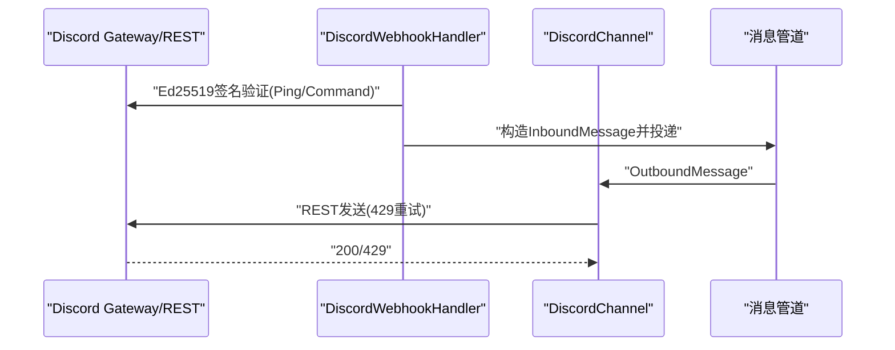
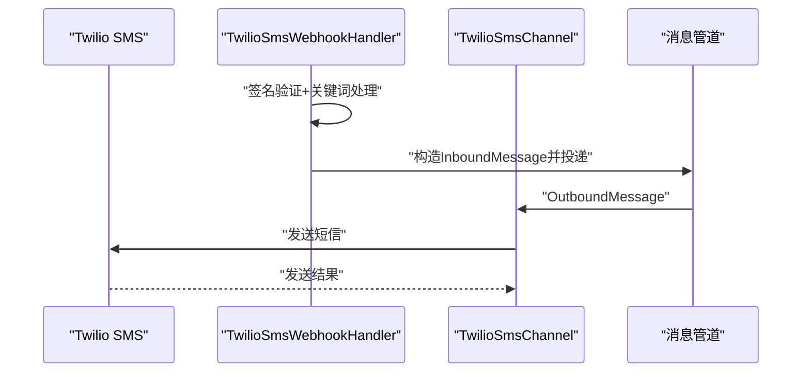
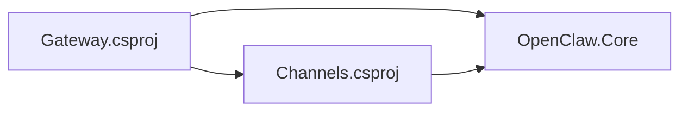

# 通信渠道

<cite>
**本文引用的文件**
- [OpenClaw.Channels.csproj](file://src/OpenClaw.Channels/OpenClaw.Channels.csproj)
- [OpenClaw.Gateway.csproj](file://src/OpenClaw.Gateway/OpenClaw.Gateway.csproj)
- [WhatsAppChannel.cs](file://src/OpenClaw.Channels/WhatsAppChannel.cs)
- [TeamsChannel.cs](file://src/OpenClaw.Channels/TeamsChannel.cs)
- [SlackChannel.cs](file://src/OpenClaw.Channels/SlackChannel.cs)
- [TelegramChannel.cs](file://src/OpenClaw.Channels/TelegramChannel.cs)
- [DiscordChannel.cs](file://src/OpenClaw.Channels/DiscordChannel.cs)
- [TwilioSmsChannel.cs](file://src/OpenClaw.Channels/TwilioSmsChannel.cs)
- [KingcrabChannelConfigs.cs](file://src/OpenClaw.Core/Models/KingcrabChannelConfigs.cs)
- [WhatsAppWebhookHandler.cs](file://src/OpenClaw.Gateway/WhatsAppWebhookHandler.cs)
- [TeamsWebhookHandler.cs](file://src/OpenClaw.Gateway/TeamsWebhookHandler.cs)
- [SlackWebhookHandler.cs](file://src/OpenClaw.Gateway/SlackWebhookHandler.cs)
- [TelegramWebhookHandler.cs](file://src/OpenClaw.Gateway/TelegramWebhookHandler.cs)
- [DiscordWebhookHandler.cs](file://src/OpenClaw.Gateway/DiscordWebhookHandler.cs)
- [TwilioSmsWebhookHandler.cs](file://src/OpenClaw.Gateway/TwilioSmsWebhookHandler.cs)
</cite>

## 目录
1. [简介](#简介)
2. [项目结构](#项目结构)
3. [核心组件](#核心组件)
4. [架构总览](#架构总览)
5. [详细组件分析](#详细组件分析)
6. [依赖关系分析](#依赖关系分析)
7. [性能考量](#性能考量)
8. [故障排除指南](#故障排除指南)
9. [结论](#结论)

## 简介
本文件系统性梳理通信渠道集成方案，覆盖多渠道支持架构（WhatsApp、Teams、Slack、Telegram、Discord、短信等）、渠道适配器设计、消息路由机制、状态同步、认证配置，并深入说明各渠道的集成步骤、Webhook 配置、消息格式转换、错误处理策略。同时提供渠道特定的安全考虑、速率限制、消息大小限制、最佳实践与故障排除指南，帮助读者快速理解并安全高效地部署与运维。

## 项目结构
- 渠道适配器位于 OpenClaw.Channels 工程，统一实现 IChannelAdapter 接口，负责对外部渠道的出站发送与入站事件接入。
- 网关层 OpenClaw.Gateway 负责 Webhook 入站解析、鉴权校验、会话映射、入站消息标准化后投递到消息管道。
- 核心模型与配置位于 OpenClaw.Core，包含各渠道的配置类型与消息模型。

图示来源
- [OpenClaw.Gateway.csproj:1-143](file://src/OpenClaw.Gateway/OpenClaw.Gateway.csproj#L1-L143)
- [OpenClaw.Channels.csproj:1-14](file://src/OpenClaw.Channels/OpenClaw.Channels.csproj#L1-L14)

章节来源
- [OpenClaw.Gateway.csproj:1-143](file://src/OpenClaw.Gateway/OpenClaw.Gateway.csproj#L1-L143)
- [OpenClaw.Channels.csproj:1-14](file://src/OpenClaw.Channels/OpenClaw.Channels.csproj#L1-L14)

## 核心组件
- 渠道适配器接口 IChannelAdapter：定义 StartAsync、SendAsync、RaiseInboundAsync、DisposeAsync 等标准生命周期与消息处理能力。
- 各渠道适配器：
  - WhatsAppChannel：官方 Business Cloud API 出站发送；内置入站 JSON 模型与序列化上下文。
  - TeamsChannel：Bot Framework REST API 出站发送；内置令牌缓存与并发锁；支持会话引用存储。
  - SlackChannel：Web API 出站发送；内置速率限制处理与 Markdown 到 mrkdwn 的转换。
  - TelegramChannel：Bot API 出站发送；支持多种媒体类型与分片发送；内置聊天 ID 规范化。
  - DiscordChannel：Gateway WebSocket 接收消息；REST API 发送；交互式 Slash Commands 处理。
  - TwilioSmsChannel：短信入站/出站；联系人白名单与 Do Not Text 控制；速率窗口限流。
- Webhook 处理器：对各渠道的入站 Webhook 进行签名验证、负载解析、会话映射、入站消息标准化与投递。

章节来源
- [WhatsAppChannel.cs:14-83](file://src/OpenClaw.Channels/WhatsAppChannel.cs#L14-L83)
- [TeamsChannel.cs:21-136](file://src/OpenClaw.Channels/TeamsChannel.cs#L21-L136)
- [SlackChannel.cs:19-115](file://src/OpenClaw.Channels/SlackChannel.cs#L19-L115)
- [TelegramChannel.cs:18-167](file://src/OpenClaw.Channels/TelegramChannel.cs#L18-L167)
- [DiscordChannel.cs:21-121](file://src/OpenClaw.Channels/DiscordChannel.cs#L21-L121)
- [TwilioSmsChannel.cs:8-58](file://src/OpenClaw.Channels/TwilioSmsChannel.cs#L8-L58)

## 架构总览
下图展示从外部渠道到内部消息管道的整体流程：Webhook 入站经由网关处理器进行鉴权与解析，随后标准化为 InboundMessage 并投递至消息管道；出站消息由各渠道适配器通过对应平台 API 发送。

图示来源
- [WhatsAppWebhookHandler.cs:35-60](file://src/OpenClaw.Gateway/WhatsAppWebhookHandler.cs#L35-L60)
- [TeamsWebhookHandler.cs:42-92](file://src/OpenClaw.Gateway/TeamsWebhookHandler.cs#L42-L92)
- [SlackWebhookHandler.cs:42-83](file://src/OpenClaw.Gateway/SlackWebhookHandler.cs#L42-L83)
- [TelegramWebhookHandler.cs:47-103](file://src/OpenClaw.Gateway/TelegramWebhookHandler.cs#L47-L103)
- [DiscordWebhookHandler.cs:52-158](file://src/OpenClaw.Gateway/DiscordWebhookHandler.cs#L52-L158)
- [TwilioSmsWebhookHandler.cs:86-162](file://src/OpenClaw.Gateway/TwilioSmsWebhookHandler.cs#L86-L162)
- [WhatsAppChannel.cs:40-70](file://src/OpenClaw.Channels/WhatsAppChannel.cs#L40-L70)
- [TeamsChannel.cs:63-110](file://src/OpenClaw.Channels/TeamsChannel.cs#L63-L110)
- [SlackChannel.cs:44-91](file://src/OpenClaw.Channels/SlackChannel.cs#L44-L91)
- [TelegramChannel.cs:54-124](file://src/OpenClaw.Channels/TelegramChannel.cs#L54-L124)
- [DiscordChannel.cs:75-121](file://src/OpenClaw.Channels/DiscordChannel.cs#L75-L121)
- [TwilioSmsChannel.cs:27-49](file://src/OpenClaw.Channels/TwilioSmsChannel.cs#L27-L49)

## 详细组件分析

### WhatsApp 集成
- 入站方式
  - 官方 Webhook：GET 验证、POST 解析、可选 HMAC-SHA256 签名验证；支持桥接模式（自建桥接服务）。
  - 入站消息经处理器解析后，按允许列表与长度限制过滤，标准化为 InboundMessage 投递。
- 出站方式
  - 通过 Graph API 发送文本或媒体（单附件），自动提取媒体标记并转换为平台支持的媒体类型。
- 安全与配置
  - 支持应用密钥与签名验证开关；支持热重载的配置更新。
- 速率与大小限制
  - 入站按配置截断；出站使用平台 API，遵循 Meta 限额。
- 最佳实践
  - 建议启用签名验证；合理设置允许列表与最大字符数；媒体需使用绝对 HTTP(S) 链接。

图示来源
- [WhatsAppWebhookHandler.cs:80-167](file://src/OpenClaw.Gateway/WhatsAppWebhookHandler.cs#L80-L167)
- [WhatsAppChannel.cs:85-138](file://src/OpenClaw.Channels/WhatsAppChannel.cs#L85-L138)

章节来源
- [WhatsAppWebhookHandler.cs:1-370](file://src/OpenClaw.Gateway/WhatsAppWebhookHandler.cs#L1-L370)
- [WhatsAppChannel.cs:1-320](file://src/OpenClaw.Channels/WhatsAppChannel.cs#L1-L320)
- [KingcrabChannelConfigs.cs:13-52](file://src/OpenClaw.Core/Models/KingcrabChannelConfigs.cs#L13-L52)

### Teams 集成
- 入站方式
  - Bot Framework Activity 入站，JWT 令牌验证（可选）；存储会话引用以支持主动消息。
- 出站方式
  - 通过 Bot Connector REST API 发送；支持线程回复；内置令牌缓存与并发锁。
- 安全与配置
  - 应用 ID、密码、租户 ID 必填；支持令牌验证与白名单控制。
- 速率与大小限制
  - 文本分片发送；超长截断。
- 最佳实践
  - 启用令牌验证；合理配置组策略与提及要求；注意会话映射键值。

图示来源
- [TeamsWebhookHandler.cs:42-188](file://src/OpenClaw.Gateway/TeamsWebhookHandler.cs#L42-L188)
- [TeamsChannel.cs:63-175](file://src/OpenClaw.Channels/TeamsChannel.cs#L63-L175)

章节来源
- [TeamsWebhookHandler.cs:1-272](file://src/OpenClaw.Gateway/TeamsWebhookHandler.cs#L1-L272)
- [TeamsChannel.cs:1-355](file://src/OpenClaw.Channels/TeamsChannel.cs#L1-L355)
- [KingcrabChannelConfigs.cs:84-125](file://src/OpenClaw.Core/Models/KingcrabChannelConfigs.cs#L84-L125)

### Slack 集成
- 入站方式
  - Events API：URL 验证、HMAC-SHA256 签名验证；支持 app_mention 与 message 事件；忽略机器人消息。
  - Slash 命令：表单提交，签名验证。
- 出站方式
  - Web API chat.postMessage；内置 429 Retry-After 处理与返回体 ok 字段检查。
- 安全与配置
  - 签名密钥可配置；工作区/频道/用户白名单。
- 速率与大小限制
  - 入站按配置截断；Markdown 转换为 mrkdwn。
- 最佳实践
  - 启用签名验证；区分 DM 与群组会话；避免循环。

图示来源
- [SlackWebhookHandler.cs:42-154](file://src/OpenClaw.Gateway/SlackWebhookHandler.cs#L42-L154)
- [SlackChannel.cs:44-91](file://src/OpenClaw.Channels/SlackChannel.cs#L44-L91)

章节来源
- [SlackWebhookHandler.cs:1-276](file://src/OpenClaw.Gateway/SlackWebhookHandler.cs#L1-L276)
- [SlackChannel.cs:1-184](file://src/OpenClaw.Channels/SlackChannel.cs#L1-L184)
- [KingcrabChannelConfigs.cs:54-78](file://src/OpenClaw.Core/Models/KingcrabChannelConfigs.cs#L54-L78)

### Telegram 集成
- 入站方式
  - Bot API Webhook；去重键解析；支持多种媒体 marker；聊天 ID 规范化。
- 出站方式
  - Bot API sendMessage/sendPhoto/sendVideo 等；文本分片；媒体 caption 截断；回复消息映射。
- 安全与配置
  - 白名单控制；最大字符数限制。
- 速率与大小限制
  - 文本/标题有上限；媒体 caption 有上限。
- 最佳实践
  - 合理拆分长文本；媒体 caption 截断后追加剩余内容。

图示来源
- [TelegramWebhookHandler.cs:47-103](file://src/OpenClaw.Gateway/TelegramWebhookHandler.cs#L47-L103)
- [TelegramChannel.cs:54-160](file://src/OpenClaw.Channels/TelegramChannel.cs#L54-L160)

章节来源
- [TelegramWebhookHandler.cs:1-252](file://src/OpenClaw.Gateway/TelegramWebhookHandler.cs#L1-L252)
- [TelegramChannel.cs:1-338](file://src/OpenClaw.Channels/TelegramChannel.cs#L1-L338)
- [KingcrabChannelConfigs.cs:84-125](file://src/OpenClaw.Core/Models/KingcrabChannelConfigs.cs#L84-L125)

### Discord 集成
- 入站方式
  - Gateway WebSocket：Hello/Heartbeat/Identify/Resume；消息创建事件过滤机器人消息；支持群组/频道/DM 会话映射。
  - 交互式 Slash Commands：Ed25519 签名校验；Ping 类型处理。
- 出站方式
  - REST API 发送消息；内置 429 重试等待。
- 安全与配置
  - 可选 Ed25519 公钥；时间戳防重放；意图配置。
- 速率与大小限制
  - 文本 2000 字符限制；429 自动重试。
- 最佳实践
  - 启用签名验证；合理配置允许的服务器/频道；注意心跳与断线重连。

图示来源
- [DiscordWebhookHandler.cs:52-158](file://src/OpenClaw.Gateway/DiscordWebhookHandler.cs#L52-L158)
- [DiscordChannel.cs:122-277](file://src/OpenClaw.Channels/DiscordChannel.cs#L122-L277)

章节来源
- [DiscordWebhookHandler.cs:1-198](file://src/OpenClaw.Gateway/DiscordWebhookHandler.cs#L1-L198)
- [DiscordChannel.cs:1-504](file://src/OpenClaw.Channels/DiscordChannel.cs#L1-L504)
- [KingcrabChannelConfigs.cs:84-125](file://src/OpenClaw.Core/Models/KingcrabChannelConfigs.cs#L84-L125)

### 短信（Twilio）集成
- 入站方式
  - 表单提交；Twilio 签名校验；关键词 STOP/START/HELP 处理；Do Not Text 控制；速率窗口限流。
- 出站方式
  - 通过 TwilioSmsClient 发送；受允许列表与速率限制约束。
- 安全与配置
  - 认证令牌与签名验证；公共 Webhook URL 组装；动态白名单。
- 速率与大小限制
  - 按分钟窗口限流；入站正文长度限制。
- 最佳实践
  - 启用签名验证；配置帮助文案；正确处理 STOP 关键词。

图示来源
- [TwilioSmsWebhookHandler.cs:86-162](file://src/OpenClaw.Gateway/TwilioSmsWebhookHandler.cs#L86-L162)
- [TwilioSmsChannel.cs:27-49](file://src/OpenClaw.Channels/TwilioSmsChannel.cs#L27-L49)

章节来源
- [TwilioSmsWebhookHandler.cs:1-246](file://src/OpenClaw.Gateway/TwilioSmsWebhookHandler.cs#L1-L246)
- [TwilioSmsChannel.cs:1-59](file://src/OpenClaw.Channels/TwilioSmsChannel.cs#L1-L59)
- [KingcrabChannelConfigs.cs:84-125](file://src/OpenClaw.Core/Models/KingcrabChannelConfigs.cs#L84-L125)

## 依赖关系分析
- 项目间依赖
  - OpenClaw.Gateway 引用 OpenClaw.Channels、OpenClaw.Core、OpenClaw.Agent 等。
  - OpenClaw.Channels 依赖 OpenClaw.Core 提供的抽象与模型。
- 渠道适配器与网关处理器耦合
  - 各 Webhook 处理器与对应 Channel 协作，完成鉴权、解析、会话映射与消息投递。
- 外部依赖
  - Slack 使用 HMAC-SHA256；Teams 使用 OAuth 令牌；Discord 使用 Ed25519；Twilio 使用签名验证；WhatsApp 使用 HMAC-SHA256 或桥接令牌。

图示来源
- [OpenClaw.Gateway.csproj:26-47](file://src/OpenClaw.Gateway/OpenClaw.Gateway.csproj#L26-L47)
- [OpenClaw.Channels.csproj:6-12](file://src/OpenClaw.Channels/OpenClaw.Channels.csproj#L6-L12)

章节来源
- [OpenClaw.Gateway.csproj:1-143](file://src/OpenClaw.Gateway/OpenClaw.Gateway.csproj#L1-L143)
- [OpenClaw.Channels.csproj:1-14](file://src/OpenClaw.Channels/OpenClaw.Channels.csproj#L1-L14)

## 性能考量
- 令牌缓存与并发控制
  - TeamsChannel 内置令牌缓存与信号量门控，降低频繁获取令牌带来的延迟与压力。
- 分片与截断
  - Teams、Telegram、Discord、Slack 等在文本过长时进行分片或截断，确保平台兼容与稳定性。
- 速率限制与退避
  - Slack、Discord、Twilio 在 429 场景下采用 Retry-After 或速率窗口限流，避免触发平台限流。
- WebSocket 重连与心跳
  - DiscordChannel 实现心跳与断线重连，提升长连接稳定性。

章节来源
- [TeamsChannel.cs:138-175](file://src/OpenClaw.Channels/TeamsChannel.cs#L138-L175)
- [TelegramChannel.cs:181-188](file://src/OpenClaw.Channels/TelegramChannel.cs#L181-L188)
- [DiscordChannel.cs:122-161](file://src/OpenClaw.Channels/DiscordChannel.cs#L122-L161)
- [SlackChannel.cs:66-71](file://src/OpenClaw.Channels/SlackChannel.cs#L66-L71)
- [TwilioSmsWebhookHandler.cs:21-56](file://src/OpenClaw.Gateway/TwilioSmsWebhookHandler.cs#L21-L56)

## 故障排除指南
- 签名/令牌验证失败
  - WhatsApp：确认应用密钥与签名验证开关；检查桥接令牌配置。
  - Teams：确认 AppId/AppPassword/TenantId；可选开启 JWT 令牌验证。
  - Slack：确认 signing_secret 与时间戳；检查事件类型与 bot 消息过滤。
  - Discord：确认 Ed25519 公钥与时间戳窗口；平台不支持 Ed25519 将拒绝所有请求。
  - Twilio：确认公共 Webhook URL 与签名计算一致。
- 入站被拒绝
  - 检查允许列表（工作区/频道/用户/群组）；确认未被 Do Not Text 或屏蔽。
- 出站失败
  - Teams：检查会话引用是否已建立；确认令牌有效。
  - Slack/Discord：关注 429 与重试逻辑；检查媒体链接有效性。
  - Telegram：确认 chat_id 格式；媒体 caption 截断策略。
- 速率限制
  - Twilio：监控速率窗口计数；调整每分钟限额；必要时增加冷却时间。
- 消息大小限制
  - 各渠道均有限制，入站按配置截断，出站按平台限制处理。

章节来源
- [WhatsAppWebhookHandler.cs:328-368](file://src/OpenClaw.Gateway/WhatsAppWebhookHandler.cs#L328-L368)
- [TeamsWebhookHandler.cs:64-72](file://src/OpenClaw.Gateway/TeamsWebhookHandler.cs#L64-L72)
- [SlackWebhookHandler.cs:244-274](file://src/OpenClaw.Gateway/SlackWebhookHandler.cs#L244-L274)
- [DiscordWebhookHandler.cs:165-196](file://src/OpenClaw.Gateway/DiscordWebhookHandler.cs#L165-L196)
- [TwilioSmsWebhookHandler.cs:107-114](file://src/OpenClaw.Gateway/TwilioSmsWebhookHandler.cs#L107-L114)

## 结论
该通信渠道集成方案通过统一的 IChannelAdapter 接口与网关 Webhook 处理器，实现了多渠道的一致化接入与消息路由。各渠道在安全（签名/令牌）、速率（限流/重试）、消息大小（截断/分片）等方面均有明确策略与实现，配合白名单与会话映射，能够稳定支撑企业级消息自动化场景。建议在生产环境中启用必要的签名与令牌验证，并根据业务流量合理配置速率与大小限制参数。