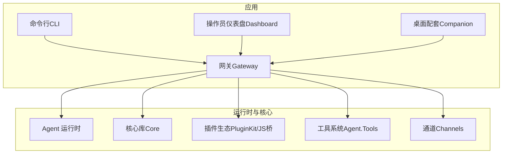
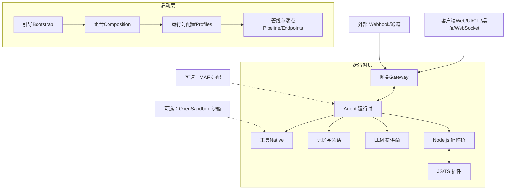
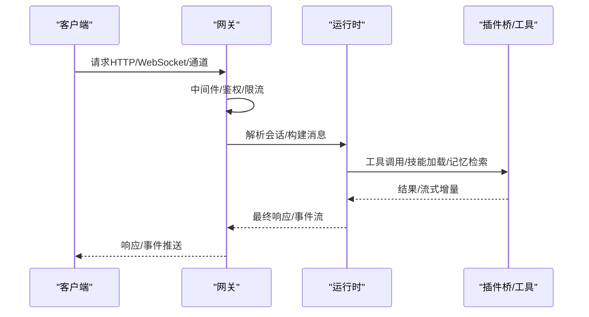
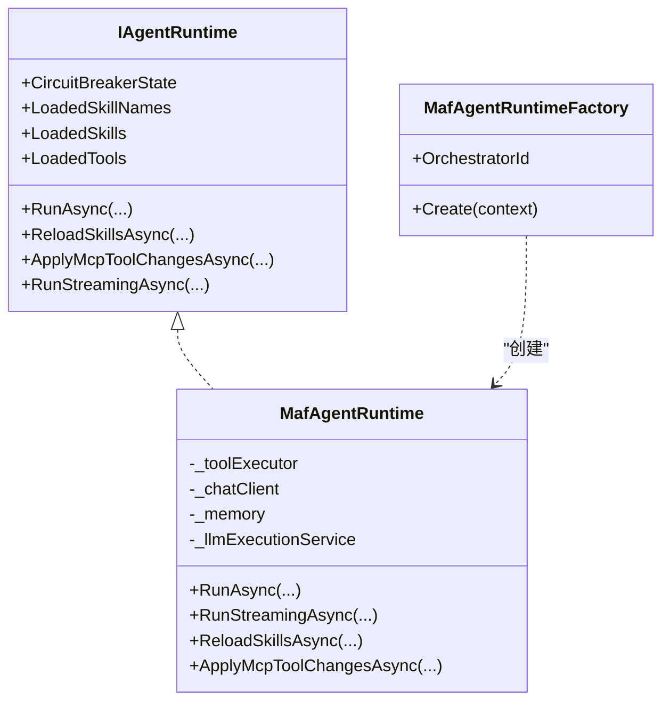
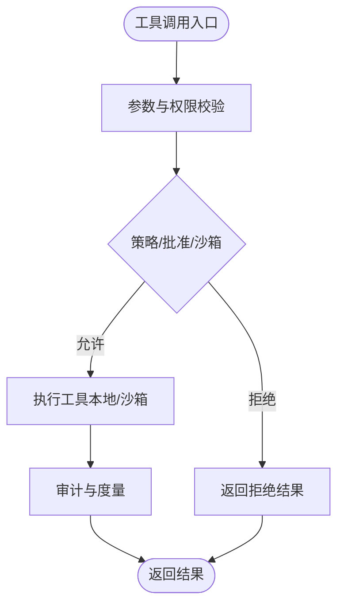
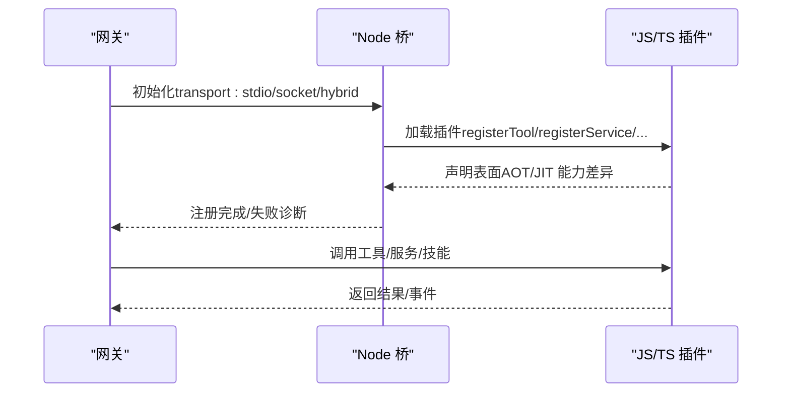
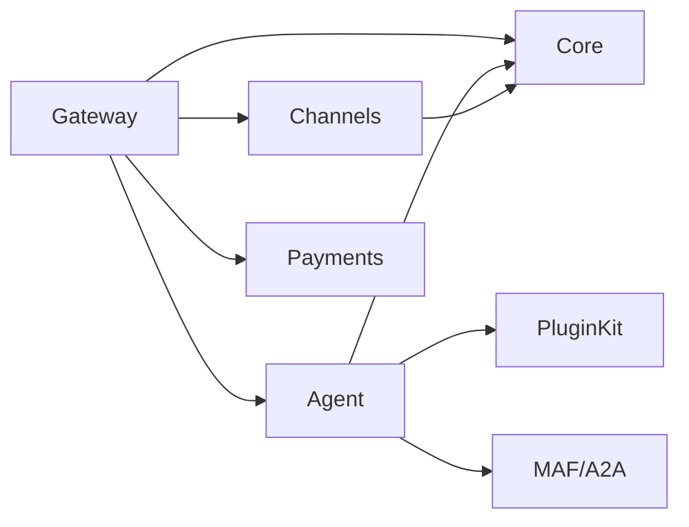

# 核心特性

<cite>
**本文引用的文件**
- [README.md](file://README.md)
- [QUICKSTART.md](file://QUICKSTART.md)
- [COMPATIBILITY.md](file://docs/COMPATIBILITY.md)
- [OpenClaw.Agent.csproj](file://src/OpenClaw.Agent/OpenClaw.Agent.csproj)
- [OpenClaw.Gateway.csproj](file://src/OpenClaw.Gateway/OpenClaw.Gateway.csproj)
- [OpenClaw.Core.csproj](file://src/OpenClaw.Core/OpenClaw.Core.csproj)
- [MafAgentRuntime.cs](file://src/OpenClaw.Agent/MafAgentRuntime.cs)
- [MafAgentRuntimeFactory.cs](file://src/OpenClaw.Agent/MafAgentRuntimeFactory.cs)
- [IAgentRuntime.cs](file://src/OpenClaw.Agent/IAgentRuntime.cs)
- [IAgentRuntimeFactory.cs](file://src/OpenClaw.Agent/IAgentRuntimeFactory.cs)
- [INativeDynamicPlugin.cs](file://src/OpenClaw.PluginKit/INativeDynamicPlugin.cs)
- [OpenClaw.Channels.csproj](file://src/OpenClaw.Channels/OpenClaw.Channels.csproj)
- [Program.cs（网关）](file://src/OpenClaw.Gateway/Program.cs)
- [Program.cs（CLI）](file://src/OpenClaw.Cli/Program.cs)
</cite>

## 目录
1. [简介](#简介)
2. [项目结构](#项目结构)
3. [核心组件](#核心组件)
4. [架构总览](#架构总览)
5. [详细组件分析](#详细组件分析)
6. [依赖关系分析](#依赖关系分析)
7. [性能考量](#性能考量)
8. [故障排查指南](#故障排查指南)
9. [结论](#结论)
10. [附录](#附录)

## 简介
本节概述 OpenClaw.NET 的核心能力与定位：以 .NET 为第一语言的智能体网关与运行时，强调可裁剪的 AOT 友好部署路径、可选的 Microsoft Agent Framework（MAF）编排、对 JavaScript/TypeScript 插件的实用兼容、以及面向生产的可观测性与安全加固能力。项目通过“启动层”与“运行时层”的分层设计，清晰地分离配置加载、服务注册与运行时编排。

- 关键定位
  - 网关与运行时：HTTP/WebSocket/Browser/Operator Dashboard 等多表面接入；消息管道、会话管理、策略与审批、工具执行、记忆与技能加载。
  - 运行时模式：AOT（低内存、可裁剪）、JIT（更广桥接与动态插件兼容）、自动选择。
  - 可选 MAF 编排：在 MAF 构建产物中启用，仍由网关/运行时模型主导。
  - 生态兼容：对主流工具/技能路径在 AOT 下可用，JIT 下扩展 registerChannel/registerCommand/registerProvider/api.on 等能力；纯 SKILL.md 包无需桥接。
  - 安全与可观测：认证、策略、速率限制、内存保留、健康与指标端点、分布式追踪。

**章节来源**
- [README.md: 9-40:9-40](file://README.md#L9-L40)
- [README.md: 145-196:145-196](file://README.md#L145-L196)

## 项目结构
从顶层看，项目采用多项目组合的库/应用布局：
- 网关（Web 应用）：负责启动、中间件、通道、端点映射、MAF/MCP/A2A 集成。
- 运行时（Agent）：承载推理、工具执行、记忆、技能、会话状态与 MAF 适配。
- 核心库（Core）：抽象、模型、验证、安全、内存与通用设施。
- 通道（Channels）：各类外部通道客户端与适配器。
- 工具系统（Agent.Tools）：内置工具集合与工具治理。
- 插件生态（PluginKit、各插件包）：原生动态插件接口与 JS/TS 桥接。
- CLI/桌面/仪表盘：交互入口与运维工具。

**图表来源**
- [OpenClaw.Gateway.csproj: 26-34:26-34](file://src/OpenClaw.Gateway/OpenClaw.Gateway.csproj#L26-L34)
- [OpenClaw.Agent.csproj: 6-26:6-26](file://src/OpenClaw.Agent/OpenClaw.Agent.csproj#L6-L26)
- [OpenClaw.Core.csproj: 10-23:10-23](file://src/OpenClaw.Core/OpenClaw.Core.csproj#L10-L23)
- [OpenClaw.Channels.csproj: 6-12:6-12](file://src/OpenClaw.Channels/OpenClaw.Channels.csproj#L6-L12)

**章节来源**
- [OpenClaw.Gateway.csproj: 26-34:26-34](file://src/OpenClaw.Gateway/OpenClaw.Gateway.csproj#L26-L34)
- [OpenClaw.Agent.csproj: 6-26:6-26](file://src/OpenClaw.Agent/OpenClaw.Agent.csproj#L6-L26)
- [OpenClaw.Core.csproj: 10-23:10-23](file://src/OpenClaw.Core/OpenClaw.Core.csproj#L10-L23)
- [OpenClaw.Channels.csproj: 6-12:6-12](file://src/OpenClaw.Channels/OpenClaw.Channels.csproj#L6-L12)

## 核心组件
- 网关服务
  - 启动与管线：配置加载、服务注册、中间件、通道与端点映射、健康/指标/保留端点。
  - 安全与可观测：认证、跨域/代理头信任、速率限制、OpenTelemetry。
  - 可选集成：MAF、MCP、A2A、可选 OpenSandbox。
- 代理运行时
  - 推理与编排：基于 IAgentRuntime 接口，支持同步与流式对话；会话状态、记忆检索、技能注入、工具治理与审计。
  - 运行时模式：IAgentRuntimeFactory 选择器支持 native 默认与 MAF 可选。
- 工具系统
  - 内置工具：文件读写、浏览器、代码执行、数据库、邮件、日历、Git、图像生成/分析、Web 抓取/搜索、Home Assistant、Notion、MQTT 等。
  - 工具治理：路径白名单、超时、审计、沙箱路由（可选）。
- 通信渠道
  - 多通道：Telegram、Twilio SMS、WhatsApp、Teams、Discord、Slack、DingTalk、飞书、Signal、WeCom、Email、WebSocket 等。
  - Webhook 与事件桥接：签名验证、去重、限流。
- 插件生态系统
  - JS/TS 插件桥：JSON-RPC 传输（stdio/socket/hybrid），支持 registerTool/registerService/技能打包；AOT/JIT 能力差异明确。
  - 原生动态插件：JIT 下可在进程内加载 .NET 插件，声明工具/服务/命令/通道/提供者/钩子/技能等。
  - 兼容性矩阵：明确支持与不支持的表面，失败即报并给出诊断。
- 两大运行时模式
  - AOT：低内存、可裁剪、适合生产部署；仅支持主流插件能力。
  - JIT：扩展桥接与动态插件能力；适合需要 registerChannel/registerCommand/registerProvider/api.on 或原生动态插件的场景。
  - 自动选择：根据运行时是否支持动态代码自动决定 aot/jit。
- Microsoft Agent Framework（MAF）集成
  - 在 MAF 构建产物中启用，作为可选编排后端；默认仍为 native。
  - 提供 MafAgentRuntime/MafAgentRuntimeFactory，实现 IAgentRuntime/IAgentRuntimeFactory。
- 与 JavaScript 插件生态系统的兼容
  - 支持主流工具/技能路径在 AOT 下直接运行；JIT 下支持 registerChannel/registerCommand/registerProvider/api.on。
  - 纯 SKILL.md 包无需桥接，最易兼容路径。
  - 明确的兼容矩阵与失败诊断，避免“部分加载”。

**章节来源**
- [README.md: 31-56:31-56](file://README.md#L31-L56)
- [README.md: 58-71:58-71](file://README.md#L58-L71)
- [README.md: 325-343:325-343](file://README.md#L325-L343)
- [COMPATIBILITY.md: 3-29:3-29](file://docs/COMPATIBILITY.md#L3-L29)
- [COMPATIBILITY.md: 40-58:40-58](file://docs/COMPATIBILITY.md#L40-L58)
- [OpenClaw.Agent.csproj: 11-21:11-21](file://src/OpenClaw.Agent/OpenClaw.Agent.csproj#L11-L21)

## 架构总览
下图展示启动与运行时的分层关系，以及网关与运行时、工具、记忆、LLM 提供商、JS/TS 插件桥之间的交互。

**图表来源**
- [README.md: 145-196:145-196](file://README.md#L145-L196)
- [Program.cs（网关）: 53-96:53-96](file://src/OpenClaw.Gateway/Program.cs#L53-L96)
- [OpenClaw.Agent.csproj: 11-21:11-21](file://src/OpenClaw.Agent/OpenClaw.Agent.csproj#L11-L21)

**章节来源**
- [README.md: 145-196:145-196](file://README.md#L145-L196)
- [Program.cs（网关）: 53-96:53-96](file://src/OpenClaw.Gateway/Program.cs#L53-L96)

## 详细组件分析

### 组件一：网关服务（Gateway）
- 职责
  - 配置解析与校验、启动恢复、安全与可观测性初始化。
  - 注册核心服务：通道、工具、后端、安全、MCP、A2A、可选 OpenSandbox。
  - 初始化运行时、挂载中间件与端点、开放 OpenAPI。
- 关键点
  - 分层启动：Bootstrap → Composition → Profiles → Pipeline/Endpoints。
  - 可选 MAF 集成与 OpenSandbox 条件编译。
  - 健康/指标/保留管理端点，便于生产监控。

**图表来源**
- [Program.cs（网关）: 80-96:80-96](file://src/OpenClaw.Gateway/Program.cs#L80-L96)
- [IAgentRuntime.cs: 25-49:25-49](file://src/OpenClaw.Agent/IAgentRuntime.cs#L25-L49)

**章节来源**
- [Program.cs（网关）: 53-96:53-96](file://src/OpenClaw.Gateway/Program.cs#L53-L96)
- [IAgentRuntime.cs: 8-50:8-50](file://src/OpenClaw.Agent/IAgentRuntime.cs#L8-L50)

### 组件二：代理运行时（Agent Runtime）
- 职责
  - 实现 IAgentRuntime：同步与流式对话、技能热加载、MCP 工具热替换、会话状态持久化。
  - MAF 适配：MafAgentRuntime/MafAgentRuntimeFactory，对接 Microsoft Agent Framework。
- 特性
  - 记忆检索与注入、历史压缩/截断、令牌预算控制、合同用量记录。
  - 工具治理与审计、钩子、批准流程、沙箱集成。
  - 支持系统事件触发（计划任务等）的无用户可见轮次生成。

**图表来源**
- [IAgentRuntime.cs: 8-50:8-50](file://src/OpenClaw.Agent/IAgentRuntime.cs#L8-L50)
- [MafAgentRuntime.cs: 17-118:17-118](file://src/OpenClaw.Agent/MafAgentRuntime.cs#L17-L118)
- [MafAgentRuntimeFactory.cs: 9-41:9-41](file://src/OpenClaw.Agent/MafAgentRuntimeFactory.cs#L9-L41)

**章节来源**
- [MafAgentRuntime.cs: 17-118:17-118](file://src/OpenClaw.Agent/MafAgentRuntime.cs#L17-L118)
- [MafAgentRuntimeFactory.cs: 9-41:9-41](file://src/OpenClaw.Agent/MafAgentRuntimeFactory.cs#L9-L41)
- [IAgentRuntime.cs: 8-50:8-50](file://src/OpenClaw.Agent/IAgentRuntime.cs#L8-L50)

### 组件三：工具系统（Tools）
- 覆盖面
  - 文件：读/写/编辑/补丁/发布/搜索/PDF/归档等。
  - 执行：Shell/代码执行/外部 CLI/进程管理。
  - 通讯：邮件、短信（Twilio）、即时通讯（Telegram/Discord/Slack/Teams/WhatsApp/飞书/WeCom/Signal）。
  - 信息：日历、Web 搜索/XSearch、浏览器抓取、图像生成/分析。
  - 设备/自动化：Home Assistant、MQTT、Notion、Fractal Memory。
- 安全与治理
  - 路径白名单、超时、输入清洗、URL 安全校验、工具审计与治理服务。
  - 可选 OpenSandbox 沙箱执行高风险工具。

**图表来源**
- [MafAgentRuntime.cs: 64-78:64-78](file://src/OpenClaw.Agent/MafAgentRuntime.cs#L64-L78)
- [IAgentRuntime.cs: 25-49:25-49](file://src/OpenClaw.Agent/IAgentRuntime.cs#L25-L49)

**章节来源**
- [MafAgentRuntime.cs: 64-78:64-78](file://src/OpenClaw.Agent/MafAgentRuntime.cs#L64-L78)
- [IAgentRuntime.cs: 25-49:25-49](file://src/OpenClaw.Agent/IAgentRuntime.cs#L25-L49)

### 组件四：通信渠道（Channels）
- 渠道类型
  - 即时通讯：Telegram、Twilio SMS、WhatsApp、Discord、Slack、飞书、WeCom、Signal、DingTalk。
  - 企业与邮件：Teams、Email。
  - Webhook：通用 Webhook、签名验证、请求体上限。
- 安全与合规
  - 严格允许列表、签名验证、去重、速率限制、代理头信任与已知代理配置。

**章节来源**
- [README.md: 344-403:344-403](file://README.md#L344-L403)
- [OpenClaw.Channels.csproj: 6-12:6-12](file://src/OpenClaw.Channels/OpenClaw.Channels.csproj#L6-L12)

### 组件五：插件生态系统（PluginKit 与 JS/TS 桥）
- 原生动态插件（JIT）
  - 接口：INativeDynamicPlugin/INativeDynamicPluginContext，支持注册工具/通道/命令/提供者/内存提供者/钩子/服务。
  - 安全：插件根目录约束、清单/程序集路径必须位于插件根内。
- JS/TS 插件桥（AOT/JIT）
  - 能力矩阵：registerTool/registerService/技能打包在 AOT/JIT 均支持；registerChannel/registerCommand/registerProvider/api.on 仅 JIT。
  - 传输：stdio、socket、hybrid（init stdio，运行 socket）。
  - 兼容性：失败即报，明确错误码与诊断；TS 需 jiti。

**图表来源**
- [COMPATIBILITY.md: 11-30:11-30](file://docs/COMPATIBILITY.md#L11-L30)
- [COMPATIBILITY.md: 40-58:40-58](file://docs/COMPATIBILITY.md#L40-L58)
- [INativeDynamicPlugin.cs: 11-46:11-46](file://src/OpenClaw.PluginKit/INativeDynamicPlugin.cs#L11-L46)

**章节来源**
- [COMPATIBILITY.md: 11-30:11-30](file://docs/COMPATIBILITY.md#L11-L30)
- [COMPATIBILITY.md: 40-58:40-58](file://docs/COMPATIBILITY.md#L40-L58)
- [INativeDynamicPlugin.cs: 11-46:11-46](file://src/OpenClaw.PluginKit/INativeDynamicPlugin.cs#L11-L46)

### 组件六：两大运行时模式（AOT 与 JIT）
- AOT
  - 优势：低内存占用、可裁剪、适合生产部署；二进制体积小、启动快。
  - 限制：不支持 registerChannel/registerCommand/registerProvider/api.on 等 JIT 表面；动态原生插件受限。
- JIT
  - 优势：扩展桥接与动态插件能力；可加载 JIT-only 原生动态插件。
  - 场景：需要 registerChannel/registerCommand/registerProvider/api.on 或原生动态插件。
- 自动选择
  - 根据运行时是否支持动态代码自动选择 aot/jit。

**章节来源**
- [README.md: 58-71:58-71](file://README.md#L58-L71)
- [QUICKSTART.md: 101-125:101-125](file://QUICKSTART.md#L101-L125)
- [COMPATIBILITY.md: 3-10:3-10](file://docs/COMPATIBILITY.md#L3-L10)

### 组件七：Microsoft Agent Framework（MAF）集成
- 位置与作用
  - 在 MAF 构建产物中启用，作为可选编排后端；默认仍为 native。
  - 提供 MafAgentRuntime/MafAgentRuntimeFactory，实现 IAgentRuntime/IAgentRuntimeFactory。
- 与网关/运行时的关系
  - 不替代网关/运行时所有权模型，仅替换编排策略。

**章节来源**
- [README.md: 36, 444-478:36-478](file://README.md#L36-L478)
- [MafAgentRuntimeFactory.cs: 31-41:31-41](file://src/OpenClaw.Agent/MafAgentRuntimeFactory.cs#L31-L41)
- [IAgentRuntimeFactory.cs: 47-65:47-65](file://src/OpenClaw.Agent/IAgentRuntimeFactory.cs#L47-L65)

### 组件八：与 JavaScript 插件生态系统的兼容
- 主流路径
  - AOT：registerTool/registerService/技能打包/受支持的清单/配置子集。
  - JIT：额外支持 registerChannel/registerCommand/registerProvider/api.on。
- 纯 SKILL.md 包
  - 无需桥接，最易兼容路径。
- 失败即报
  - 发现问题、越界路径、配置错误、不支持表面、AOT/JIT 能力缺失等均给出明确诊断。

**章节来源**
- [README.md: 325-343:325-343](file://README.md#L325-L343)
- [COMPATIBILITY.md: 11-30:11-30](file://docs/COMPATIBILITY.md#L11-L30)
- [COMPATIBILITY.md: 96-131:96-131](file://docs/COMPATIBILITY.md#L96-L131)

## 依赖关系分析
- 项目级依赖
  - 网关引用 Core、Agent、Channels、支付相关包与服务默认项。
  - Agent 引用 Core、PluginKit、MAF/A2A/MQTT 等。
  - Channels 引用 Core 与 HTTP 客户端。
- 运行时与编排
  - IAgentRuntimeFactory 选择器按 OrchestratorId 选择具体工厂；默认 native，MAF 在 MAF 构建中可用。
- 可选集成
  - OpenSandbox 通过条件编译与构建标志启用；MAF 通过编译常量启用。

**图表来源**
- [OpenClaw.Gateway.csproj: 26-34:26-34](file://src/OpenClaw.Gateway/OpenClaw.Gateway.csproj#L26-L34)
- [OpenClaw.Agent.csproj: 6-26:6-26](file://src/OpenClaw.Agent/OpenClaw.Agent.csproj#L6-L26)
- [OpenClaw.Channels.csproj: 6-12:6-12](file://src/OpenClaw.Channels/OpenClaw.Channels.csproj#L6-L12)

**章节来源**
- [OpenClaw.Gateway.csproj: 26-34:26-34](file://src/OpenClaw.Gateway/OpenClaw.Gateway.csproj#L26-L34)
- [OpenClaw.Agent.csproj: 6-26:6-26](file://src/OpenClaw.Agent/OpenClaw.Agent.csproj#L6-L26)
- [OpenClaw.Channels.csproj: 6-12:6-12](file://src/OpenClaw.Channels/OpenClaw.Channels.csproj#L6-L12)

## 性能考量
- AOT 优化
  - NativeAOT 配置：裁剪、符号剥离、优化偏好、禁用非必要功能（如事件源、HTTP 活动传播）。
  - Playwright 反射限制：通过修剪根与警告抑制处理。
- JIT 与桥接
  - Node 桥传输：stdio/socket/hybrid；socket 传输默认启用认证握手与私有运行时套接字目录。
- 工具与记忆
  - 历史压缩/截断、记忆召回上限、会话令牌预算、工具超时与审计，降低资源占用与提升稳定性。
- 观测与诊断
  - OpenTelemetry、健康/指标端点、保留清理、/doctor 文本报告。

**章节来源**
- [OpenClaw.Gateway.csproj: 4-21:4-21](file://src/OpenClaw.Gateway/OpenClaw.Gateway.csproj#L4-L21)
- [README.md: 118-124:118-124](file://README.md#L118-L124)
- [MafAgentRuntime.cs: 684-764:684-764](file://src/OpenClaw.Agent/MafAgentRuntime.cs#L684-L764)

## 故障排查指南
- 启动与配置
  - 使用 doctor 模式检查配置与环境；交互式快速启动与恢复。
  - 公网绑定需强认证与安全加固；允许的危险设置需显式开启。
- 插件兼容
  - /doctor 报告包含每插件加载诊断；TS 需 jiti；AOT/JIT 能力差异明确。
  - 不支持表面（如 registerGatewayMethod/registerCli）会失败并给出兼容码。
- 运行时与工具
  - 工具路径越界、配置 Schema 关键字不受支持、工具冲突（先到先得）等均有明确诊断。
  - 记忆召回失败、历史压缩失败等回退到简单策略。
- 通道与 Webhook
  - 签名验证、请求体上限、允许列表、代理头信任与已知代理配置。

**章节来源**
- [Program.cs（网关）: 100-122:100-122](file://src/OpenClaw.Gateway/Program.cs#L100-L122)
- [README.md: 277-324:277-324](file://README.md#L277-L324)
- [COMPATIBILITY.md: 96-131:96-131](file://docs/COMPATIBILITY.md#L96-L131)
- [MafAgentRuntime.cs: 625-682:625-682](file://src/OpenClaw.Agent/MafAgentRuntime.cs#L625-L682)

## 结论
OpenClaw.NET 以 .NET 为核心，提供生产就绪的网关与运行时能力：AOT/JIT 双通道满足不同部署与兼容需求，MAF 可选编排增强推理能力，JS/TS 插件生态通过桥接实现实用兼容，通道与工具覆盖广泛场景，安全与可观测贯穿始终。通过明确的兼容矩阵与失败即报机制，项目在保证可维护性的同时，最大化复用现有生态。

## 附录
- 快速开始与本地体验
  - 浏览器 UI、CLI、桌面配套、WebSocket、健康端点等。
- 运行时模式建议
  - AOT：追求低内存与可裁剪；JIT：需要扩展桥接或原生动态插件。
- 兼容性参考
  - 兼容矩阵、TS 要求、Schema 子集、失败形态与自动化证明。

**章节来源**
- [README.md: 198-246:198-246](file://README.md#L198-L246)
- [QUICKSTART.md: 101-125:101-125](file://QUICKSTART.md#L101-L125)
- [COMPATIBILITY.md: 60-94:60-94](file://docs/COMPATIBILITY.md#L60-L94)