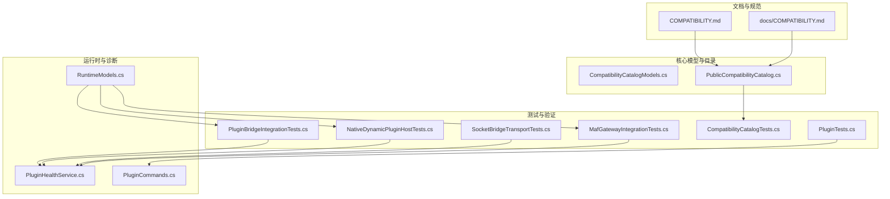
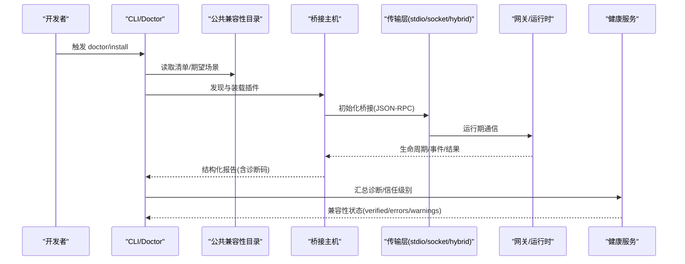
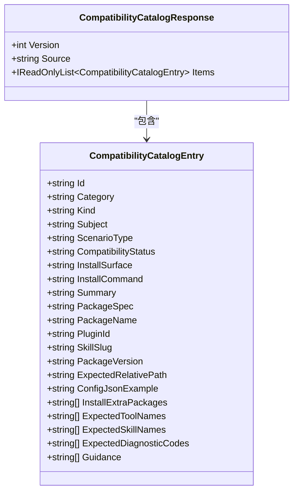
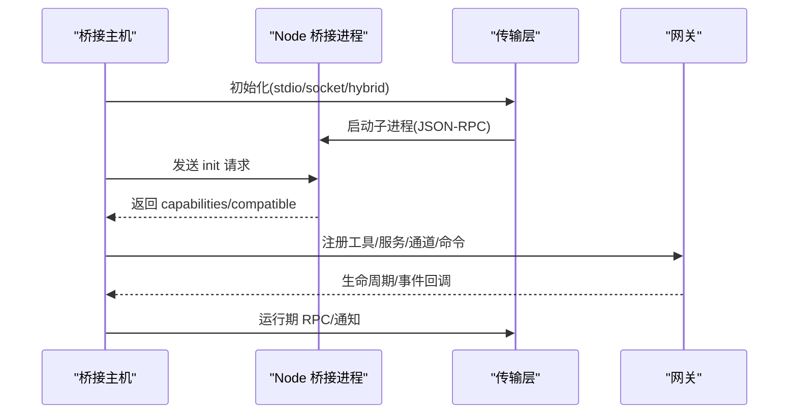
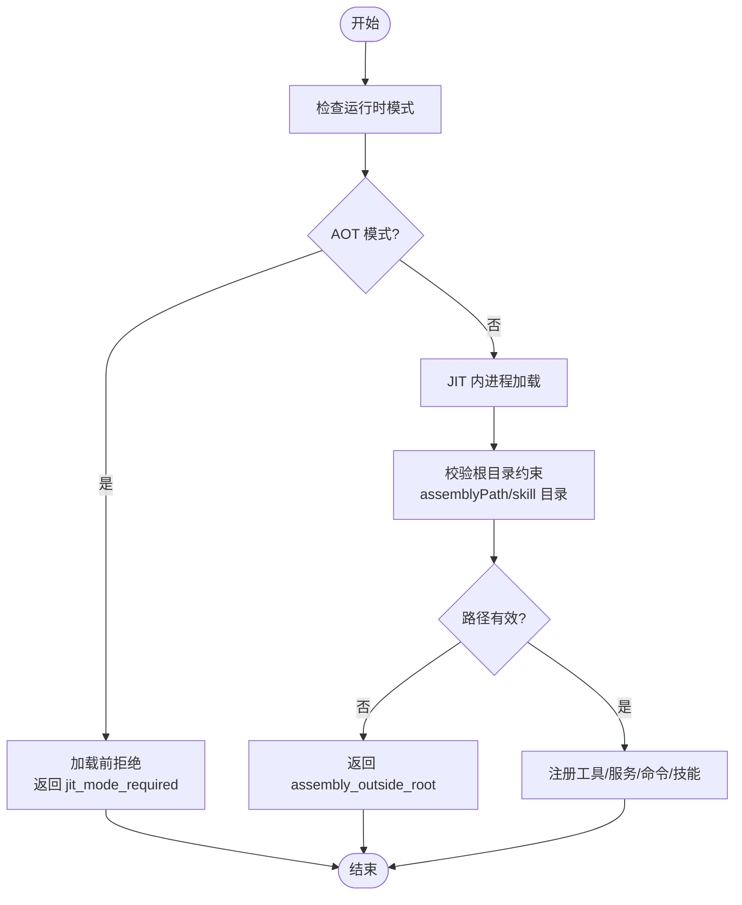
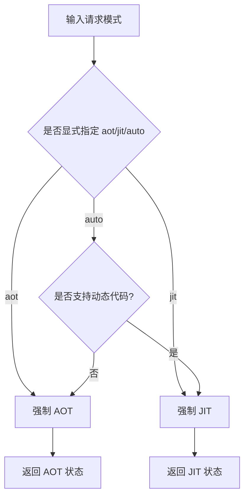
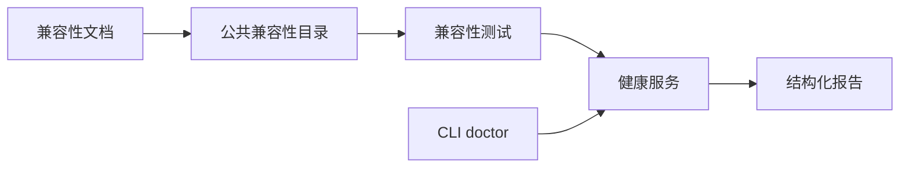

# 生态系统兼容性

<cite>
**本文引用的文件**
- [COMPATIBILITY.md](file://COMPATIBILITY.md)
- [docs/COMPATIBILITY.md](file://docs/COMPATIBILITY.md)
- [src/OpenClaw.Core/Compatibility/PublicCompatibilityCatalog.cs](file://src/OpenClaw.Core/Compatibility/PublicCompatibilityCatalog.cs)
- [src/OpenClaw.Core/Models/CompatibilityCatalogModels.cs](file://src/OpenClaw.Core/Models/CompatibilityCatalogModels.cs)
- [src/OpenClaw.Tests/CompatibilityCatalogTests.cs](file://src/OpenClaw.Tests/CompatibilityCatalogTests.cs)
- [src/OpenClaw.Tests/PluginBridgeIntegrationTests.cs](file://src/OpenClaw.Tests/PluginBridgeIntegrationTests.cs)
- [src/OpenClaw.Tests/NativeDynamicPluginHostTests.cs](file://src/OpenClaw.Tests/NativeDynamicPluginHostTests.cs)
- [src/OpenClaw.Gateway/PluginHealthService.cs](file://src/OpenClaw.Gateway/PluginHealthService.cs)
- [src/OpenClaw.Cli/PluginCommands.cs](file://src/OpenClaw.Cli/PluginCommands.cs)
- [src/OpenClaw.Core/Models/RuntimeModels.cs](file://src/OpenClaw.Core/Models/RuntimeModels.cs)
- [src/OpenClaw.Tests/SocketBridgeTransportTests.cs](file://src/OpenClaw.Tests/SocketBridgeTransportTests.cs)
- [src/OpenClaw.Tests/MafGatewayIntegrationTests.cs](file://src/OpenClaw.Tests/MafGatewayIntegrationTests.cs)
- [src/OpenClaw.Tests/PluginTests.cs](file://src/OpenClaw.Tests/PluginTests.cs)
- [docs/openclaw-plugin-system-analysis.md](file://docs/openclaw-plugin-system-analysis.md)
</cite>

## 目录
1. [简介](#简介)
2. [项目结构](#项目结构)
3. [核心组件](#核心组件)
4. [架构总览](#架构总览)
5. [详细组件分析](#详细组件分析)
6. [依赖关系分析](#依赖关系分析)
7. [性能考量](#性能考量)
8. [故障排查指南](#故障排查指南)
9. [结论](#结论)
10. [附录](#附录)

## 简介
本文件面向希望在 OpenClaw.NET 中集成 OpenClaw 生态系统的开发者，系统性阐述兼容性矩阵、运行时模式、插件表面支持、测试与诊断方法，并提供可操作的配置与迁移建议。目标是帮助团队在 AOT 与 JIT 两种运行时模式下，明确哪些能力可用、如何快速定位失败原因、以及如何通过自动化测试与诊断工具降低集成风险。

## 项目结构
围绕“兼容性”的关键代码分布在以下模块：
- 兼容性声明与规范：根目录与 docs 目录下的兼容性文档
- 公共兼容性目录与模型：用于生成兼容性清单与指导信息
- 测试层：桥接插件、原生动态插件、传输模式、健康度服务等端到端验证
- CLI 与网关：安装/诊断命令、健康快照与诊断汇总
- 运行时解析：AOT/JIT 模式选择与规范化

图表来源
- [COMPATIBILITY.md:1-119](file://COMPATIBILITY.md#L1-L119)
- [docs/COMPATIBILITY.md:1-131](file://docs/COMPATIBILITY.md#L1-L131)
- [src/OpenClaw.Core/Compatibility/PublicCompatibilityCatalog.cs:119-181](file://src/OpenClaw.Core/Compatibility/PublicCompatibilityCatalog.cs#L119-L181)
- [src/OpenClaw.Core/Models/CompatibilityCatalogModels.cs:1-33](file://src/OpenClaw.Core/Models/CompatibilityCatalogModels.cs#L1-L33)
- [src/OpenClaw.Tests/PluginBridgeIntegrationTests.cs:1-200](file://src/OpenClaw.Tests/PluginBridgeIntegrationTests.cs#L1-L200)
- [src/OpenClaw.Tests/NativeDynamicPluginHostTests.cs:1-200](file://src/OpenClaw.Tests/NativeDynamicPluginHostTests.cs#L1-L200)
- [src/OpenClaw.Tests/SocketBridgeTransportTests.cs:39-78](file://src/OpenClaw.Tests/SocketBridgeTransportTests.cs#L39-L78)
- [src/OpenClaw.Tests/CompatibilityCatalogTests.cs:27-66](file://src/OpenClaw.Tests/CompatibilityCatalogTests.cs#L27-L66)
- [src/OpenClaw.Tests/MafGatewayIntegrationTests.cs:37-63](file://src/OpenClaw.Tests/MafGatewayIntegrationTests.cs#L37-L63)
- [src/OpenClaw.Tests/PluginTests.cs:160-312](file://src/OpenClaw.Tests/PluginTests.cs#L160-L312)
- [src/OpenClaw.Core/Models/RuntimeModels.cs:40-68](file://src/OpenClaw.Core/Models/RuntimeModels.cs#L40-L68)
- [src/OpenClaw.Gateway/PluginHealthService.cs:67-436](file://src/OpenClaw.Gateway/PluginHealthService.cs#L67-L436)
- [src/OpenClaw.Cli/PluginCommands.cs:569-596](file://src/OpenClaw.Cli/PluginCommands.cs#L569-L596)

章节来源
- [COMPATIBILITY.md:1-119](file://COMPATIBILITY.md#L1-L119)
- [docs/COMPATIBILITY.md:1-131](file://docs/COMPATIBILITY.md#L1-L131)

## 核心组件
- 兼容性矩阵与运行时模式
  - AOT/JIT 自动选择、强制 AOT/JIT 行为
  - 支持的插件表面：registerTool、registerService；JIT 限定：registerChannel、registerCommand、api.on、registerProvider
  - 支持的技能与扩展：插件打包技能、ClawHub SKILL.md、.openclaw/extensions 下的 JS/TS
  - 传输模式：stdio、socket、hybrid
- 公共兼容性目录
  - 以清单形式描述正反向场景、期望工具名/技能名、诊断码与指引
- 测试与诊断
  - 桥接插件测试覆盖 JS/TS 加载、jiti、registerService、AOT/JIT 能力门控、通道/命令/提供者/api.on、配置校验、不支持表面
  - 原生动态插件测试覆盖 JIT 内部加载、生命周期、技能、AOT 快速拒绝
  - 健康服务对诊断进行汇总，输出兼容性状态、错误/警告计数、信任级别
  - CLI doctor 命令输出发现、加载、配置与兼容性失败的结构化报告

章节来源
- [COMPATIBILITY.md:5-29](file://COMPATIBILITY.md#L5-L29)
- [docs/COMPATIBILITY.md:11-29](file://docs/COMPATIBILITY.md#L11-L29)
- [src/OpenClaw.Core/Compatibility/PublicCompatibilityCatalog.cs:119-181](file://src/OpenClaw.Core/Compatibility/PublicCompatibilityCatalog.cs#L119-L181)
- [src/OpenClaw.Tests/PluginBridgeIntegrationTests.cs:96-126](file://src/OpenClaw.Tests/PluginBridgeIntegrationTests.cs#L96-L126)
- [src/OpenClaw.Tests/NativeDynamicPluginHostTests.cs:32-92](file://src/OpenClaw.Tests/NativeDynamicPluginHostTests.cs#L32-L92)
- [src/OpenClaw.Gateway/PluginHealthService.cs:67-436](file://src/OpenClaw.Gateway/PluginHealthService.cs#L67-L436)
- [src/OpenClaw.Cli/PluginCommands.cs:569-596](file://src/OpenClaw.Cli/PluginCommands.cs#L569-L596)

## 架构总览
下图展示从“插件声明”到“运行时装载与诊断”的整体流程，包括 AOT/JIT 门控、桥接传输、健康度汇总与 CLI doctor 输出。

图表来源
- [src/OpenClaw.Core/Compatibility/PublicCompatibilityCatalog.cs:119-181](file://src/OpenClaw.Core/Compatibility/PublicCompatibilityCatalog.cs#L119-L181)
- [src/OpenClaw.Tests/PluginBridgeIntegrationTests.cs:1013-1048](file://src/OpenClaw.Tests/PluginBridgeIntegrationTests.cs#L1013-L1048)
- [src/OpenClaw.Tests/SocketBridgeTransportTests.cs:39-78](file://src/OpenClaw.Tests/SocketBridgeTransportTests.cs#L39-L78)
- [src/OpenClaw.Gateway/PluginHealthService.cs:67-436](file://src/OpenClaw.Gateway/PluginHealthService.cs#L67-L436)
- [src/OpenClaw.Cli/PluginCommands.cs:569-596](file://src/OpenClaw.Cli/PluginCommands.cs#L569-L596)

## 详细组件分析

### 兼容性矩阵与运行时门控
- 运行时模式
  - auto：在具备动态代码时走 JIT，否则走 AOT
  - aot：强制严格兼容路径
  - jit：启用更广能力集
- 插件表面支持
  - AOT/JIT：registerTool、registerService
  - JIT 限定：registerChannel、registerCommand、api.on、registerProvider
  - 不支持：registerGatewayMethod、registerCli
- 技能与扩展
  - 插件打包技能按优先级注入
  - ClawHub SKILL.md 无需桥接
  - .openclaw/extensions 下的 JS/TS 扩展，TS 需 jiti
- 传输模式
  - stdio、socket、hybrid 均受支持

章节来源
- [COMPATIBILITY.md:5-29](file://COMPATIBILITY.md#L5-L29)
- [docs/COMPATIBILITY.md:11-29](file://docs/COMPATIBILITY.md#L11-L29)
- [COMPATIBILITY.md:31-39](file://COMPATIBILITY.md#L31-L39)

### 公共兼容性目录与清单
- 目录模型包含版本、来源、条目集合，条目字段覆盖 ID、类别、种类、主题、场景类型、兼容状态、安装面/命令、摘要、包规格/名称/版本、插件 ID/技能 slug、相对路径、配置示例、期望工具/技能名、期望诊断码、指引等
- 目录工厂根据兼容状态与种类构建摘要与指引，对不支持表面、配置 schema 失配等场景给出明确提示
- 单元测试验证过滤、缺失状态/技能 slug 的快速失败行为

图表来源
- [src/OpenClaw.Core/Models/CompatibilityCatalogModels.cs:1-33](file://src/OpenClaw.Core/Models/CompatibilityCatalogModels.cs#L1-L33)
- [src/OpenClaw.Core/Compatibility/PublicCompatibilityCatalog.cs:119-181](file://src/OpenClaw.Core/Compatibility/PublicCompatibilityCatalog.cs#L119-L181)
- [src/OpenClaw.Tests/CompatibilityCatalogTests.cs:27-66](file://src/OpenClaw.Tests/CompatibilityCatalogTests.cs#L27-L66)

章节来源
- [src/OpenClaw.Core/Models/CompatibilityCatalogModels.cs:1-33](file://src/OpenClaw.Core/Models/CompatibilityCatalogModels.cs#L1-L33)
- [src/OpenClaw.Core/Compatibility/PublicCompatibilityCatalog.cs:119-181](file://src/OpenClaw.Core/Compatibility/PublicCompatibilityCatalog.cs#L119-L181)
- [src/OpenClaw.Tests/CompatibilityCatalogTests.cs:27-66](file://src/OpenClaw.Tests/CompatibilityCatalogTests.cs#L27-L66)

### 桥接插件与传输层
- 桥接测试覆盖
  - JS/TS 加载与 jiti 成功/失败
  - registerService 生命周期
  - AOT/JIT 能力门控
  - registerChannel/registerCommand/registerProvider/api.on
  - 插件打包技能
  - 配置校验（含 oneOf）
  - 不支持表面的快速失败
- 传输层
  - stdio：子进程 stdin/stdout
  - socket：Unix 域套接字/Windows 命名管道，支持认证握手与私有运行时 socket 目录
  - hybrid：init 使用 stdio，运行期切换到 socket

图表来源
- [src/OpenClaw.Tests/PluginBridgeIntegrationTests.cs:1013-1048](file://src/OpenClaw.Tests/PluginBridgeIntegrationTests.cs#L1013-L1048)
- [src/OpenClaw.Tests/SocketBridgeTransportTests.cs:39-78](file://src/OpenClaw.Tests/SocketBridgeTransportTests.cs#L39-L78)
- [docs/openclaw-plugin-system-analysis.md:322-330](file://docs/openclaw-plugin-system-analysis.md#L322-L330)

章节来源
- [src/OpenClaw.Tests/PluginBridgeIntegrationTests.cs:96-126](file://src/OpenClaw.Tests/PluginBridgeIntegrationTests.cs#L96-L126)
- [src/OpenClaw.Tests/PluginBridgeIntegrationTests.cs:1381-1400](file://src/OpenClaw.Tests/PluginBridgeIntegrationTests.cs#L1381-L1400)
- [src/OpenClaw.Tests/SocketBridgeTransportTests.cs:39-78](file://src/OpenClaw.Tests/SocketBridgeTransportTests.cs#L39-L78)
- [docs/openclaw-plugin-system-analysis.md:322-330](file://docs/openclaw-plugin-system-analysis.md#L322-L330)

### 原生动态插件（JIT）
- 在 JIT 模式下，支持内进程加载原生动态插件，暴露 tools/services/commands/skills 等能力
- AOT 模式下对原生动态插件进行“加载前拒绝”，返回明确诊断码
- 路径约束：assemblyPath、manifest/skill 目录必须位于插件根目录内，越权路径被拒绝

图表来源
- [src/OpenClaw.Tests/NativeDynamicPluginHostTests.cs:94-123](file://src/OpenClaw.Tests/NativeDynamicPluginHostTests.cs#L94-L123)
- [src/OpenClaw.Tests/NativeDynamicPluginHostTests.cs:165-193](file://src/OpenClaw.Tests/NativeDynamicPluginHostTests.cs#L165-L193)

章节来源
- [src/OpenClaw.Tests/NativeDynamicPluginHostTests.cs:32-92](file://src/OpenClaw.Tests/NativeDynamicPluginHostTests.cs#L32-L92)
- [src/OpenClaw.Tests/NativeDynamicPluginHostTests.cs:94-123](file://src/OpenClaw.Tests/NativeDynamicPluginHostTests.cs#L94-L123)
- [src/OpenClaw.Tests/NativeDynamicPluginHostTests.cs:165-193](file://src/OpenClaw.Tests/NativeDynamicPluginHostTests.cs#L165-L193)

### 配置校验与诊断
- 支持的 JSON Schema 关键字：type、properties、required、additionalProperties、items、enum、const、minLength、maxLength、minimum、maximum、minItems、maxItems、pattern、oneOf、anyOf，以及仅作文档用途的 title/description/default
- 不支持的关键字将触发“不支持的 schema 关键字”诊断
- CLI doctor 对未找到清单、扩展配置、技能越权路径等情况输出结构化诊断

章节来源
- [docs/COMPATIBILITY.md:72-103](file://docs/COMPATIBILITY.md#L72-L103)
- [COMPATIBILITY.md:61-84](file://COMPATIBILITY.md#L61-L84)
- [src/OpenClaw.Cli/PluginCommands.cs:569-596](file://src/OpenClaw.Cli/PluginCommands.cs#L569-L596)

### 运行时模式解析与 AOT/JIT 流程
- 模式规范化与解析：auto/aot/jit 三态，结合是否支持动态代码决定最终有效模式
- 流式执行对比：AOT/JIT 在流式工具事件发射与内存占用方面存在差异，测试用例覆盖两类模式

图表来源
- [src/OpenClaw.Core/Models/RuntimeModels.cs:40-68](file://src/OpenClaw.Core/Models/RuntimeModels.cs#L40-L68)
- [src/OpenClaw.Tests/MafGatewayIntegrationTests.cs:37-63](file://src/OpenClaw.Tests/MafGatewayIntegrationTests.cs#L37-L63)

章节来源
- [src/OpenClaw.Core/Models/RuntimeModels.cs:40-68](file://src/OpenClaw.Core/Models/RuntimeModels.cs#L40-L68)
- [src/OpenClaw.Tests/MafGatewayIntegrationTests.cs:37-63](file://src/OpenClaw.Tests/MafGatewayIntegrationTests.cs#L37-L63)

## 依赖关系分析
- 文档与目录：公共兼容性目录由文档中的兼容性矩阵驱动，确保测试与清单一致
- 测试与实现：桥接测试、原生动态测试、传输测试与健康服务共同构成“自动证明”
- CLI 与网关：doctor 命令与健康服务形成闭环，前者负责“发现/装载/配置/兼容性”诊断，后者负责“汇总/信任级别/重启计数/内存快照”

图表来源
- [COMPATIBILITY.md:93-119](file://COMPATIBILITY.md#L93-L119)
- [docs/COMPATIBILITY.md:105-131](file://docs/COMPATIBILITY.md#L105-L131)
- [src/OpenClaw.Gateway/PluginHealthService.cs:67-436](file://src/OpenClaw.Gateway/PluginHealthService.cs#L67-L436)
- [src/OpenClaw.Cli/PluginCommands.cs:569-596](file://src/OpenClaw.Cli/PluginCommands.cs#L569-L596)

章节来源
- [COMPATIBILITY.md:93-119](file://COMPATIBILITY.md#L93-L119)
- [docs/COMPATIBILITY.md:105-131](file://docs/COMPATIBILITY.md#L105-L131)
- [src/OpenClaw.Gateway/PluginHealthService.cs:67-436](file://src/OpenClaw.Gateway/PluginHealthService.cs#L67-L436)
- [src/OpenClaw.Cli/PluginCommands.cs:569-596](file://src/OpenClaw.Cli/PluginCommands.cs#L569-L596)

## 性能考量
- 桥接子进程内存占用：测试用例对 JS/TS 桥接子进程的内存增长范围进行了测量与断言，确保 AOT 主机侧增量可控
- 流式执行：AOT/JIT 在工具事件发射与持久化方面存在差异，需结合业务场景选择合适模式
- 传输模式：socket/hybrid 提供更高效的运行期通信，但需关注认证握手与私有 socket 目录的安全配置

章节来源
- [src/OpenClaw.Tests/PluginBridgeIntegrationTests.cs:38-93](file://src/OpenClaw.Tests/PluginBridgeIntegrationTests.cs#L38-L93)
- [src/OpenClaw.Tests/MafGatewayIntegrationTests.cs:37-63](file://src/OpenClaw.Tests/MafGatewayIntegrationTests.cs#L37-L63)
- [src/OpenClaw.Tests/SocketBridgeTransportTests.cs:39-78](file://src/OpenClaw.Tests/SocketBridgeTransportTests.cs#L39-L78)

## 故障排查指南
- 快速失败与诊断码
  - 不支持表面：registerGatewayMethod、registerCli
  - JIT 限定：registerChannel/registerCommand/api.on/registerProvider 在 AOT 模式下会因“需要 JIT 模式”而拒绝
  - 配置 schema：使用不受支持的关键字将触发“不支持的 schema 关键字”
  - 路径越权：技能/入口/程序集路径越出插件根目录将被拒绝
- 诊断聚合与信任
  - 健康服务汇总错误/警告数量，计算兼容性状态（verified/errors/warnings），并给出信任级别与审查建议
- CLI doctor
  - 输出结构化诊断，包含标签、键、生效值、来源与是否脱敏等信息，便于定位问题

章节来源
- [COMPATIBILITY.md:31-39](file://COMPATIBILITY.md#L31-L39)
- [docs/COMPATIBILITY.md:96-103](file://docs/COMPATIBILITY.md#L96-L103)
- [src/OpenClaw.Gateway/PluginHealthService.cs:67-436](file://src/OpenClaw.Gateway/PluginHealthService.cs#L67-L436)
- [src/OpenClaw.Cli/PluginCommands.cs:569-596](file://src/OpenClaw.Cli/PluginCommands.cs#L569-L596)
- [src/OpenClaw.Tests/PluginTests.cs:201-312](file://src/OpenClaw.Tests/PluginTests.cs#L201-L312)

## 结论
OpenClaw.NET 通过“明确的运行时门控 + 受限的能力矩阵 + 结构化的诊断与测试”保障与 OpenClaw 生态的兼容性。AOT 模式聚焦主流工具/技能路径，JIT 模式开放更多能力。借助公共兼容性目录、桥接与原生动态测试、健康服务与 doctor 命令，团队可以快速评估集成风险、识别失败根因并制定迁移策略。

## 附录
- 兼容性示例与配置要点
  - 使用公共兼容性目录中的“正向/负向”场景清单，结合期望工具名/技能名与诊断码，快速判断迁移优先级
  - TS 插件需在插件目录或工作区安装 jiti，否则加载失败并给出可操作错误
  - 配置 schema 仅支持受限关键字集合，超出将被拒绝
  - 传输模式推荐 socket/hybrid 以提升运行期效率，注意认证与私有 socket 目录配置
- 迁移策略建议
  - 优先保证 registerTool/registerService 的可用性，确保 AOT 可用
  - 若插件依赖 registerChannel/registerCommand/api.on/registerProvider，请评估迁移到 JIT 或寻找替代方案
  - 对于 registerGatewayMethod/registerCli 等不支持表面，应替换为网关侧实现或调整插件设计

章节来源
- [COMPATIBILITY.md:49-60](file://COMPATIBILITY.md#L49-L60)
- [docs/COMPATIBILITY.md:72-103](file://docs/COMPATIBILITY.md#L72-L103)
- [docs/COMPATIBILITY.md:27-29](file://docs/COMPATIBILITY.md#L27-L29)
- [COMPATIBILITY.md:31-39](file://COMPATIBILITY.md#L31-L39)