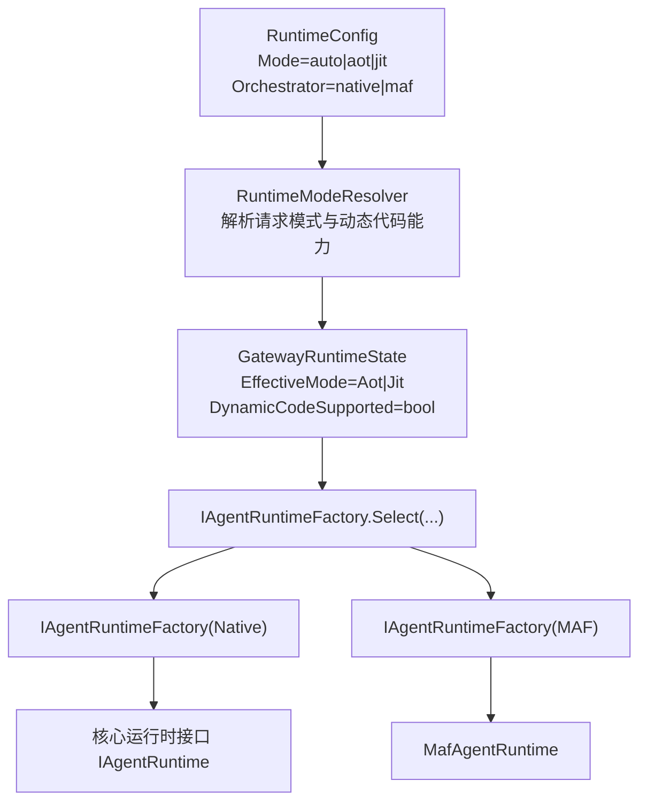
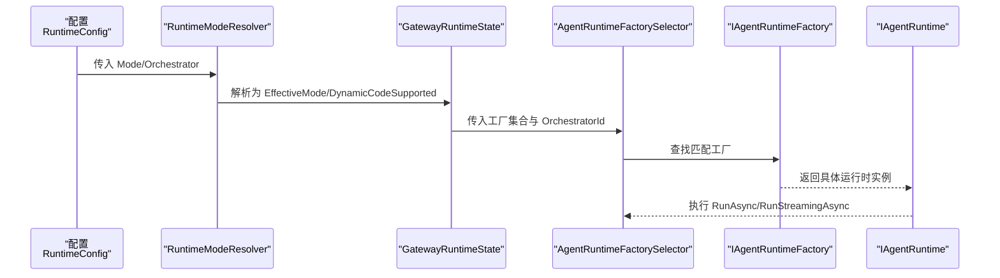
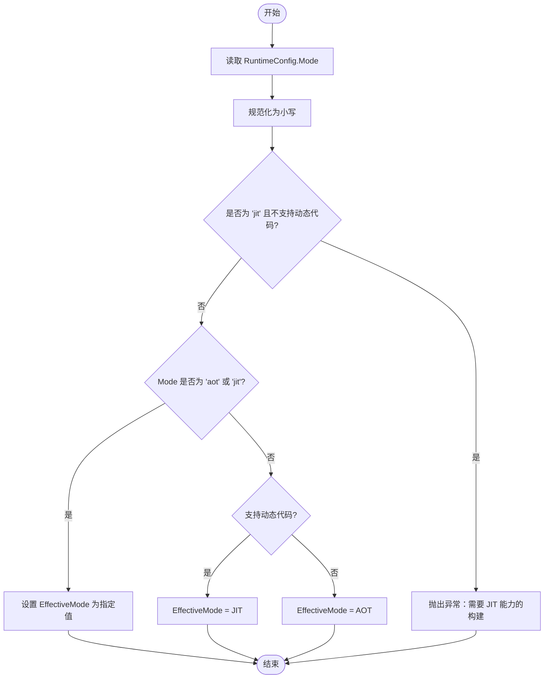
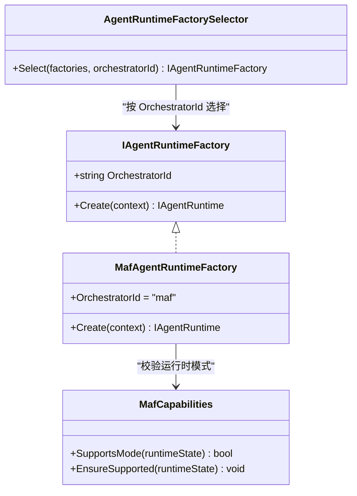
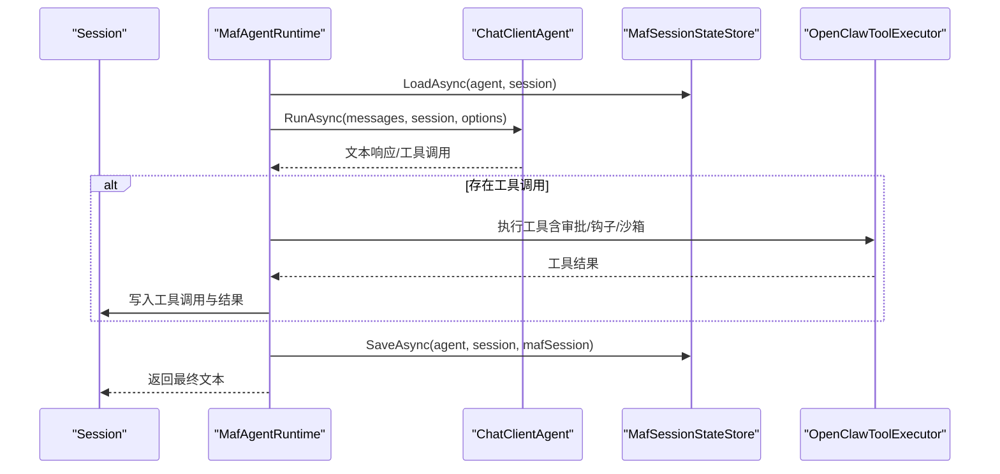
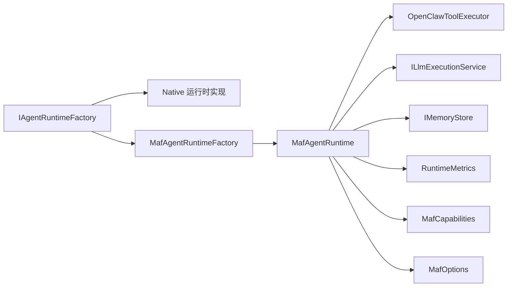

# 运行时模型

<cite>
**本文引用的文件**
- [RuntimeModels.cs](file://src/OpenClaw.Core/Models/RuntimeModels.cs)
- [IAgentRuntime.cs](file://src/OpenClaw.Agent/IAgentRuntime.cs)
- [IAgentRuntimeFactory.cs](file://src/OpenClaw.Agent/IAgentRuntimeFactory.cs)
- [MafAgentRuntime.cs](file://src/OpenClaw.Agent/MafAgentRuntime.cs)
- [MafAgentRuntimeFactory.cs](file://src/OpenClaw.Agent/MafAgentRuntimeFactory.cs)
- [MafCapabilities.cs](file://src/OpenClaw.Agent/MafCapabilities.cs)
- [MafOptions.cs](file://src/OpenClaw.Agent/MafOptions.cs)
- [AgentRuntimeFactorySelectorTests.cs](file://src/OpenClaw.Tests/AgentRuntimeFactorySelectorTests.cs)
- [maf-aot-jit-plan.md](file://docs/maf-aot-jit/maf-aot-jit-plan.md)
</cite>

## 目录
1. [引言](#引言)
2. [项目结构](#项目结构)
3. [核心组件](#核心组件)
4. [架构总览](#架构总览)
5. [详细组件分析](#详细组件分析)
6. [依赖关系分析](#依赖关系分析)
7. [性能考量](#性能考量)
8. [故障排查指南](#故障排查指南)
9. [结论](#结论)
10. [附录](#附录)

## 引言
本文件面向 OpenClaw.NET 的运行时模型，系统性阐述两大运行时模式（AOT 与 JIT）的技术差异、性能特征与适用场景；详解运行时模式选择逻辑（auto 模式）；解释 Orchestrator 选择（native/maf）对系统行为的影响；给出每种模式下的功能集、限制条件与最佳实践；并提供配置示例与性能对比建议，帮助用户基于具体需求做出合适的选择。

## 项目结构
OpenClaw.NET 将“运行时模式”与“编排器（Orchestrator）”解耦为两个维度：
- 运行时模式：由 GatewayRuntimeMode 表示，包含 AOT 与 JIT 两种形态。
- 编排器：由 RuntimeOrchestrator 表示，包含 native 与 maf 两种形态。
- 二者通过运行时状态 GatewayRuntimeState 统一在运行时解析与生效。

图表来源
- [RuntimeModels.cs:5-69](file://src/OpenClaw.Core/Models/RuntimeModels.cs#L5-L69)
- [IAgentRuntimeFactory.cs:47-66](file://src/OpenClaw.Agent/IAgentRuntimeFactory.cs#L47-L66)
- [MafAgentRuntimeFactory.cs:9-31](file://src/OpenClaw.Agent/MafAgentRuntimeFactory.cs#L9-L31)

章节来源
- [RuntimeModels.cs:5-69](file://src/OpenClaw.Core/Models/RuntimeModels.cs#L5-L69)
- [IAgentRuntimeFactory.cs:47-66](file://src/OpenClaw.Agent/IAgentRuntimeFactory.cs#L47-L66)

## 核心组件
- 运行时模式与状态
  - GatewayRuntimeMode：Aot/Jit 枚举。
  - RuntimeConfig：包含 Mode 与 Orchestrator 字段。
  - GatewayRuntimeState：包含 RequestedMode、EffectiveMode、DynamicCodeSupported。
  - RuntimeModeResolver：负责将请求模式与运行时动态代码能力映射为 EffectiveMode。
- 运行时接口与工厂
  - IAgentRuntime：定义运行时统一接口（同步/流式对话、技能重载、工具热替换等）。
  - IAgentRuntimeFactory：按 OrchestratorId 提供具体运行时实例。
  - AgentRuntimeFactorySelector：根据配置选择对应工厂。
- MAF 运行时适配
  - MafAgentRuntime：基于 Microsoft Agent Framework 的运行时实现。
  - MafAgentRuntimeFactory：注册 MAF 工厂，支持委托代理与配置裁剪。
  - MafCapabilities：声明 MAF 支持的运行时模式（JIT/AOT）。
  - MafOptions：MAF 特定选项（如流式、A2A 等）。

章节来源
- [RuntimeModels.cs:5-69](file://src/OpenClaw.Core/Models/RuntimeModels.cs#L5-L69)
- [IAgentRuntime.cs:8-51](file://src/OpenClaw.Agent/IAgentRuntime.cs#L8-L51)
- [IAgentRuntimeFactory.cs:40-66](file://src/OpenClaw.Agent/IAgentRuntimeFactory.cs#L40-L66)
- [MafAgentRuntime.cs:17-118](file://src/OpenClaw.Agent/MafAgentRuntime.cs#L17-L118)
- [MafAgentRuntimeFactory.cs:9-31](file://src/OpenClaw.Agent/MafAgentRuntimeFactory.cs#L9-L31)
- [MafCapabilities.cs:5-17](file://src/OpenClaw.Agent/MafCapabilities.cs#L5-L17)
- [MafOptions.cs:3-44](file://src/OpenClaw.Agent/MafOptions.cs#L3-L44)

## 架构总览
下图展示从配置到运行时实例创建的关键流程，包括 auto 模式的解析与 MAF 适配器的可选集成。

图表来源
- [RuntimeModels.cs:29-69](file://src/OpenClaw.Core/Models/RuntimeModels.cs#L29-L69)
- [IAgentRuntimeFactory.cs:47-66](file://src/OpenClaw.Agent/IAgentRuntimeFactory.cs#L47-L66)
- [MafAgentRuntimeFactory.cs:119-166](file://src/OpenClaw.Agent/MafAgentRuntimeFactory.cs#L119-L166)

## 详细组件分析

### 运行时模式：AOT 与 JIT
- 模式定义
  - AOT：Ahead-of-Time 发布，不依赖 JIT 动态代码生成。
  - JIT：Just-In-Time 运行，依赖动态代码生成能力。
- auto 模式解析逻辑
  - 若显式指定 aot/jit，则严格采用该模式。
  - 若为 auto：
    - 当运行时支持动态代码（RuntimeFeature.IsDynamicCodeSupported）时，优先选择 JIT；
    - 否则回退到 AOT。
- 错误处理
  - 当请求模式为 jit 但运行时不支持动态代码时，抛出明确异常，提示需要 JIT 能力的构建产物。

图表来源
- [RuntimeModels.cs:29-59](file://src/OpenClaw.Core/Models/RuntimeModels.cs#L29-L59)

章节来源
- [RuntimeModels.cs:29-59](file://src/OpenClaw.Core/Models/RuntimeModels.cs#L29-L59)

### 编排器：native 与 maf
- 默认编排器
  - native 为默认编排器，保持现有行为作为基线。
- maf 编排器
  - 通过 MafAgentRuntimeFactory 注册，需在包含 MAF 适配器的构建中启用。
  - MafCapabilities.EnsureSupported 在工厂创建前校验运行时模式兼容性（JIT/AOT 均支持）。
  - 未包含适配器而选择 maf 时，启动阶段会快速失败并给出清晰错误信息。
- 工厂选择
  - AgentRuntimeFactorySelector.Select 根据 OrchestratorId 选择工厂；若找不到对应工厂或未包含适配器，抛出异常并引导修复。

图表来源
- [IAgentRuntimeFactory.cs:40-66](file://src/OpenClaw.Agent/IAgentRuntimeFactory.cs#L40-L66)
- [MafAgentRuntimeFactory.cs:9-31](file://src/OpenClaw.Agent/MafAgentRuntimeFactory.cs#L9-L31)
- [MafCapabilities.cs:5-17](file://src/OpenClaw.Agent/MafCapabilities.cs#L5-L17)

章节来源
- [IAgentRuntimeFactory.cs:47-66](file://src/OpenClaw.Agent/IAgentRuntimeFactory.cs#L47-L66)
- [MafAgentRuntimeFactory.cs:119-166](file://src/OpenClaw.Agent/MafAgentRuntimeFactory.cs#L119-L166)
- [MafCapabilities.cs:9-16](file://src/OpenClaw.Agent/MafCapabilities.cs#L9-L16)
- [AgentRuntimeFactorySelectorTests.cs:9-34](file://src/OpenClaw.Tests/AgentRuntimeFactorySelectorTests.cs#L9-L34)

### MAF 运行时实现（MafAgentRuntime）
- 职责与能力
  - 基于 Microsoft Agent Framework 的 ChatClientAgent 执行对话。
  - 通过 OpenClawToolExecutor 统一执行工具调用，支持审批、钩子、沙箱与审计日志。
  - 支持会话状态持久化（MafSessionStateStore）、遥测（MafTelemetryAdapter）、内存检索注入、历史压缩与摘要。
  - 支持同步与流式对话（RunAsync/RunStreamingAsync），并提供技能重载与 MCP 工具热替换。
- 关键流程
  - RunAsync：构建消息、注入记忆、执行推理、记录会话、处理工具调用与预算检查。
  - RunStreamingAsync：以事件流方式输出文本增量，支持错误事件与完成事件。
- 并发与一致性
  - 技能列表与工具列表使用锁保护，确保并发安全。
  - 使用 MafExecutionContextScope 传递上下文（会话、转数、预算、审批回调等）。

图表来源
- [MafAgentRuntime.cs:203-337](file://src/OpenClaw.Agent/MafAgentRuntime.cs#L203-L337)
- [MafAgentRuntime.cs:339-423](file://src/OpenClaw.Agent/MafAgentRuntime.cs#L339-L423)

章节来源
- [MafAgentRuntime.cs:17-118](file://src/OpenClaw.Agent/MafAgentRuntime.cs#L17-L118)
- [MafAgentRuntime.cs:203-337](file://src/OpenClaw.Agent/MafAgentRuntime.cs#L203-L337)
- [MafAgentRuntime.cs:339-423](file://src/OpenClaw.Agent/MafAgentRuntime.cs#L339-L423)

### 配置与选择逻辑（auto 模式与 Orchestrator）
- 配置项
  - OpenClaw:Runtime:Mode：auto（默认）、aot、jit。
  - OpenClaw:Runtime:Orchestrator：native（默认）、maf。
- 选择规则
  - Orchestrator 选择：AgentRuntimeFactorySelector.Select 根据配置的 OrchestratorId 选择工厂；若选择 maf 但未包含适配器，启动失败并提示。
  - auto 模式：RuntimeModeResolver.Resolve 根据运行时动态代码能力决定 EffectiveMode。
- 实验与兼容性
  - 计划文档指出 maf 可在 JIT/AOT 中使用，但需在包含 MAF 适配器的构建中启用；否则快速失败。

章节来源
- [RuntimeModels.cs:11-18](file://src/OpenClaw.Core/Models/RuntimeModels.cs#L11-L18)
- [IAgentRuntimeFactory.cs:47-66](file://src/OpenClaw.Agent/IAgentRuntimeFactory.cs#L47-L66)
- [MafAgentRuntimeFactory.cs:119-166](file://src/OpenClaw.Agent/MafAgentRuntimeFactory.cs#L119-L166)
- [maf-aot-jit-plan.md:78-99](file://docs/maf-aot-jit/maf-aot-jit-plan.md#L78-L99)

## 依赖关系分析
- 组件耦合
  - IAgentRuntimeFactory 与具体运行时实现解耦，便于扩展 native/maf 等不同后端。
  - MafAgentRuntimeFactory 依赖 MafAgentFactory、MafSessionStateStore、MafTelemetryAdapter、MafOptions 等服务。
  - MafAgentRuntime 依赖 OpenClawToolExecutor、ILlmExecutionService、IMemoryStore、RuntimeMetrics 等核心服务。
- 外部依赖
  - Microsoft Agent Framework（ChatClientAgent、AITool 等）。
  - 运行时动态代码能力（RuntimeFeature.IsDynamicCodeSupported）影响 auto 模式决策。
- 循环依赖
  - 未见直接循环依赖；工厂与运行时通过接口解耦。

图表来源
- [IAgentRuntimeFactory.cs:40-66](file://src/OpenClaw.Agent/IAgentRuntimeFactory.cs#L40-L66)
- [MafAgentRuntimeFactory.cs:9-31](file://src/OpenClaw.Agent/MafAgentRuntimeFactory.cs#L9-L31)
- [MafAgentRuntime.cs:17-118](file://src/OpenClaw.Agent/MafAgentRuntime.cs#L17-L118)

章节来源
- [IAgentRuntimeFactory.cs:40-66](file://src/OpenClaw.Agent/IAgentRuntimeFactory.cs#L40-L66)
- [MafAgentRuntimeFactory.cs:9-31](file://src/OpenClaw.Agent/MafAgentRuntimeFactory.cs#L9-L31)
- [MafAgentRuntime.cs:17-118](file://src/OpenClaw.Agent/MafAgentRuntime.cs#L17-L118)

## 性能考量
- AOT 模式
  - 启动更快、部署更简单、无 JIT 编译开销。
  - 适合对启动时间敏感、资源受限或需要严格发布控制的环境。
  - 功能上与 JIT 一致，但受限于发布时的裁剪与不可变性。
- JIT 模式
  - 更灵活，支持动态代码生成与运行时优化。
  - 适合开发调试、需要热插拔或频繁变更的场景。
  - auto 模式在支持动态代码的环境中优先选择 JIT。
- MAF 运行时
  - 通过 ChatClientAgent 执行推理，具备与 native 相同的工具链与策略（审批、钩子、沙箱、审计）。
  - 流式能力受 MafOptions.EnableStreaming 控制；实验文档强调 JIT/AOT 均支持 MAF。
- 最佳实践
  - 生产环境优先考虑 AOT，结合严格的发布流水线与可观测性。
  - 开发/测试环境优先 JIT，便于快速迭代。
  - 选择 maf 时确保构建包含适配器，避免启动失败。

[本节为通用指导，无需特定文件来源]

## 故障排查指南
- 选择 maf 但未包含适配器导致启动失败
  - 现象：启动时报错，提示需要包含 OpenClaw.MicrosoftAgentFrameworkAdapter 的构建。
  - 排查：确认构建配置包含 MAF 适配器项目；或切换 Orchestrator=native。
  - 参考测试断言：当仅注册 native 而选择 maf 时，应抛出明确异常。
- 请求模式为 jit 但运行时不支持动态代码
  - 现象：抛出异常，提示需要 JIT 能力的构建。
  - 排查：确认运行时构建支持动态代码；或改为 aot。
- auto 模式行为不符合预期
  - 现象：在不支持动态代码的环境中被回退到 AOT。
  - 排查：检查运行时动态代码能力；必要时显式指定 Mode=aot/jit。

章节来源
- [IAgentRuntimeFactory.cs:60-64](file://src/OpenClaw.Agent/IAgentRuntimeFactory.cs#L60-L64)
- [AgentRuntimeFactorySelectorTests.cs:17-24](file://src/OpenClaw.Tests/AgentRuntimeFactorySelectorTests.cs#L17-L24)
- [RuntimeModels.cs:36-40](file://src/OpenClaw.Core/Models/RuntimeModels.cs#L36-L40)

## 结论
- AOT 与 JIT 是运行时层面的发布/执行模式，auto 会依据运行时动态代码能力自动选择。
- native 与 maf 是编排器层面的选择，native 为默认基线，maF 为可选增强后端，需在包含适配器的构建中启用。
- MAF 在 JIT/AOT 下均可使用，但需遵循适配器可用性与配置约束。
- 建议：生产优先 AOT，开发优先 JIT；选择 maf 时确保构建包含适配器并关注流式与工具链一致性。

[本节为总结，无需特定文件来源]

## 附录

### 配置示例（JSON）
- 默认（auto + native）
  - OpenClaw:Runtime:Mode=auto
  - OpenClaw:Runtime:Orchestrator=native
- 显式 AOT + native
  - OpenClaw:Runtime:Mode=aot
  - OpenClaw:Runtime:Orchestrator=native
- 显式 JIT + native
  - OpenClaw:Runtime:Mode=jit
  - OpenClaw:Runtime:Orchestrator=native
- 显式 AOT + maf（需包含适配器）
  - OpenClaw:Runtime:Mode=aot
  - OpenClaw:Runtime:Orchestrator=maf
- 显式 JIT + maf（需包含适配器）
  - OpenClaw:Runtime:Mode=jit
  - OpenClaw:Runtime:Orchestrator=maf

章节来源
- [maf-aot-jit-plan.md:81-90](file://docs/maf-aot-jit/maf-aot-jit-plan.md#L81-L90)
- [RuntimeModels.cs:11-18](file://src/OpenClaw.Core/Models/RuntimeModels.cs#L11-L18)

### 功能集与限制对照（概览）
- native
  - 支持：同步/流式对话、工具链、审批、钩子、沙箱、审计、技能与记忆检索、历史压缩。
  - 限制：无特殊限制，作为默认基线。
- maf
  - 支持：与 native 相同的工具链与策略；通过 ChatClientAgent 执行推理。
  - 限制：需包含适配器构建；流式能力受 MafOptions.EnableStreaming 控制；选择 maf 时必须在包含适配器的构建中启用。
- AOT/JIT 影响
  - 对 native：AOT 启动更快、部署更稳；JIT 更灵活。
  - 对 maf：JIT/AOT 均可使用，但需适配器可用。

章节来源
- [MafAgentRuntime.cs:17-118](file://src/OpenClaw.Agent/MafAgentRuntime.cs#L17-L118)
- [MafOptions.cs:3-44](file://src/OpenClaw.Agent/MafOptions.cs#L3-L44)
- [MafCapabilities.cs:9-16](file://src/OpenClaw.Agent/MafCapabilities.cs#L9-L16)
- [RuntimeModels.cs:5-69](file://src/OpenClaw.Core/Models/RuntimeModels.cs#L5-L69)