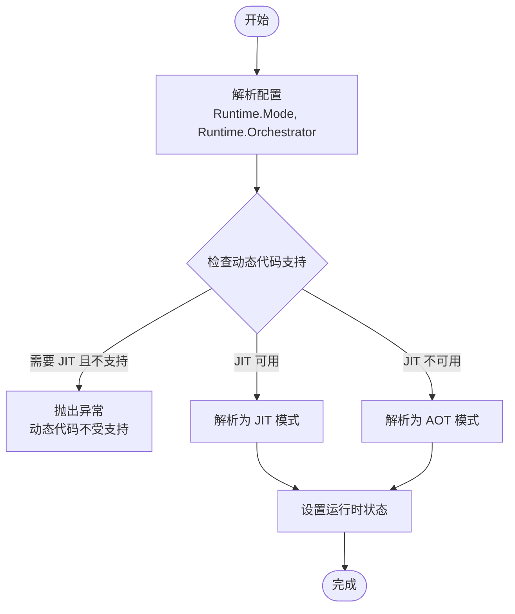
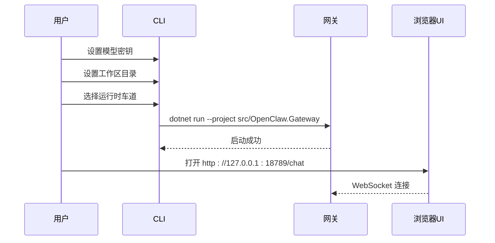

# 项目介绍

<cite>
**本文档引用的文件**
- [README.md](file://README.md)
- [QUICKSTART.md](file://QUICKSTART.md)
- [COMPATIBILITY.md](file://COMPATIBILITY.md)
- [Directory.Build.props](file://Directory.Build.props)
- [OpenClaw.Net.slnx](file://OpenClaw.Net.slnx)
- [src/OpenClaw.Gateway/Program.cs](file://src/OpenClaw.Gateway/Program.cs)
- [src/OpenClaw.Agent/MafAgentRuntime.cs](file://src/OpenClaw.Agent/MafAgentRuntime.cs)
- [src/OpenClaw.Core/Models/GatewayConfig.cs](file://src/OpenClaw.Core/Models/GatewayConfig.cs)
- [src/OpenClaw.PluginKit/INativeDynamicPlugin.cs](file://src/OpenClaw.PluginKit/INativeDynamicPlugin.cs)
- [src/OpenClaw.Core/Models/RuntimeModels.cs](file://src/OpenClaw.Core/Models/RuntimeModels.cs)
- [docs/COMPATIBILITY.md](file://docs/COMPATIBILITY.md)
</cite>

## 目录
1. [项目概述](#项目概述)
2. [项目架构](#项目架构)
3. [核心设计理念](#核心设计理念)
4. [运行时模型](#运行时模型)
5. [插件生态系统兼容性](#插件生态系统兼容性)
6. [主要功能特性](#主要功能特性)
7. [部署与运行模式](#部署与运行模式)
8. [项目独立性声明](#项目独立性声明)
9. [总结](#总结)

## 项目概述

OpenClaw.NET 是一个独立的 .NET 实现的 OpenClaw 代理运行时和网关系统。该项目旨在解决传统代理栈普遍采用 Python 或 Node-first 运行时假设所带来的限制，为 .NET 生态系统提供一个轻量级、可独立部署的解决方案。

### 项目存在的原因

大多数代理系统仍然假设 Python 或 Node-first 运行时。当用户希望在 .NET 生态系统中保持轻量级自包含二进制文件和复用现有基础设施时，这种假设就显得不够灵活。OpenClaw.NET 通过以下方式解决了这些问题：

- **.NET-first 网关和代理运行时**：专为 .NET 环境设计，支持真实的 NativeAOT 友好部署路径
- **实用的 JavaScript/TypeScript 插件生态兼容性**：通过 JSON-RPC 桥接实现对现有 JS/TS 插件的直接复用，无需强制重写
- **明确的兼容性诊断**：提供清晰的兼容性报告，避免模糊的"大部分兼容"声明
- **可选的微软代理框架(MAF)编排路径**：在 MAF 启用的制品中提供可选的编排策略，同时保持原生运行时作为默认选择

### 项目价值主张

OpenClaw.NET 专注于为生产环境提供可靠的代理基础设施，包括认证、策略、内存、渠道、可观测性和打包部署目标等核心能力。

## 项目架构

OpenClaw.NET 将网关启动和运行时组合分解为明确的层次结构，而不是单一的启动路径。

```mermaid
graph TD
Client[Web UI / CLI / Companion / WebSocket 客户端] --> Gateway[网关]
Webhooks[Telegram / Twilio / WhatsApp / 通用 Webhooks] --> Gateway
subgraph Startup[启动阶段]
Bootstrap[引导程序]
Composition[组合层]
Profiles[运行时配置文件]
Pipeline[管道 + 端点]
Bootstrap --> Composition --> Profiles --> Pipeline
end
subgraph Runtime[运行时]
Gateway < --> Agent[代理运行时]
Agent < --> Tools[原生工具]
Agent < --> Memory[(内存 + 会话)]
Agent < --> LLM{LLM 提供商}
Agent < --> Bridge[Node.js 插件桥]
Bridge < --> JSPlugins[TS / JS 插件]
end
```

**图表来源**
- [README.md:167-188](file://README.md#L167-L188)

### 启动流程

1. **Bootstrap/** - 加载配置，解析运行时模式和编排器，应用验证和加固，并处理早期退出（如 `--doctor`）
2. **Composition/** 和 **Profiles/** - 注册服务并应用有效的运行时车道：`aot` 用于修剪安全部署或 `jit` 用于扩展兼容性
3. **Pipeline/** 和 **Endpoints/** - 连接中间件、渠道启动、工作者、关闭处理和分组的 HTTP/WebSocket 表面

### 运行时流程

- 网关处理 HTTP、WebSocket、webhook、认证、策略和可观测性等关注点
- 代理运行时负责推理、工具执行、内存交互和技能加载
- 原生工具在进程中运行
- JS/TS 插件通过 Node.js 桥运行，能力强制取决于有效的运行时车道
- 可选的 MAF 适配器在 MAF 启用的制品中切换编排策略；它不替换网关/运行时的所有权模型
- 纯 `SKILL.md` 包独立于插件桥

**章节来源**
- [README.md:145-196](file://README.md#L145-L196)

## 核心设计理念

### .NET-first 设计

项目采用完全的 .NET-first 方法论，确保：

- **原生 .NET 性能**：充分利用 .NET 运行时的优势
- **NativeAOT 友好**：优化修剪和原生编译支持
- **类型安全**：利用强类型语言的优势
- **生态系统集成**：与现有的 .NET 工具链和部署方案无缝集成

### 明确的兼容性边界

OpenClaw.NET 通过明确的兼容性矩阵和诊断机制，确保用户能够清楚地了解哪些功能可用以及为什么某些功能不可用。

### 可插拔的编排器

支持多种编排器选择，包括默认的原生编排器和可选的微软代理框架(MAF)，以适应不同的使用场景和需求。

## 运行时模型

OpenClaw.NET 现在有两个相关的选择器：

### 运行时模式选择

- **`Runtime.Mode`**: `aot`、`jit` 或 `auto`
- **`Runtime.Orchestrator`**: `maf` 的 MAF 启用制品

在实践中：

- `aot` 保持修剪安全、低内存的车道
- `jit` 启用更广泛的动态/插件兼容性车道
- `auto` 根据运行时能力在 `aot` 和 `jit` 之间选择
- `native` 在 MAF 启用的制品中仍然是默认编排器

### 运行时状态解析



**图表来源**
- [src/OpenClaw.Core/Models/RuntimeModels.cs:29-59](file://src/OpenClaw.Core/Models/RuntimeModels.cs#L29-L59)

**章节来源**
- [README.md:58-71](file://README.md#L58-L71)
- [src/OpenClaw.Core/Models/RuntimeModels.cs:1-68](file://src/OpenClaw.Core/Models/RuntimeModels.cs#L1-L68)

## 插件生态系统兼容性

OpenClaw.NET 关注实用的兼容性，特别是在工具、技能和主流插件路径方面。

### 兼容性矩阵

| 表面 | 在 `main` 上的状态 | 说明 |
| --- | --- | --- |
| 独立的 `SKILL.md` 包 | 支持 | 原生运行；无需 JS 桥 |
| JS/TS 工具插件 | 支持 | 通过 Node 桥运行 |
| 修剪安全兼容性车道 | 在 `aot` 中支持 | 保守的部署路径 |
| `registerChannel()` / `registerCommand()` / `registerProvider()` / `api.on(...)` | 在 `jit` 中支持 | 动态插件表面故意仅限 JIT |
| `Runtime.Orchestrator=maf` | 在 MAF 启用的制品中支持 | `native` 仍然是默认编排器 everywhere |

### 支持的插件类型

1. **纯 JS/TS 插件**：通过 Node.js JSON-RPC 桥接运行
2. **原生动态插件**：在 JIT 模式下通过本机动态主机加载
3. **技能包插件**：支持插件打包的技能
4. **服务插件**：支持生命周期管理的服务注册

### 不支持的功能

- `registerGatewayMethod()`
- `registerCli()`

这些功能在插件初始化时会快速失败，提供明确的兼容性代码。

**章节来源**
- [README.md:41-56](file://README.md#L41-L56)
- [COMPATIBILITY.md:11-48](file://COMPATIBILITY.md#L11-L48)
- [docs/COMPATIBILITY.md:11-48](file://docs/COMPATIBILITY.md#L11-L48)

## 主要功能特性

### 网关表面

- HTTP、WebSocket、浏览器 UI、webhook 和 OpenAI 兼容端点
- 代理运行时：工具、内存、会话、技能、策略、批准和消息管道执行
- 两种运行时车道：修剪安全的 `aot` 和更广泛的兼容性 `jit`
- 可选的微软代理框架(MAF)编排路径；MEAI / 语义内核适配器未在此仓库中提供

### 内置客户端

- 浏览器 UI 在 `/chat`
- CLI、Avalonia 桌面配套应用
- Blazor WASM 操作员仪表板 (`OpenClaw.Dashboard`)

### 可重用库包

- `OpenClaw.Core`、`OpenClaw.PluginKit`、`OpenClaw.SkillKit`
- `OpenClaw.Payments.*`、`OpenClaw.Testing`

### 可选集成

- Telegram、Twilio SMS、WhatsApp（Baileys 工作者）、Stripe Link
- JS/TS 插件桥

**章节来源**
- [README.md:31-40](file://README.md#L31-L40)

## 部署与运行模式

### 本地快速启动



**图表来源**
- [QUICKSTART.md:10-51](file://QUICKSTART.md#L10-L51)

### Docker 部署

项目提供了完整的 Docker 部署支持，包括多架构镜像构建和自动 TLS 配置。

### 运行时模式

- **`aot` 模式**：适用于需要更安全、修剪友好的车道
- **`jit` 模式**：适用于需要扩展插件兼容性的场景
- **`auto` 模式**：根据动态代码支持自动选择

**章节来源**
- [QUICKSTART.md:101-125](file://QUICKSTART.md#L101-L125)
- [README.md:277-324](file://README.md#L277-L324)

## 项目独立性声明

OpenClaw.NET 与上游 OpenClaw 项目保持完全独立的关系：

> **免责声明**：此项目与 OpenClaw 项目无关联、不被认可或与其相关联。这是一个受其启发的独立实现。

这意味着：

- 项目拥有自己的代码库、维护团队和发布周期
- 虽然受到上游项目的启发，但在设计和实现上保持独立
- 用户可以基于 .NET 生态系统的需求使用该项目，而不需要考虑上游项目的 Python/Node 假设

**章节来源**
- [README.md:11](file://README.md#L11)

## 总结

OpenClaw.NET 为 .NET 开发者提供了一个强大而灵活的代理运行时解决方案，专门针对 .NET 生态系统进行了优化。通过明确的兼容性边界、实用的插件生态兼容性和多种部署选项，该项目解决了传统代理栈在 .NET 环境中的关键限制。

### 核心优势

1. **真正的 .NET 原生体验**：充分利用 .NET 运行时的优势
2. **明确的兼容性**：通过详细的兼容性矩阵和诊断报告
3. **灵活的部署选项**：支持 NativeAOT 和 JIT 两种运行时模式
4. **生产就绪**：提供完整的可观测性、安全性和部署工具
5. **独立性**：完全独立于上游项目，专注于 .NET 生态系统

对于那些希望在 .NET 生态系统中构建智能代理应用的开发者来说，OpenClaw.NET 提供了一个可靠、高效且易于使用的解决方案。