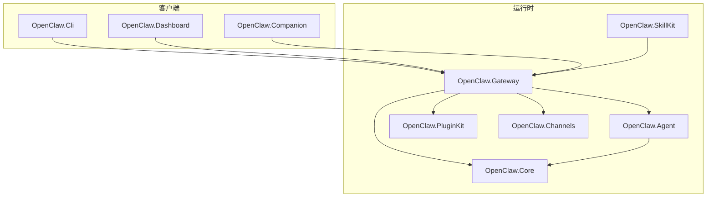
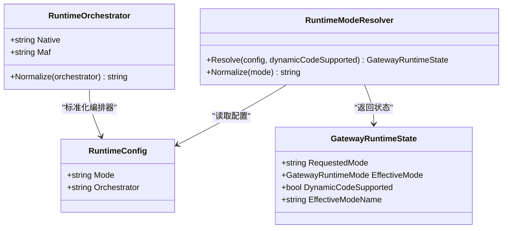
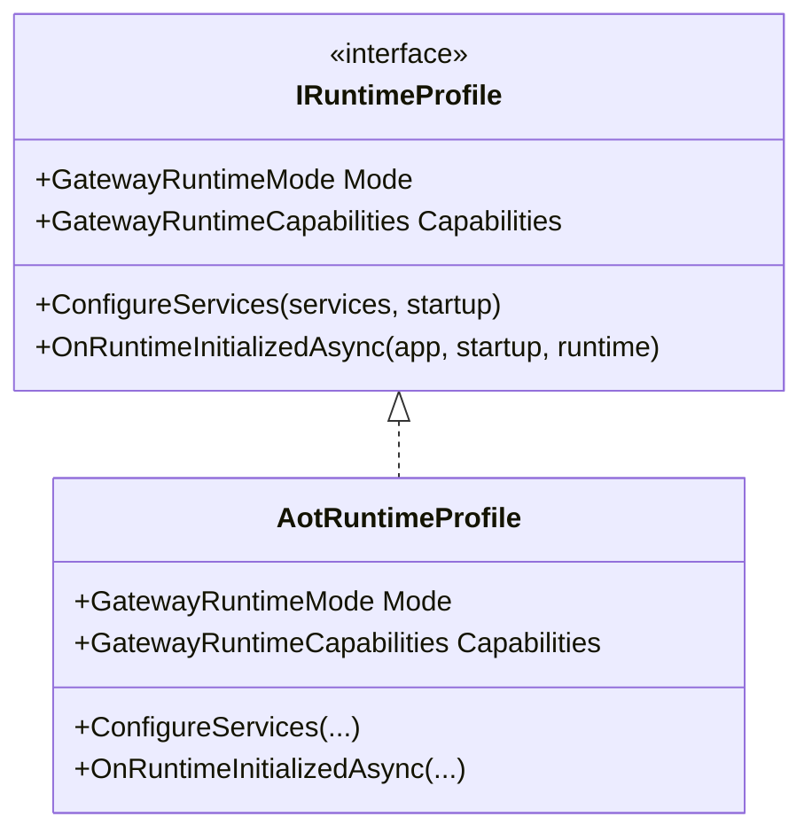
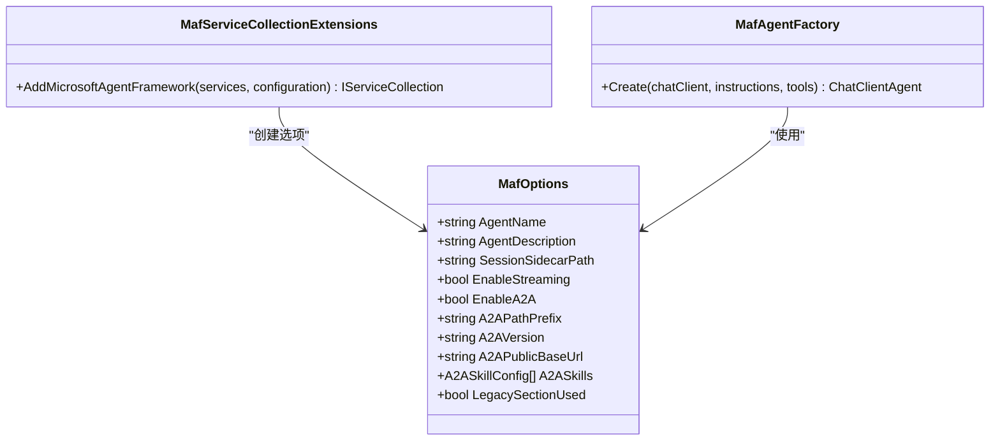
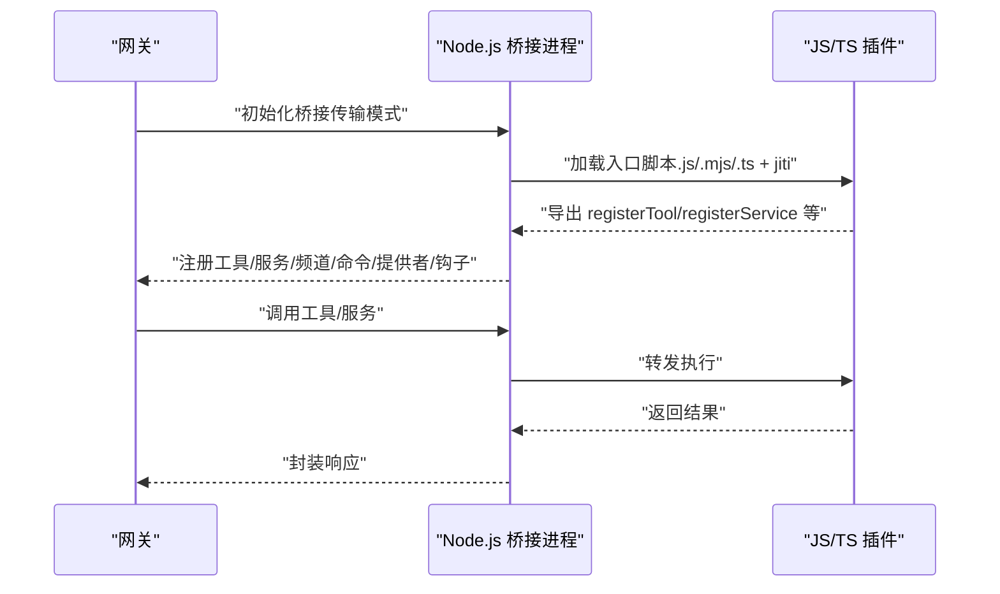
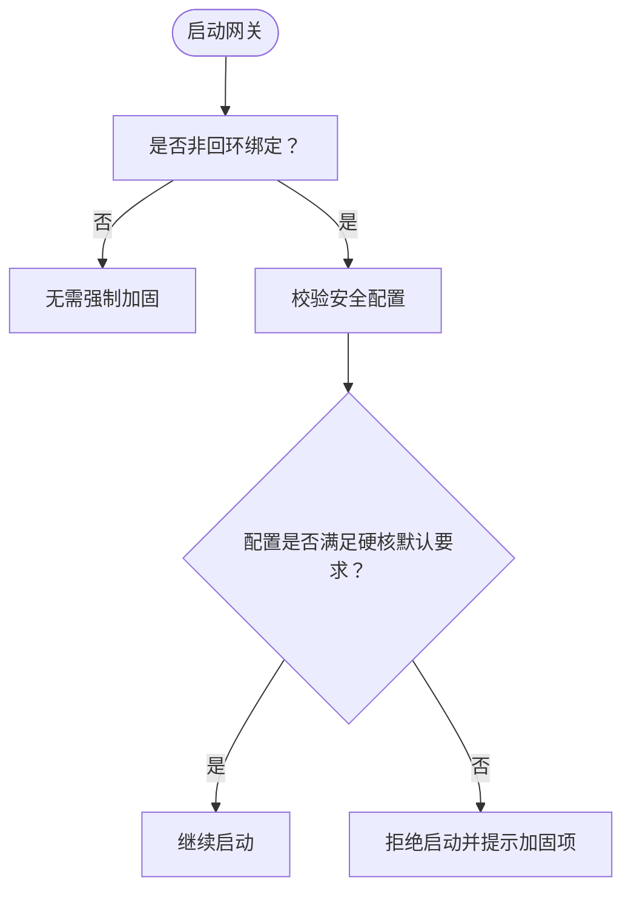
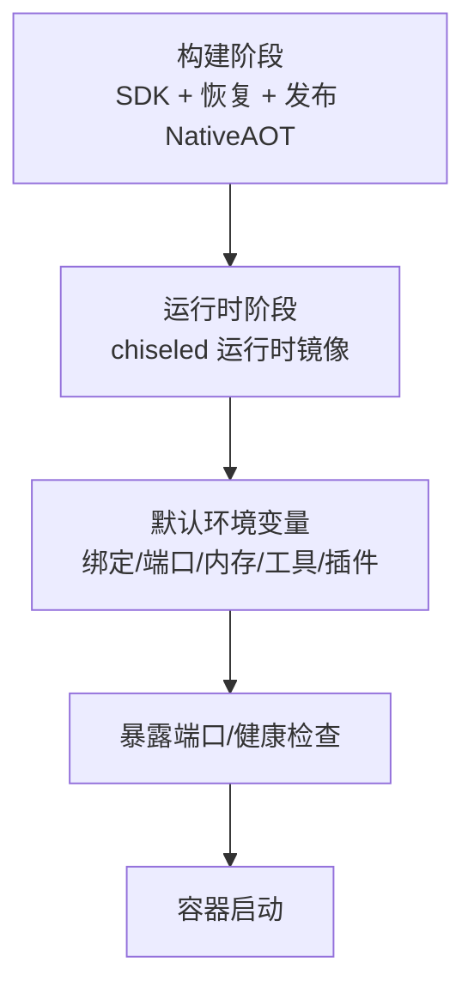
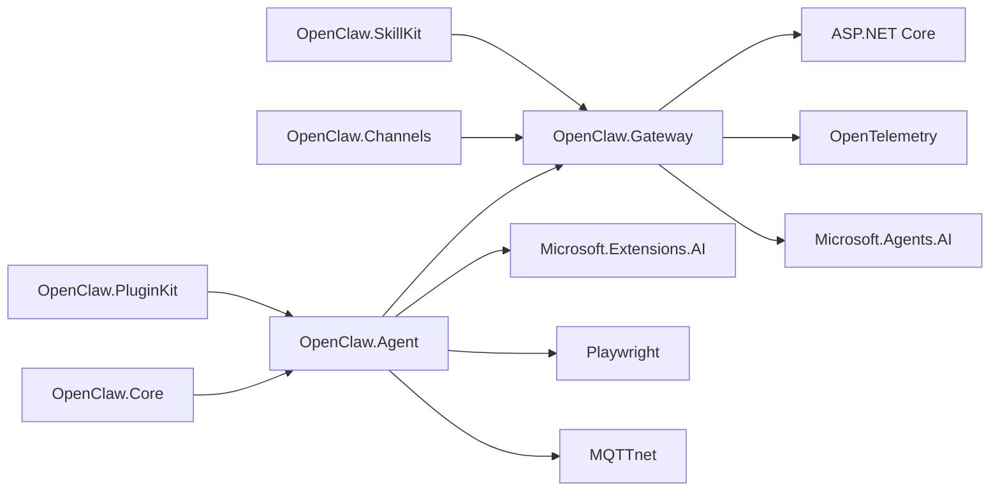

# 项目介绍与愿景

<cite>
**本文引用的文件**
- [README.md](file://README.md)
- [QUICKSTART.md](file://QUICKSTART.md)
- [COMPATIBILITY.md](file://COMPATIBILITY.md)
- [USER_GUIDE.md](file://USER_GUIDE.md)
- [TOOLS_GUIDE.md](file://TOOLS_GUIDE.md)
- [OpenClaw.Agent.csproj](file://src/OpenClaw.Agent/OpenClaw.Agent.csproj)
- [OpenClaw.Gateway.csproj](file://src/OpenClaw.Gateway/OpenClaw.Gateway.csproj)
- [OpenClaw.Core.csproj](file://src/OpenClaw.Core/OpenClaw.Core.csproj)
- [OpenClaw.PluginKit.csproj](file://src/OpenClaw.PluginKit/OpenClaw.PluginKit.csproj)
- [RuntimeModels.cs](file://src/OpenClaw.Core/Models/RuntimeModels.cs)
- [AotRuntimeProfile.cs](file://src/OpenClaw.Gateway/Profiles/AotRuntimeProfile.cs)
- [MafServiceCollectionExtensions.cs](file://src/OpenClaw.Agent/MafServiceCollectionExtensions.cs)
- [MafOptions.cs](file://src/OpenClaw.Agent/MafOptions.cs)
- [MafAgentFactory.cs](file://src/OpenClaw.Agent/MafAgentFactory.cs)
- [Dockerfile](file://Dockerfile)
</cite>

## 目录
1. [引言](#引言)
2. [项目结构](#项目结构)
3. [核心组件](#核心组件)
4. [架构总览](#架构总览)
5. [详细组件分析](#详细组件分析)
6. [依赖关系分析](#依赖关系分析)
7. [性能考量](#性能考量)
8. [故障排查指南](#故障排查指南)
9. [结论](#结论)
10. [附录](#附录)

## 引言
OpenClaw.NET 是一个独立实现的 .NET 代理运行时与网关系统，旨在为现有 .NET 生态系统提供原生、可部署、具备生产级可观测性与安全能力的智能体基础设施。项目的核心价值在于：
- 以 .NET 为第一语言，提供真实可用的 NativeAOT 部署路径，同时保留 JIT 扩展能力；
- 通过 JSON-RPC 桥接复用主流 JavaScript/TypeScript 插件生态，避免重写成本；
- 明确的兼容性矩阵与诊断报告，拒绝“大致兼容”的模糊承诺；
- 可选的 Microsoft Agent Framework（MAF）编排路径，同时保持原生运行时作为默认；
- 提供认证、策略、内存、通道、可观测性与打包部署等面向生产的全套能力。

重要声明：本项目与上游 OpenClaw 无隶属关系，是独立实现，灵感来源于其工作。

**章节来源**
- [README.md:11](file://README.md#L11)
- [README.md:15-27](file://README.md#L15-L27)

## 项目结构
仓库采用多项目分层组织，围绕“网关启动层（Bootstrap/Composition/Profiles/Pipeline）+ 运行时（Gateway + Agent Runtime + 工具/技能/内存）”进行模块化设计。关键目录与职责概览：
- src/OpenClaw.Gateway：ASP.NET Core 网关宿主，负责 HTTP/WebSocket/通道接入、中间件、生命周期与端点组合；
- src/OpenClaw.Agent：代理运行时，包含工具执行、会话管理、技能加载、策略与审批、可观测性适配等；
- src/OpenClaw.Core：核心抽象、模型、验证、安全与内存基元；
- src/OpenClaw.PluginKit：插件抽象与辅助类型；
- src/OpenClaw.Channels：各类消息通道（Telegram、Twilio、WhatsApp、邮件等）；
- src/OpenClaw.Dashboard：Blazor WASM 运营仪表盘；
- src/OpenClaw.Cli：命令行客户端；
- src/OpenClaw.Companion：Avalonia 桌面配套应用；
- src/OpenClaw.SkillKit：技能包生成与校验工具；
- docs：兼容性、迁移、架构、沙箱、专利等文档。



**图表来源**
- [OpenClaw.Gateway.csproj:1-143](file://src/OpenClaw.Gateway/OpenClaw.Gateway.csproj#L1-L143)
- [OpenClaw.Agent.csproj:1-31](file://src/OpenClaw.Agent/OpenClaw.Agent.csproj#L1-L31)
- [OpenClaw.Core.csproj:1-24](file://src/OpenClaw.Core/OpenClaw.Core.csproj#L1-L24)
- [OpenClaw.PluginKit.csproj:1-15](file://src/OpenClaw.PluginKit/OpenClaw.PluginKit.csproj#L1-L15)

**章节来源**
- [README.md:31-39](file://README.md#L31-L39)

## 核心组件
- 网关（Gateway）：统一处理 HTTP/WebSocket/通道入站消息，执行认证、策略与速率限制，并将消息交由代理运行时处理；支持内置 UI、CLI、桌面应用与运营仪表盘。
- 代理运行时（Agent Runtime）：负责“思考-行动”循环（ReAct），工具执行、记忆交互、会话管理、技能加载与治理；在 MAF 启用时可切换到 MAF 编排后端。
- 工具与技能（Tools & Skills）：内置 15+ 原生工具（Shell、文件、浏览器、数据库、日历、Home Assistant、MQTT、Notion 等），以及可复用的 SKILL.md 技能包；通过桥接支持 JS/TS 插件。
- 插件生态（Plugin Ecosystem）：通过 Node.js 桥接复用上游 OpenClaw 插件生态；支持 AOT/JIT 不同兼容面，明确失败诊断。
- 安全与合规（Security & Compliance）：工具审批、路径白名单、禁止路径、只读模式、请求者匹配、公开绑定硬核默认、TLS/反向代理、健康检查与可观测性。
- 部署与打包（Deployment & Packaging）：Docker 多阶段构建、NativeAOT 单文件、chiseled 运行时镜像、多架构发布、CI/CD 自动化。

**章节来源**
- [README.md:58-166](file://README.md#L58-L166)
- [USER_GUIDE.md:5-11](file://USER_GUIDE.md#L5-L11)
- [TOOLS_GUIDE.md:38-192](file://TOOLS_GUIDE.md#L38-L192)

## 架构总览
OpenClaw.NET 将“启动层”与“运行时”解耦，形成清晰的启动流程与运行时职责划分：
- 启动层（Bootstrap/Composition/Profiles/Pipeline）：加载配置、解析运行时模式与编排器、应用加固与诊断、注册服务与中间件；
- 运行时（Gateway + Agent Runtime + 工具/技能/内存）：网关负责接入与治理，代理运行时负责认知循环与工具执行，JS/TS 插件通过桥接运行。

```mermaid
graph TB
Client["客户端<br/>Web/UI/CLI/桌面/通道"] --> GW["网关"]
Webhooks["Telegram/Twilio/WhatsApp/通用Webhook"] --> GW
subgraph "启动层"
BS["Bootstrap<br/>加载配置/解析模式/诊断"]
CM["Composition<br/>注册服务/应用运行时特性"]
PR["Profiles<br/>AOT/JIT 运行时特性集"]
PL["Pipeline/Endpoints<br/>中间件/通道/端点"]
BS --> CM --> PR --> PL
end
subgraph "运行时"
GW <- --> AR["代理运行时"]
AR --> TO["原生工具"]
AR --> ME["内存/会话"]
AR --> BR["Node.js 插件桥接"]
BR --> JS["JS/TS 插件生态"]
end
```

**图表来源**
- [README.md:145-188](file://README.md#L145-L188)

**章节来源**
- [README.md:145-196](file://README.md#L145-L196)

## 详细组件分析

### 运行时模式与编排器选择
- 运行时模式（Runtime.Mode）：aot/jit/auto，自动根据动态代码能力选择；aot 保持裁剪友好与低内存占用，jit 支持更广的桥接与动态插件能力；
- 编排器（Runtime.Orchestrator）：native（默认）或 maf（仅在 MAF 启用产物中支持），MAF 适配器为可选扩展，不影响网关/运行时所有权模型。



**图表来源**
- [RuntimeModels.cs:11-68](file://src/OpenClaw.Core/Models/RuntimeModels.cs#L11-L68)

**章节来源**
- [README.md:58-71](file://README.md#L58-L71)
- [RuntimeModels.cs:29-68](file://src/OpenClaw.Core/Models/RuntimeModels.cs#L29-L68)

### AOT 与 JIT 运行时特性
- AOT 运行时特性集：不支持扩展桥接表面与原生动态插件，聚焦低内存与裁剪友好；
- JIT 运行时特性集：支持 registerChannel/registerCommand/registerProvider/api.on 等动态桥接表面与原生动态插件。



**图表来源**
- [AotRuntimeProfile.cs:7-21](file://src/OpenClaw.Gateway/Profiles/AotRuntimeProfile.cs#L7-L21)

**章节来源**
- [README.md:327-342](file://README.md#L327-L342)
- [COMPATIBILITY.md:11-30](file://COMPATIBILITY.md#L11-L30)

### MAF 编排适配器
- 可选启用，提供与 Microsoft Agent Framework 的集成，保持原生运行时作为默认；
- 通过服务扩展注册 MAF 选项、遥测适配器、会话存储、工厂与运行时工厂。



**图表来源**
- [MafOptions.cs:3-43](file://src/OpenClaw.Agent/MafOptions.cs#L3-L43)
- [MafAgentFactory.cs:8-36](file://src/OpenClaw.Agent/MafAgentFactory.cs#L8-L36)
- [MafServiceCollectionExtensions.cs:7-36](file://src/OpenClaw.Agent/MafServiceCollectionExtensions.cs#L7-L36)

**章节来源**
- [README.md:36](file://README.md#L36)
- [MafServiceCollectionExtensions.cs:9-20](file://src/OpenClaw.Agent/MafServiceCollectionExtensions.cs#L9-L20)

### 插件桥接与生态兼容
- 通过 Node.js 桥接运行 JS/TS 插件，支持工具注册、服务生命周期、频道/命令/提供者注册与事件钩子（JIT 专用）；
- 明确的兼容矩阵与失败诊断，AOT/JIT 下不支持的表面会快速失败并给出明确错误码；
- 支持标准/混合传输（stdio/socket/hybrid），本地 IPC 默认带认证握手。



**图表来源**
- [COMPATIBILITY.md:11-30](file://COMPATIBILITY.md#L11-L30)
- [TOOLS_GUIDE.md:24-35](file://TOOLS_GUIDE.md#L24-L35)

**章节来源**
- [COMPATIBILITY.md:11-30](file://COMPATIBILITY.md#L11-L30)
- [TOOLS_GUIDE.md:24-35](file://TOOLS_GUIDE.md#L24-L35)

### 安全与合规
- 公开绑定默认严格：未显式加固的危险设置（如通配根目录、允许 Shell、启用插件桥、WhatsApp 未校验签名、桥接令牌缺失、raw 密钥引用）将阻止启动；
- 工具审批、只读模式、路径白名单/黑名单、请求者匹配、TLS/反向代理、健康检查与指标端点；
- 通过 /doctor 文本报告与 JSON 报告输出安全与兼容性诊断。



**图表来源**
- [README.md:277-313](file://README.md#L277-L313)

**章节来源**
- [README.md:277-313](file://README.md#L277-L313)

### 部署与打包
- Docker 多阶段构建：SDK 阶段安装 NativeAOT 前置条件并发布单文件二进制，运行时阶段使用 chiseled 运行时镜像，暴露健康检查；
- 多架构镜像发布，支持 GHCR/AWS ECR 等注册表；
- 本地快速启动与配置文件方式，支持环境变量注入。



**图表来源**
- [Dockerfile:1-59](file://Dockerfile#L1-L59)

**章节来源**
- [README.md:405-516](file://README.md#L405-L516)
- [Dockerfile:1-59](file://Dockerfile#L1-L59)

## 依赖关系分析
- 项目采用多项目引用与 NuGet 包结合的方式，核心库（Core/PluginKit）被网关与代理共享；
- 网关依赖 ASP.NET Core、OpenTelemetry、Microsoft.Agents.AI 等用于托管、可观测性与可选 MAF 集成；
- 代理依赖 Playwright、MQTT、AI 抽象与 A2A 组件，承载工具与会话能力；
- 插件生态通过 Node.js 桥接与 JS/TS 插件交互，桥接进程与网关进程通过本地 IPC 通信。



**图表来源**
- [OpenClaw.Gateway.csproj:26-47](file://src/OpenClaw.Gateway/OpenClaw.Gateway.csproj#L26-L47)
- [OpenClaw.Agent.csproj:10-26](file://src/OpenClaw.Agent/OpenClaw.Agent.csproj#L10-L26)
- [OpenClaw.Core.csproj:10-23](file://src/OpenClaw.Core/OpenClaw.Core.csproj#L10-L23)
- [OpenClaw.PluginKit.csproj:9-13](file://src/OpenClaw.PluginKit/OpenClaw.PluginKit.csproj#L9-L13)

**章节来源**
- [OpenClaw.Gateway.csproj:26-47](file://src/OpenClaw.Gateway/OpenClaw.Gateway.csproj#L26-L47)
- [OpenClaw.Agent.csproj:10-26](file://src/OpenClaw.Agent/OpenClaw.Agent.csproj#L10-L26)

## 性能考量
- NativeAOT 单文件发布，裁剪与体积优化，适合边缘与容器部署；
- 桥接 IPC 调用带来额外延迟，建议优先使用原生工具；对高吞吐场景可考虑桥接传输优化；
- 内存与会话持久化、保留清理与压缩阈值需结合业务规模调整；
- 观测性（指标、追踪、日志）有助于定位瓶颈与异常。

[本节为通用指导，无需列出具体文件来源]

## 故障排查指南
- 使用 /doctor 与 /doctor/text 获取诊断报告，覆盖安全姿态、通道、插件、内存与技能状态；
- 公开绑定前务必执行 --doctor 或 /doctor/text，确保满足硬核默认要求；
- 插件加载失败时查看兼容矩阵与错误码，确认运行时模式与桥接能力；
- 工具审批与只读模式导致的拒绝，可通过审批接口或调整配置解决；
- TLS/反向代理与 CORS/Origin 限制问题，检查 Allow* 配置与代理头信任设置。

**章节来源**
- [README.md:353-358](file://README.md#L353-L358)
- [COMPATIBILITY.md:96-131](file://COMPATIBILITY.md#L96-L131)
- [USER_GUIDE.md:352-358](file://USER_GUIDE.md#L352-L358)

## 结论
OpenClaw.NET 以 .NET 原生实现与 NativeAOT 部署为核心，兼顾生产级安全、可观测性与生态兼容性，提供清晰的运行时模式与编排器选择，既可满足轻量自包含部署，也可在需要时启用更广的桥接与动态能力。项目强调独立实现与明确兼容性，帮助 .NET 团队在不重构现有基础设施的前提下，快速构建可运维的智能体系统。

[本节为总结性内容，无需列出具体文件来源]

## 附录

### 技术愿景与定位
- .NET 原生实现：以 .NET 为第一语言，复用现有 .NET 生态与基础设施；
- NativeAOT 部署路径：单文件、裁剪、小体积，适合容器与边缘部署；
- JavaScript 插件生态兼容：通过桥接复用上游生态，避免重写成本；
- 可选 MAF 编排：在 MAF 启用产物中提供可替换的编排后端，保持原生运行时默认；
- 生产导向：认证、策略、内存、通道、可观测性与打包部署一体化。

**章节来源**
- [README.md:9](file://README.md#L9)
- [README.md:21-25](file://README.md#L21-L25)

### 目标用户与适用场景
- 目标用户：希望在 .NET 生态中引入智能体能力的团队与个人开发者；
- 场景示例：自动化运维与开发辅助、企业内运营助理、跨渠道消息处理、本地化 AI 应用与微服务集成。

**章节来源**
- [README.md:9](file://README.md#L9)