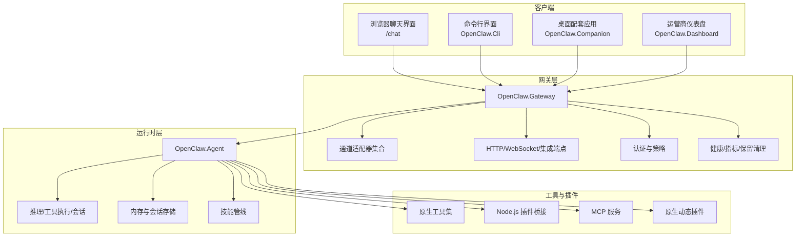
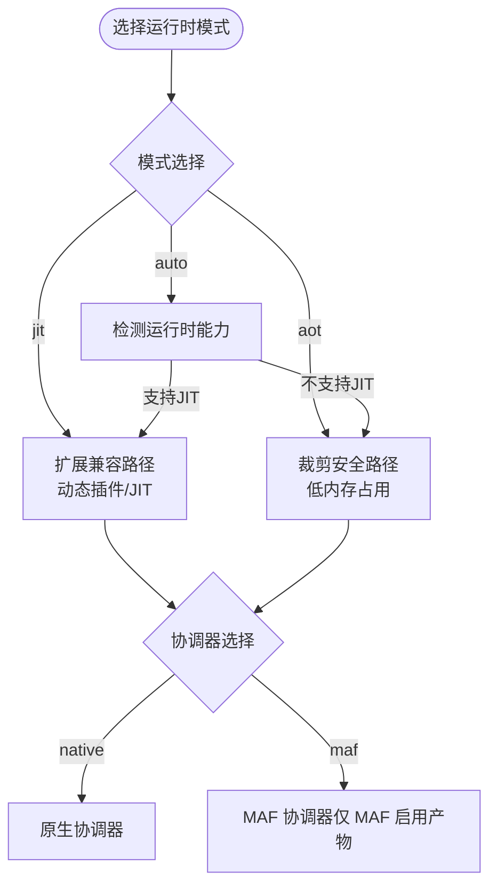
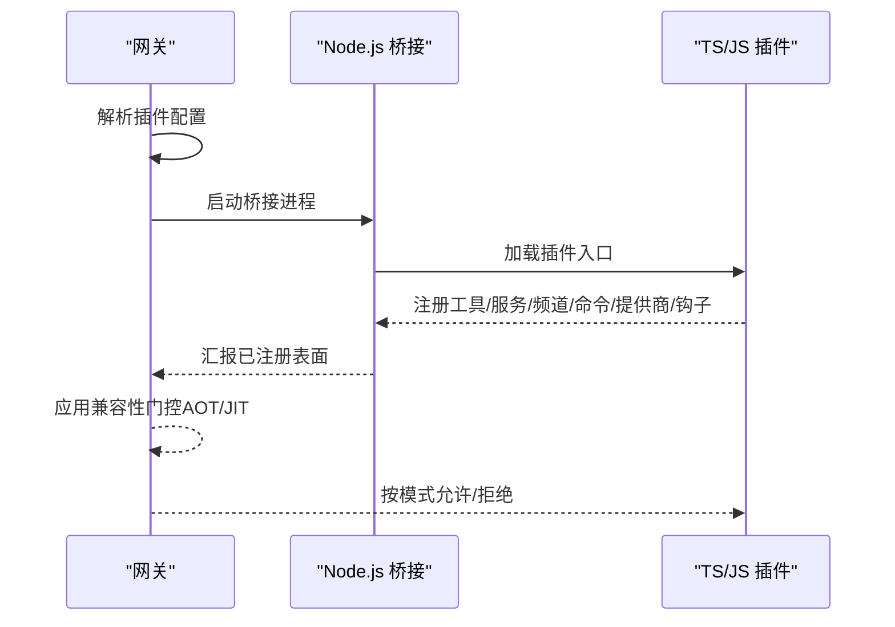
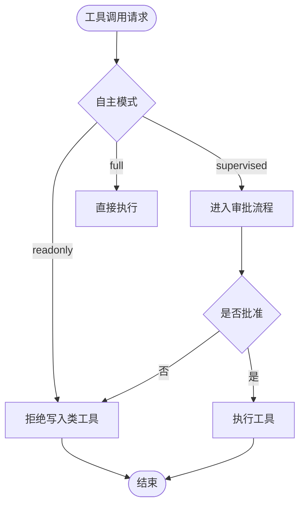
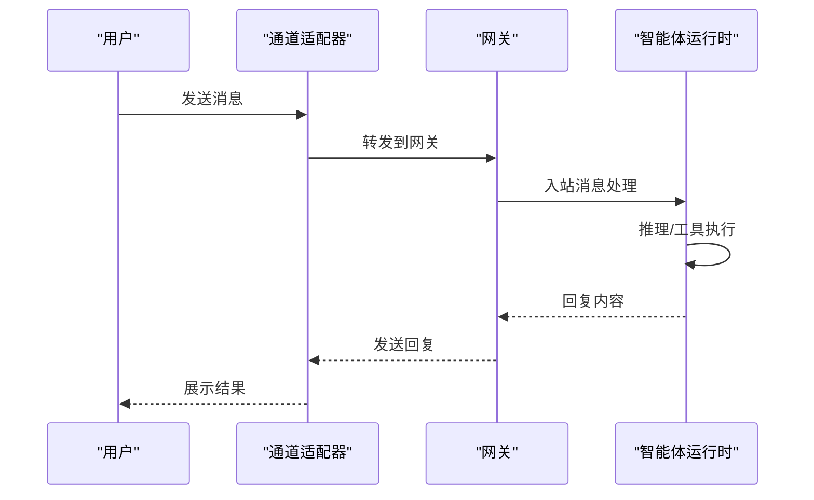
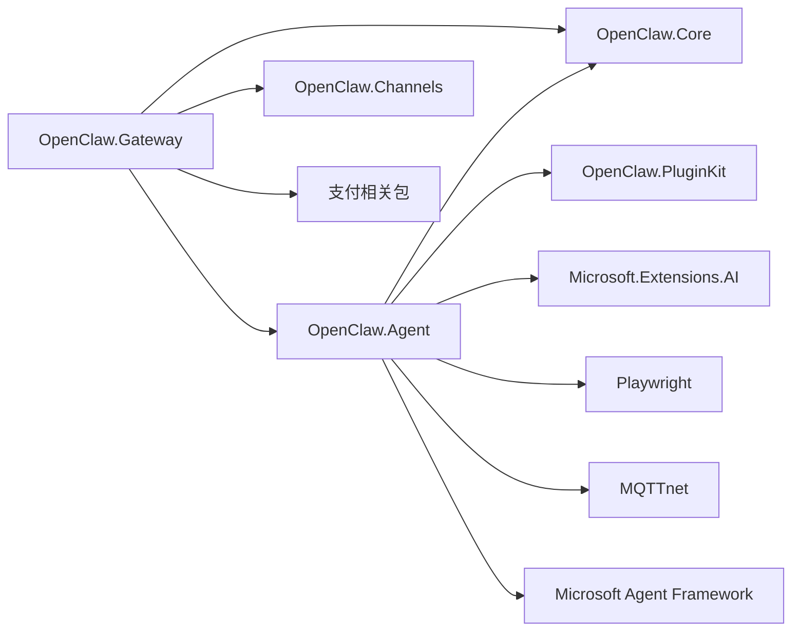

# 项目概述

<cite>
**本文引用的文件**
- [README.md](file://README.md)
- [QUICKSTART.md](file://QUICKSTART.md)
- [USER_GUIDE.md](file://docs/USER_GUIDE.md)
- [COMPATIBILITY.md](file://docs/COMPATIBILITY.md)
- [TOOLS_GUIDE.md](file://docs/TOOLS_GUIDE.md)
- [TEAMS_SETUP.md](file://docs/TEAMS_SETUP.md)
- [OpenClaw.Agent.csproj](file://src/OpenClaw.Agent/OpenClaw.Agent.csproj)
- [OpenClaw.Gateway.csproj](file://src/OpenClaw.Gateway/OpenClaw.Gateway.csproj)
- [OpenClaw.Core.csproj](file://src/OpenClaw.Core/OpenClaw.Core.csproj)
- [OpenClaw.PluginKit.csproj](file://src/OpenClaw.PluginKit/OpenClaw.PluginKit.csproj)
- [appsettings.json](file://src/OpenClaw.Gateway/appsettings.json)
- [appsettings.Production.json](file://src/OpenClaw.Gateway/appsettings.Production.json)
</cite>

## 目录
1. [引言](#引言)
2. [项目结构](#项目结构)
3. [核心组件](#核心组件)
4. [架构总览](#架构总览)
5. [详细组件分析](#详细组件分析)
6. [依赖关系分析](#依赖关系分析)
7. [性能考量](#性能考量)
8. [故障排查指南](#故障排查指南)
9. [结论](#结论)
10. [附录](#附录)

## 引言
OpenClaw.NET 是一个独立于上游 OpenClaw 的 .NET 实现，专注于在 .NET 生态中提供可部署、具备 NativeAOT 友好性的智能体运行时与网关。其核心价值主张包括：
- .NET 首选的网关与智能体运行时，具备真实的 NativeAOT 部署路径
- 通过 JSON-RPC 桥接复用 OpenClaw JS/TS 插件生态，避免重写成本
- 明确的兼容性诊断，拒绝“大致兼容”的模糊承诺
- 在 MAF 启用产物中提供可选的 Microsoft Agent Framework 协调器路径，同时保持原生运行时作为默认
- 提供面向生产的基础设施：认证、策略、内存、通道、可观测性与打包部署目标

项目愿景是成为 .NET 场景下可生产部署的智能体平台，既支持本地开发与自动化脚本，也能满足企业级安全与合规要求。

## 项目结构
仓库采用按功能域分层的项目组织方式，核心模块包括：
- 网关层：负责 HTTP/WebSocket/网页端、Webhook、认证、策略与可观测性等
- 运行时层：负责推理、工具执行、内存交互与技能加载
- 工具与插件：内置原生工具、桥接 JS/TS 插件与可选的原生动态插件
- 客户端与仪表盘：浏览器聊天界面、CLI、桌面配套应用与 Blazor 运营商仪表盘
- 核心库与插件工具包：抽象、模型、验证、安全、内存与插件开发辅助



图表来源
- [README.md:145-188](file://README.md#L145-L188)
- [OpenClaw.Gateway.csproj:1-143](file://src/OpenClaw.Gateway/OpenClaw.Gateway.csproj#L1-L143)
- [OpenClaw.Agent.csproj:1-31](file://src/OpenClaw.Agent/OpenClaw.Agent.csproj#L1-L31)

章节来源
- [README.md:31-40](file://README.md#L31-L40)
- [OpenClaw.Gateway.csproj:1-143](file://src/OpenClaw.Gateway/OpenClaw.Gateway.csproj#L1-L143)
- [OpenClaw.Agent.csproj:1-31](file://src/OpenClaw.Agent/OpenClaw.Agent.csproj#L1-L31)

## 核心组件
- 网关（Gateway）
  - 承担 HTTP/WebSocket/网页端、Webhook、认证、策略与可观测性职责
  - 支持多种通道适配器（Telegram、Twilio SMS、WhatsApp、Teams、Slack、Discord、Signal、飞书、企业微信等）
  - 内置健康检查、指标导出与内存保留清理能力
- 智能体运行时（Agent）
  - 负责 ReAct 推理循环、工具执行、内存交互与技能加载
  - 原生工具在进程中执行；JS/TS 插件通过 Node.js 桥接；可选 MAF 协调器
- 工具系统
  - 原生工具：Shell、文件读写、浏览器、邮件、Git、数据库、Notion、Home Assistant、MQTT、图像生成、PDF阅读、日历、代码执行、Inbox Zero 等
  - 桥接工具：通过 Node.js 桥接社区 TS/JS 插件
  - MCP 服务：提供标准化的工具与资源访问接口
- 插件生态
  - 兼容矩阵明确区分 AOT 与 JIT 两种运行时模式下的能力范围
  - 支持原生动态插件（JIT 模式）
- 客户端与仪表盘
  - 浏览器聊天界面、CLI、桌面配套应用与 Blazor 运营商仪表盘

章节来源
- [README.md:31-40](file://README.md#L31-L40)
- [USER_GUIDE.md:5-11](file://docs/USER_GUIDE.md#L5-L11)
- [TOOLS_GUIDE.md:38-86](file://docs/TOOLS_GUIDE.md#L38-L86)
- [COMPATIBILITY.md:11-30](file://docs/COMPATIBILITY.md#L11-L30)

## 架构总览
OpenClaw.NET 将网关启动与运行时组合拆分为显式的分层：
- 启动层：Bootstrap 加载配置、解析运行时模式与协调器、应用校验与加固、处理早期退出（如 doctor）
- 组合层：注册服务并应用有效运行时车道（AOT 用于裁剪安全部署，JIT 用于扩展兼容性）
- 管线层：挂载中间件、通道启动、工作线程、关闭处理与聚合 HTTP/WebSocket 表面

运行时流：
- 网关处理 HTTP/WebSocket/webhook、认证、策略与可观测性
- 智能体运行时负责推理、工具执行、内存交互与技能加载
- 原生工具进程内执行；JS/TS 插件通过 Node.js 桥接；可选 MAF 适配器替换协调策略但不改变网关/运行时所有权模型

```mermaid
graph TB
Client["客户端/通道"] --> Gateway["网关"]
Webhooks["Telegram/Twilio/WhatsApp/通用 Webhooks"] --> Gateway
subgraph "启动层"
Bootstrap["Bootstrap"]
Composition["Composition"]
Profiles["运行时配置文件"]
Pipeline["管道+端点"]
Bootstrap --> Composition --> Profiles --> Pipeline
end
subgraph "运行时"
Gateway < --> Agent["智能体运行时"]
Agent < --> Tools["原生工具"]
Agent < --> Memory["内存+会话"]
Agent < --> LLM["LLM 提供商"]
Agent < --> Bridge["Node.js 插件桥接"]
Bridge < --> JSPlugins["TS/JS 插件"]
end
```

图表来源
- [README.md:147-188](file://README.md#L147-L188)

章节来源
- [README.md:145-196](file://README.md#L145-L196)

## 详细组件分析

### 运行时模式与协调器
- 运行时模式
  - aot：裁剪安全、低内存路径
  - jit：启用更广泛的桥接表面与原生动态插件
  - auto：根据运行时能力自动选择 aot 或 jit
- 协调器
  - MAF 仅在 MAF 启用产物中可用；native 始终为默认协调器



图表来源
- [README.md:58-71](file://README.md#L58-L71)
- [README.md:444-463](file://README.md#L444-L463)

章节来源
- [README.md:58-71](file://README.md#L58-L71)
- [README.md:444-463](file://README.md#L444-L463)

### 插件桥接与兼容性矩阵
- AOT 模式支持：registerTool/registerService、插件打包技能、受支持清单/配置子集
- JIT 模式支持：registerChannel/registerCommand/registerProvider/api.on(...)、原生动态插件
- 不支持：registerGatewayMethod/registerCli，或在 AOT 中使用 JIT 专属能力时，将快速失败并给出明确诊断



图表来源
- [COMPATIBILITY.md:11-30](file://docs/COMPATIBILITY.md#L11-L30)
- [README.md:325-342](file://README.md#L325-L342)

章节来源
- [COMPATIBILITY.md:11-30](file://docs/COMPATIBILITY.md#L11-L30)
- [README.md:325-342](file://README.md#L325-L342)

### 工具系统与安全模型
- 原生工具覆盖 Shell、文件系统、浏览器、邮件、Git、数据库、Notion、Home Assistant、MQTT、图像生成、PDF、日历、代码执行、Inbox Zero 等
- 安全模型：只读模式、审批模式、路径限制、禁止路径、工作区隔离、工具超时、并行执行控制
- 自动化模式：readonly（只读）、supervised（监督）、full（完整）



图表来源
- [TOOLS_GUIDE.md:202-237](file://docs/TOOLS_GUIDE.md#L202-L237)
- [TOOLS_GUIDE.md:327-339](file://docs/TOOLS_GUIDE.md#L327-L339)

章节来源
- [TOOLS_GUIDE.md:38-86](file://docs/TOOLS_GUIDE.md#L38-L86)
- [TOOLS_GUIDE.md:202-237](file://docs/TOOLS_GUIDE.md#L202-L237)
- [TOOLS_GUIDE.md:327-339](file://docs/TOOLS_GUIDE.md#L327-L339)

### 多渠道通信
- 通道适配器：Telegram、Twilio SMS、WhatsApp（官方云 API/自定义桥接）、Microsoft Teams、Slack、Discord、Signal、飞书、企业微信
- 访问控制：DM 策略（开放/配对/封闭）、群组策略（开放/白名单/禁用）、提及要求、允许域/租户/对话/团队/用户/群组白名单
- Teams 设置：Azure Bot 创建、消息端点配置、应用包上传与权限授权



图表来源
- [TEAMS_SETUP.md:141-161](file://docs/TEAMS_SETUP.md#L141-L161)
- [README.md:344-392](file://README.md#L344-L392)

章节来源
- [TEAMS_SETUP.md:1-205](file://docs/TEAMS_SETUP.md#L1-L205)
- [README.md:344-392](file://README.md#L344-L392)

### 企业级特性
- 认证与策略：Bearer Token、查询字符串 Token（非 loopback 时可选）、跨域白名单、反向代理信任、OIDC 集成
- 安全加固：非 loopback 绑定时的安全检查开关、工具路径限制、插件桥接开关、原始密钥引用开关
- 观测性：健康检查、指标导出、内存保留清理、保留策略配置、日志级别控制
- 生产部署：Docker 多架构镜像、反向代理（Caddy/nginx/Kestrel HTTPS）、TLS 配置、连接数与速率限制

章节来源
- [README.md:277-324](file://README.md#L277-L324)
- [README.md:517-618](file://README.md#L517-L618)
- [appsettings.Production.json:1-65](file://src/OpenClaw.Gateway/appsettings.Production.json#L1-L65)

## 依赖关系分析
- 技术栈选择
  - .NET 10 + ASP.NET Core Web（网关）
  - Microsoft.Extensions.AI 与各提供商适配（OpenAI、Azure OpenAI、Ollama、Anthropic、Gemini、Groq 等）
  - Microsoft Agent Framework（可选 MAF 后端）
  - Playwright（浏览器工具）
  - MQTTnet（MQTT 工具）
  - OpenTelemetry（可观测性）
- 项目间依赖
  - OpenClaw.Gateway 依赖 OpenClaw.Core、OpenClaw.Agent、OpenClaw.Channels、支付相关包与插件包
  - OpenClaw.Agent 依赖 OpenClaw.Core、OpenClaw.PluginKit、Microsoft.Extensions.AI、Playwright、MQTTnet、MAF 相关包
  - OpenClaw.Core 与 OpenClaw.PluginKit 提供抽象与插件开发基础



图表来源
- [OpenClaw.Gateway.csproj:22-47](file://src/OpenClaw.Gateway/OpenClaw.Gateway.csproj#L22-L47)
- [OpenClaw.Agent.csproj:6-26](file://src/OpenClaw.Agent/OpenClaw.Agent.csproj#L6-L26)
- [OpenClaw.Core.csproj:1-24](file://src/OpenClaw.Core/OpenClaw.Core.csproj#L1-L24)
- [OpenClaw.PluginKit.csproj:1-15](file://src/OpenClaw.PluginKit/OpenClaw.PluginKit.csproj#L1-L15)

章节来源
- [OpenClaw.Gateway.csproj:22-47](file://src/OpenClaw.Gateway/OpenClaw.Gateway.csproj#L22-L47)
- [OpenClaw.Agent.csproj:6-26](file://src/OpenClaw.Agent/OpenClaw.Agent.csproj#L6-L26)
- [OpenClaw.Core.csproj:1-24](file://src/OpenClaw.Core/OpenClaw.Core.csproj#L1-L24)
- [OpenClaw.PluginKit.csproj:1-15](file://src/OpenClaw.PluginKit/OpenClaw.PluginKit.csproj#L1-L15)

## 性能考量
- NativeAOT 部署
  - 通过裁剪与优化减少二进制体积与内存占用，适合边缘与容器环境
  - 关闭堆栈跟踪、调试支持与事件源支持以进一步减小体积
- 工具执行
  - 并行工具执行与超时控制，避免阻塞与资源耗尽
  - 沙箱执行高风险工具（可选 OpenSandbox），降低主机暴露面
- 观测性
  - OpenTelemetry 集成提供指标与追踪，便于性能监控与问题定位

章节来源
- [OpenClaw.Gateway.csproj:9-20](file://src/OpenClaw.Gateway/OpenClaw.Gateway.csproj#L9-L20)
- [README.md:72-124](file://README.md#L72-L124)
- [README.md:619-650](file://README.md#L619-L650)

## 故障排查指南
- 快速诊断
  - 使用 doctor 模式检查配置与兼容性：`dotnet run --project src/OpenClaw.Gateway -c Release -- --doctor`
  - 查看 /doctor 与 /doctor/text 获取安全姿态、通道与插件诊断报告
- 常见问题
  - 非 loopback 绑定未设置认证令牌：需设置 OPENCLAW_AUTH_TOKEN 并在网关中配置
  - 工具路径限制导致执行失败：调整 AllowedReadRoots/AllowedWriteRoots 或启用审批
  - 插件桥接失败：确认 Node.js 版本、jiti 存在、插件清单与配置符合支持子集
  - Teams 渠道无响应：检查消息端点、应用安装与权限、提及要求与缓存刷新

章节来源
- [QUICKSTART.md:41-45](file://QUICKSTART.md#L41-L45)
- [USER_GUIDE.md:352-358](file://docs/USER_GUIDE.md#L352-L358)
- [README.md:277-324](file://README.md#L277-L324)
- [COMPATIBILITY.md:96-131](file://docs/COMPATIBILITY.md#L96-L131)

## 结论
OpenClaw.NET 以 .NET 为核心，结合 NativeAOT 与可选 MAF 协调器，提供了从本地开发到企业级生产的完整智能体平台。其明确的兼容性矩阵、强大的工具系统、丰富的通道适配与可观测性，使其在 .NET 生态中具备独特的部署与运维优势。对于希望在现有 .NET 基础设施上快速落地智能体能力、同时保持高性能与安全性的团队，OpenClaw.NET 是一个值得考虑的选择。

## 附录

### 快速开始指南
- 本地启动
  - 设置模型密钥与可选工作区目录
  - 选择运行时模式（aot/jit/auto）
  - 使用 doctor 检查配置
  - 启动网关并使用浏览器聊天界面、CLI 或桌面配套应用
- Docker 部署
  - 构建多架构镜像并推送至镜像仓库
  - 使用 docker compose 启动网关与可选 TLS（Caddy）
  - 挂载持久化卷保存会话历史与工作区

章节来源
- [QUICKSTART.md:10-58](file://QUICKSTART.md#L10-L58)
- [README.md:198-224](file://README.md#L198-L224)
- [README.md:405-442](file://README.md#L405-L442)

### 配置参考
- 网关配置
  - 绑定地址与端口、认证令牌、运行时模式与协调器、LLM 提供商与模型、内存后端与保留策略、安全策略、WebSocket 参数、工具与插件配置
- 生产配置
  - 默认绑定到 0.0.0.0，禁用插件、收紧工具路径、启用反向代理信任、设置日志级别

章节来源
- [appsettings.json:1-908](file://src/OpenClaw.Gateway/appsettings.json#L1-L908)
- [appsettings.Production.json:1-65](file://src/OpenClaw.Gateway/appsettings.Production.json#L1-L65)