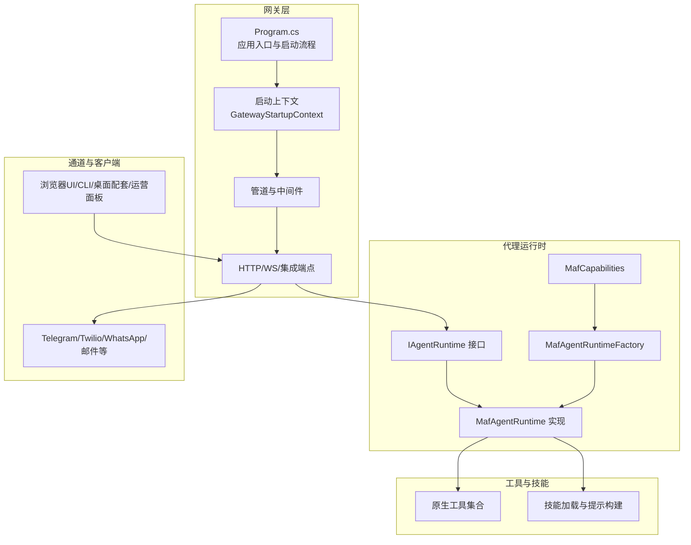
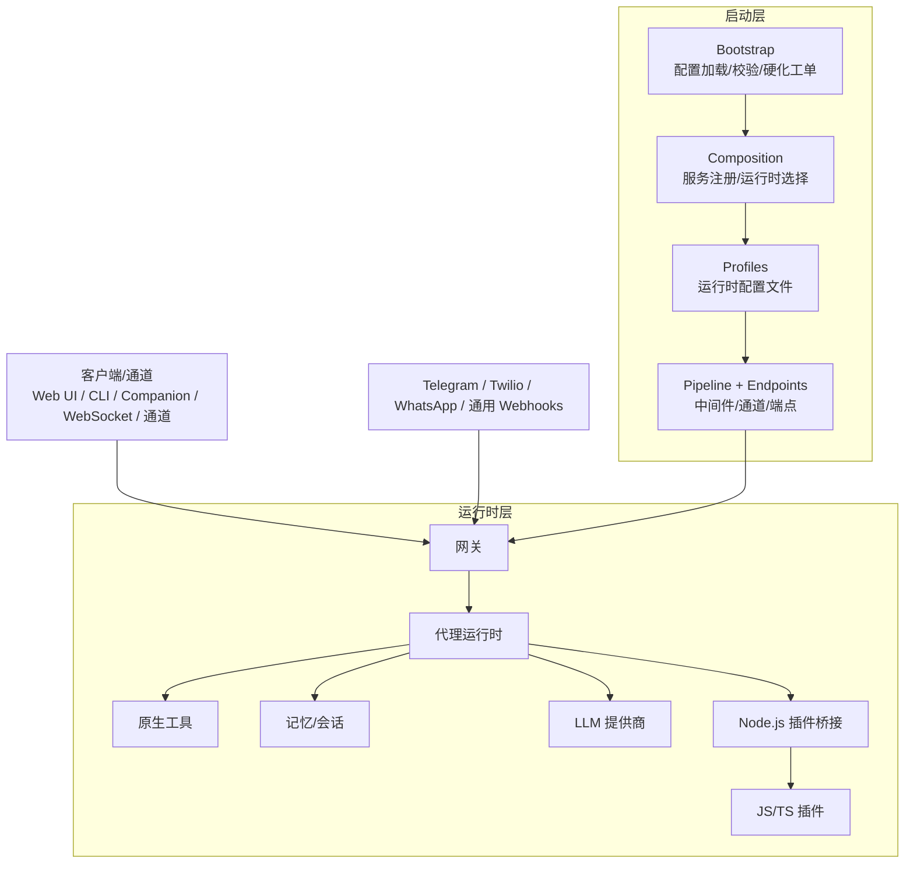
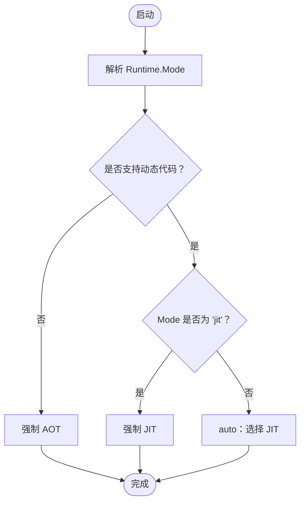
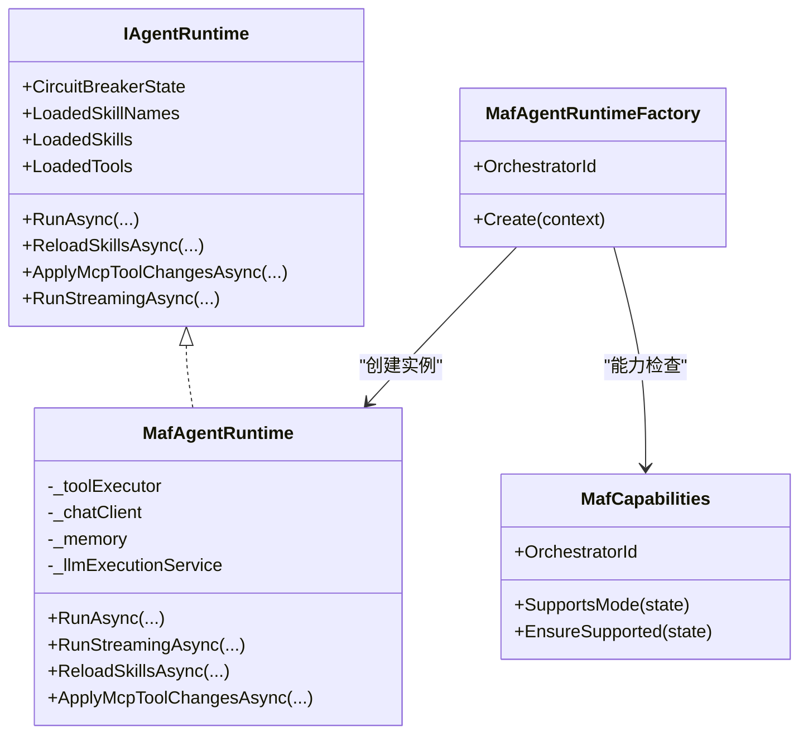
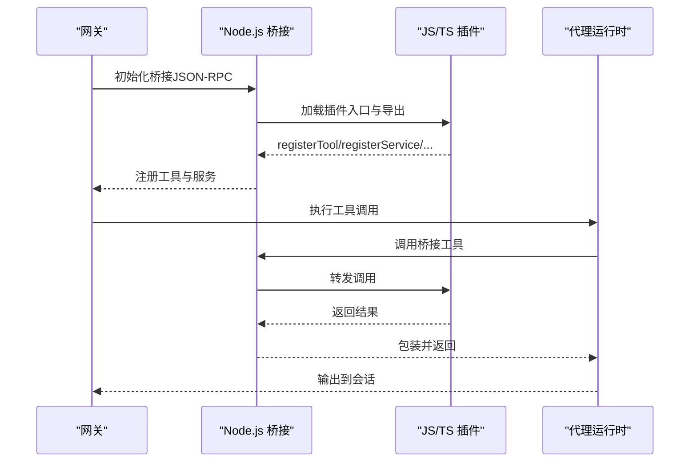
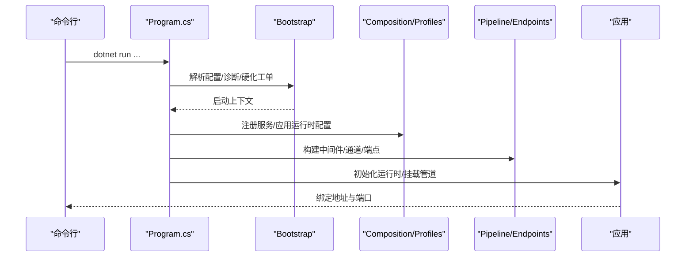
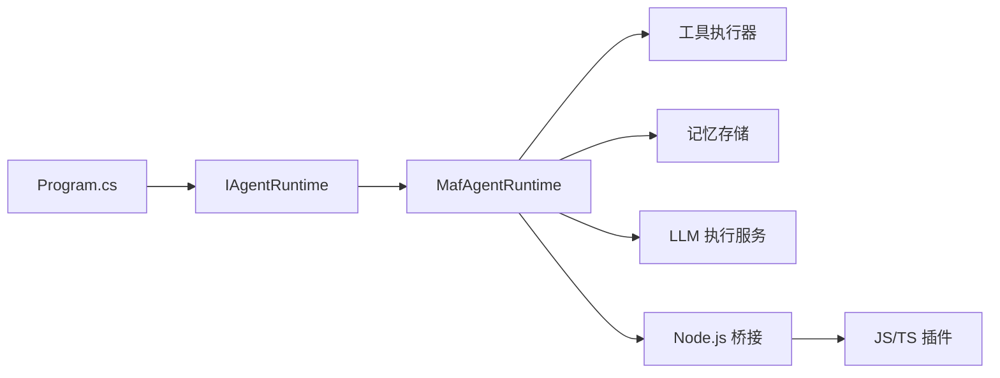

# 项目概述

<cite>
**本文档引用的文件**
- [README.md](file://README.md)
- [QUICKSTART.md](file://QUICKSTART.md)
- [USER_GUIDE.md](file://USER_GUIDE.md)
- [COMPATIBILITY.md](file://COMPATIBILITY.md)
- [docs/COMPATIBILITY.md](file://docs/COMPATIBILITY.md)
- [src/OpenClaw.Gateway/Program.cs](file://src/OpenClaw.Gateway/Program.cs)
- [src/OpenClaw.Agent/MafAgentRuntime.cs](file://src/OpenClaw.Agent/MafAgentRuntime.cs)
- [src/OpenClaw.Agent/IAgentRuntime.cs](file://src/OpenClaw.Agent/IAgentRuntime.cs)
- [src/OpenClaw.Agent/MafAgentRuntimeFactory.cs](file://src/OpenClaw.Agent/MafAgentRuntimeFactory.cs)
- [src/OpenClaw.Core/Models/RuntimeModels.cs](file://src/OpenClaw.Core/Models/RuntimeModels.cs)
- [src/OpenClaw.Agent/MafCapabilities.cs](file://src/OpenClaw.Agent/MafCapabilities.cs)
- [src/OpenClaw.Gateway/Bootstrap/GatewayStartupContext.cs](file://src/OpenClaw.Gateway/Bootstrap/GatewayStartupContext.cs)
</cite>

## 目录
1. [引言](#引言)
2. [项目结构](#项目结构)
3. [核心组件](#核心组件)
4. [架构总览](#架构总览)
5. [详细组件分析](#详细组件分析)
6. [依赖关系分析](#依赖关系分析)
7. [性能考虑](#性能考虑)
8. [故障排查指南](#故障排查指南)
9. [结论](#结论)

## 引言
OpenClaw.NET 是一个独立实现的 .NET 代理运行时与网关，面向在 .NET 生态中部署可移植、可生产化的 AI 代理基础设施。其核心目标是：
- 提供 .NET 原生的网关与代理运行时，支持 NativeAOT 的轻量部署路径
- 通过 JSON-RPC 桥接复用主流 JavaScript/TypeScript 插件生态，避免重写
- 明确的兼容性诊断与失败模式，而非“大致兼容”的模糊承诺
- 可选的 Microsoft Agent Framework（MAF）编排路径，同时保持原生运行时作为默认
- 覆盖认证、策略、内存、通道、可观测性与打包部署的一体化能力

与传统 Python/Node.js 代理栈相比，OpenClaw.NET 的关键差异在于：
- 在 .NET 中原生实现推理循环、工具执行、会话与记忆管理
- 以网关为中心的统一接入层，支持 HTTP、WebSocket、Webhook、浏览器 UI、CLI 等多表面
- 通过桥接复用上游生态插件，同时在 AOT/JIT 两种运行时模式下提供明确的能力边界

## 项目结构
项目采用模块化分层组织，核心模块包括：
- 网关层：负责启动、配置解析、中间件、通道与端点映射
- 代理运行时：负责推理、工具执行、技能加载、会话与记忆交互
- 工具系统：内置多种原生工具，并通过桥接支持 JS/TS 插件工具
- 通道适配器：Telegram、Twilio、WhatsApp、邮件等
- 客户端与仪表盘：浏览器 UI、CLI、桌面配套应用、Blazor 运营面板
- 兼容性与测试：桥接与原生动态插件的兼容矩阵与自动化验证

**图表来源**
- [src/OpenClaw.Gateway/Program.cs:1-124](file://src/OpenClaw.Gateway/Program.cs#L1-L124)
- [src/OpenClaw.Gateway/Bootstrap/GatewayStartupContext.cs:1-15](file://src/OpenClaw.Gateway/Bootstrap/GatewayStartupContext.cs#L1-L15)
- [src/OpenClaw.Agent/IAgentRuntime.cs:1-51](file://src/OpenClaw.Agent/IAgentRuntime.cs#L1-L51)
- [src/OpenClaw.Agent/MafAgentRuntime.cs:1-1184](file://src/OpenClaw.Agent/MafAgentRuntime.cs#L1-L1184)
- [src/OpenClaw.Agent/MafAgentRuntimeFactory.cs:1-166](file://src/OpenClaw.Agent/MafAgentRuntimeFactory.cs#L1-L166)
- [src/OpenClaw.Agent/MafCapabilities.cs:1-17](file://src/OpenClaw.Agent/MafCapabilities.cs#L1-L17)

**章节来源**
- [README.md:145-197](file://README.md#L145-L197)
- [src/OpenClaw.Gateway/Program.cs:1-124](file://src/OpenClaw.Gateway/Program.cs#L1-L124)

## 核心组件
- 网关（Gateway）
  - 启动与配置：解析环境变量与配置文件，应用安全加固与诊断
  - 中间件与管道：认证、限流、速率限制、可观测性埋点
  - 端点与通道：HTTP、WebSocket、Webhook、MCP、A2A 等
- 代理运行时（Agent Runtime）
  - 推理循环：基于系统提示、技能、记忆与工具的 ReAct 循环
  - 工具执行：原生工具与桥接工具统一调度
  - 会话与记忆：历史截断、压缩、召回与持久化
- 工具系统（Tools）
  - 原生工具：文件读写、Shell、浏览器、Git、数据库、MQTT、Notion、Home Assistant 等
  - 桥接工具：通过 Node.js 桥接复用 JS/TS 插件生态
- 通道与客户端（Channels & Clients）
  - 通道：Telegram、Twilio SMS、WhatsApp、邮件等
  - 客户端：浏览器 UI、CLI、Avalonia 桌面配套、Blazor 运营面板
- 兼容性与桥接（Compatibility & Bridge）
  - AOT/JIT 两套能力矩阵，明确不支持的表面并快速失败
  - 原生动态插件（JIT-only），以及桥接插件的传输与校验

**章节来源**
- [README.md:31-56](file://README.md#L31-L56)
- [USER_GUIDE.md:5-11](file://USER_GUIDE.md#L5-L11)
- [COMPATIBILITY.md:1-119](file://COMPATIBILITY.md#L1-L119)
- [docs/COMPATIBILITY.md:1-131](file://docs/COMPATIBILITY.md#L1-L131)

## 架构总览
OpenClaw.NET 将“启动”与“运行时组合”解耦为显式的分层：
- 启动层（Bootstrap/Composition/Profiles/Pipeline/Endpoints）
- 运行时层（网关处理接入与治理，代理运行时负责认知与行动）

**图表来源**
- [README.md:145-197](file://README.md#L145-L197)
- [src/OpenClaw.Gateway/Program.cs:47-98](file://src/OpenClaw.Gateway/Program.cs#L47-L98)

## 详细组件分析

### 运行时模式：AOT 与 JIT
- AOT（Trim-safe）
  - 低内存占用，适合容器与边缘部署
  - 支持主流工具与技能，以及受支持的清单/配置子集
- JIT（Expanded compatibility）
  - 动态代码可用时启用，支持更广的插件表面（通道、命令、提供商、事件钩子）
  - 支持原生动态插件（JIT-only）
- 自动选择
  - 若未指定，根据是否支持动态代码自动选择 JIT 或 AOT

**图表来源**
- [src/OpenClaw.Core/Models/RuntimeModels.cs:29-59](file://src/OpenClaw.Core/Models/RuntimeModels.cs#L29-L59)

**章节来源**
- [README.md:58-71](file://README.md#L58-L71)
- [QUICKSTART.md:101-125](file://QUICKSTART.md#L101-L125)
- [src/OpenClaw.Core/Models/RuntimeModels.cs:1-69](file://src/OpenClaw.Core/Models/RuntimeModels.cs#L1-L69)

### Microsoft Agent Framework（MAF）集成
- 运行时编排可选 MAF 后端，但网关与运行时职责保持不变
- MAF 运行时工厂负责创建 MAF 驱动的代理运行时实例
- 能力声明与支持检查由 MafCapabilities 提供

**图表来源**
- [src/OpenClaw.Agent/IAgentRuntime.cs:1-51](file://src/OpenClaw.Agent/IAgentRuntime.cs#L1-L51)
- [src/OpenClaw.Agent/MafAgentRuntime.cs:1-1184](file://src/OpenClaw.Agent/MafAgentRuntime.cs#L1-L1184)
- [src/OpenClaw.Agent/MafAgentRuntimeFactory.cs:1-166](file://src/OpenClaw.Agent/MafAgentRuntimeFactory.cs#L1-L166)
- [src/OpenClaw.Agent/MafCapabilities.cs:1-17](file://src/OpenClaw.Agent/MafCapabilities.cs#L1-L17)

**章节来源**
- [README.md:36-36](file://README.md#L36-L36)
- [src/OpenClaw.Agent/MafAgentRuntimeFactory.cs:1-166](file://src/OpenClaw.Agent/MafAgentRuntimeFactory.cs#L1-L166)
- [src/OpenClaw.Agent/MafCapabilities.cs:1-17](file://src/OpenClaw.Agent/MafCapabilities.cs#L1-L17)

### 插件生态系统兼容性
- 桥接插件（JS/TS）
  - 通过 Node.js 桥接复用生态，支持工具、服务、技能等
  - AOT/JIT 能力矩阵明确，不支持的表面快速失败
- 原生动态插件（JIT-only）
  - 在进程内加载 .NET 插件，能力包含工具、服务、命令、通道、提供商、钩子、技能
- 配置与传输
  - 支持 stdio、socket、hybrid 三种传输模式；本地 IPC 默认带认证与私有目录

**图表来源**
- [COMPATIBILITY.md:11-30](file://COMPATIBILITY.md#L11-L30)
- [docs/COMPATIBILITY.md:11-30](file://docs/COMPATIBILITY.md#L11-L30)

**章节来源**
- [README.md:41-56](file://README.md#L41-L56)
- [COMPATIBILITY.md:1-119](file://COMPATIBILITY.md#L1-L119)
- [docs/COMPATIBILITY.md:1-131](file://docs/COMPATIBILITY.md#L1-L131)

### 网关启动与运行时组合
- 启动阶段
  - 解析参数与配置，应用诊断与硬化工单
  - 服务注册：核心、通道、工具、后端、安全、MCP、A2A
  - 应用运行时配置文件，按有效运行时模式装配
- 运行阶段
  - 初始化运行时，挂载管道与端点
  - 启动监听，提供 HTTP、WebSocket、Webhook、MCP、A2A 等

**图表来源**
- [src/OpenClaw.Gateway/Program.cs:47-98](file://src/OpenClaw.Gateway/Program.cs#L47-L98)
- [src/OpenClaw.Gateway/Bootstrap/GatewayStartupContext.cs:1-15](file://src/OpenClaw.Gateway/Bootstrap/GatewayStartupContext.cs#L1-L15)

**章节来源**
- [README.md:145-197](file://README.md#L145-L197)
- [src/OpenClaw.Gateway/Program.cs:1-124](file://src/OpenClaw.Gateway/Program.cs#L1-L124)

## 依赖关系分析
- 组件耦合
  - 网关与运行时通过接口解耦（IAgentRuntime），便于替换不同编排后端（如 MAF）
  - 工具执行通过统一适配器对接原生与桥接工具
- 外部依赖
  - LLM 提供商抽象（Microsoft.Extensions.AI）
  - MCP（Model Context Protocol）与 A2A（Agent-to-Agent）协议支持
  - 可选 OpenSandbox 执行沙箱集成

**图表来源**
- [src/OpenClaw.Gateway/Program.cs:67-93](file://src/OpenClaw.Gateway/Program.cs#L67-L93)
- [src/OpenClaw.Agent/IAgentRuntime.cs:1-51](file://src/OpenClaw.Agent/IAgentRuntime.cs#L1-L51)
- [src/OpenClaw.Agent/MafAgentRuntime.cs:1-1184](file://src/OpenClaw.Agent/MafAgentRuntime.cs#L1-L1184)

**章节来源**
- [README.md:31-56](file://README.md#L31-L56)
- [src/OpenClaw.Gateway/Program.cs:67-93](file://src/OpenClaw.Gateway/Program.cs#L67-L93)

## 性能考虑
- AOT 模式
  - 更小的内存占用与更快的启动时间，适合容器与边缘场景
  - 严格的能力边界，避免不必要的动态特性带来的开销
- JIT 模式
  - 动态插件与桥接带来灵活性，但可能增加内存与启动成本
  - 建议仅在需要扩展插件能力时启用
- 记忆与历史
  - 支持历史压缩与召回注入，减少上下文长度与提升响应效率
- 观测性
  - 内置健康、指标与保留清理等端点，便于运行时监控与优化

[本节为通用指导，无需特定文件引用]

## 故障排查指南
- 启动诊断
  - 使用 doctor 模式检查配置与安全设置，定位公共绑定、插件桥接、工具路径等风险项
- 兼容性问题
  - AOT 下启用 JIT-only 表面会直接失败，需切换到 JIT 或移除相关插件
  - 桥接插件缺少 jiti 等依赖会导致加载失败，需按兼容矩阵补齐
- 运行时错误
  - LLM 选择异常或提供方不可达会返回兜底消息，检查令牌、模型与网络连通性
  - 工具审批与策略限制导致的拒绝，可通过批准队列或调整策略解决

**章节来源**
- [README.md:198-246](file://README.md#L198-L246)
- [USER_GUIDE.md:198-322](file://USER_GUIDE.md#L198-L322)
- [COMPATIBILITY.md:85-103](file://COMPATIBILITY.md#L85-L103)
- [docs/COMPATIBILITY.md:96-103](file://docs/COMPATIBILITY.md#L96-L103)

## 结论
OpenClaw.NET 以 .NET 原生方式解决了 AI 代理在 .NET 生态中的运行时与工程化问题，提供：
- 明确的 AOT/JIT 两套运行时模式与能力边界
- 与上游插件生态的实用兼容性与快速失败机制
- 以网关为中心的统一接入与治理，覆盖认证、策略、内存、通道与可观测性
- 可选的 MAF 编排后端，兼顾灵活性与稳定性

对于希望在 .NET 中构建可生产化 AI 代理系统的团队，OpenClaw.NET 提供了清晰、可演进且工程友好的基础。