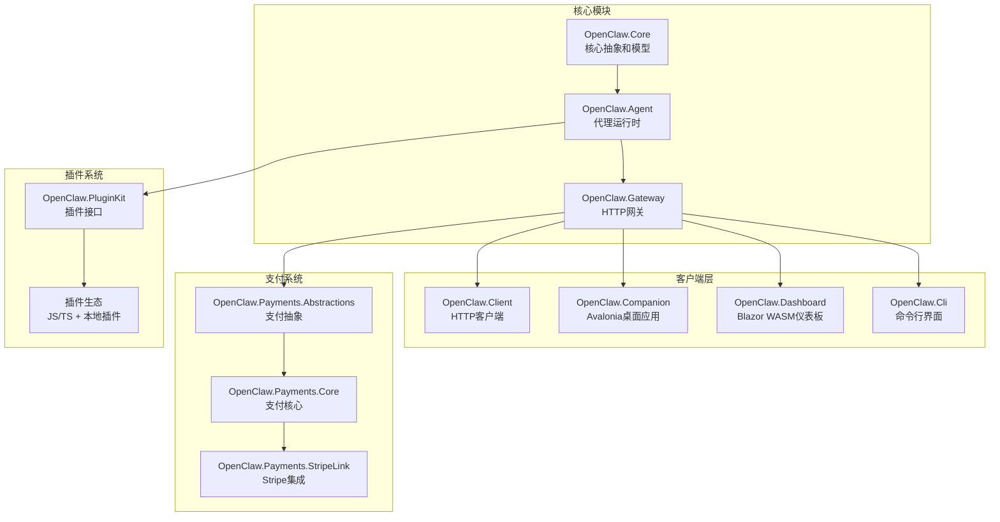
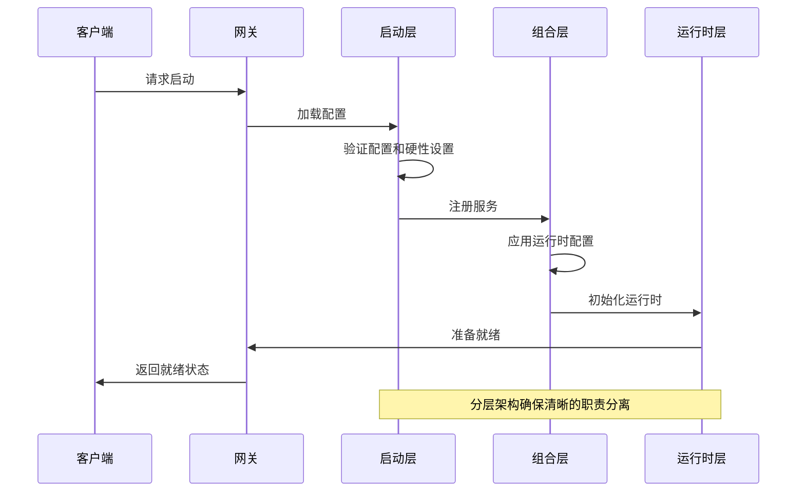
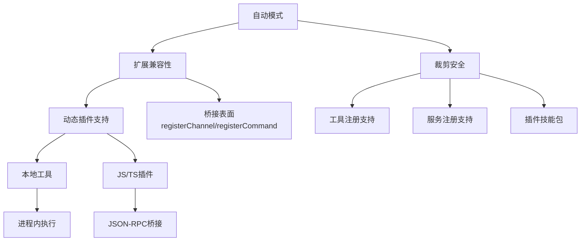
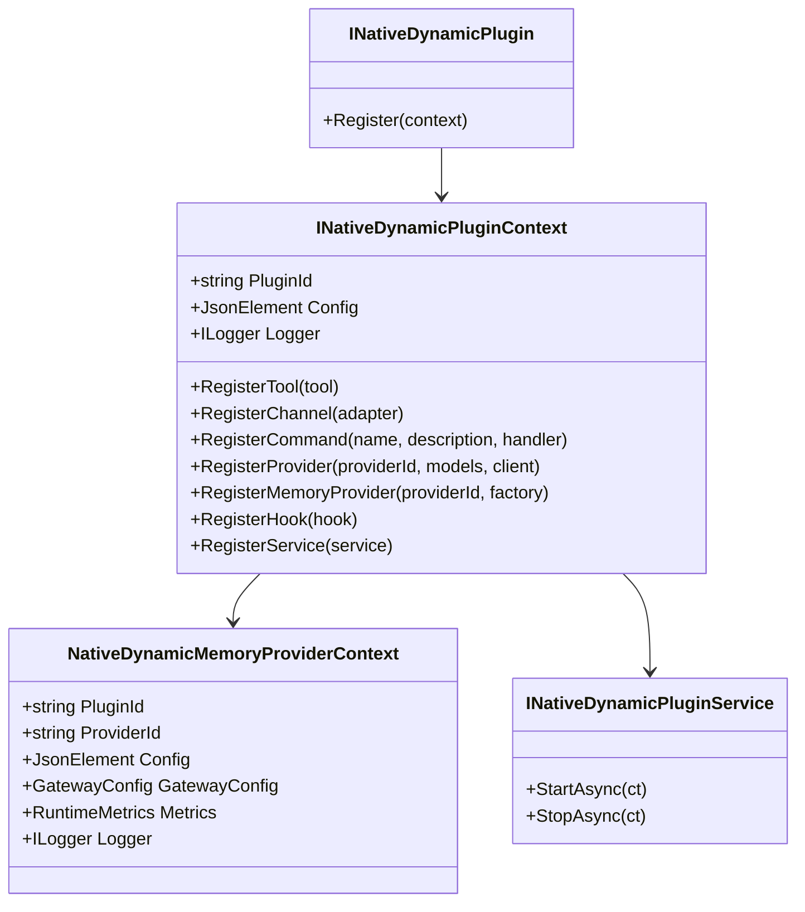
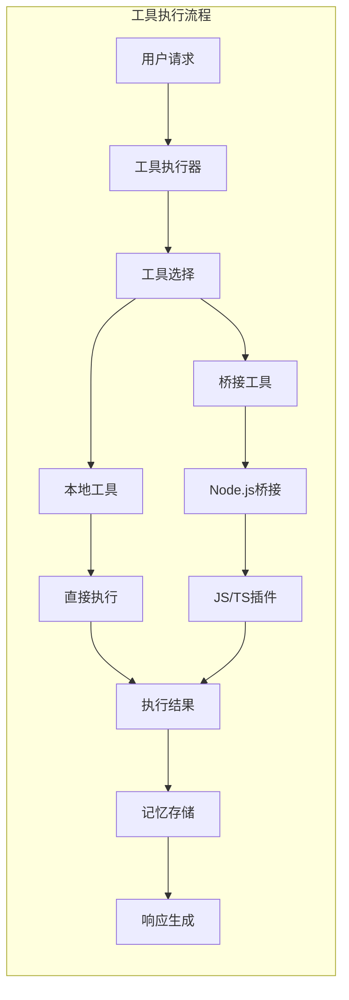
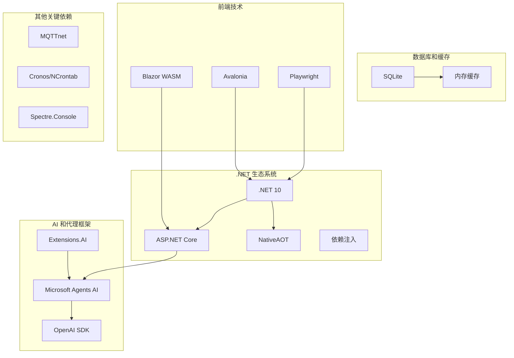

# 项目概述

<cite>
**本文档引用的文件**
- [README.md](file://README.md)
- [QUICKSTART.md](file://QUICKSTART.md)
- [architecture-startup-refactor.md](file://docs/architecture-startup-refactor.md)
- [COMPATIBILITY.md](file://COMPATIBILITY.md)
- [OpenClaw.Agent.csproj](file://src/OpenClaw.Agent/OpenClaw.Agent.csproj)
- [OpenClaw.Gateway.csproj](file://src/OpenClaw.Gateway/OpenClaw.Gateway.csproj)
- [OpenClaw.Cli.csproj](file://src/OpenClaw.Cli/OpenClaw.Cli.csproj)
- [OpenClaw.Core.csproj](file://src/OpenClaw.Core/OpenClaw.Core.csproj)
- [INativeDynamicPlugin.cs](file://src/OpenClaw.PluginKit/INativeDynamicPlugin.cs)
- [Program.cs](file://src/OpenClaw.Gateway/Program.cs)
- [MafAgentRuntime.cs](file://src/OpenClaw.Agent/MafAgentRuntime.cs)
- [Program.cs](file://src/OpenClaw.Dashboard/Program.cs)
</cite>

## 目录
1. [简介](#简介)
2. [项目结构](#项目结构)
3. [核心组件](#核心组件)
4. [架构总览](#架构总览)
5. [详细组件分析](#详细组件分析)
6. [依赖分析](#依赖分析)
7. [性能考虑](#性能考虑)
8. [故障排除指南](#故障排除指南)
9. [结论](#结论)

## 简介

OpenClaw.NET 是一个独立的 .NET 实现的 AI 代理平台，专为可部署的 .NET 服务而构建。该项目采用 .NET-first 设计理念，提供了原生的 NativeAOT 友好部署路径，同时保持与 JavaScript/TypeScript 插件生态系统的兼容性。

### 核心价值主张

- **.NET-first 原生实现**：完全基于 .NET 构建的代理运行时和网关，避免了对 Python 或 Node.js 的依赖
- **NativeAOT 友好**：优化的二进制大小和启动性能，适合云原生和边缘计算场景
- **插件生态兼容**：通过 JSON-RPC 桥接支持上游 OpenClaw 的 JavaScript/TypeScript 插件
- **明确的兼容性矩阵**：在 AOT 和 JIT 运行时模式之间提供清晰的功能边界
- **生产就绪特性**：内置认证、策略、内存管理、渠道集成和可观测性

### 与上游 OpenClaw 的关系

OpenClaw.NET 是一个独立实现，虽然受到上游项目的启发，但并非官方或官方关联的实现。它保持了与上游项目在功能上的兼容性，同时针对 .NET 生态系统进行了优化。

## 项目结构

项目采用模块化架构，主要包含以下核心模块：



**图表来源**
- [OpenClaw.Agent.csproj:1-31](file://src/OpenClaw.Agent/OpenClaw.Agent.csproj#L1-L31)
- [OpenClaw.Gateway.csproj:1-143](file://src/OpenClaw.Gateway/OpenClaw.Gateway.csproj#L1-L143)
- [OpenClaw.Cli.csproj:1-24](file://src/OpenClaw.Cli/OpenClaw.Cli.csproj#L1-L24)

**章节来源**
- [README.md:31-40](file://README.md#L31-L40)
- [README.md:145-196](file://README.md#L145-L196)

## 核心组件

### 代理运行时 (Agent Runtime)

OpenClaw.NET 的代理运行时是整个系统的核心，负责处理智能体的推理、工具执行、记忆交互和技能加载。它支持两种运行时模式：

- **AOT 模式**：优化的裁剪安全路径，适合生产部署
- **JIT 模式**：扩展的兼容性路径，支持动态插件

### 网关 (Gateway)

网关作为系统的入口点，提供多种协议支持：
- HTTP API 和 OpenAI 兼容端点
- WebSocket 支持
- 浏览器 UI 集成
- Webhook 处理
- 多种通信渠道集成

### 客户端生态系统

系统提供多种客户端选择：
- **Web UI**：基于浏览器的聊天界面
- **CLI**：命令行工具，支持脚本和自动化
- **桌面应用**：Avalonia 跨平台桌面应用
- **仪表板**：Blazor WASM 运营仪表板

**章节来源**
- [README.md:33-37](file://README.md#L33-L37)
- [README.md:247-255](file://README.md#L247-L255)

## 架构总览

OpenClaw.NET 采用了分层的启动架构，将启动过程分为三个明确的阶段：



**图表来源**
- [architecture-startup-refactor.md:5-24](file://docs/architecture-startup-refactor.md#L5-L24)
- [Program.cs:48-98](file://src/OpenClaw.Gateway/Program.cs#L48-L98)

### 运行时模式

系统支持三种运行时模式：



**图表来源**
- [COMPATIBILITY.md:11-32](file://COMPATIBILITY.md#L11-L32)
- [README.md:58-71](file://README.md#L58-L71)

**章节来源**
- [architecture-startup-refactor.md:25-34](file://docs/architecture-startup-refactor.md#L25-L34)
- [README.md:58-71](file://README.md#L58-L71)

## 详细组件分析

### 插件系统架构

OpenClaw.NET 提供了灵活的插件系统，支持多种插件类型：



**图表来源**
- [INativeDynamicPlugin.cs:11-46](file://src/OpenClaw.PluginKit/INativeDynamicPlugin.cs#L11-L46)

### 工具执行框架

系统实现了强大的工具执行框架，支持本地工具和外部插件工具：



**图表来源**
- [MafAgentRuntime.cs:66-78](file://src/OpenClaw.Agent/MafAgentRuntime.cs#L66-L78)

### 安全和认证机制

系统内置了多层次的安全机制：

- **认证令牌**：支持 Bearer 令牌认证
- **查询字符串认证**：可选的传统认证方式
- **公共绑定硬性设置**：防止危险配置
- **工具权限控制**：限制文件系统访问
- **插件能力隔离**：根据运行时模式限制插件功能

**章节来源**
- [README.md:277-324](file://README.md#L277-L324)
- [COMPATIBILITY.md:31-48](file://COMPATIBILITY.md#L31-L48)

## 依赖分析

### 技术栈概览

OpenClaw.NET 基于以下关键技术栈构建：



**图表来源**
- [OpenClaw.Agent.csproj:11-26](file://src/OpenClaw.Agent/OpenClaw.Agent.csproj#L11-L26)
- [OpenClaw.Gateway.csproj:53-67](file://src/OpenClaw.Gateway/OpenClaw.Gateway.csproj#L53-L67)
- [OpenClaw.Core.csproj:14-23](file://src/OpenClaw.Core/OpenClaw.Core.csproj#L14-L23)

### 关键依赖说明

- **Microsoft.Agents.AI**：提供核心的 AI 代理框架支持
- **ASP.NET Core**：构建高性能的 Web 服务
- **SQLite**：轻量级数据库用于持久化存储
- **Playwright**：浏览器自动化和测试支持
- **MQTTnet**：消息传输协议支持

**章节来源**
- [OpenClaw.Agent.csproj:11-26](file://src/OpenClaw.Agent/OpenClaw.Agent.csproj#L11-L26)
- [OpenClaw.Gateway.csproj:53-67](file://src/OpenClaw.Gateway/OpenClaw.Gateway.csproj#L53-L67)
- [OpenClaw.Core.csproj:14-23](file://src/OpenClaw.Core/OpenClaw.Core.csproj#L14-L23)

## 性能考虑

### NativeAOT 优化

OpenClaw.NET 在 NativeAOT 模式下进行了专门的性能优化：

- **二进制大小优化**：通过裁剪不使用的代码减少部署体积
- **启动时间优化**：减少 JIT 编译开销
- **内存使用优化**：降低运行时内存占用
- **符号信息控制**：禁用堆栈跟踪以减小二进制大小

### 运行时性能特性

- **流式处理**：支持实时响应和流式输出
- **并发处理**：多线程和异步操作支持
- **缓存机制**：智能缓存策略减少重复计算
- **资源管理**：高效的资源分配和回收

## 故障排除指南

### 常见问题诊断

系统提供了完善的诊断和故障排除功能：

```mermaid
flowchart TD
Issue[问题出现] --> Doctor[/doctor诊断]
Doctor --> Report[生成诊断报告]
Report --> Analysis[分析问题原因]
Analysis --> Solution[提供解决方案]
subgraph "诊断工具"
Health[健康检查]
Metrics[指标监控]
Logs[结构化日志]
Traces[分布式追踪]
end
Doctor --> Health
Doctor --> Metrics
Doctor --> Logs
Doctor --> Traces
```

### 启动问题排查

当遇到启动问题时，可以使用以下诊断方法：

1. **配置验证**：使用 `--doctor` 参数检查配置
2. **环境检查**：验证必要的环境变量设置
3. **网络连接**：检查 LLM 提供商连接
4. **文件权限**：验证工作目录和内存存储权限

**章节来源**
- [README.md:405-431](file://README.md#L405-L431)
- [QUICKSTART.md:41-46](file://QUICKSTART.md#L41-L46)

## 结论

OpenClaw.NET 代表了 .NET 生态系统中 AI 代理平台的一个重要进展。通过采用 .NET-first 设计理念和 NativeAOT 优化，该项目为 .NET 开发者提供了一个强大、高效且生产就绪的 AI 代理解决方案。

### 主要优势

- **语言一致性**：完全基于 .NET 构建，避免了多语言栈的复杂性
- **性能优化**：NativeAOT 提供了出色的启动时间和内存效率
- **生态兼容**：通过桥接支持广泛的 JavaScript/TypeScript 插件
- **生产就绪**：内置的安全、监控和管理功能
- **灵活部署**：支持容器化、云原生和传统部署方式

### 未来发展方向

随着 Microsoft Agent Framework (MAF) 的集成和持续的性能优化，OpenClaw.NET 将继续发展成为 .NET 生态系统中领先的 AI 代理平台。项目团队计划进一步完善插件生态系统、增强安全性和提供更多的部署选项。

对于希望在 .NET 生态系统中构建智能代理应用的开发者来说，OpenClaw.NET 提供了一个坚实的基础和清晰的发展路径。