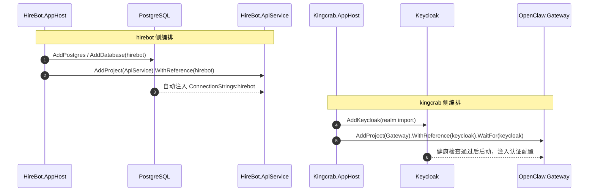
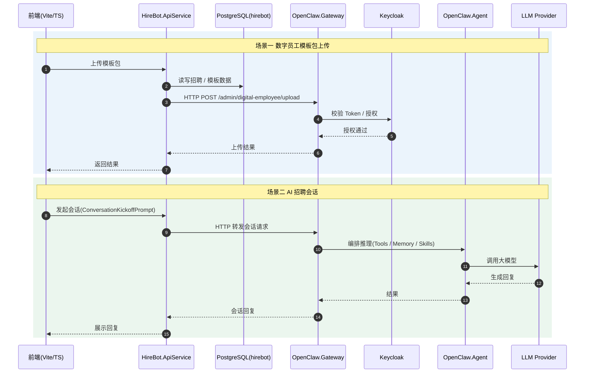
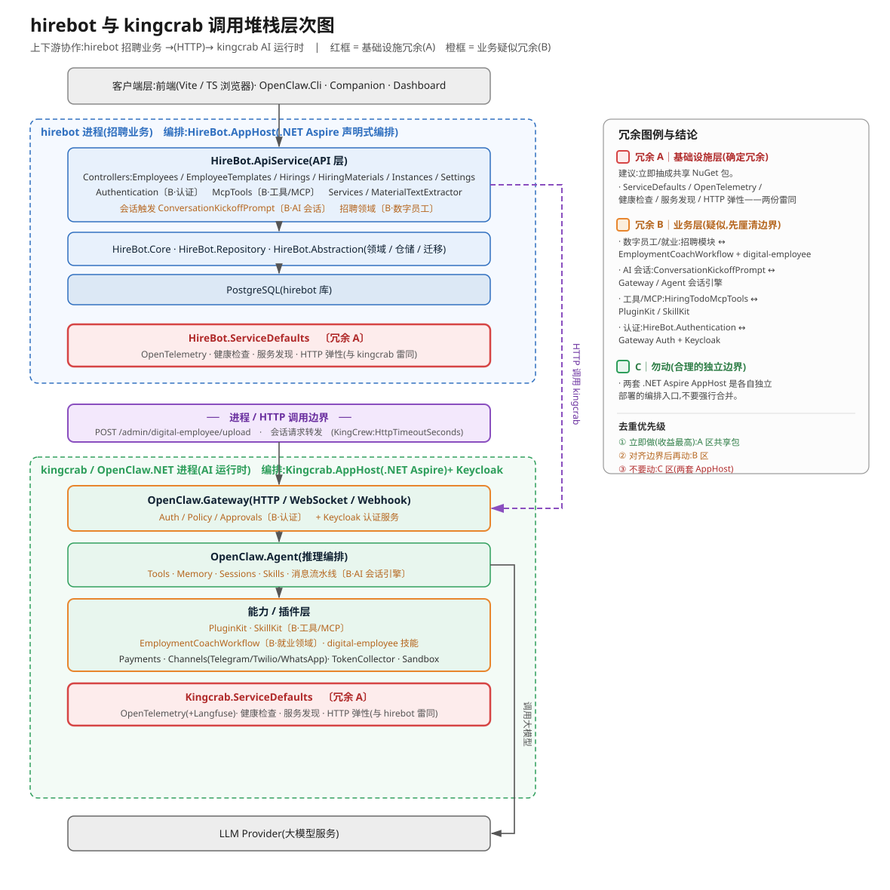

# hirebot 与 kingcrab 冗余功能模块分析

> 话题:hirebot(招聘业务)与 kingcrab(OpenClaw.NET,AI 运行时)之间的冗余功能模块梳理
> 定位前提:**hirebot 招聘业务 →（HTTP）→ kingcrab AI 运行时** 的上下游协作
> 生成日期:2026-07-01

---

## 一、结论速览

| 分区 | 类别 | 判定 | 处置建议 |
|---|---|---|---|
| **A** | 基础设施层冗余 | ✅ 确定冗余 | 🟢 立即抽成共享包 |
| **B** | 业务层冗余 | ⚠️ 疑似冗余 | 🟡 先厘清边界再动 |
| **C** | 两套 Aspire AppHost | ❎ 非冗余 | ⛔ 不要合并 |

一句话:**真正该消除的是 A 区（`ServiceDefaults`/可观测性等纯模板代码），B 区需先划清业务边界，C 区的两套 `AppHost` 是合理的独立部署入口、不要动。**

---

## 二、项目定位与协作关系

| 项目 | 角色 | 技术栈 | 关键证据 |
|---|---|---|---|
| **hirebot（HireBot）** | 上层**招聘 / 雇佣业务**系统 | .NET 10 + Aspire + Vite/TS 前端 + PostgreSQL | `HireBot.ApiService` 招聘控制器群、`.venv`、`helm/` 部署 |
| **kingcrab（OpenClaw.NET）** | 下层 **AI Agent 运行时 / 网关** | .NET 10 + Aspire + Keycloak | `OpenClaw.Gateway` / `OpenClaw.Agent` / 插件技能体系 |

**协作证据**:

- hirebot 的 `README.md` 明确:模板包上传"已固定为调用 Kingcrab `/admin/digital-employee/upload`"。
- hirebot 的 `HireBot.ServiceDefaults/Extensions.cs` 存在 `KingCrew:HttpTimeoutSeconds` 配置，说明其通过 HTTP 调用 kingcrab。

---

## 三、.NET Aspire 声明式编排 / 服务编排是什么

.NET Aspire 是微软的**云原生应用编排框架**。两个项目都用了它的标准"双件套"：

### 1. 声明式编排 = `AppHost` 工程

用 C# **声明**"系统由哪些部件组成、谁依赖谁"，Aspire 自动完成启动顺序、连接串注入、服务发现。

- **kingcrab**（`Kingcrab.AppHost/AppHost.cs`）：`AddKeycloak(...)` 声明认证服务，`AddProject<OpenClaw_Gateway>().WithReference(keycloak).WaitFor(keycloak)` 声明 Gateway 依赖 Keycloak 且等它健康后再启动。
- **hirebot**（`HireBot.AppHost/Program.cs`）：`AddPostgres` → `AddDatabase("hirebot")` → `AddProject<HireBot_ApiService>().WithReference(hirebot)`，运行时自动把连接串注入到 `ConnectionStrings:hirebot`，无需手写。

### 2. 服务编排 / 服务默认 = `ServiceDefaults` 工程

把每个服务都需要的横切能力打包成 `AddServiceDefaults()` 扩展方法，一次调用即获得：

- **服务发现**（用服务名互调，不写死 IP）
- **HTTP 弹性**（超时 / 重试 / 熔断）
- **健康检查**（`/health` 就绪 + `/alive` 存活）
- **OpenTelemetry**（日志 / 指标 / 链路追踪，可导出到 Aspire Dashboard、Jaeger、Langfuse 等）

> `.aspire` 目录为 Aspire 工具链本地缓存；运行 `AppHost` 时会拉起 Aspire Dashboard 可视化面板。

---

## 四、冗余清单与分析

### A. 基础设施层冗余（确定冗余，代码几乎一致）

| 冗余模块 | hirebot | kingcrab | 说明 |
|---|---|---|---|
| **Aspire ServiceDefaults** | `HireBot.ServiceDefaults/Extensions.cs` | `Kingcrab.ServiceDefaults/Extensions.cs` | 两份 `Extensions.cs` 结构基本相同（同为 Aspire 模板）。差异仅在：kingcrab 多 Langfuse 导出与 `OpenClaw.*` trace 源；hirebot 多可配 resilience 超时。 |
| **OpenTelemetry 可观测性** | 含于 ServiceDefaults | 含于 ServiceDefaults | 各配一套，口径不统一，trace 串不起来。 |
| **健康检查 / 服务发现 / HTTP 弹性** | 含于 ServiceDefaults | 含于 ServiceDefaults | 同源重复。 |

> **建议**：抽成内部共享 NuGet 包（如 `Ai4c.ServiceDefaults`），差异用配置开关控制。收益最高、风险最低。

### B. 业务层冗余（疑似，需厘清边界）

| 业务能力 | hirebot | kingcrab | 疑似原因 |
|---|---|---|---|
| **数字员工 / 就业领域** | `Employees` / `EmployeeTemplates` / `Hirings` 等招聘模块 | `OpenClaw.Plugins.EmploymentCoachWorkflow` + `digital-employee` 技能 | 同一"数字员工/就业"概念两处实现。 |
| **AI 会话编排** | `ConversationKickoffPrompt`（自拼提示词触发首问） | `OpenClaw.Gateway` + `OpenClaw.Agent` 会话/记忆/消息流水线 | hirebot 又做一层 AI 编排，而 kingcrab 本就是会话引擎。 |
| **工具 / MCP** | `McpTools/HiringTodoMcpTools.cs` | `OpenClaw.PluginKit` + `OpenClaw.SkillKit` | 自建小型 MCP 与成熟工具体系职责重叠。 |
| **身份认证 / 用户** | `Authentication/`（`ApiAuthorizationService` / `UserSyncMiddleware`） | AppHost 引入 **Keycloak** + Gateway auth/policy | 两边都做认证与用户同步；若 hirebot 另起 Keycloak 即冗余。 |

### C. 看似冗余但**不应合并**

- **两套 `AppHost` + `.aspire` 不是坏味道**。在 Aspire 模型下，每个**独立部署单元**（hirebot 有独立 Dockerfile / Helm chart）拥有自己的编排入口是正常的。真正该消除的是 A 区模板代码与 B 区业务重复，**不要把两个 `AppHost` 强行合并**。

---

## 五、时序图（Mermaid）

### 5.1 Aspire 声明式编排 —— 启动顺序

### 5.2 运行时协作 —— hirebot 调用 kingcrab

---

## 六、调用堆栈层次图（SVG）

分层调用关系与冗余标注见独立 SVG 文件：

> 红框 = 基础设施冗余(A)；橙框 = 业务疑似冗余(B)；紫条 = 进程 / HTTP 调用边界。

---

## 七、去重优先级建议

1. 🟢 **立即做（收益最高、风险最低）**：A 区 —— `ServiceDefaults` / OpenTelemetry / 健康检查抽共享包。
2. 🟡 **对齐边界后再动**：B 区 —— 数字员工领域、AI 会话、工具/MCP、认证，先明确"哪部分归 hirebot、哪部分归 kingcrab"。
3. ⛔ **不要动**：C 区 —— 两套 `AppHost` 各自作为独立部署编排入口保留。

---

## 附:证据出处

| 结论 | 来源文件 |
|---|---|
| hirebot 调用 kingcrab | `hirebot/README.md`、`HireBot.ServiceDefaults/Extensions.cs`（`KingCrew:HttpTimeoutSeconds`） |
| hirebot 招聘业务模块 | `HireBot.ApiService/Controllers/*`、`Authentication/*`、`McpTools/*` |
| hirebot Aspire 编排 | `HireBot.AppHost/Program.cs`、`HireBot.ServiceDefaults/Extensions.cs` |
| kingcrab AI 运行时 | `kingcrab/README.md`、`src/OpenClaw.*` |
| kingcrab Aspire 编排 | `Kingcrab.AppHost/AppHost.cs`、`Kingcrab.ServiceDefaults/Extensions.cs` |
| 就业领域重叠 | `src/OpenClaw.Plugins.EmploymentCoachWorkflow`、`digital-employee` 技能 |
