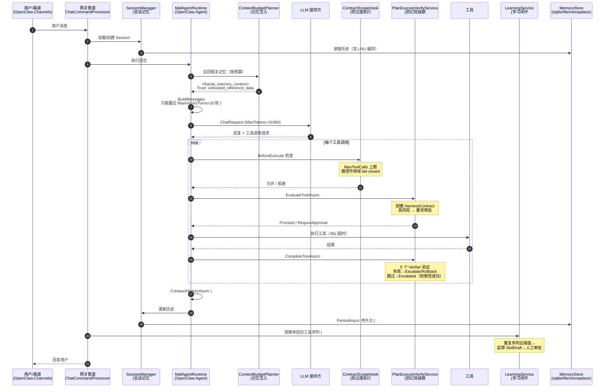

# kingcrab（OpenClaw.NET）智能体可靠性六大机制分析

> 调研日期：2026-07-02
> 调研范围：`src/` 全部项目，重点为 OpenClaw.Gateway、OpenClaw.Agent、OpenClaw.Core
> 面向读者：中级开发工程师

---

## 结论速览

| # | 问题 | 结论 | 核心模块 |
|---|------|------|----------|
| 1 | 幻觉级联处理 | **间接处理**：无专门的语义级幻觉检测，但通过"计划-执行-验证（PEV）+ 证据包 + 记忆不可信标签"三道防线抑制级联 | `PlanExecuteVerifyService`、`ContextBudgetPlanner` |
| 2 | 上下文窗口 | **不直接设定模型原生窗口**，分四层控制：输出 Token 上限、历史轮数、本地模型 KV 上下文、记忆注入预算 | `GatewayConfig` + `appsettings.json` |
| 3 | 上下文压缩 | **有**：LLM 摘要式压缩（Compaction），失败时回退纯截断；原始历史已持久化，窗口内有语义丢失风险 | `MafAgentRuntime.CompactHistoryAsync` |
| 4 | 会话记忆持久化 | **有**：三种后端（file / sqlite / mempalace）+ 分形记忆 + 召回注入 + TTL 归档 | `SessionManager` + `FileMemoryStore` / `SqliteMemoryStore` |
| 5 | 学习闭环 | **有**：观察重复工具序列 → 自动起草技能 → 校验 → 人工审批 → 落盘热加载 → 可回滚 | `LearningService` + SkillKit |
| 6 | 无声失败防护 | **部分覆盖**：工具调用上限、Token 预算、超时 fail-closed、PEV 结果验证、心跳巡检；**缺显式死循环语义检测** | `ContractScopeHook`、`RuntimePulseService` |

---

## 1. 幻觉级联（Hallucination Cascade）的处理

**什么是幻觉级联**：模型某一步生成了错误内容（幻觉），该内容被写入历史/记忆，后续轮次把它当作"事实"继续推理，错误像滚雪球一样放大。

项目里没有名为"幻觉检测"的模块，但存在三道针对级联路径的防线：

### 防线一：Plan-Execute-Verify（PEV）三段闭环

[PlanExecuteVerifyService.cs](../src/OpenClaw.Gateway/PlanExecuteVerifyService.cs#L19) 是核心。高风险工具执行前先创建 **HarnessContract（执行契约）**，契约里写明目标、成功标准（SuccessCriteria）、验证计划（VerificationPlan）、回滚计划（RollbackPlan）。执行后由 5 个验证器逐一检查（[第 48-55 行](../src/OpenClaw.Gateway/PlanExecuteVerifyService.cs#L48-L55)）：

| 验证器 | 检查内容 |
|--------|----------|
| `ToolOutcomeVerifier` | 工具结果状态必须是 Completed 且无 FailureCode（防"假性成功"） |
| `ApprovalVerifier` | 要求审批的操作是否真的被批准 |
| `ContractCompletenessVerifier` | 契约是否缺成功标准/验证计划/回滚计划 |
| `SecurityPostureVerifier` | 公网绑定等安全姿态 |
| `RegressionVerifier` | 提示运行回归测试套件 |

关键点在 [ApplyVerificationResultAsync](../src/OpenClaw.Gateway/PlanExecuteVerifyService.cs#L646)：验证**失败 → Rollback 或 Escalate（升级给操作员）**，验证**被跳过 → 状态标记为 Escalated 而不是 Verified**。也就是说，未经验证的结果不会被静默地当作"成功事实"进入下一步——这正是切断级联的关键一环。

### 防线二：记忆注入打"不可信"标签

[ContextBudgetPlanner.BuildContextBlock](../src/OpenClaw.Core/Memory/ContextBudgetPlanner.cs#L105-L114) 把召回的记忆包在 `<fractal_memory_context>` 块里，并显式写入一行：

```
Trust: untrusted_reference_data
```

这告诉模型：这段召回内容是**参考资料而非既定事实**。幻觉级联最常见的路径是"幻觉→写入记忆→再次召回→被当事实"，这个标签在召回端降低了污染扩散的权重。

### 防线三：证据与治理台账

每次 PEV 运行都关联 `EvidenceBundleService`（证据包）和 `GovernanceLedgerService`（治理台账），所有决策留痕，可事后追溯哪一步开始出错。

### 局限

- 对模型**文本回答本身**（非工具调用）没有事实性校验；
- 压缩摘要（见第 3 节）由 LLM 生成且无二次验证，摘要出现幻觉会随窗口一直存在。

---

## 2. 上下文窗口大小与配置位置

项目**不直接设定云端模型的原生上下文窗口**（那由模型提供方决定），而是分四层控制"实际进入窗口的内容量"：

| 层 | 配置项 | 默认值 | 实际配置（appsettings.json） | 定义位置 |
|----|--------|--------|------------------------------|----------|
| 单次输出上限 | `Llm.MaxTokens` | 4096 | **16384** | [GatewayConfig.cs:98](../src/OpenClaw.Core/Models/GatewayConfig.cs#L98) |
| 历史轮数 | `Memory.MaxHistoryTurns` | 50 | **20** | [GatewayConfig.cs:189](../src/OpenClaw.Core/Models/GatewayConfig.cs#L189) |
| 本地模型 KV 上下文 | `LocalLlm.ContextSize` | 0（用模型默认） | — | [GatewayConfig.cs:141](../src/OpenClaw.Core/Models/GatewayConfig.cs#L141) |
| 记忆注入预算 | `Memory.Fractal.MaxContextTokens` / `MaxContextChars` | 6000 tokens / 24000 字符 | — | [GatewayConfig.cs:261-262](../src/OpenClaw.Core/Models/GatewayConfig.cs#L261-L262) |

**配置位置**：

1. 静态配置：[src/OpenClaw.Gateway/appsettings.json](../src/OpenClaw.Gateway/appsettings.json) 的 `OpenClaw` 配置段（如第 28 行 `"MaxTokens": 16384`、第 53 行 `"MaxHistoryTurns": 20`）；
2. 运行期热改：`AdminSettingsService`（Admin API / Companion 界面）可在线修改并记录变更审计；
3. 本地模型的推荐上下文窗口在 [LocalModelPackageCatalog.cs](../src/OpenClaw.Core/Setup/LocalModelPackageCatalog.cs) 中以 `ContextWindow` 字段按模型登记。

历史轮数的裁剪发生在 [MafAgentRuntime.BuildMessages](../src/OpenClaw.Agent/MafAgentRuntime.cs#L794-L798)：每次调用 LLM 前只取最近 `MaxHistoryTurns` 轮。

> ⚠️ 顺带提醒：appsettings.json 第 25 行有一个明文 API Key 已入库，建议改用环境变量或用户机密（user-secrets）管理。

---

## 3. 上下文压缩与信息丢失风险

### 实现模块

核心在 **OpenClaw.Agent** 的 [MafAgentRuntime.CompactHistoryAsync](../src/OpenClaw.Agent/MafAgentRuntime.cs#L712-L792)，配置来自 `MemoryConfig`：

- `EnableCompaction`（实配 **true**）：开启后旧历史不是直接丢弃而是 LLM 摘要；
- `CompactionThreshold`（实配 **30**）：历史超过 30 轮触发压缩；
- `CompactionKeepRecent`（实配 **6**）：最近 6 轮保留原文。

### 压缩流程（通俗版）

1. 历史轮数超阈值 → 把"最近 6 轮之外"的旧轮拼成文本（普通轮截断到 500 字符，工具结果截断到 200 字符）；
2. 调用 LLM："把这些轮总结成 2-3 句话，只输出摘要"（`MaxOutputTokens=256, Temperature=0.3`）；
3. 删掉旧轮，在历史头部插入一条系统消息 `[Previous conversation summary: …]`；
4. **任何一步失败（摘要为空、LLM 异常）→ 回退到 `TrimHistory` 纯截断**，并记录 Warning 日志——降级是显式的，不会静默卡死。

### 信息丢失的保障与局限

**有保障的部分**：

- **原始历史不丢**：压缩只改内存中的窗口表示；完整历史此前已由 `SessionManager.PersistAsync` 写入持久化存储，且 `ISessionSearchStore` 支持全文检索找回；
- **截断显式标记**：`ContextBudgetPlanner` 的记忆注入超预算时追加 `[truncated]` 标记并置 `Truncated=true`，模型和调用方都知道内容不完整；
- **配置自洽校验**：[ConfigValidator.cs:89-98](../src/OpenClaw.Core/Validation/ConfigValidator.cs#L89-L98) 强制 `CompactionThreshold > MaxHistoryTurns`、`KeepRecent < Threshold`，防止配错导致反复压缩；
- **可观测**：每次压缩计入 `RuntimeMetrics.IncrementMemoryCompactions()`，摘要调用的 Token 用量单独记账。

**局限**：2-3 句摘要 + 截断必然有语义丢失，且摘要本身由 LLM 生成、无二次校验——"窗口内"的信息保真度无法保证，只能保证"存储层"不丢。

---

## 4. 会话记忆与持久化

### 分层结构

**会话级记忆（短期）**：`Session.History`（`List<ChatTurn>`）由 [SessionManager](../src/OpenClaw.Core/Sessions/SessionManager.cs)（OpenClaw.Core/Sessions）管理。持久化两条路径：

- 同步：[PersistAsync](../src/OpenClaw.Core/Sessions/SessionManager.cs#L132)；
- 后台尽力而为：[QueueBestEffortPersist](../src/OpenClaw.Core/Sessions/SessionManager.cs#L589)（LRU 淘汰会话时异步落盘，用 `ConcurrentDictionary` 跟踪未完成任务，Dispose 时等待全部完成）。

**长期记忆后端**：由 `Memory.Provider` 选择（[GatewayConfig.cs:186](../src/OpenClaw.Core/Models/GatewayConfig.cs#L186)），本项目实配 **sqlite**：

| Provider | 实现 | 存储形态 |
|----------|------|----------|
| `file` | [FileMemoryStore](../src/OpenClaw.Core/Memory/FileMemoryStore.cs) | `./memory` 下 JSON 文件；文件名 base64url 编码防路径穿越；内置 LRU 缓存 |
| `sqlite`（实配） | [SqliteMemoryStore](../src/OpenClaw.Core/Memory/SqliteMemoryStore.cs) | `./memory/openclaw.db`；支持 FTS 全文检索 + 可选向量嵌入检索 |
| `mempalace` | OpenClaw.Plugins.Mempalace 插件 | "记忆宫殿"结构 + 知识图谱（`kg.db`）+ 向量检索 |

**辅助机制**：

- **分形记忆（Fractal Memory）**：`Memory.Fractal` 配置，走 MCP 外部进程，由 `ContextBudgetPlanner` 按预算注入上下文，写操作默认需审批（`RequireApprovalForWrites=true`）；
- **召回注入（Recall）**：`MafAgentRuntime` 在建消息时把检索到的相关记忆作为参考资料插入（失败只记 Warning 不阻断对话）；
- **保留与归档（Retention）**：`MemoryRetentionConfig` —— 会话 TTL 30 天、分支 TTL 14 天，过期先归档到 `./memory/archive` 再删除，避免"直接消失"。

---

## 5. 学习闭环（Skills System / Closed Learning Loop）

**有完整的闭环自学能力**，分两层：

- **技能系统底座**：OpenClaw.SkillKit / SkillKit.Abstractions 负责技能包（`SKILL.md`）的装载与热加载，技能存放在 Gateway 的 `skills/` 目录；
- **闭环学习**：[LearningService](../src/OpenClaw.Gateway/LearningService.cs)（OpenClaw.Gateway）实现"观察 → 起草 → 校验 → 审批 → 应用 → 回滚"全流程。

### 自动技能生成流程

1. **观察**（[EnsureSkillProposalAsync](../src/OpenClaw.Gateway/LearningService.cs#L749)）：每轮结束后统计本会话内相同的"多工具调用序列"重复次数，达到 `SkillProposalThreshold` 才触发；
2. **起草**（[SummarizeSkillDraftAsync](../src/OpenClaw.Gateway/LearningService.cs#L823)）：调 LLM 把工具序列总结成 SKILL.md 草稿，**10 秒超时，LLM 不可用则回退到固定模板**——起草永不阻塞；
3. **校验**（[ValidateSkillDraft](../src/OpenClaw.Gateway/LearningService.cs#L940)）：检查草稿是否含隐藏推理标记（含则强制重新生成）、内容哈希（`DraftContentHash`）、重复次数过低告警、风险分级（`DetermineSkillRisk`）；
4. **去重**：用 `ProposalFingerprint` 指纹合并重复提案，近期已批准的不再重复提；
5. **人工审批**：提案落库为 Pending 状态，**绝不自动生效**；
6. **应用**（[ApproveAsync](../src/OpenClaw.Gateway/LearningService.cs#L396-L448)）：审批时**再次校验 + 目标路径冲突检查**，通过后写入 `SKILL.md` + `.openclaw-learning.json` 元数据，然后 `ReloadSkillsAsync` 热加载；
7. **回滚**（[RollbackAsync](../src/OpenClaw.Gateway/LearningService.cs#L521)）：已批准的技能可整体回滚（删除托管技能文件并重新加载）。

### 任务完整性保障

- **双重校验**：起草时校验一次，审批时用保存的哈希再校验一次，防止草稿在审批前被篡改；
- **失败不静默**：技能落盘成功但热加载失败时，在提案 metadata 里记录 `reloadFailed=true` + 错误详情并 LogWarning（[第 438-447 行](../src/OpenClaw.Gateway/LearningService.cs#L438-L447)），而不是假装成功；
- **可逆**：ProfileUpdate 类提案保存"应用前快照"（`AppliedProfileBefore`），回滚可恢复原状；
- **Harness 自我进化提案更严格**：要求提供回滚计划、证伪测试（falsification tests）、回归测试类别，高风险强制回归，且审批后仍需**手动应用**。

---

## 6. 自主决策的不可预测性与"无声失败"防护

### 防"过度执行"

| 机制 | 位置 | 作用 |
|------|------|------|
| `MaxToolCalls` 硬上限 | [ContractScopeHook.cs:44-53](../src/OpenClaw.Agent/ContractScopeHook.cs#L44-L53) | 每会话工具调用次数达上限后**拒绝执行并记日志** |
| 路径作用域 | [ContractScopeHook.cs:56-107](../src/OpenClaw.Agent/ContractScopeHook.cs#L56-L107) | 作用域契约下 `shell`/`code_exec` 默认拒绝；文件操作限制在白名单路径内；**路径解析不了 → 直接拒绝（fail-closed）** |
| Token 预算 | `SessionTokenBudget` + `EnableEstimatedTokenAdmissionControl`（[GatewayConfig.cs:55-58](../src/OpenClaw.Core/Models/GatewayConfig.cs#L55-L58)） | 会话总 Token 超预算即停；开启准入控制后，预估 Token 就会耗尽预算的轮次**提前拒绝** |
| 超时链 | `Llm.TimeoutSeconds`（120s）、`ToolTimeoutSeconds`（30s）、`ToolApprovalTimeoutSeconds`（300s） | 审批超时**默认拒绝**而不是默认放行 |

### 防"假性成功"（Silent Failures）

- **PEV 结果验证**（见第 1 节）：`ToolOutcomeVerifier` 要求结果状态为 Completed 且无 FailureCode；验证失败 → Escalate/Rollback；验证被跳过 → 状态 Escalated（不冒充 Verified）；
- **证据包留痕**：每次工具执行的调用参数、结果、审批记录进 `EvidenceBundle`，事后可审计；
- **显式降级**：全项目的降级路径（压缩失败→截断、召回失败→跳过、事件写入失败→LogWarning）都带日志，异常捕获排除 `OutOfMemoryException`/`StackOverflowException` 这类不该吞的致命异常。

### 主动巡检对抗"无声卡死"

[RuntimePulseService](../src/OpenClaw.Gateway/RuntimePulseService.cs)（BackgroundService）周期性读取工作区 `HEARTBEAT.md` 中的任务清单，驱动 LLM 自查并产出 `HEARTBEAT_OK` 或告警（上限 20 条）——相当于给智能体配了一个"定时体检"，长期任务停摆时会浮出水面而不是无声消失。

### 已识别的薄弱点

1. **无显式死循环语义检测**：没有"连续 N 次相同工具+相同参数"的循环识别，只靠 `MaxToolCalls` 和 Token 预算兜底，且两者默认值均为 0（不限制），**需要运维显式配置才生效**；
2. 模型纯文本回答（不经工具）不进 PEV，无验证覆盖；
3. 压缩摘要无二次校验（见第 3 节）。

---

## 消息处理全链路时序图

下图展示一条用户消息从进入到落盘的完整旅程，六大机制在链路中的挂载点均已标注：



## 配套图表

- 调用堆栈层次图（SVG）：[kingcrab智能体可靠性调用堆栈层次图.svg](kingcrab智能体可靠性调用堆栈层次图.svg)
