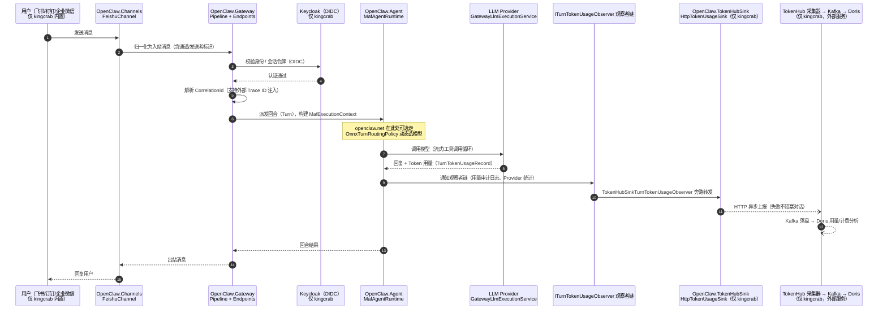

# openclaw.net 与 kingcrab 架构与功能模块差异分析

> 分析日期：2026-07-04
> 对比对象：
> - **openclaw.net**（`e:\Documents\CODES\openclaw.net-main`，OpenClaw.NET 上游开源版，.NET 实现）
> - **kingcrab**（`e:\Documents\CODES\ai4c_Projects\kingcrab`，基于 openclaw.net 的企业定制版）
>
> 注意：本文与已有的《openclaw与kingcrab架构与功能模块差异分析.md》不是同一主题——那篇对比的是 **TypeScript 官方原版**，本篇对比的是 **同为 .NET 的上游版与企业定制版**。

---

## 一、一句话定位

| 项目 | 定位 |
|------|------|
| **openclaw.net** | 面向开源社区的 .NET 智能体运行时与网关"上游发行版"：可选编排器（native / MAF / Semantic Kernel / MEAI）、动态回合路由、MCP App、/loop 与 /goal 自主任务等前沿功能齐全，配套完整的冒烟验证矩阵与 60+ 篇文档 |
| **kingcrab** | 在 openclaw.net 基础上做减法与企业加法的"生产定制版"：砍掉多编排器适配层，加上 .NET Aspire 编排、Keycloak 统一认证、Token 用量计量上报（TokenHub → Kafka → Doris）、中国办公生态通道（飞书/钉钉/企业微信）、数字员工工作流与可靠性加固 |

**血缘关系**：kingcrab 不是平行实现，而是 openclaw.net 的下游分支。根据 kingcrab 的 CHANGELOG，2026-03-05 完成了一次"结构性合并"——把 openclaw.net（截至 2026-03-04 的版本）整体迁入 kingcrab，之后独立演进约 4 个月。因此两者约 85% 的代码同源（Gateway、Agent、Core、Channels、CLI、Companion、Dashboard、PluginKit、SkillKit、Payments、Tui、OpenSandbox 等），差异集中在"各自的最后一公里"。

---

## 二、解决方案级差异（项目清单对比）

### 2.1 kingcrab 独有项目（openclaw.net 没有）

| 项目 | 作用 |
|------|------|
| `Kingcrab.AppHost` | .NET Aspire 分布式应用编排宿主：一键拉起 Keycloak（含 Realm 导入、管理员账号）、Gateway、CLI、Companion，并声明服务间依赖与健康等待（`WaitFor`） |
| `Kingcrab.ServiceDefaults` | Aspire 服务默认值包：OpenTelemetry、健康检查、HTTP 弹性（重试/熔断）等统一横切配置 |
| `OpenClaw.TokenHubSink` | Token 用量旁路上报：`HttpTokenUsageSink`（HTTP 上报）、`SecretResolver`（密钥解析）、`TokenUsageEvents`（可观测事件）、`TokenUsageConfig`（配置模型） |
| `OpenClaw.Plugins.EmploymentCoachWorkflow` | 数字员工（就业教练）原生工作流插件，含配套 skills |
| `OpenClaw.SandboxDemo` | OpenSandbox 沙箱演示工程，配合 `Dockerfile.opensandbox` / `.base` / `.app` 三件套做沙箱镜像分层打包 |

### 2.2 openclaw.net 独有项目（kingcrab 没有或已合并）

| 项目 | 作用 | kingcrab 的处理方式 |
|------|------|------|
| `OpenClaw.MicrosoftAgentFrameworkAdapter` | 可选 MAF 编排器适配层（独立工程，含 A2A） | **已合并**进 kingcrab 的 `OpenClaw.Agent`（12 个 `Maf*` 文件），MAF 成为 kingcrab 唯一编排路径 |
| `OpenClaw.SemanticKernelAdapter` | Semantic Kernel 工具/策略互操作 | 排除，不引入 |
| `OpenClaw.Providers.MicrosoftExtensionsAI` | MEAI（Microsoft.Extensions.AI）Provider | 排除，不引入 |
| `OpenClaw.Routing.Onnx` | 本地 ONNX 嵌入模型做**动态回合路由**（按提示词特征选模型），配套 `Agent/Routing`、`Gateway/Routing`（含 OpenSquilla 模型包加载器） | 排除；kingcrab 无动态路由 |
| `OpenClaw.Protocols.Browser` | 浏览器控制工具协议工程 | 排除（能力散落在 Gateway `BrowserToolSupport` 层面） |
| `OpenClaw.Protocols.Mqtt` | MQTT 发布/订阅协议工程 | 排除 |
| `OpenClaw.Plugins.TokenJuice` | 规则驱动的工具输出压缩（省 token） | 排除 |
| `src/mcpapp`（OpenClaw.McpApp） | 一等 MCP App 支持：清单发现、生命周期管理、工具桥接、交互式 UI 资源 | 排除；kingcrab 保留 `/mcp` JSON-RPC 门面与工具级接入 |
| `whatsapp-whatsmeow-worker`（Go） | WhatsApp 第二桥接实现 | 排除，仅保留 Baileys Worker |

### 2.3 功能目录级差异（同名项目内部的分叉）

| 位置 | openclaw.net | kingcrab |
|------|------|------|
| `OpenClaw.Agent` | `Goal/`（/goal 会话自动续跑）、`Routing/`（回合路由策略）、`Runtime/`；native 为默认编排器，MAF 是可选工件 | `Maf*` 12 文件（MAF 内置且唯一）、`A2A/`、`Observability/`（`TokenHubSinkTurnTokenUsageObserver`）、`TokenUsageEventMapper` |
| `OpenClaw.Core` | 多出 `Loops/`（/loop 周期任务，TickerQ 定时注入）、`Services/` | 与上游一致（无 Loops） |
| `OpenClaw.Gateway` | 多出 `Background/`（后台执行限流器、会话恢复 Worker）、`Routing/`（动态路由配置归一化） | 多出 `Channels/`、`McpWorkspaceWatcherService`、Keycloak/OIDC 接入（`Bootstrap`、`Composition/SecurityServicesExtensions`、`EndpointHelpers`） |
| `OpenClaw.Channels` | 11 个通道 | 上游 11 个 + **飞书（FeishuChannel + FeishuMessageDedup 去重）、钉钉（DingTalkChannel）、企业微信（WeComChannel）** 共 14 个 |

### 2.4 工程化基础设施差异（根目录）

| 维度 | openclaw.net | kingcrab |
|------|------|------|
| 测试与验证 | `tests/`、`compat/`（公共冒烟契约）、`eng/`（**50+ 个 AOT×MAF×native 组合冒烟矩阵脚本** + findings 生成器） | 仅 `src/OpenClaw.Tests` + `OpenClaw.Testing`；无冒烟矩阵 |
| 示例与模型 | `examples/`、`samples/`、`models/` | 无 |
| 文档 | 60+ 篇英文架构/治理/集成文档 | 上游 docs 已删除，改为中文分析文档（可靠性六大机制、调用堆栈图、专利文档 `docs/patent`、迁移记录 `docs/migration`） |
| 社区治理 | CONTRIBUTING / SECURITY / CODE_OF_CONDUCT / AUDIT_REPORT / deploy | 无（内部项目不需要） |
| 本地编排 | docker-compose | docker-compose + **Aspire AppHost**（推荐路径） |

---

## 三、给中级开发者的通俗解读

把 openclaw.net 想成 **"官方原厂 ROM"**：功能开关多（4 种编排器可换、动态路由可插 ONNX 模型、MCP App 商店化）、测试矩阵齐全、文档完善，但它默认不替你回答"企业里谁能登录、用了多少 token 找谁结账"这类问题。

把 kingcrab 想成 **"企业刷机包"**：
1. **砍掉用不到的开关**——编排器只留 MAF 一条路（直接焊死在 Agent 里），SK/MEAI 适配层、ONNX 路由、TokenJuice 全部不带，二进制和维护面都更小；
2. **焊上企业必需件**——
   - **登录**：Keycloak（OIDC 统一身份认证），Aspire 启动时自动导入 Realm 配置；
   - **记账**：每轮对话的 token 用量走 `ITurnTokenUsageObserver` 观察者链，由 `TokenHubSinkTurnTokenUsageObserver` 旁路推给 `HttpTokenUsageSink`，经 TokenHub 采集器进 Kafka，最终落 Doris 做用量/计费分析——全链路带 CorrelationId（支持外部 Trace ID 注入、按 Profile 配置），失败不阻塞主对话（旁路设计）；
   - **接入中国办公软件**：飞书/钉钉/企业微信通道是内置 C# 类，飞书还带消息去重；
   - **数字员工**：就业教练工作流插件是"把智能体当员工用"的业务化样板；
3. **可靠性加固**——kingcrab 在防幻觉级联（PEV 三段闭环）、防假性成功、主动巡检、上下文压缩保障等方向持续打补丁（见《kingcrab智能体可靠性六大机制分析.md》），这些是上游合并点之后的增量。

代价也要看清：kingcrab 丢掉了上游的 **冒烟验证矩阵**（eng/ 下 50+ 脚本）和 /loop、/goal 这类自主任务能力，测试防护网比上游薄。

---

## 四、消息处理与 Token 计量全链路时序图

下图以"用户从飞书发一条消息"为例，标出两个项目的公共链路与 kingcrab 特有分支（openclaw.net 在 ⑥ 之后没有 TokenHub 旁路，而是可选走 ONNX 动态路由选模型）。

---

## 五、企业级应用优势对比结论

### 5.1 逐维度打分

| 企业关注维度 | openclaw.net | kingcrab | 说明 |
|------|:---:|:---:|------|
| 统一身份认证（SSO） | ✗（仅 AuthToken/网关加固） | ✅ Keycloak/OIDC | 企业准入的硬门槛 |
| 用量计量与计费审计 | △（进程内统计/审计日志） | ✅ TokenHub→Kafka→Doris 全链路 | 多租户成本分摊必备 |
| 分布式编排与横切治理 | ✗ docker-compose | ✅ .NET Aspire + ServiceDefaults | OTel/健康检查/弹性开箱即用 |
| 中国办公生态接入 | ✗ | ✅ 飞书/钉钉/企业微信内置 | 国内企业落地关键 |
| 可观测性关联追踪 | △ | ✅ CorrelationId 外部注入 + 按 Profile 配置 | 对接企业 APM |
| 业务化模板（数字员工） | ✗ | ✅ EmploymentCoachWorkflow | 可复制的业务样板 |
| 编排器/框架生态灵活性 | ✅ native/MAF/SK/MEAI 四选 | △ 仅 MAF | 上游更开放 |
| 智能路由降本 | ✅ ONNX 动态回合路由 | ✗ | 上游按题选模型省钱 |
| Token 压缩降本 | ✅ TokenJuice | ✗ | 上游省上下文开销 |
| 自主长任务（/loop、/goal） | ✅ | ✗ | 上游功能面更前沿 |
| MCP 生态深度 | ✅ 一等 MCP App | △ /mcp 门面 + 工具级 | 上游更完整 |
| 回归/冒烟验证体系 | ✅ 50+ 矩阵脚本 | △ 单元测试为主 | **kingcrab 最大短板** |
| 文档与社区治理 | ✅ 60+ 篇 + 完整社区文件 | △ 中文内部文档 | 定位不同 |

### 5.2 结论

**面向企业级应用，kingcrab 更具优势**。理由：企业选型的一票否决项——身份认证（Keycloak SSO）、用量计费（TokenHub 计量链路）、可观测关联（CorrelationId/OTel/Aspire ServiceDefaults）、本土通道（飞书/钉钉/企业微信）——kingcrab 全部内置，而这些在 openclaw.net 里要么缺失、要么需要自行二次开发；kingcrab"单一 MAF 编排路径"的减法也符合企业"少开关、少分叉、可控优先"的运维哲学。

openclaw.net 的优势在**平台开放性与工程验证成熟度**：多编排器适配、动态路由、TokenJuice、MCP App、/loop//goal，以及最值得学习的 50+ 冒烟验证矩阵。它更适合作为持续吸收上游创新的"源头"。

**给 kingcrab 的两条建议**：
1. **回补验证矩阵**：把上游 `eng/` 的 AOT×编排器冒烟矩阵思路移植过来，覆盖 Keycloak 认证链路与 TokenHub 上报链路，补上目前最薄弱的回归防护网；
2. **保持定期上游同步**：/loop、/goal、TokenJuice、动态路由都是对企业降本增效有价值的候选功能，建议按需 cherry-pick 而非整体再合并。

---

## 六、配套图表

- 调用堆栈层次图（SVG）：[openclaw.net与kingcrab调用堆栈层次图.svg](openclaw.net与kingcrab调用堆栈层次图.svg)
