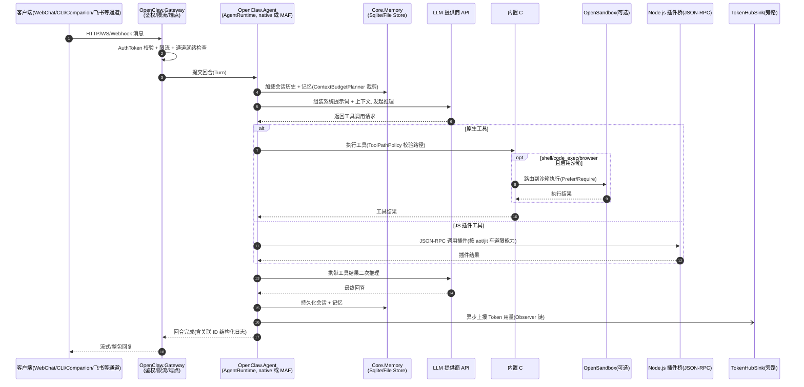
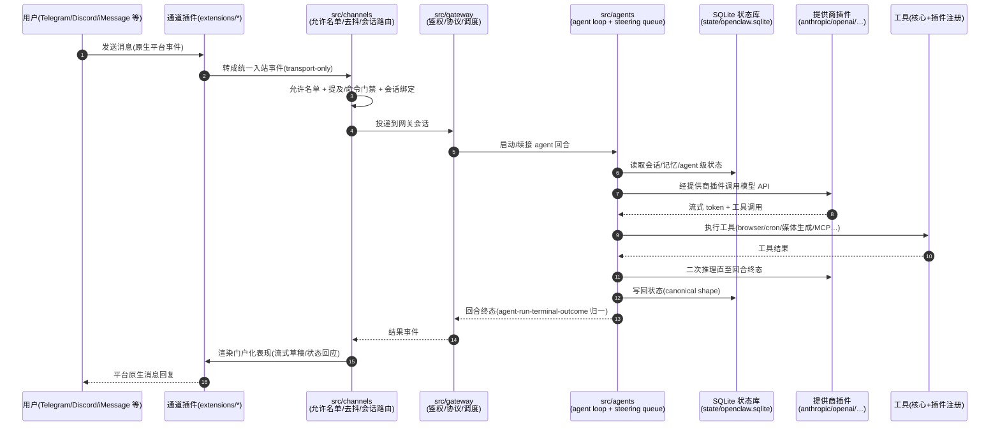

# openclaw 与 kingcrab 架构与功能模块差异分析

> 分析日期:2026-07-03
> 对比对象:
> - **kingcrab**(`e:\Documents\CODES\ai4c_Projects\kingcrab`,即 OpenClaw.NET,.NET 独立实现)
> - **openclaw**(`e:\Documents\CODES\openclaw`,TypeScript 官方原版)

---

## 一、一句话定位

| 项目 | 定位 |
|------|------|
| **openclaw** | TypeScript/Node.js 编写的原版个人 AI 智能体平台,拥有庞大的插件生态(130+ 插件)、多端原生 App、多媒体生成能力,面向个人助手与开源社区场景 |
| **kingcrab (OpenClaw.NET)** | 用 C#/.NET 独立重写的 OpenClaw 智能体运行时与网关,主打 NativeAOT 轻量部署、企业级治理(支付、合规、Token 计量、数字员工),并通过 Node.js JSON-RPC 桥接层**兼容**原版 JS 插件生态 |

通俗地说:**openclaw 是"原厂生态旗舰",kingcrab 是"面向企业生产环境的 .NET 改装版"**——后者不追求 100% 功能对齐,而是挑选核心能力重写,再叠加原版没有的企业功能。

---

## 二、技术栈与工程结构差异

| 维度 | kingcrab (.NET) | openclaw (TypeScript) |
|------|------|------|
| 语言/运行时 | C# / .NET,`OpenClaw.Net.slnx` 解决方案 | TypeScript ESM,Node 22+(兼容 Bun),pnpm workspace |
| 工程组织 | `src/` 下 26 个 C# 项目(Gateway、Agent、Core、Channels 等) | `src/` 单包核心 + `packages/` 21 个共享包 + `extensions/` 130+ 插件 + `apps/` 原生应用 |
| 部署形态 | NativeAOT 自包含二进制(约 23MB)、Docker Chiseled 镜像、.NET Aspire 编排(`Kingcrab.AppHost` + `Kingcrab.ServiceDefaults`) | Node 进程 / npm 包 / Docker,另有 fly.io、render 云部署配置 |
| 运行时选择 | 双车道:`Runtime.Mode = aot / jit / auto`;双编排器:`Runtime.Orchestrator = native / maf`(Microsoft Agent Framework) | 单一 Node 运行时,自研 agent loop,无可切换编排器 |
| 存储策略 | SQLite + 文件混用(`SqliteMemoryStore` / `FileMemoryStore` / `AtomicJsonFileStore`,多个 `File*Store`) | 强制 SQLite-only 政策(Kysely 访问,严禁新增 JSON/JSONL 旁路文件) |
| 测试 | `OpenClaw.Tests` 集中测试项目 + `OpenClaw.Testing` 测试库 | Vitest,测试与源码同目录(`*.test.ts`),辅以 Crabbox/Testbox 远程验证体系 |
| UI 技术 | 内置 WebChat(`/chat`)、Avalonia 桌面 Companion、Blazor WASM 运维 Dashboard、Terminal.Gui TUI | Vite Web UI(`ui/`)、macOS/iOS/Android 原生 App(`apps/`) |

---

## 三、架构分层差异

### 3.1 启动与组合方式

- **kingcrab**:显式的四段式启动分层——`Bootstrap/`(配置加载、运行时车道决策、`--doctor` 提前退出)→ `Composition/`(DI 服务注册)→ `Profiles/`(按 aot/jit 车道应用差异)→ `Pipeline/ + Endpoints/`(中间件与 HTTP/WS 端点分组)。这是典型的 ASP.NET Core 强类型 DI 风格。
- **openclaw**:`entry.ts` 入口 + `daemon/`、`gateway/` 引导,模块间靠 ESM 导入与运行时注册表(registry)组织,插件通过 `plugin-sdk` 注入,风格是动态组合而非编译期 DI。

### 3.2 插件模型(最核心的架构差异)

| | kingcrab | openclaw |
|---|---|---|
| 插件地位 | 兼容层:JS/TS 插件通过 **Node.js JSON-RPC 桥**(out-of-process)运行 | 一等公民:插件就是产品本体,`extensions/` 内置 130+ 个 |
| 原生插件 | `OpenClaw.PluginKit` 支持 JIT-only 进程内 .NET 动态插件 | 无(全部是 TS 插件) |
| 能力边界 | 显式兼容矩阵:aot 车道仅支持 `registerTool()/registerService()`;jit 车道追加 `registerChannel()/registerCommand()/registerProvider()/api.on(...)`;不支持的能力**快速失败**并给出诊断 | 全能力开放,插件可注册通道、提供商、命令、钩子等一切表面 |
| 技能(Skill) | `SKILL.md` 包原生支持,不走桥接;`OpenClaw.SkillKit` 提供打包/校验/模板渲染 | `skills/` + ClawHub 市场生态 |

### 3.3 通道(Channels)架构

- **kingcrab**:通道是**内置 C# 类**(`OpenClaw.Channels` 项目单文件一通道):Telegram、Discord、Slack、Teams、**飞书(Feishu)、钉钉(DingTalk)、企业微信(WeCom)**、Email、Signal、Twilio SMS、WhatsApp(官方 webhook + Baileys 桥双路)、WebSocket、Cron。**中国生态通道是 kingcrab 内置独有的**。
- **openclaw**:核心只保留通道抽象与通用策略(`src/channels/` 下是路由、允许名单、打字状态、流式草稿、线程绑定等**通用机制**),具体通道传输(telegram、discord、slack、whatsapp、imessage、matrix、line、qqbot、zalo 等)全部下沉为插件,通道种类远多于 kingcrab(含 iMessage、Matrix、IRC、Nostr、Twitch 等)。

### 3.4 对外协议

- **kingcrab**:HTTP + WebSocket(原始文本 + JSON 信封双协议)+ **OpenAI 兼容端点**(`/v1/chat/completions`、`/v1/responses`),可以直接被任何 OpenAI 客户端当作模型服务调用——这是 openclaw 没有对等物的能力。
- **openclaw**:类型化的自有网关协议(`packages/gateway-protocol` + `gateway-client`),协议变更要求"先增量、不兼容需版本化"。

---

## 四、kingcrab 独有的功能模块(openclaw 没有)

1. **支付体系**:`OpenClaw.Payments.Abstractions / Core / StripeLink`、`OpenClaw.Plugins.Payment`、网关侧 `GatewayPaymentApprovalService`(支付审批)。
2. **Token 用量计量链路**:`OpenClaw.TokenCollector`(采集器)+ `OpenClaw.TokenHubSink`(`HttpTokenUsageSink` 旁路上报),下游对接 Kafka + Doris 做用量分析——完整的企业计费/审计管道。
3. **数字员工**:`DigitalEmployeeEndpoints` + `OpenClaw.Plugins.EmploymentCoachWorkflow`(就业教练工作流插件)。
4. **治理与合规**:`Core/Governance`、`ContractGovernanceService`、`ContractStore`、`EvidenceBundleService`(证据包)、GovernanceLedger(治理台账)、HarnessContracts(挂具契约)等一整套管理端点(`AdminEndpoints.GovernanceLedger / HarnessContracts / EvidenceBundles`)。
5. **自动化建议引擎**:`GatewayAutomationService` + `AutomationSuggestion*` 系列(意图抽取、预览构建、质量门禁、精炼)。
6. **OpenSandbox 沙箱路由**:`shell` / `code_exec` / `browser` 三类高危工具可路由到独立沙箱执行,支持 `Prefer`(可回退本地)与 `Require`(失败关闭)两种模式。
7. **MAF 编排器**:可选 Microsoft Agent Framework 编排后端(`MafAgentRuntime` 等约 15 个 `Maf*` 类),原生编排器仍为默认。
8. **公网绑定强化安全**:非回环地址绑定时,若未显式加固(AuthToken、禁 shell、禁通配读写根、webhook 签名校验、禁 `raw:` 密钥引用)则**拒绝启动**。
9. **运维面板**:Blazor WASM `OpenClaw.Dashboard`(操作员仪表盘)+ Avalonia `OpenClaw.Companion` 桌面伴侣。
10. **内置 C# 工具集独有项**:HomeAssistant(读/写/WS)、MQTT 发布订阅、Notion 读写、InboxZero、MinerU PDF 解析、Database 工具、XSearch 等。
11. **.NET Aspire 服务编排**:`Kingcrab.AppHost` 一键拉起多服务本地开发环境。
12. **记忆保留清扫器**:会话/分支 TTL 到期归档后删除的后台 sweeper(`/memory/retention/*` 管理端点)。

---

## 五、openclaw 独有的功能模块(kingcrab 没有)

1. **海量提供商/插件生态**:`extensions/` 覆盖 40+ 模型提供商(anthropic、openai、google、bedrock、deepseek、qwen、moonshot、ollama、vllm……)与大量功能插件;kingcrab 的模型接入面远小于此。
2. **多媒体生成全家桶**:`image-generation`、`video-generation`、`music-generation`、`tts`、`realtime-transcription`、`media-understanding`(kingcrab 仅有 ImageGen/ImageAnalyze/音频转写等少量对应物)。
3. **原生多端 App**:`apps/ios`、`apps/android`、`apps/macos`(含 MLX TTS)——kingcrab 只有桌面 Avalonia 与 Web。
4. **MCP 与 ACP 协议支持**:`src/mcp`、`src/acp` + `packages/acp-core`(kingcrab 仅有 `McpNativeTool` 单工具级接入)。
5. **外部编码智能体挂具**:`extensions/codex`、`codex-supervisor`、`opencode` 等,把 Codex/OpenCode 这类编码 agent 作为可托管后端(kingcrab 有 `ExternalCli`/`CodingBackendProcessHost` 的对应雏形,但生态深度差距大)。
6. **浏览器/设备控制**:`extensions/browser`(浏览器接管)、`phone-control`、`voice-call`、`talk`(语音对话)。
7. **国际化 i18n、链接理解 link-understanding、web-fetch/web-search 核心模块**。
8. **ClawHub 技能市场 + 记忆插件生态**(memory-core、memory-lancedb 向量库、memory-wiki)。
9. **QA 场景体系**:`qa/scenarios` YAML 场景库与 qa-lab/qa-matrix 插件。
10. **通道通用机制层**:流式草稿(draft streaming)、状态回应(status reactions)、打字生命周期、线程绑定策略等精细化聊天体验机制,kingcrab 的通道实现相对直接、机制层薄。

---

## 六、双方都有但实现路径不同的模块

| 能力 | kingcrab 实现 | openclaw 实现 |
|------|------|------|
| 网关 | ASP.NET Core Minimal API,`Endpoints/` 按管理域拆分 40+ 文件 | `src/gateway/` TS 模块 + 类型化协议包 |
| 智能体循环 | `OpenClaw.Agent`(含 CircuitBreaker、AuditLogHook、AutonomyHook) | `src/agents/`(agent loop、steering queue、compaction) |
| 工具系统 | 内置 C# 工具 40+ 个,`ToolPathPolicy` 路径策略 | `src/agents/tools` + 插件注册工具 |
| 记忆 | `Core/Memory`(File/Sqlite 双 store、ContextBudgetPlanner、Fractal 记忆工具) | SQLite 共享库 + agent 级库 + 记忆插件 |
| 会话 | `Core/Sessions` + Gateway 会话管理端点 | `src/sessions/` |
| 定时任务 | `CronChannel`(作为通道建模) | `src/cron/`(独立子系统 + cron 工具) |
| 诊断 | `--doctor` 启动自检 + `/doctor` 报告端点 | `openclaw doctor --fix`(带配置迁移修复) |
| 画布 | `Core/Canvas` + `CanvasCommandBroker` | `extensions/canvas` |
| A2A(智能体互联) | `Agent/A2A` + `Gateway/A2A` | 通过 gateway 协议与 sub-agent spawn 机制 |
| 观测性 | OpenTelemetry + `.NET Activity` 关联 ID、`/metrics` 计数器 | diagnostics-otel / diagnostics-prometheus 插件 |

---

## 七、给中级开发者的理解要点(通俗版)

1. **把 openclaw 想成"安卓系统 + 应用商店"**:核心很克制(通道、插件、协议都是抽象),真正的功能都在 `extensions/` 这个"应用商店"里。它的架构规则(AGENTS.md)非常严格:核心不许出现具体插件的 ID、运行时只读规范配置、状态一律进 SQLite。
2. **把 kingcrab 想成"给企业定制的固件"**:它用 .NET 重写了内核,牺牲插件生态的广度,换来:①编译成 23MB 的单文件原生二进制,内存占用低;②强类型 + DI + fail-fast 的工程可控性;③企业刚需(支付、计费、审计、合规、沙箱、中国办公生态通道)直接内置。
3. **兼容策略是"诚实降级"**:kingcrab 不假装全兼容——aot 车道只给安全子集,jit 车道开放动态能力,不支持的插件直接报错拒载,并在 `/doctor` 里给出逐插件诊断。这比"静默半加载"对生产环境友好得多。
4. **选型直觉**:要接入尽可能多的模型/通道/媒体能力、做个人助手 → openclaw;要在 .NET 技术栈里跑生产级智能体服务、需要计费与治理 → kingcrab。

---

## 八、一次用户消息的处理时序对比(Mermaid 时序图)

### 8.1 kingcrab(OpenClaw.NET)消息处理时序

### 8.2 openclaw(TypeScript 原版)消息处理时序

---

## 九、调用堆栈层次图

两个项目的调用堆栈层次对比图(SVG 矢量图)见同目录文件:

**[openclaw与kingcrab调用堆栈层次图.svg](./openclaw与kingcrab调用堆栈层次图.svg)**

---

## 十、结论

1. **同源不同路**:kingcrab 不是 openclaw 的移植版,而是"运行时内核重写 + 企业功能扩展 + 插件生态桥接"的组合。两者共享概念模型(Gateway/Agent/Tool/Skill/Channel/Memory),但代码零共享。
2. **生态 vs 交付**:openclaw 赢在生态广度(提供商、通道、媒体、多端);kingcrab 赢在交付形态(NativeAOT、Aspire、Docker Chiseled)与企业纵深(支付、计费、治理、沙箱)。
3. **中国本土化**:飞书/钉钉/企业微信通道、Kafka+Doris 计量链路等,表明 kingcrab 明确面向国内企业落地场景,这是与 openclaw 分化最明显的产品方向差异。
