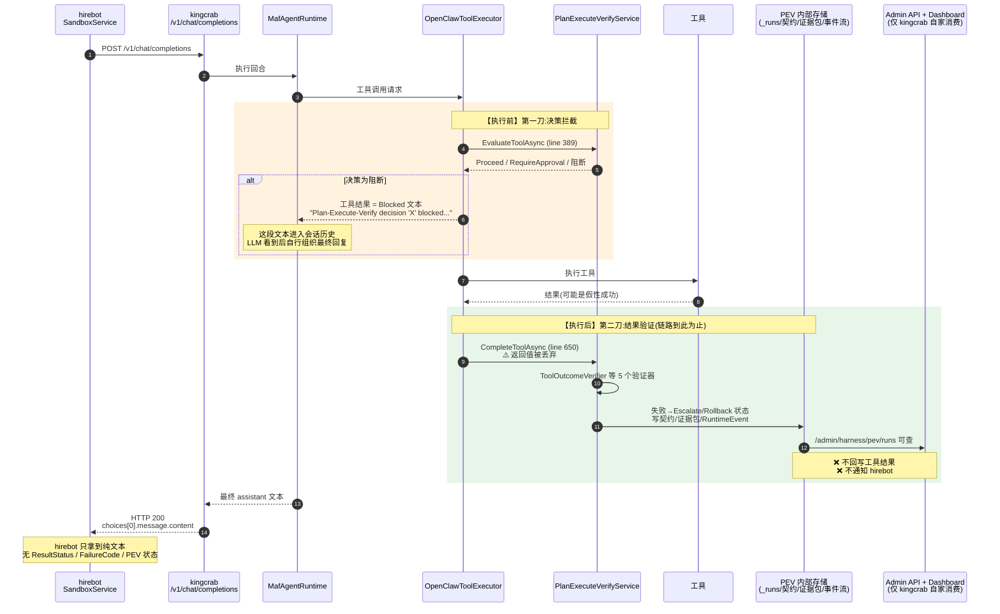
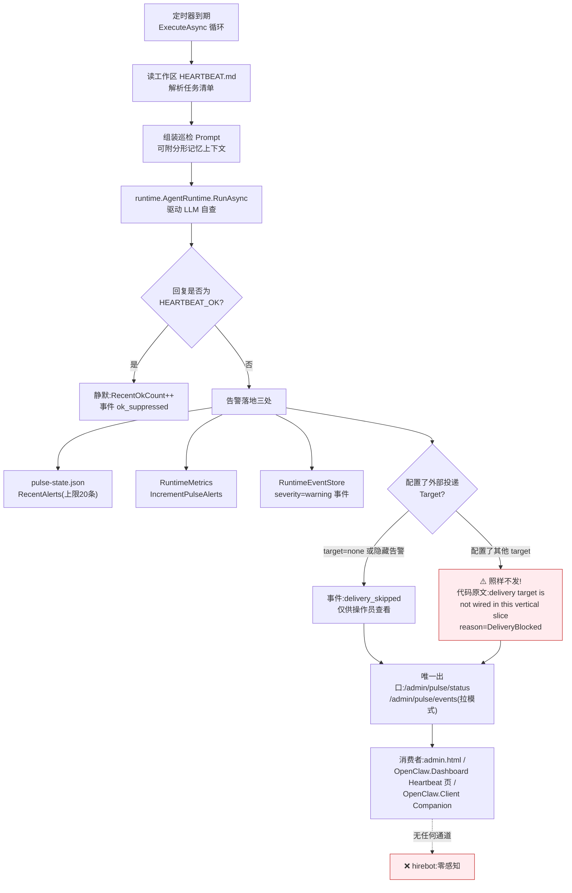

# 防"假性成功"与主动巡检机制向 hirebot 的传导链路分析

> 调研日期:2026-07-02
> 上游文档:[kingcrab智能体可靠性六大机制分析.md](kingcrab智能体可靠性六大机制分析.md)、[hirebot与kingcrab冗余功能模块分析.md](hirebot与kingcrab冗余功能模块分析.md)
> 调研范围:kingcrab `src/OpenClaw.Agent`、`src/OpenClaw.Gateway`;hirebot `back-end/HireBot.Core`
> 面向读者:中级开发工程师

---

## 一、结论速览

| 机制 | 是否主动传导/通知 hirebot | hirebot 能感知到的方式 |
|------|--------------------------|------------------------|
| 防"假性成功"(PEV 验证) | **否**,链路终止在 kingcrab 进程内 | 仅"带内文本":工具被拦截的说明文字混在 LLM 最终回复里,HTTP 200,无结构化错误码 |
| 主动巡检(RuntimePulseService) | **否**,外部投递代码里**明确未接线**(`not wired in this vertical slice`) | 完全感知不到;告警只留在 kingcrab 自己的状态文件、事件流和管理面板 |

一句话:这两个机制是 kingcrab 的**进程内自我保护**,产出全部落在 kingcrab 自己的状态存储、事件流、指标和 Admin API 上;**不存在 webhook、回调、消息队列等任何面向 hirebot 的主动通知通道**。hirebot 唯一可能"沾到边"的,是 LLM 在最终回复文本里顺嘴提了一句失败——这是不可靠的间接传导。

---

## 二、两个系统怎么连接(前置知识)

hirebot(招聘业务)通过 HTTP 调 kingcrab(AI 运行时)。hirebot 侧消费 kingcrab 的接口只有三类,代码都在 `HireBot.Core/Services/Sandbox/` 与 `Services/EmployeeRuntime/`:

| hirebot 调用的 kingcrab 接口 | hirebot 侧调用点 | hirebot 实际读取的内容 |
|---|---|---|
| `POST /v1/chat/completions`(OpenAI 兼容对话) | `SandboxService.cs:471` | **只取 `choices[0].message.content` 纯文本**(`SandboxService.cs:491-495`) |
| `GET /api/integration/sessions/{id}`(会话时间线) | `SandboxService.cs:588` | 历史消息里**只保留 `user` / `assistant` 两种角色**,工具调用轮被过滤掉(`SandboxService.cs:600-611`) |
| `admin/digital-employee/upload`、`admin/workspace/*`、`admin/channels/*` | `EvaluationService`、`EmployeeRuntimeService`、`InstanceChatService` | 上传/配置类,与可靠性机制无关 |

**关键旁证**:在 hirebot 整个 back-end 目录里 grep `pulse` / `heartbeat` / `PlanExecuteVerify` / `pev`,**零命中**——hirebot 代码里根本不存在消费这两个机制的任何入口。

---

## 三、防"假性成功"(PEV)的完整执行链路

### 3.1 链路总览

PEV 在工具执行的**前后各插一刀**,两刀的去向完全不同:



### 3.2 执行前拦截:唯一能"摸到" hirebot 的路径(带内文本)

[OpenClawToolExecutor.cs:389-416](../src/OpenClaw.Agent/OpenClawToolExecutor.cs#L389-L416):

1. 每次工具执行前调用 `_planExecuteVerify.EvaluateToolAsync(...)` 拿到决策;
2. `BlocksPlanExecuteVerifyDecision`([第 1045-1048 行](../src/OpenClaw.Agent/OpenClawToolExecutor.cs#L1045-L1048))判定:决策既不是 `Proceed` 也不是 `RequireApproval` 就拦截;
3. 拦截时构造一条**文本型工具结果**:`"Plan-Execute-Verify decision 'X' blocked tool execution: ..."`,状态 `Blocked`、失败码 `ApprovalRequired`;
4. 需要审批但会话没有审批通道时(hirebot 走的 `/v1/chat/completions` 正是无审批通道的场景),**自动拒绝**并生成类似的 Blocked 文本([第 441-462 行](../src/OpenClaw.Agent/OpenClawToolExecutor.cs#L441-L462))。

这条 Blocked 文本会作为工具结果进入会话历史,LLM 读到后**自行决定**在最终回复里怎么说。hirebot 在 [SandboxService.cs:491-495](../../hirebot/back-end/HireBot.Core/Services/Sandbox/SandboxService.cs#L491-L495) 只提取 `choices[0].message.content`——所以 hirebot 收到的是:

- **HTTP 200(成功状态码)**;
- 一段可能提到、也可能没提到失败的自然语言文本;
- `ResultStatus`、`FailureCode`、PEV run id 等结构化字段**全部丢失**。

> 通俗地说:kingcrab 拦下了危险操作,但告诉 hirebot 的方式是"让 AI 转述",而不是"发一个错误码"。转述得清不清楚,取决于模型发挥。

### 3.3 执行后验证:链路在 kingcrab 内部终止

[OpenClawToolExecutor.cs:650](../src/OpenClaw.Agent/OpenClawToolExecutor.cs#L650) 是关键证据:

```csharp
await _planExecuteVerify.CompleteToolAsync(pevDecision.Run, invocation, ct);
return new ToolExecutionResult { Invocation = invocation, ... };
```

`CompleteToolAsync` 的**返回值被直接丢弃**,紧接着返回的 `ToolExecutionResult` 用的还是验证前的 `invocation`。也就是说:5 个验证器(`ToolOutcomeVerifier` 防假性成功、`ApprovalVerifier` 等)即使判出 `Failed → Rollback/Escalate`,**也不会改写已经生成的工具结果,更不会插入任何面向调用方的通知**。

验证结果的实际去向(全部在 kingcrab 进程内,见 [PlanExecuteVerifyService.cs:646-688](../src/OpenClaw.Gateway/PlanExecuteVerifyService.cs#L646-L688)):

| 去向 | 说明 | 谁消费 |
|---|---|---|
| `_runs` 内存字典 | run 状态更新为 Verified / Failed / Escalated | `/admin/harness/pev/runs` 系列端点([AdminEndpoints.PlanExecuteVerify.cs](../src/OpenClaw.Gateway/Endpoints/AdminEndpoints.PlanExecuteVerify.cs)) |
| `HarnessContract` 状态 | `MarkStatusAsync` 置 Failed / Verified | 治理台账、Admin API |
| `EvidenceBundle` | 追加 "Plan-Execute-Verify result" 检查项 | 证据审计 |
| `RuntimeEventStore` | `pev_*` 事件 | admin.html、OpenClaw.Dashboard、OpenClaw.Client(Companion) |

这些出口的消费者**清一色是 kingcrab 自家的管理面**(admin.html、Dashboard、Companion 客户端),hirebot 一个都不调用。

### 3.4 hirebot 时间线接口也看不到

hirebot 的第二条读取路径 `GET /api/integration/sessions/{id}`([SandboxService.cs:586-611](../../hirebot/back-end/HireBot.Core/Services/Sandbox/SandboxService.cs#L586-L611))在拿到会话历史后,只保留 `role == "user" || role == "assistant"` 的消息——**携带 `ResultStatus`/`FailureCode` 的工具轮在 hirebot 侧被主动过滤掉了**。即使 kingcrab 把 Blocked 状态存进了历史,hirebot 也自己把它扔了。

---

## 四、主动巡检(RuntimePulseService)的完整执行链路

### 4.1 链路总览



### 4.2 逐步拆解

1. **定时触发**:[RuntimePulseService.ExecuteAsync](../src/OpenClaw.Gateway/RuntimePulseService.cs#L109-L134)(`BackgroundService`)按 `Pulse.Every`(默认 30 分钟)循环;
2. **读取体检单**:`ReadHeartbeatFile` 读工作区 `HEARTBEAT.md`,`ParseTasks` 解析 `tasks:` 块,`SelectDueTasks` 选出到期任务;
3. **LLM 自查**:`RunPulseAsync` 组装 Prompt("Observe, summarize, notify, and propose only... If nothing needs attention, reply HEARTBEAT_OK"),调用 `runtime.AgentRuntime.RunAsync` 让智能体自己检查;
4. **判定**:回复命中 `HEARTBEAT_OK`(`IsAck`)→ 静默计数;否则视为**告警**;
5. **告警落地**([第 249-274 行](../src/OpenClaw.Gateway/RuntimePulseService.cs#L249-L274)):写入 `./memory/admin/pulse-state.json` 的 `RecentAlerts`(最多 20 条)、指标 `IncrementPulseAlerts()`、`RuntimeEventStore` 一条 warning 事件;
6. **外部投递——设计了但没接线**,这是全案最硬的证据([第 266-273 行](../src/OpenClaw.Gateway/RuntimePulseService.cs#L266-L273)):

```csharp
if (string.Equals(config.Target, "none", ...) || !config.Visibility.ShowAlerts)
{
    AppendEvent(DeliverySkipped, "…external delivery skipped.", ...);
}
else
{
    AppendEvent(DeliverySkipped,
        $"Runtime Pulse alert retained for operator visibility; " +
        $"delivery target '{config.Target}' is not wired in this vertical slice. " +
        $"reason={PulseSkipReasons.DeliveryBlocked}", ...);
}
```

   翻译成人话:**配置里就算写了投递目标(比如某个渠道),代码也只会记一条"投递被跳过"的事件,不会真的发出去**。配置项 `Target`/`To`/`AccountId` 是为将来预留的接口,当前版本是"只留痕、不投递"。

7. **唯一出口是拉模式 Admin API**:`/admin/pulse/status`、`/admin/pulse/events`、`/admin/pulse/run`([AdminEndpoints.Runtime.cs:227-283](../src/OpenClaw.Gateway/Endpoints/AdminEndpoints.Runtime.cs#L227-L283)),消费者是 kingcrab 自己的 admin.html、[Heartbeat.razor](../src/OpenClaw.Dashboard/Pages/Heartbeat.razor) 面板和 `OpenClawHttpClient`(Companion)。**hirebot 后端没有任何代码调用这些端点。**

---

## 五、通俗总结(讲给中级工程师)

把 kingcrab 想象成一个"带质检科和巡逻队的工厂",hirebot 是"下订单的客户":

- **质检科(PEV 防假性成功)**:工人(工具)干完活,质检科会检查"活儿是不是真干成了"。查出问题会在**厂内**贴告示、记台账、把工单打回(Escalate/Rollback)——但**不会给客户打电话**。客户唯一可能知道出事的方式,是接待员(LLM)在回复订单时顺嘴提了一句"刚才有道工序被拦下来了"。接待员提不提、怎么提,没有制度保证(纯文本、HTTP 200、无错误码)。
- **巡逻队(RuntimePulseService 主动巡检)**:每 30 分钟按 `HEARTBEAT.md` 巡一圈厂房,发现停摆就在**厂内公告栏**(pulse-state.json + Admin 面板)贴告警。厂里其实设计了"给外部发通知"的表格(`Target` 配置),但**电话线压根没接**(`not wired in this vertical slice`),所以客户永远收不到巡逻队的告警。
- **客户(hirebot)自己还加了一层屏蔽**:它看订单回执时只读"客服说的话"(user/assistant 消息),把所有"内部工单记录"(工具轮、状态码)都过滤掉了。

### 若需要真正的传导,缺的是什么

当前架构下,若业务上需要 hirebot 感知这两类事件,可行方向(按侵入度从低到高):

1. **hirebot 轮询 kingcrab Admin API**:定时拉 `/admin/pulse/status`、`/admin/harness/pev/runs?status=escalated`(需解决 Admin 鉴权,改动最小);
2. **扩展 `/api/integration/sessions/{id}`**:在会话详情里透出工具轮的 `ResultStatus`/`FailureCode`,并让 hirebot 停止过滤非 user/assistant 消息;
3. **把 Pulse 的投递接线**:实现 `config.Target` 的真实投递通道(webhook 指向 hirebot 回调接口),这正是代码注释里预留的"vertical slice"缺口。

---

## 六、证据清单

| # | 结论 | 证据位置 |
|---|------|----------|
| 1 | hirebot 只读对话纯文本 | `hirebot/back-end/HireBot.Core/Services/Sandbox/SandboxService.cs:469-495` |
| 2 | hirebot 时间线过滤掉工具轮 | 同上 `:600-611` |
| 3 | hirebot 全库无 pulse/pev 引用 | grep `pulse|heartbeat|PlanExecuteVerify|pev` 于 `hirebot/back-end` → 零业务命中 |
| 4 | PEV 执行前拦截产生 Blocked 文本 | `kingcrab/src/OpenClaw.Agent/OpenClawToolExecutor.cs:402-416` |
| 5 | 无审批通道时自动拒绝 | 同上 `:441-462` |
| 6 | PEV 执行后验证结果被丢弃、不回写 | 同上 `:650`;`PlanExecuteVerifyService.cs:646-688` |
| 7 | PEV 结果仅经 Admin API 暴露 | `kingcrab/src/OpenClaw.Gateway/Endpoints/AdminEndpoints.PlanExecuteVerify.cs:14-80` |
| 8 | Pulse 告警外部投递未接线 | `kingcrab/src/OpenClaw.Gateway/RuntimePulseService.cs:266-273` |
| 9 | Pulse 仅经 Admin API 暴露 | `kingcrab/src/OpenClaw.Gateway/Endpoints/AdminEndpoints.Runtime.cs:227-283` |
| 10 | Pulse 消费者为 kingcrab 自家面板 | `admin.html:3924-3970`、`OpenClaw.Dashboard/Pages/Heartbeat.razor:572-640`、`OpenClaw.Client/OpenClawHttpClient.cs:147-151` |
