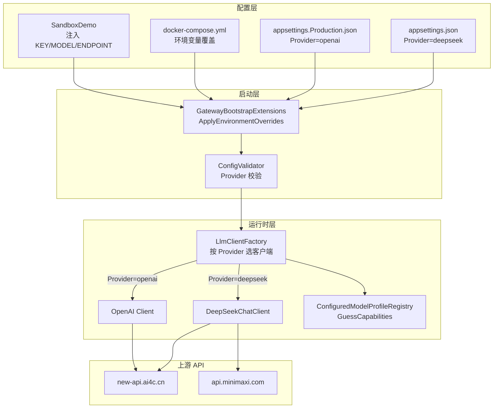
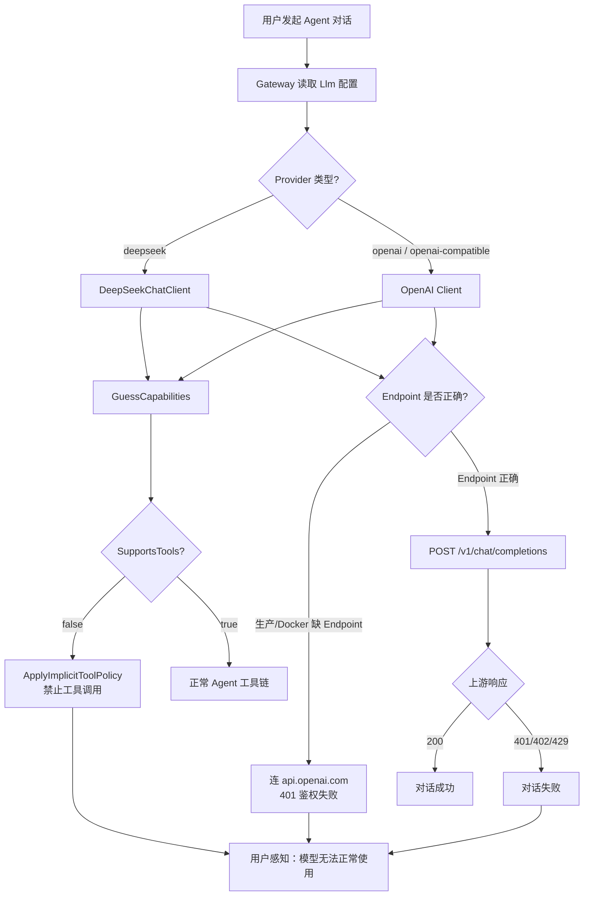
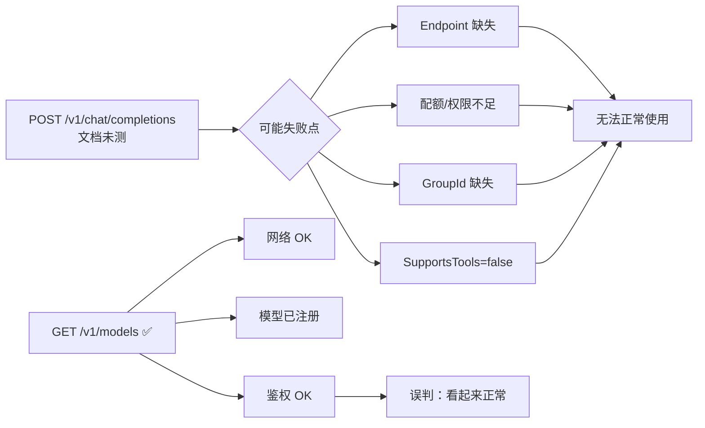

# LLM 双模型故障分析与修复设计文档

> 面向中级工程师：说明 `new-api.ai4c.cn/gpt-5.2` 与 `MiniMax-M2.5` 为何「模型列表可用但无法正常使用」，并给出可执行的修复路径。

---

## 1. 背景与目标

### 现状

`docs/LLM配置信息汇总.md`（2026-08-13）记录了两个 LLM 端点的配置与实测结果：

| 端点 | 默认模型 | 文档测试 | 用户反馈 |
|------|----------|----------|----------|
| `https://new-api.ai4c.cn/v1` | `gpt-5.2` | GET `/v1/models` ✅ | 无法正常使用 |
| `https://api.minimaxi.com/v1` | `MiniMax-M2.5` | GET `/v1/models` ✅ | 无法正常使用 |

文档**没有**记录 `POST /v1/chat/completions` 的错误日志、HTTP 状态码或 Gateway 启动日志。

### 痛点

1. **测试覆盖不足**：模型列表可用 ≠ 对话推理可用 ≠ Agent 工具链可用。
2. **配置错配**：Provider、Model、Endpoint 在开发/生产/Docker/沙箱之间不一致。
3. **能力误判**：Provider=`deepseek` 时，网关将 `SupportsTools=false`，Agent 无法调工具。

### 目标

- 定位两个模型失效的**具体原因**与**根因**。
- 给出**分阶段、可验收**的修复方案。
- 建立后续「对话可用」的冒烟验证标准。

### 成功标准

- 两个模型均能完成 `POST /v1/chat/completions` 并返回有效内容。
- Gateway Agent 场景下工具调用不被隐式禁用。
- Docker/生产/沙箱三环境的 Provider、Endpoint、Key 注入一致且可追踪。

---

## 2. 范围

### 2.1 包含

- Gateway 主 LLM（`gpt-5.2` @ new-api.ai4c.cn）
- SandboxDemo 沙箱 LLM（`MiniMax-M2.5` @ api.minimaxi.com）
- 相关配置文件、环境变量、代码行为交叉分析
- 修复方案与分阶段实施步骤

### 2.2 不包含

- Azure OpenAI、Gemini、ElevenLabs 等其他 AI 服务
- 修改生产数据库表结构
- 实际调用外部 API 验证（需本地执行冒烟脚本）
- API Key 轮换操作（仅给出建议）

---

## 3. 架构概览

**LLM 配置在 kingcrab 中的调用链**（Gateway 是 ASP.NET Core 应用，负责路由 LLM 请求）：



**关键组件说明：**

| 组件 | 作用 |
|------|------|
| `ApplyEnvironmentOverrides` | 用 `MODEL_PROVIDER_KEY/MODEL/ENDPOINT` 覆盖 JSON 配置 |
| `LlmClientFactory` | 按 Provider 字符串选择 HTTP 客户端实现 |
| `GuessCapabilities` | 决定模型是否支持工具（Tools）、视觉等能力 |
| `OpenAiEndpoints` | 当 `SupportsTools=false` 时，禁止 Agent 隐式使用工具 |

---

## 4. 核心流程

### 4.1 请求链路（正常 vs 异常）



### 4.2 文档测试 vs 真实故障



---

## 5. 关键设计

### 5.1 模型一：gpt-5.2 @ new-api.ai4c.cn

#### 配置快照

| 配置项 | 开发值 | 生产值 | Docker 默认 |
|--------|--------|--------|-------------|
| Provider | `deepseek` | `openai` | 继承 Production |
| Model | `gpt-5.2` | `gpt-5.2` | `gpt-4o` |
| Endpoint | `https://new-api.ai4c.cn/v1` | **未配置** | **空** |
| ApiKey | 明文硬编码 | 需 `MODEL_PROVIDER_KEY` | 需 `MODEL_PROVIDER_KEY` |
| Plugins.Enabled | `true` | `false` | `false` |

配置文件路径：

- `src/OpenClaw.Gateway/appsettings.json`（L22–45）
- `src/OpenClaw.Gateway/appsettings.Production.json`（L6–13）
- `docker-compose.yml`（L13–20）
- `Dockerfile`（L46–52）

#### 根因分析

| 序号 | 失效原因 | 置信度 | 说明 |
|------|----------|--------|------|
| R1 | **Provider 与 Model 错配** | 高 | Provider=`deepseek` 但 Model=`gpt-5.2`（OpenAI 系列），走 `DeepSeekChatClient` 而非 OpenAI 客户端 |
| R2 | **SupportsTools=false** | 高 | `GuessCapabilities()` 不含 `deepseek`，Agent 工具被 `ApplyImplicitToolPolicy` 禁用 |
| R3 | **生产/Docker 缺 Endpoint** | 高 | 无 Endpoint 时 openai Provider 默认连 `api.openai.com`，new-api 的 Key 会 401 |
| R4 | **Docker 默认模型不一致** | 中 | `MODEL_PROVIDER_MODEL` 默认 `gpt-4o`，非文档中的 `gpt-5.2` |
| R5 | **Provider 校验盲区** | 中 | `deepseek` 不在 `BuiltInLlmProviders`；Docker 下 `Plugins.Enabled=false` 时可能启动失败 |
| R6 | **Smoke 探测跳过** | 中 | `ProviderSmokeProbe` 无 deepseek 探针，健康检查不验证对话 |
| R7 | **上游 chat 失败** | 待验证 | 配额、渠道权限、Key 轮换等，文档无日志 |

#### 代码依据

`GuessCapabilities` 中 `deepseek` 不在工具支持列表：

```202:202:src/OpenClaw.Gateway/Models/ConfiguredModelProfileRegistry.cs
        var supportsTools = provider is "openai" or "openai-compatible" or "aperture" or "azure-openai" or "groq" or "together" or "lmstudio" or "anthropic" or "claude" or "anthropic-vertex" or "amazon-bedrock" or "gemini" or "google";
```

工具被禁逻辑：

```29:35:src/OpenClaw.Gateway/Endpoints/OpenAiEndpoints.cs
        if (!TryResolveSelectedProfile(session, runtime, out var profile) ||
            profile.Capabilities.SupportsTools)
        {
            return;
        }

        session.RouteAllowedTools = [NoImplicitToolsAllowed];
```

---

### 5.2 模型二：MiniMax-M2.5 @ api.minimaxi.com

#### 配置快照

| 配置项 | 值 | 来源 |
|--------|-----|------|
| LlmModel | `MiniMax-M2.5` | `src/OpenClaw.SandboxDemo/appsettings.json` L15 |
| LlmEndpoint | `https://api.minimaxi.com/v1` | 同上 L16 |
| LlmApiKey | `sk-cp-...`（明文） | 同上 L17 |
| 注入变量 | KEY / MODEL / ENDPOINT | `SandboxManager.cs` L71–73 |
| **未注入** | Provider | 沿用镜像内 `deepseek` |

#### 根因分析

| 序号 | 失效原因 | 置信度 | 说明 |
|------|----------|--------|------|
| R1 | **沙箱未覆盖 Provider** | 高 | 只注入 KEY/MODEL/ENDPOINT，Provider 仍为 `deepseek` → 同模型一，工具被禁 |
| R2 | **可能缺 GroupId** | 中-高 | MiniMax 部分账户/接口要求 URL 参数 `?GroupId=xxx`；文档未配置 |
| R3 | **DeepSeekChatClient 代理 MiniMax** | 中 | OpenAI 兼容格式通常可用，但非最优路径 |
| R4 | **上游 chat 失败** | 待验证 | 配额、GroupId、Key 有效性等 |

沙箱环境变量注入（无 Provider）：

```71:73:src/OpenClaw.SandboxDemo/SandboxManager.cs
        ["MODEL_PROVIDER_KEY"] = LlmApiKey,
        ["MODEL_PROVIDER_MODEL"] = LlmModel,
        ["MODEL_PROVIDER_ENDPOINT"] = LlmEndpoint,
```

---

### 5.3 跨模型共性故障

| 故障点 | 影响 | 涉及文件 |
|--------|------|----------|
| Companion 用 `OPENCLAW_MODEL_PROVIDER_KEY`，Gateway 读 `MODEL_PROVIDER_KEY` | Companion 启动时 Key 注入失败 | `ManagedGatewayService.cs` L10 |
| 多处明文硬编码 Key | 泄露后鉴权失效 | appsettings.json、SandboxDemo appsettings |
| 仅测 GET /models | 运维误判为可用 | `docs/LLM配置信息汇总.md` 附录 B |
| GET /models ✅ 不能证明 chat 可用 | 列表与推理权限可能分离 | — |

---

## 6. 接口 / 配置 / 代码要点

### 6.1 环境变量覆盖逻辑

Gateway 启动时读取顺序（高优先级在前）：

```224:227:src/OpenClaw.Gateway/Bootstrap/GatewayBootstrapExtensions.cs
        config.Llm.ApiKey = ResolveSecretRefOrNull(config.Llm.ApiKey) ?? Environment.GetEnvironmentVariable("MODEL_PROVIDER_KEY");
        config.Llm.Model = Environment.GetEnvironmentVariable("MODEL_PROVIDER_MODEL") ?? config.Llm.Model;
        config.Llm.Endpoint = ResolveSecretRefOrNull(config.Llm.Endpoint) ?? Environment.GetEnvironmentVariable("MODEL_PROVIDER_ENDPOINT");
        config.AuthToken ??= Environment.GetEnvironmentVariable("OPENCLAW_AUTH_TOKEN");
```

**注意**：没有 `MODEL_PROVIDER` 环境变量，Provider 只能改 JSON 配置。

### 6.2 推荐配置（开发环境 appsettings.json）

将 Provider 改为 `openai-compatible`（OpenAI 兼容代理的标准写法）：

```json
"Llm": {
  "Provider": "openai-compatible",
  "Model": "gpt-5.2",
  "ApiKey": "env:MODEL_PROVIDER_KEY",
  "Endpoint": "https://new-api.ai4c.cn/v1",
  "MaxTokens": 16384,
  "Temperature": 0.7,
  "TimeoutSeconds": 600,
  "RetryCount": 3,
  "SupportsVision": false,
  "EnableThinking": false
}
```

### 6.3 Docker Compose 补全

```yaml
environment:
  - MODEL_PROVIDER_KEY=${MODEL_PROVIDER_KEY:?Set MODEL_PROVIDER_KEY}
  - MODEL_PROVIDER_MODEL=${OPENCLAW_MODEL:-gpt-5.2}
  - MODEL_PROVIDER_ENDPOINT=${MODEL_PROVIDER_ENDPOINT:-https://new-api.ai4c.cn/v1}
  - OpenClaw__Llm__Provider=openai-compatible
```

### 6.4 沙箱 SandboxDemo 补 Provider 注入

在 `SandboxManager.cs` 的 `BuildRuntimeEnv` 中增加：

```csharp
["OpenClaw__Llm__Provider"] = "openai-compatible",
```

MiniMax 若需 GroupId，Endpoint 改为：

```
https://api.minimaxi.com/v1?GroupId=YOUR_GROUP_ID
```

（GroupId 从 MiniMax 控制台获取。）

### 6.5 对话冒烟脚本（PowerShell）

**不含真实 Key**，需替换 `$env:LLM_API_KEY`：

```powershell
# 模型一：new-api / gpt-5.2
$headers = @{
  "Authorization" = "Bearer $env:LLM_API_KEY"
  "Content-Type"  = "application/json"
}
$body = '{"model":"gpt-5.2","messages":[{"role":"user","content":"Reply with READY."}],"temperature":0,"max_tokens":8}'
Invoke-RestMethod -Uri "https://new-api.ai4c.cn/v1/chat/completions" -Method POST -Headers $headers -Body $body -TimeoutSec 30

# 模型二：MiniMax / M2.5
$body2 = '{"model":"MiniMax-M2.5","messages":[{"role":"user","content":"Reply with READY."}],"temperature":0,"max_tokens":8}'
Invoke-RestMethod -Uri "https://api.minimaxi.com/v1/chat/completions" -Method POST -Headers $headers -Body $body2 -TimeoutSec 30
```

### 6.6 Gateway 本地启动验证

```powershell
cd e:\Documents\CODES\ai4c_Projects\kingcrab
$env:MODEL_PROVIDER_KEY = "你的Key"
$env:MODEL_PROVIDER_ENDPOINT = "https://new-api.ai4c.cn/v1"
$env:MODEL_PROVIDER_MODEL = "gpt-5.2"
dotnet run --project src/OpenClaw.Gateway/OpenClaw.Gateway.csproj -- --doctor
```

`--doctor` 会跑 Provider Smoke 等检查（`openai-compatible` 有内置探针，`deepseek` 无）。

---

## 7. 分阶段实施步骤

### 阶段一：确认真实故障点（诊断）

- **目标**：区分「配置问题」与「上游 API 问题」。
- **任务**：
  1. 执行 6.5 节两个 chat 冒烟脚本，记录 HTTP 状态码与响应 body。
  2. 本地 `dotnet run -- --doctor`，查看 Provider Smoke 结果。
  3. 若用 Docker，检查容器内实际环境变量：`docker exec openclaw-gateway printenv | findstr MODEL`.
- **验收**：
  - 有 chat 请求/响应日志（成功或失败均可）。
  - 能明确失败发生在「网关配置」还是「上游 API」。

### 阶段二：修复 Provider 与 Endpoint（P0）

- **目标**：Gateway 正确路由到 new-api / MiniMax，且 SupportsTools=true。
- **任务**：
  1. 修改 `appsettings.json`：Provider → `openai-compatible`（见 6.2）。
  2. 修改 `appsettings.Production.json`：同步 Provider，并文档化 Endpoint 必填。
  3. 更新 `docker-compose.yml`（见 6.3）。
  4. 在 `SandboxManager.cs` 增加 `OpenClaw__Llm__Provider` 注入（见 6.4）。
  5. MiniMax 若 chat 401，在 Endpoint 追加 `?GroupId=xxx`。
- **验收**：
  - `--doctor` Provider Smoke 为 Pass 或明确 Fail 原因。
  - Agent 对话可触发工具调用（不再被 `NoImplicitToolsAllowed` 拦截）。

### 阶段三：密钥安全与变量统一（P1）

- **目标**：消除明文 Key，统一 Companion 与 Gateway 变量名。
- **任务**：
  1. 将所有 ApiKey 改为 `env:MODEL_PROVIDER_KEY`。
  2. 轮换已泄露 Key（文档、git 历史中的 Key 视为已暴露）。
  3. Companion 启动 Gateway 时同时设置 `MODEL_PROVIDER_KEY`（或在 Gateway 侧增加对 `OPENCLAW_MODEL_PROVIDER_KEY` 的回退读取）。
- **验收**：
  - appsettings 中无明文 Key。
  - Companion 与 CLI 启动 Gateway 均能通过鉴权。

### 阶段四：建立持续验证（P2）

- **目标**：避免「models 可用、chat 不可用」的监控盲区。
- **任务**：
  1. 在 CI 或运维脚本中加入 chat 冒烟（6.5 脚本）。
  2. 考虑为 `deepseek` 注册 ProviderSmokeProbe，或弃用 deepseek 作为非 DeepSeek 模型的 Provider。
  3. 更新 `docs/LLM配置信息汇总.md`：附录 B 增加 chat 测试结果列。
- **验收**：
  - 部署前自动跑 chat 冒烟。
  - 文档含 models + chat 双项测试结果。

---

## 8. 风险与待决事项

| 风险/待决 | 影响 | 建议 |
|-----------|------|------|
| 文档无 chat 错误日志 | 无法 100% 确认上游 API 失败原因 | 阶段一必须先跑 chat 冒烟 |
| MiniMax GroupId 要求未确认 | chat 可能 401 | 查 MiniMax 控制台账户类型 |
| Key 已泄露 | 随时可能鉴权失败 | 阶段三立即轮换 |
| 改 Provider 影响现有 DeepSeek 专用逻辑 | deepseek-v4 等模型需保留 DeepSeekChatClient | 仅对 new-api/MiniMax 用 openai-compatible；DeepSeek 官方模型仍用 deepseek |
| 生产 Endpoint 依赖环境变量 | 漏配即连错 api.openai.com | docker-compose 设默认值 + 启动校验 |

---

## 9. 附录

### 9.1 故障因果汇总表

| 模型 | 具体失效原因 | 根因定位 | 排查结论 |
|------|-------------|----------|----------|
| gpt-5.2 | Agent 无法调工具；生产可能连错端点 | 配置层：Provider/Endpoint/部署参数 | **配置错误为主因**；chat 失败待实测 |
| MiniMax-M2.5 | Agent 无法调工具；可能 chat 401 | 配置层：Provider 未覆盖 + 可能缺 GroupId | **网关配置为主因**；MiniMax 鉴权待确认 |

### 9.2 配置文件索引

| 文件 | 路径 |
|------|------|
| Gateway 主配置 | `src/OpenClaw.Gateway/appsettings.json` |
| Gateway 生产配置 | `src/OpenClaw.Gateway/appsettings.Production.json` |
| Docker Compose | `docker-compose.yml` |
| SandboxDemo 配置 | `src/OpenClaw.SandboxDemo/appsettings.json` |
| 沙箱环境注入 | `src/OpenClaw.SandboxDemo/SandboxManager.cs` |
| 能力探测 | `src/OpenClaw.Gateway/Models/ConfiguredModelProfileRegistry.cs` |
| 客户端工厂 | `src/OpenClaw.Gateway/Extensions/LlmClientFactory.cs` |
| 源分析文档 | `docs/LLM配置信息汇总.md` |

### 9.3 术语表

| 术语 | 含义 |
|------|------|
| Provider | 网关选择 LLM 客户端的类型标识（如 openai、deepseek、openai-compatible） |
| Endpoint | LLM API 基础 URL（如 `https://new-api.ai4c.cn/v1`） |
| SupportsTools | 网关判定模型是否支持 function calling；false 时 Agent 不能调工具 |
| Provider Smoke | 启动时向 LLM 发简短对话请求的健康检查 |
| openai-compatible | 适用于 new-api、one-api 等 OpenAI 格式代理的 Provider 类型 |

---

**文档版本**：v1.0  
**基于**：`docs/LLM配置信息汇总.md` + kingcrab 源码交叉验证  
**下一步**：执行阶段一 chat 冒烟，确认上游 API 是否也有独立故障。