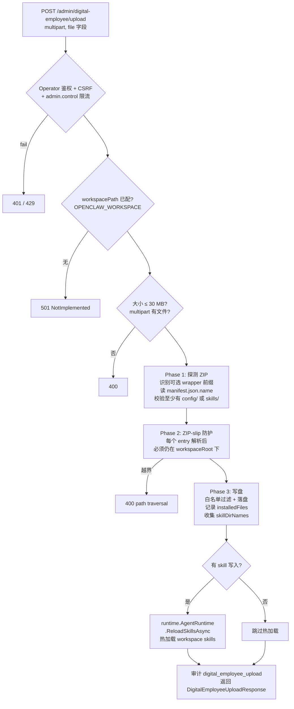

# 数字员工模板（Digital Employee Template）

数字员工模板是一个 **ZIP 压缩包**，由 OpenClaw Gateway 的 `/admin/digital-employee/upload` 端点接收并解压到当前 workspace。它本质上是一组 **配置文件 + 技能包 + 本体片段** 的归档，用来一键给某个 Agent 装上人格、记忆、能力。

> 后端实现：[`src/OpenClaw.Gateway/Endpoints/DigitalEmployeeEndpoints.cs`](../src/OpenClaw.Gateway/Endpoints/DigitalEmployeeEndpoints.cs)
> 响应模型：[`DigitalEmployeeUploadResponse`](../src/OpenClaw.Core/Models/AdminApiModels.cs)
> 前端入口：[`src/OpenClaw.Gateway/wwwroot/webchat.js`](../src/OpenClaw.Gateway/wwwroot/webchat.js) 中“安装数字员工”按钮

---

## 1. ZIP 包结构

支持顶层有一个**可选的包装目录**（如 `my-employee/`），实际识别的是下面这三个目录加一个 manifest：

```
[wrapper/]
├── manifest.json           只读 name 字段（包名），不写盘
├── config/
│   ├── AGENTS.md           ┐
│   ├── SOUL.md             │ 仅这 4 个白名单文件会被解出
│   ├── IDENTITY.md         │ 直接落到 workspace 根
│   └── MEMORY.md           ┘
├── skills/
│   └── <skill-name>/**     skill 目录名必须匹配 ^[a-zA-Z0-9][a-zA-Z0-9_\-.]{0,63}$
│                           整个子树落到 workspace/skills/<skill-name>/
└── ontology/
    └── *.json                只接受顶层 .json，落到 workspace/ontology/
```

**严格规则**（`MapEntryToWorkspaceRelative` 实现）：

| 输入 | 行为 |
|---|---|
| `config/` 下不在白名单的文件 | 静默丢弃 |
| `config/<dir>/...`（带子目录） | 静默丢弃 |
| `skills/<bad-name>/...` | 静默丢弃 |
| `ontology/<sub>/foo.md`、`ontology/foo.txt` | 静默丢弃 |
| 任何其他顶层目录、`manifest.json` 自身 | 不解出（manifest 只读 name 字段） |

---

## 2. 上传流程 4 阶段



---

## 3. 关键安全 / 防呆点

- **鉴权**：要求 Operator 身份 + CSRF token（`AuthorizeOperatorRequest(..., requireCsrf: true)`）
- **限流**：`admin.control` 策略
- **大小**：硬上限 30 MB（`MaxUploadBytes = 30 * 1024 * 1024`）
- **ZIP-slip**：Phase 2 用 `Path.GetFullPath` 把目标路径规范化后再校验前缀，拒绝任何 `../` 逃逸
- **白名单**：`AllowedConfigFiles` 写死了仅 4 个 config 文件（`AGENTS.md` / `SOUL.md` / `IDENTITY.md` / `MEMORY.md`）可写到 workspace 根，避免污染
- **包名**：仅从 `manifest.json` 的 `name` 字段读出来，回显 + 写入审计日志，不影响落盘路径

---

## 4. 安装副作用 / 生效时机

| 内容类型 | 落点 | 生效时机 |
|---|---|---|
| `skills/<name>/**` | `workspace/skills/<name>/` | **立即热加载**，`runtime.AgentRuntime.ReloadSkillsAsync` 返回当前 skill 总数 |
| `ontology/*.md` | `workspace/ontology/` | 由本体加载器按其自身策略读取 |
| `config/{AGENTS,SOUL,IDENTITY,MEMORY}.md` | workspace 根 | **下次 Agent 重启才生效** |

---

## 5. 响应模型

`DigitalEmployeeUploadResponse` 字段：

| 字段 | 含义 |
|---|---|
| `Success` | 是否成功 |
| `Error` | 失败原因（成功时为空） |
| `Name` | manifest.json 的 `name` |
| `SkillsInstalled` | 本次安装/更新的 skill 目录数 |
| `InstalledFiles` | 本次写入的 workspace 相对路径列表（正斜杠） |
| `TotalSkillsLoaded` | 热加载后 workspace 当前总 skill 数 |

---

## 6. 错误响应一览

| HTTP 状态 | 触发条件 |
|---|---|
| `401 Unauthorized` | Operator 鉴权或 CSRF 校验失败 |
| `429 Too Many Requests` | 命中 `admin.control` 限流策略 |
| `501 Not Implemented` | `OPENCLAW_WORKSPACE` 未配置 |
| `400 Bad Request` | 未携带文件 / 超过 30 MB / ZIP 损坏 / 不含 `config/` 或 `skills/` / 命中 ZIP-slip |
| `500 Internal Server Error` | 解压阶段异常（落盘失败等） |

所有错误均以 `DigitalEmployeeUploadResponse { Success = false, Error = "<原因>" }` 形式返回。

---

## 7. 前端入口

`webchat.js` 中“安装数字员工”按钮提交逻辑：FormData 单 `file` 字段 → `POST /admin/digital-employee/upload` → 渲染 `name` + `installedFiles` 列表，安装后 toast `"✅ 数字员工模板安装成功"` 并把侧栏列表标 dirty 触发刷新。

---

## 8. 最小可用模板示例

最小可上传 ZIP（不必装 skill 即可跑通）：

```
demo-employee.zip
├── manifest.json          { "name": "demo-employee" }
├── config/
│   ├── SOUL.md            （人设）
│   ├── IDENTITY.md        （身份/边界）
│   └── AGENTS.md          （工具/工作流约束）
└── ontology/
    └── domain.md          （领域本体片段）
```

带技能时加 `skills/<name>/SKILL.md` 即可立刻热加载，可参照 [`src/OpenClaw.Plugins.EmploymentCoachWorkflow/skills/`](../src/OpenClaw.Plugins.EmploymentCoachWorkflow/skills) 现成 skill 的目录形态。

---

## 9. `manifest.json` Schema 草案

> 状态：**草案**。当前后端（[`DigitalEmployeeEndpoints.cs`](../src/OpenClaw.Gateway/Endpoints/DigitalEmployeeEndpoints.cs) Phase 1）**只读 `name` 字段**，其余字段**仅用于人工识别和外部工具（如 NCrew 打包器、CI 校验脚本）**，写入但不会影响落盘行为；后端也不会因为缺失这些字段而拒绝包。`additionalProperties: true` 是有意保留的，允许 NCrew 等上游打包器自由扩展私有字段。

### 9.1 字段总览

| 字段 | 类型 | 必填 | 后端是否读取 | 说明 |
|---|---|:---:|:---:|---|
| `name` | string | ✅ | ✅ 回显 + 审计日志 | 人类可读的包名 |
| `version` | string (SemVer) | ❌ | ❌ | 语义化版本号，便于追溯 |
| `author` | string | ❌ | ❌ | 作者/组织标识 |
| `description` | string | ❌ | ❌ | 一句话功能简述 |
| 其他自定义字段 | any | ❌ | ❌ | 上游打包器可自由扩展 |

### 9.2 JSON Schema（draft-2020-12）

```json
{
  "$schema": "https://json-schema.org/draft/2020-12/schema",
  "$id": "https://openclaw.dev/schemas/digital-employee-manifest.schema.json",
  "title": "Digital Employee Manifest",
  "description": "OpenClaw 数字员工模板包（NCrew 兼容）的元数据描述。",
  "type": "object",
  "required": ["name"],
  "additionalProperties": true,
  "properties": {
    "name": {
      "type": "string",
      "minLength": 1,
      "maxLength": 128,
      "description": "包名。后端会读出来回显并写入审计日志（action=digital_employee_upload, target=<name>）。建议使用 ASCII 字母数字 + 短横/下划线，便于跨系统传递。",
      "examples": ["hr-coach", "sales-assistant-zh"]
    },
    "version": {
      "type": "string",
      "pattern": "^(0|[1-9]\\d*)\\.(0|[1-9]\\d*)\\.(0|[1-9]\\d*)(?:-[0-9A-Za-z-]+(?:\\.[0-9A-Za-z-]+)*)?(?:\\+[0-9A-Za-z-]+(?:\\.[0-9A-Za-z-]+)*)?$",
      "description": "语义化版本号（SemVer 2.0.0）。当前后端不解析，仅用于人工/CI 识别。",
      "examples": ["1.0.0", "0.3.1", "1.0.0-rc.1", "2.1.0+build.20260101"]
    },
    "author": {
      "type": "string",
      "minLength": 1,
      "maxLength": 256,
      "description": "作者或组织标识，可包含邮箱（RFC 5322 风格）或团队名。当前后端不解析。",
      "examples": ["OpenClaw Team <devs@openclaw.dev>", "内部 HR 平台组"]
    },
    "description": {
      "type": "string",
      "maxLength": 2048,
      "description": "包功能/适用场景的一句话简述（建议 ≤ 200 字）。当前后端不解析，仅用于 UI/Wiki 展示。"
    }
  }
}
```

该文件**建议同步落盘**为 [`docs/schemas/digital-employee-manifest.schema.json`](./schemas/digital-employee-manifest.schema.json)（按需创建），便于 IDE / CI 引用 `$schema` 自动校验。

### 9.3 最小示例（仅必填）

```json
{
  "name": "demo-employee"
}
```

### 9.4 完整示例（推荐）

```json
{
  "$schema": "https://openclaw.dev/schemas/digital-employee-manifest.schema.json",
  "name": "hr-coach",
  "version": "1.2.0",
  "author": "OpenClaw Team <devs@openclaw.dev>",
  "description": "面向 HR 场景的对话教练，含简历筛选与面试问答两组 skill。"
}
```

### 9.5 兼容性约定

- 上游 NCrew 打包器若已写入更多字段（如 `tags`、`license`、`homepage`），**保持原样**即可；后端不会拒绝包，本仓库的 IDE/Wiki 工具也不应静默删除这些字段。
- 后端未来若要新增字段读取（如 `version` 写入审计日志），应**保留向后兼容**：缺失视为 `null`，不抛 400。
- 工具链需要**强校验**时（CI 验包），可在本草案基础上再叠加一份内部 schema，把 `additionalProperties` 收紧或把 `version`/`author` 设为必填。

---

## 10. 相关链接

- 后端端点实现：[`DigitalEmployeeEndpoints.cs`](../src/OpenClaw.Gateway/Endpoints/DigitalEmployeeEndpoints.cs)
- 响应 DTO：[`AdminApiModels.cs`](../src/OpenClaw.Core/Models/AdminApiModels.cs) → `DigitalEmployeeUploadResponse`
- JSON Source-Generation 注册：[`Session.cs`](../src/OpenClaw.Core/Models/Session.cs) → `CoreJsonContext`
- 雇佣教练工作流（数字员工模板包的典型生产者）：[`OpenClaw.Plugins.EmploymentCoachWorkflow`](../src/OpenClaw.Plugins.EmploymentCoachWorkflow)
- WebChat 上传按钮：[`webchat.js`](../src/OpenClaw.Gateway/wwwroot/webchat.js) 搜 `digital-employee`
