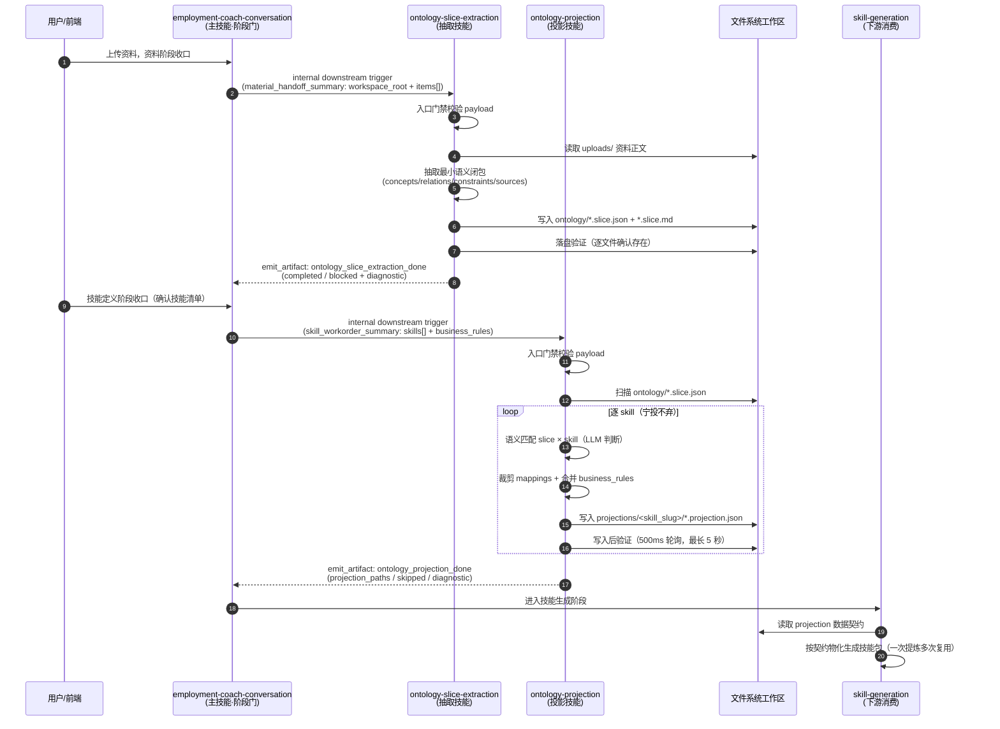
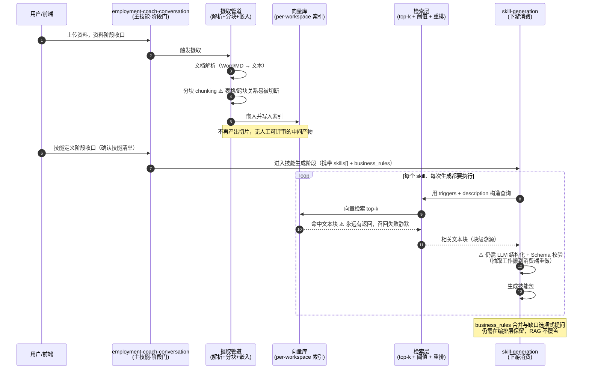

# hirebot 本体投影功能模块 RAG 替代可行性与优缺点对比分析

> 分析日期：2026-07-04
> 依据材料：
> - `kingcrab/docs/hirebot本体投影功能模块作用与核心概念解析.md`（参考分析文档）
> - `kingcrab/docs/hirebot本体投影功能模块工作原理与MAF开发可行性分析.md`（参考分析文档）
> - `hirebot/back-end/HireBot.ApiService/Assets/DigitalEmployeeTemplates/employment-coach-conversation/skills/ontology-slice-extraction/`（抽取技能，已核对源码）
> - 同模板包 `skills/ontology-projection/`（投影技能，已核对源码）
> - 同模板包 `skills/ontology-slice-extraction/templates/TEMPLATE.schema.json`（切片数据契约 Schema，已核对源码）
>
> 面向对象：中级开发工程师。
>
> **结论先行：**
> 1. **RAG 只能替代本模块的一半职能。** 本体投影模块同时承担"信息选择"和"结构化契约生产"两个职能：前者（从资料里挑出与技能相关的内容）正是 RAG 的本职工作，可以替代；后者（产出机器可校验、可追溯、引用闭合的 JSON 数据契约供 `skill-generation` 消费）RAG 本身不做，替代不了。
> 2. **整体替换不会更简单，只会把复杂度从"提示词侧"搬到"基础设施侧"。** 由于下游消费的是强结构契约，纯 RAG 方案最终仍要在消费端补一个 LLM 结构化步骤——等于把抽取工作从"上游一次性"搬到"下游每次生成时重做"，总复杂度和总成本大概率更高。
> 3. **推荐混合方案：** 保留两段式提炼作为契约生产者；用 embedding 相似度替换投影段"逐 skill 语义匹配"这一个子环节（最干净的 RAG 化收益点）；仅当上传资料超出上下文窗口时，才在抽取段内部引入 RAG 做预筛选漏斗。

---

## 一、先回顾：这个模块到底在干两件什么事

hirebot 的本体投影模块是一条两段式流水线（细节见同目录两篇参考文档）：

```
上传资料（Word/MD，非结构化）
  ▼ ① ontology-slice-extraction：资料 → 切片（最小语义闭包）
ontology/*.slice.json（concepts / relations / constraints / sources）
  ▼ ② ontology-projection：切片 × 已确认技能 → 按技能裁剪
ontology/projections/<skill_slug>/*.projection.json（per-skill 数据契约）
  ▼ ③ skill-generation 按契约物化生成技能包
```

拆开看，它实际上同时干了**两件性质不同的事**：

| 职能 | 内容 | 与 RAG 的关系 |
|------|------|--------------|
| **A. 信息选择** | 从全量资料中挑出"与当前任务/当前技能相关"的内容，控噪音、控 token | 这正是 RAG（检索增强）的本职工作 |
| **B. 结构化契约生产** | 把挑出的内容炼成机器可校验（JSON Schema）、可追溯（source_ids 回链）、引用闭合（关系主客体都有定义）的结构化契约，一次生产、多技能复用，且带失败显式化（blocked + diagnostic 枚举）和缺口精确提问（business_rules 缺口给 2~5 个选项） | RAG 完全不覆盖：检索返回的是"相关文本块"，不是结构化契约 |

**"RAG 能否替代"这个问题，答案取决于你问的是职能 A 还是职能 B。**

---

## 二、问题 1：能否用 RAG 替代开发？

### 2.1 标准 RAG 方案长什么样

若用 RAG 替代，典型架构是：

```
上传资料 → 文档解析（Word/MD → 纯文本）→ 分块（chunking）
        → 嵌入（embedding）→ 向量库（per-workspace 索引）
skill-generation 需要数据时：
  用 skill 的 triggers + description 构造查询
        → 向量检索 top-k（+ 相似度阈值 + 可选重排 rerank）
        → 把命中的文本块直接拼进 skill-generation 的上下文
```

即：**不再有切片、不再有投影文件，`skill-generation` 每次生成时现场检索原始资料片段。**

### 2.2 RAG 能替代的部分（职能 A）

| 现状机制 | RAG 等价物 | 替代效果 |
|----------|-----------|---------|
| 抽取段"只保留任务相关内容"（最小闭包的"最小"半边） | 向量检索 top-k | ✅ 可替代，且检索是代码执行：确定、便宜、可单测 |
| 投影段"逐 skill 语义匹配"（用 triggers/description 匹配切片） | skill 定义作查询 → embedding 相似度 | ✅ 可替代，效果甚至更稳定（现状靠 LLM 判断匹配度，不可复现） |
| 控 token 成本（不把全量资料塞进上下文） | 只拼 top-k 命中块 | ✅ 可替代 |
| 新增资料后的更新 | 增量入索引，无需重跑抽取 | ✅ RAG 更优（现状要重跑抽取段） |

### 2.3 RAG 替代不了的部分（职能 B）

| 现状机制 | RAG 的困难 | 后果 |
|----------|-----------|------|
| **强结构契约**：projection JSON 含 `concept_mappings` / `relation_mappings` / `constraint_mappings`，`skill-generation` 按字段消费 | 检索返回的是文本块，没有结构 | 下游要么改成消费自然语言（生成质量退化、无法校验），要么在消费端补一个"LLM 结构化 + Schema 校验"步骤——**抽取工作没有消失，只是搬到了下游，且从"一次提炼多技能复用"变成"每个技能每次生成都重做一遍"** |
| **闭包性质**：切片内引用不悬空（每条关系的主客体都在 concepts 里、每个 source_id 都能回链） | 分块把跨段落/跨文档的关系切断了；top-k 命中的块之间互相引用可能悬空 | 规则完整性无保障；"部件A依赖部件B"这类跨块关系丢失（GraphRAG 可部分弥补，但复杂度再上一个台阶） |
| **可追溯**：每条概念/约束带 `source_ids` 回链到 `sources` | 块级溯源（这段话来自哪份文档）是有的，但 LLM 综合后的**断言级**溯源没有 | 产物包里某条规则从哪来，回答粒度变粗 |
| **失败显式化**：资料不足必须 blocked，diagnostic 只能取三个枚举值 | 向量检索 top-k **永远返回"某些东西"**，哪怕相似度很低；召回失败是静默的 | "假成功"风险换了个形态回来：检索到不相关内容照样往下走，需要额外设计阈值+空结果协议 |
| **缺口精确提问**：business_rules 缺口以"哪个 skill 缺哪条规则 + 2~5 个选项"提问 | RAG 没有"提问"概念，这是对话编排逻辑 | 该机制必须原样保留在别处，RAG 帮不上忙 |
| **人工可评审**：`.slice.md` 双格式给人看 | 向量索引不可评审，检索结果每次可能不同 | 评审环节失去抓手 |
| **确定性复用**：投影是固化文件，同一契约反复消费结果一致 | 检索结果随嵌入模型、索引状态、k 值漂移 | 可复现性下降，问题难排查 |

### 2.4 一个容易被忽略的规模事实

hirebot 每次雇佣会话上传的资料量很小（几份 Word/Markdown，通常几十页以内），**现代模型的上下文窗口放得下**——所以现状的抽取段是"全文读进上下文再提炼"，根本没有检索需求。RAG 的核心价值（语料大到放不进上下文、需要跨会话共享知识库）在这个场景里**并不成立**。

> **结论（问题 1）**：可以用 RAG 替代"信息选择"职能，但无法替代"结构化契约生产"职能；而后者才是这个模块存在的主要理由（下游 `skill-generation` 消费的就是契约）。**整体替代在技术上做得出来，但要么牺牲下游消费质量，要么在下游重建一套结构化步骤——不推荐。**

---

## 三、问题 2：两者实现复杂度详细对比

### 3.1 分维度对比

| 复杂度维度 | 现状：提示词两段式流水线 | RAG 替代方案 | 谁更复杂 |
|-----------|------------------------|-------------|---------|
| **开发工作量** | 约 700 行 SKILL.md（两份）+ 2 份 JSON Schema + 4 个校验脚本（py/ps1 各两个）+ 三态样例约 20 个文件 + 6 份 references 文档；纯声明式资产，无新代码 | 文档解析、分块策略（表格感知）、嵌入接入、向量库选型与封装、per-workspace 索引生命周期、检索 API、top-k/阈值调参、可选重排器，估算 2000~4000 行 C# 代码；**另加下游 skill-generation 的消费端改造**（这是最容易被漏算的一块） | **RAG 明显更重** |
| **基础设施** | 零新增：跑在现有 OpenClaw 沙箱 + LLM 运行时 + 文件系统上 | 新增嵌入模型依赖（API 或本地）、向量库（pgvector / Qdrant / 内存索引）、索引存储与一致性维护 | **RAG 明显更重** |
| **运行时成本** | 高 token：两段 LLM 调用，每次触发约 700 行规约进上下文；但**一次提炼、多技能复用** | 检索本身便宜（嵌入调用 + 向量查询），但若下游要结构化，**每个技能每次生成都要重付一遍 LLM 结构化成本** | 取决于生成次数：生成次数越多，RAG 越亏 |
| **维护复杂度** | 高：规约膨胀螺旋——每发现一种模型跑偏就加一条"⛔ 严禁"，SKILL.md 持续变长 | 中：代码可重构可测试；但检索质量长尾调优（分块粒度、中文嵌入模型选型、阈值）是持续投入 | 各有痛点，大体持平 |
| **测试复杂度** | 高：编排路径无法单测，只能靠三态样例 + 事后审计 | 检索环节可单测（代码）；但**检索质量评测**（recall/precision 标注集）是出名的长尾工程 | 各有痛点 |
| **可观测/排障** | 状态散落在文件系统与 artifact 事件里，但**中间产物全部落盘可见**，出错能看切片和投影文件定位 | 向量索引不可读，检索结果漂移，"为什么没召回这条规则"极难排查 | **现状更可排障** |
| **迭代速度** | 改 markdown 即生效，不用发版；模板包可移植到任何 OpenClaw 宿主 | 改 C# 要发版；索引结构变更要重建索引 | **现状更快** |

### 3.2 复杂度搬家，而不是复杂度消失

直观感受上"上 RAG = 不用写 700 行提示词了"，但逐项核算后是**复杂度搬家**：

- 提示词侧省掉的：阶段流程描述、匹配规则、宁投不弃条款 →（搬到）检索代码 + 阈值调参；
- 提示词侧省不掉的：反造假、落盘验证、diagnostic、缺口提问 →（原样保留或改写成代码）；
- 新增的：整套检索基础设施 + 下游消费端改造 + 检索质量评测。

且现状方案有一个被低估的优势：**它是零基础设施的**——整个模块就是一包 markdown + JSON + 脚本，扔进任何 OpenClaw 宿主就能跑。RAG 方案会让 hirebot 模板包第一次背上"必须有向量库和嵌入服务"的部署依赖。

> **结论（问题 2）**：现状的复杂度集中在"提示词工程与规约维护"（智力密集、基础设施为零）；RAG 的复杂度集中在"基础设施与质量调优"（工程密集、组件链长）。就本场景（小语料、强契约下游）而言，**RAG 方案的总复杂度更高**。

---

## 四、问题 3：优缺点详细对比

### 4.1 本体投影流水线（现状）

| | 内容 |
|---|------|
| ✅ 优点 1 | **契约先行**：slice/projection 有 JSON Schema + 三态样例 + 校验脚本，下游消费稳定、可机器验收 |
| ✅ 优点 2 | **可追溯**：断言级 `source_ids` 回链，冲突显式记录（`conflicts`），审计有抓手 |
| ✅ 优点 3 | **闭包完整**：引用不悬空可被脚本机械检查，跨段落关系被显式建模为 `relations` |
| ✅ 优点 4 | **双格式对齐人机**：`.md` 人工评审、`.json` 工程消费，评审与工程不脱节 |
| ✅ 优点 5 | **失败显式化**：blocked + diagnostic 枚举，资料不足在最早阶段拦截，不静默传播 |
| ✅ 优点 6 | **缺口精确提问**：business_rules 已有规则不重复问，缺口给选项题，用户体验可控 |
| ✅ 优点 7 | **一次提炼多技能复用**：切片是公共中间产物，补一个技能只需重跑投影 |
| ✅ 优点 8 | **零基础设施、可移植**：改 markdown 即迭代，模板包跨宿主可用 |
| ❌ 缺点 1 | token 成本高：每次触发约 700 行规约进上下文，两段 LLM 调用 |
| ❌ 缺点 2 | 不变量靠模型自觉：落盘验证、slug 不可变等全是概率保障，无代码强制 |
| ❌ 缺点 3 | 规约膨胀螺旋：防跑偏条款越加越多，进一步推高成本、稀释注意力 |
| ❌ 缺点 4 | 难单测、难观测：无统一状态机，编排路径不可断点调试 |
| ❌ 缺点 5 | 校验事后：Schema 校验发生在产物写完之后，不能像类型系统那样在构造时阻止非法状态 |

### 4.2 RAG 替代方案

| | 内容 |
|---|------|
| ✅ 优点 1 | **检索环节是代码**：确定性执行、可单测、几乎不耗 LLM token，无"假成功"造假空间 |
| ✅ 优点 2 | **增量更新**：新资料只需入索引，不用重跑抽取；语料常变的场景优势明显 |
| ✅ 优点 3 | **规模扩展性**：语料从几份文档涨到几百份时依然工作，是唯一能跨过上下文窗口上限的路线 |
| ✅ 优点 4 | **生态成熟**：嵌入模型、向量库、评测工具链都是现成的，招人好招 |
| ✅ 优点 5 | **省掉规约维护**：不再有 700 行 SKILL.md 的膨胀问题（匹配逻辑变成代码） |
| ❌ 缺点 1 | **产物非结构化（致命）**：下游 `skill-generation` 消费的是结构化契约，文本块无法直接消费；补结构化步骤 = 把抽取搬到下游每次重做 |
| ❌ 缺点 2 | **闭包丢失**：分块切断跨块关系，检索命中块之间引用悬空，规则完整性无保障 |
| ❌ 缺点 3 | **召回失败静默**：top-k 永远有返回，不相关内容照样进上下文；没有 blocked/diagnostic 等价物，需要额外设计 |
| ❌ 缺点 4 | **溯源粒度退化**：只有块级溯源，没有断言级 `source_ids` |
| ❌ 缺点 5 | **不可评审**：向量索引没有人能看，检索结果随模型/索引/k 值漂移，不可复现 |
| ❌ 缺点 6 | **表格语义易被分块破坏**：业务规则（CIP 矩阵、交期口径）常以表格存在，chunking 是重灾区 |
| ❌ 缺点 7 | **新增基础设施与运维**：嵌入服务、向量库、索引一致性，模板包丧失"零部署依赖"特性 |
| ❌ 缺点 8 | **质量调优长尾**：分块粒度、中文嵌入选型、阈值、重排，都需要标注集和持续评测 |
| ❌ 缺点 9 | **交互机制缺位**：business_rules 合并与缺口选项式提问不属于 RAG 范畴，仍需另行保留 |

### 4.3 一句话对比

> 本体投影流水线是"**先炼钢再用钢**"：上游把资料一次性炼成结构化契约，下游按契约消费，贵在炼钢、稳在契约。
> RAG 是"**用时现挖矿**"：不炼钢，下游要用时现场检索原矿，快在取用、险在"挖到什么算什么"——而 hirebot 的下游（代码生成）恰恰是**吃不了原矿、只吃钢材**的场景。

---

## 五、建议：如果引入 RAG，应该怎么做

### 5.1 总体判断：不做整体替换，做局部 RAG 化

按收益/风险排序的三步建议：

**建议 1（推荐，低风险高收益）：用 embedding 相似度替换投影段的"逐 skill 语义匹配"子环节。**

现状投影段用 LLM 判断"skill 的 triggers/description 与哪个切片最匹配"——这是纯相似度计算，却付了 LLM 的价钱且不可复现。改法：

- 切片写入时，对 `slice_request.topic` / `concepts[].name` / `constraints[].rule` 计算嵌入并缓存（就存 JSON 文件，不需要向量库）；
- 投影时对 skill 的 `triggers + description` 计算嵌入，余弦相似度排序选切片；
- 相似度低于阈值 → 走现有 `no_matching_slice` 跳过路径（"宁投不弃"策略以阈值参数化）；
- LLM 只保留"从选中切片里裁剪 mappings"这一步真正需要语义理解的工作。

收益：匹配环节可单测、可复现、省 token；不动数据契约，下游零改造。

**建议 2（条件触发）：仅当上传资料超出上下文窗口时，在抽取段内部加 RAG 预筛选漏斗。**

即"RAG 辅助抽取"而非"RAG 替代抽取"：资料几百页时，先按当前任务检索相关块，再把命中块喂给抽取 LLM 构造切片。契约、闭包、溯源全部保留，RAG 只当漏斗。当前每会话几份文档的规模下，**此步不需要做**。

**建议 3（不推荐，但若坚持全量 RAG 化的最低要求清单）：**

若产品方向变化（例如资料库变成跨会话共享的大知识库）导致必须全量 RAG 化，以下环节缺一不可，请按此验收：

1. **分块必须表格感知**：按标题层级 + 表格整体保留分块，禁止固定字数硬切（业务规则大量在表格里）；
2. **消费端补结构化步骤**：检索结果 → LLM structured output（JSON Schema 约束响应）→ Schema 校验，等于把现在的抽取逻辑搬到消费端——**这条做完你会发现只是把切片改名叫"检索后结构化结果"**；
3. **空结果协议**：相似度阈值 + 零命中时的显式 diagnostic（对应现状的 `no_matching_slice` / `slices_not_ready`），禁止低分结果静默进上下文；
4. **块级溯源落盘**：每次检索命中的块 ID、相似度、来源文档写入审计文件，弥补断言级溯源的丢失；
5. **检索质量评测集**：先建标注集（问题→应命中的资料段），上线前 recall 达标，否则"假成功"只是从"编造切片"变成"检索跑偏"；
6. **保留缺口提问机制**：business_rules 合并与选项式提问与 RAG 无关，原样保留在编排层。

### 5.2 与 MAF 代码化路线的关系

同目录《hirebot本体投影功能模块工作原理与MAF开发可行性分析.md》的结论在此依然成立且优先级更高：这个模块当前最大的痛点是**编排与容错靠提示词概率保障**（落盘验证、超时降级、slug 不可变），解药是把这些下沉为 MAF 代码工作流；而**不是**把语义提炼换成 RAG。两条路线解决的是不同的痛点：

| 痛点 | 解药 |
|------|------|
| 不变量靠模型自觉、容错靠提示词手写 | MAF 代码化下沉（优先做） |
| 匹配环节贵且不可复现 | 建议 1 的 embedding 匹配（可与 MAF 下沉同步做） |
| 语料超出上下文窗口 | 建议 2 的 RAG 预筛选（按需做） |
| —— | 全量 RAG 替换（不建议做） |

---

## 六、时序图对比（Mermaid）

### 6.1 现状：本体投影两段式流水线



### 6.2 RAG 替代方案（假想）



---

## 七、配套图表

- 调用堆栈层次图（SVG，左右对比现状与 RAG 方案）：`docs/hirebot本体投影与RAG替代调用堆栈层次图.svg`

---

## 附：关键文件索引

| 文件 | 职责 |
|------|------|
| `hirebot/.../skills/ontology-slice-extraction/SKILL.md` | 抽取技能执行手册（约 370 行） |
| `hirebot/.../skills/ontology-slice-extraction/templates/TEMPLATE.schema.json` | 切片数据契约 Schema（14 个必填顶层字段） |
| `hirebot/.../skills/ontology-slice-extraction/scripts/validate-slice.py` | 切片确定性校验器 |
| `hirebot/.../skills/ontology-projection/SKILL.md` | 投影技能执行手册（约 330 行） |
| `hirebot/.../skills/ontology-projection/templates/PROJECTION_TEMPLATE.schema.json` | 投影数据契约 Schema |
| `hirebot/.../skills/ontology-projection/scripts/validate-projection.py` | 投影确定性校验器 |
| `kingcrab/docs/hirebot本体投影功能模块作用与核心概念解析.md` | 模块作用与核心概念（参考文档） |
| `kingcrab/docs/hirebot本体投影功能模块工作原理与MAF开发可行性分析.md` | 工作原理与 MAF 代码化路线（参考文档） |
