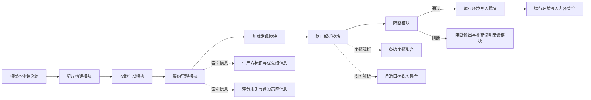
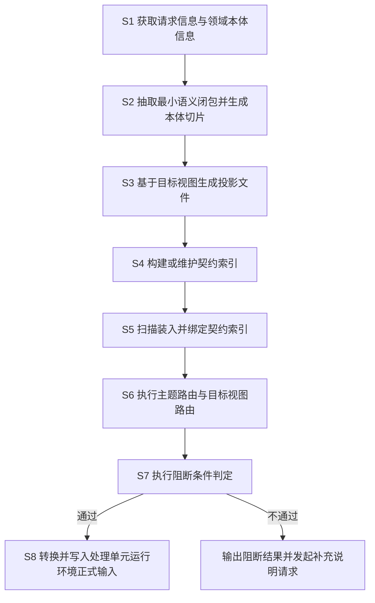
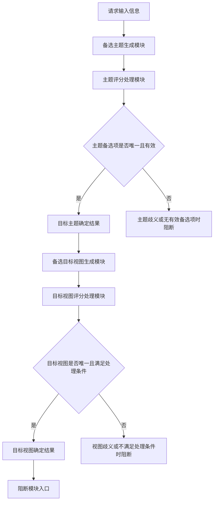
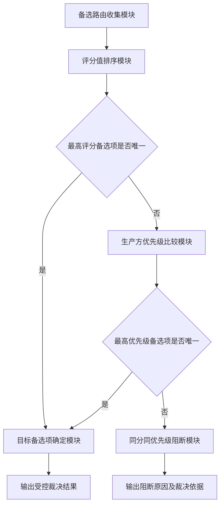
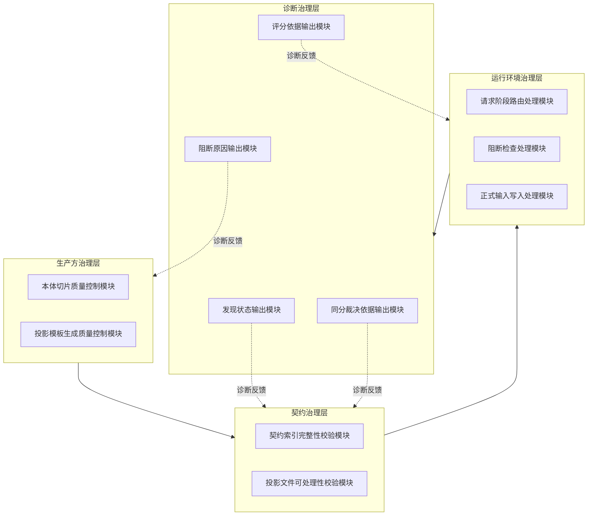

# 专利草案

## 一、发明名称

一种将面向任务的本体切片转换为处理单元运行环境正式输入的方法、系统、设备及存储介质。

## 二、技术领域

本发明涉及人工智能工程化、知识建模、智能体处理单元编排与运行环境治理技术领域，尤其涉及一种将领域本体中与当前任务相关的最小语义子图，转换为可发现、可路由、可阻断、可治理的处理单元运行环境正式输入的技术方案。

## 三、背景技术

随着大模型与智能体系统在复杂业务中的应用增加，领域本体常用于统一术语、概念关系与约束边界。然而，现有实践通常存在以下问题：

1. 直接使用完整本体或摘要作为提示输入，语义冗余高、噪声大，执行阶段需自行裁剪，容易引入无关语义和错误推断。
2. 本体局部抽取结果多停留在离线文档层（如标记文档、结构化数据文档、评审材料），未形成面向目标处理单元的正式输入链路。
3. 投影文件即便存在，也常缺乏统一的契约索引与自动识别机制，执行阶段无法按请求变化式选择主题和目标视图。
4. 在主题歧义、视图冲突、投影缺失、未决问题存在或多生产方打平时，系统常执行非显式降级处理或继续执行，缺乏正式阻断治理。
5. 多生产方并存时常采用覆盖式或单来源假设，缺少可解释、可审计的受控裁决机制。

因此，现有技术缺少一条将“任务导向本体切片”稳定演进为“处理单元运行环境正式输入”的完整控制链路。

## 四、发明目的

本发明旨在提供一种标准化运行机制，使本体语义资产能够在请求过程中被正式调用，具体解决：

1. 如何从完整本体中抽取当前任务最小语义闭包。
2. 如何将该闭包转换为多目标视图可复用的投影文件。
3. 如何通过契约索引和处理单元加载器将投影引入运行环境自动识别与绑定链路。
4. 如何在请求过程中执行“主题 + 目标视图”双层变化式路由。
5. 如何在关键不确定条件下执行阻断，避免错误语义继续扩散。
6. 如何支持多生产方场景下的受控合流与同分阻断。

## 五、技术方案

### 5.1 总体链路

本发明构建如下执行阶段控制链路：

领域本体 -> 任务导向本体切片 -> 定向投影文件 -> 契约索引 -> 加载发现 -> 请求阶段路由解析 -> 阻断检查 -> 运行环境写入。

### 5.2 核心步骤

S1：获取请求信息及相关领域本体信息。

S2：围绕当前任务抽取最小语义闭包，生成任务导向本体切片；所述切片至少包含概念、关系、约束、来源中的两类以上信息。

S3：将本体切片按至少一种目标视图进行投影，生成投影文件；目标视图包括但不限于：

1. 领域模型视图
2. 数据结构约束视图
3. 提示约束视图
4. 工作流契约视图

S4：基于投影文件构建或维护契约索引，组织生产方标识、生产方优先级、主题、目标视图、路径、评分规则与预设策略。

S5：由处理单元加载器自动扫描并绑定契约索引，使契约进入处理单元运行环境可解析输入集合。

S6：在请求过程中执行双层变化式路由：

1. 对备选主题评分并选择主题。
1. 在选定主题内对备选目标视图评分并选择视图。

S7：对目标路由执行阻断检查。阻断条件包括但不限于：

1. 主题歧义或无有效主题。
1. 目标视图歧义或不满足处理条件。
1. 投影文件缺失或解析失败。
1. 必需字段缺失。
1. 未决问题存在且策略要求阻断。
1. 多生产方备选项在评分值与优先级同时打平。

S8：在阻断检查通过时，将投影文件转换为处理单元运行环境正式输入并写入运行流程，所述输入包括但不限于提示约束片段、允许术语、禁止性假设、必要澄清项、推理路径、来源摘要、裁剪项。

## 六、优选实施方式

### 6.1 提示约束实施方式

围绕“会话记忆写入边界”任务构建本体切片，投影为提示约束视图；当请求命中该主题且阻断检查通过时，将允许术语、禁止性假设、必要澄清项写入运行环境提示约束片段；若存在未决问题且策略为阻断，则终止执行并输出补充说明要求。

### 6.2 多视图复用实施方式

对于同一任务导向本体切片，可针对不同应用场景生成多个目标视图。例如：

1. 偏代码实现时选择领域模型视图。
1. 偏结构约束校验时选择数据结构约束视图。
1. 偏推理约束时选择提示约束视图。
1. 偏流程协同时选择工作流契约视图。

### 6.3 多生产方合流实施方式

对每个生产方独立执行路由解析，收集备选路由后按“评分值优先、生产方优先级次优先”排序；当最高备选项在评分值与优先级同时相同，则执行阻断，不进行任意选择。

### 6.4 分层治理实施方式

1. 生产方层：校验本体切片和投影模板生成质量。
1. 契约调用层：校验契约索引和执行阶段投影可处理性。
1. 运行环境层：执行请求阶段路由解析、阻断和写入。
1. 诊断层：输出发现状态、评分依据、阻断原因和同分裁决依据。

## 七、发明效果

与现有技术相比，本发明至少具有以下效果：

1. 将本体切片从离线语义整理产物升级为处理单元运行环境正式输入。
1. 通过任务导向最小语义闭包显著降低执行阶段输入噪声。
1. 通过目标视图投影实现同源语义跨场景稳定复用。
1. 通过契约索引与自动识别机制实现运行环境可绑定、可诊断。
1. 通过请求阶段双层路由提升场景适配能力。
1. 通过阻断机制在不确定情况下停止执行，降低错误传播。

## 八、权利要求书初稿

1. 一种将面向任务的本体切片转换为处理单元运行环境正式输入的方法，其特征在于，包括以下步骤：获取请求信息与领域本体信息；基于所述请求信息抽取最小语义闭包并形成本体切片；基于所述本体切片按照至少一种目标视图生成投影文件；基于所述投影文件构建或维护契约索引，其中，所述契约索引包括生产方标识、生产方优先级、预设选择策略、主题评分配置、目标视图评分配置以及主题到备选目标视图的路由清单，所述预设选择策略至少包括“仅选择就绪项策略”和“未决问题阻断策略”，所述路由清单中的每个主题记录至少包括主题标识、预设目标视图以及备选目标视图列表，所述备选目标视图列表中的每个备选目标视图至少包括目标视图标识、状态和投影文件路径；自动识别并绑定所述契约索引；在请求过程中按照主题选择、目标视图选择、投影文件调取和阻断检查的顺序执行变化式路由解析，其中，仅当所选备选目标视图的状态满足处理要求，且不存在依据所述预设选择策略需要阻断的未决问题时，才调取对应投影文件；在存在多个生产方备选路由时，对各生产方分别执行路由解析，并按照评分值降序、生产方优先级降序进行排序，在评分值与生产方优先级同时相同时触发阻断；以及在阻断检查通过时，将所述投影文件转换并写入处理单元运行环境正式输入。
1. 根据权利要求1所述的方法，其特征在于，所述本体切片包括概念、关系、约束和来源中的至少两类信息。
1. 根据权利要求1所述的方法，其特征在于，所述目标视图包括领域模型视图、数据结构约束视图、提示约束视图和工作流契约视图中的至少一种。
1. 根据权利要求1所述的方法，其特征在于，所述契约索引包括生产方标识、生产方优先级、主题、目标视图、投影文件路径、评分规则和预设策略中的至少一部分。
1. 根据权利要求1所述的方法，其特征在于，所述主题与目标视图变化式路由基于所述契约索引中的主题评分配置和目标视图评分配置执行，且在目标主题确定后，在该目标主题对应的备选目标视图列表内，结合预设目标视图执行目标视图选择。
1. 根据权利要求1所述的方法，其特征在于，所述阻断检查的触发条件包括下列至少之一：所选备选目标视图的状态不是就绪状态；对应投影文件缺失；对应投影文件解析失败；存在未决问题且预设选择策略要求阻断；主题路由结果不唯一；目标视图路由结果不唯一。
1. 根据权利要求1所述的方法，其特征在于，在存在多个生产方备选项时，对各生产方分别执行路由解析，并从契约索引中的生产方优先级配置项读取生产方优先级；当最高备选项的评分值与生产方优先级同时相同时，将该路由结果判定为不可消解歧义并触发阻断。
1. 根据权利要求1所述的方法，其特征在于，所述处理单元运行环境正式输入包括提示约束片段、允许术语、禁止性假设、必要澄清项、推理路径、来源摘要和裁剪项中的至少一种。
1. 根据权利要求1所述的方法，其特征在于，还包括输出发现诊断信息，所述发现诊断信息包括发现状态、评分依据、阻断原因和同分裁决依据中的至少一种。
1. 根据权利要求1所述的方法，其特征在于，所述方法采用分层治理机制，所述分层治理机制至少包括生产方治理层、契约治理层、运行环境治理层和诊断治理层。
1. 一种将面向任务的本体切片转换为处理单元运行环境正式输入的系统，其特征在于，包括：切片构建模块，用于基于请求信息和领域本体信息抽取最小语义闭包并生成本体切片；投影生成模块，用于基于所述本体切片按照至少一种目标视图生成投影文件；契约管理模块，用于基于所述投影文件构建并维护契约索引，其中，所述契约索引包括生产方标识、生产方优先级、预设选择策略、主题评分配置、目标视图评分配置以及主题到备选目标视图的路由清单，所述预设选择策略至少包括“仅选择就绪项策略”和“未决问题阻断策略”，所述路由清单中的每个主题记录至少包括主题标识、预设目标视图以及备选目标视图列表，所述备选目标视图列表中的每个备选目标视图至少包括目标视图标识、状态和投影文件路径；加载发现模块，用于自动扫描并绑定所述契约索引；路由解析模块，用于按照主题选择、目标视图选择、投影文件调取和阻断检查的顺序执行请求阶段变化式路由解析，并对多个生产方分别执行路由解析后按照评分值降序、生产方优先级降序进行排序；阻断模块，用于在所选备选目标视图的状态不满足处理要求、存在依据所述预设选择策略需要阻断的未决问题、或者评分值与生产方优先级同时相同时触发阻断；以及运行环境写入模块，用于在阻断检查通过时，将所述投影文件转换并写入处理单元运行环境正式输入。
1. 一种电子设备，其特征在于，包括处理器和存储器，所述存储器中存储有计算机程序，所述计算机程序被所述处理器执行时，使所述电子设备执行权利要求1至10任一项所述的方法。
1. 一种计算机可读存储介质，其特征在于，所述计算机可读存储介质中存储有计算机程序，所述计算机程序被处理器执行时，使所述处理器执行权利要求1至10任一项所述的方法。

## 九、术语统一口径

1. 本体
1. 本体切片
1. 投影文件
1. 契约索引
1. 目标处理单元
1. 处理单元加载器
1. 处理单元运行环境
1. 主题
1. 目标视图
1. 路由解析
1. 阻断检查
1. 生产方优先级
1. 评分值
1. 发现诊断信息

## 十、创新点与创造性主张建议

建议围绕以下三组组合特征主张创造性，而非停留于单一文件格式、单一评分规则或单一提示写入动作：

1. 以任务导向最小语义闭包为源，通过多目标视图投影生成可在执行阶段调用的投影文件，并进一步组织为包含生产方标识、生产方优先级、预设选择策略、主题评分配置、目标视图评分配置以及主题到备选目标视图路由清单的契约索引，从而将本体切片、多视图投影与处理单元运行环境契约结构化绑定为同一控制结构。
2. 以所述契约索引为请求阶段控制入口，按照主题选择、目标视图选择、投影文件调取和阻断检查的顺序执行变化式路由解析，并将备选目标视图状态、未决问题阻断策略以及预设目标视图选择共同纳入路由判定条件，从而将静态语义资产转化为请求过程中可执行的正式输入解析机制。
3. 在多生产方并存场景下，对各生产方分别执行路由解析，并按照评分值降序、生产方优先级降序进行排序，且在评分值与生产方优先级同时相同时执行阻断，而仅在阻断检查通过时才将投影文件转换并写入处理单元运行环境正式输入，从而形成“多生产方备选裁决 + 同分阻断 + 通过后写入”的受控闭环治理机制。

### 10.1 答审式创造性论证

可按审查意见通知书答复的口吻表述如下：

关于对比文件1，申请人认为如下。对比文件1可认定为静态提示约束或本体摘要调用方案。其通常以静态提示片段、本体摘要或单一投影文档为目标处理单元提供约束信息。该文件至多公开静态提示补充。并未公开将本体切片组织为执行阶段可调用的契约索引。亦未公开以请求阶段主题解析和目标视图解析为核心的正式执行阶段调用链路。

关于对比文件2，申请人认为如下。对比文件2可认定为处理单元配置清单路由或单一生产方投影绑定方案。其通常基于配置清单或单一生产方契约执行预设绑定、静态路由或简单优先级选择。该文件并未公开多生产方并存场景下的分别解析。亦未公开按评分值与生产方优先级统一排序。更未公开在同分情形下执行阻断的治理机制。

关于本申请的区别特征，申请人答复如下。本申请与上述对比文件至少存在以下区别。第一，本申请并非将本体切片直接作为静态提示材料使用，而是先将本体切片投影为多目标视图投影文件，再组织为契约索引。该契约索引包含生产方标识、生产方优先级、预设选择策略、主题评分配置、目标视图评分配置以及主题到备选目标视图的路由清单。由此，本体切片、多视图投影和处理单元运行环境契约进入同一结构化控制结构。第二，本申请以该契约索引作为请求阶段控制入口。系统按主题选择、目标视图选择、投影文件调取和阻断检查的顺序执行变化式路由解析。备选目标视图状态、预设目标视图和未决问题阻断策略共同参与判定。第三，本申请在多生产方并存时，对各生产方分别执行路由解析。随后按评分值降序、生产方优先级降序统一排序。在评分值与生产方优先级同时相同时执行阻断。仅在阻断检查通过后，才将投影文件转换并写入处理单元运行环境正式输入。

关于区别特征所产生的技术效果，申请人答复如下。上述区别并非信息记载形式的变化，而是带来了明确技术效果。其一，原本停留在离线文档层的本体切片和投影文件资产进入处理单元运行环境正式输入链路，形成可自动识别、自动绑定、请求阶段解析和请求阶段调用的结构化控制结构。其二，主题、目标视图、投影文件调取与阻断检查在同一请求上下文中联动执行，从而降低无效投影文件被误调取、错误视图被误调用以及未决问题继续扩散的概率。其三，在多生产方场景下，通过“分别解析 + 双关键字排序 + 同分阻断”的裁决机制，提高多生产方契约接入时的稳定性、可解释性和可审计性。

关于结合动机，申请人答复如下。审查意见可能认为，对比文件1已经公开语义约束信息，对比文件2已经公开配置路由机制，本领域技术人员有动机将二者结合。申请人对此不予认可。即使存在该种结合动机，其所指向的也仅是将静态约束材料作配置化组织或静态绑定。其仍属于“静态材料 + 静态绑定”的改良路径。其并不指向“契约索引 + 请求阶段变化式解析 + 阻断优先治理”的执行阶段控制路径。

关于结合后仍不能得到本申请方案，申请人答复如下。进一步地，即使将对比文件1中的静态约束内容写入对比文件2的配置清单，也不能自然得到本申请的契约索引结构。原因在于，该种结合并不能推出预设选择策略、主题评分配置、目标视图评分配置以及主题到备选目标视图路由清单的协同组织方式。即使存在多来源或多视图情形，常规结合更可能导向预设优先级覆盖或预设回退。其不会自然导向“分别解析、统一排序、同分阻断、通过后写入”的受控裁决与阻断机制。

关于对比文件结合后的技术评价，申请人答复如下。因此，即使将对比文件1与对比文件2结合，本领域技术人员仍难以得到本申请方案。对比文件1的核心仍是将本体或投影文件作为静态提示约束材料调用。其缺乏将投影文件进一步抽象为契约索引的技术启示。对比文件2虽涉及处理单元配置清单路由或单一生产方绑定，但其技术路径仍是静态绑定、预设选择或简单优先级覆盖。其不会自然导向“主题选择 -> 目标视图选择 -> 投影文件调取 -> 阻断检查”的顺序化请求阶段控制链路。其亦不会自然导向“各生产方分别解析、统一排序、同分阻断”的受控裁决机制。

关于常规替换认定，申请人答复如下。若审查意见进一步认为上述区别仅属于常规技术手段替换或现有技术的简单并列拼接，申请人亦不予认可。本申请并非将已知技术特征孤立替换至既有系统中的任意位置。亦非将彼此独立的功能模块作机械叠加。本申请是围绕“契约索引作为请求阶段控制入口”这一核心结构，对主题选择、目标视图选择、投影文件调取、阻断检查以及多生产方裁决的执行顺序、判定条件与生效关系进行了协同重构。由此获得的请求阶段正式调用能力、阻断优先治理能力和多生产方受控裁决能力，并非各单独技术手段效果的简单相加。

关于创造性结论，申请人答复如下。综上，对比文件1与对比文件2的结合不能给出本申请方案。本申请不是现有技术的简单并列拼接，而是形成了执行阶段正式调用、请求阶段双层解析、阻断优先治理以及多生产方受控裁决的协同技术组合，因而具备突出的实质性特点和显著的进步。

## 十一、附图建议

1. 总体架构图：本体、切片、投影、契约、加载器、路由、阻断、运行环境。
2. 方法流程图：S1 至 S8。
3. 双层路由图：主题选择 + 视图选择。
4. 多生产方裁决图：评分、优先级、同分阻断。
5. 分层治理图：生产方层、契约层、运行环境层、诊断层。

### 图1 本发明总体架构示意图

附图说明：图1示出了本发明一实施例中的总体架构关系，用于说明领域本体语义源经由切片构建模块、投影生成模块、契约管理模块、加载发现模块、路由解析模块以及阻断模块后，向运行环境写入模块提供可处理输入的整体控制链路。其中，契约管理模块还可关联生产方标识与优先级信息、评分规则与预设策略信息，路由解析模块还可面向备选主题集合和备选目标视图集合执行解析。

### 图2 本发明方法流程示意图

附图说明：图2示出了本发明一实施例中的方法流程，用于说明从请求信息与领域本体信息获取开始，经由本体切片生成、投影文件生成、契约索引构建、契约索引装入绑定、双层变化式路由处理及阻断条件判定，最终完成处理单元运行环境正式输入写入的步骤序列。其中，在阻断条件判定不通过时，可输出阻断结果并发起补充说明请求，而不继续后续写入处理。

### 图3 双层变化式路由示意图

附图说明：图3示出了本发明一实施例中的双层变化式路由关系，用于说明系统先针对请求输入信息执行备选主题生成模块与主题评分处理模块，在主题备选项唯一且有效时确定目标主题；随后在所确定的目标主题内执行备选目标视图生成模块与目标视图评分处理模块，在目标视图唯一且满足处理条件时确定目标视图，并将其送入阻断模块入口。若主题侧或视图侧存在歧义、无有效备选项或不满足处理条件情形，则执行阻断。

### 图4 多生产方裁决示意图

附图说明：图4示出了本发明一实施例中的多生产方裁决关系，用于说明在存在多个生产方备选路由时，系统先通过备选路由收集模块完成备选项聚合，再通过评分值排序模块进行排序；当最高评分备选项不唯一时，进一步通过生产方优先级比较模块进行比较；当最高优先级备选项仍不唯一时，触发同分同优先级阻断模块。由此可避免在评分值与优先级同时打平的情况下进行任意选择。

### 图5 分层治理结构示意图

附图说明：图5示出了本发明一实施例中的分层治理结构，用于说明生产方治理层、契约治理层、运行环境治理层和诊断治理层之间的层级关系及反馈关系。其中，生产方治理层用于控制本体切片质量和投影模板生成质量，契约治理层用于校验契约索引完整性和投影文件可处理性，运行环境治理层用于执行请求阶段路由解析、阻断检查及正式输入写入，诊断治理层用于输出发现状态、评分依据、阻断原因及同分裁决依据，并向前述各层提供诊断反馈；上述各层可分别由相应质量控制模块、校验模块、处理模块及输出模块实现。

## 十二、撰写注意事项

1. 不将保护范围限定为具体处理单元名称、目录结构、文件名或固定评分公式。
2. 不将创新点窄化为“使用结构化数据模式校验”。
3. 主权应突出“请求阶段变化式路由 + 阻断后写入”的控制链。
4. 从权用于增强稳定性与防绕过能力（多生产方、诊断、分层治理、多视图）。
