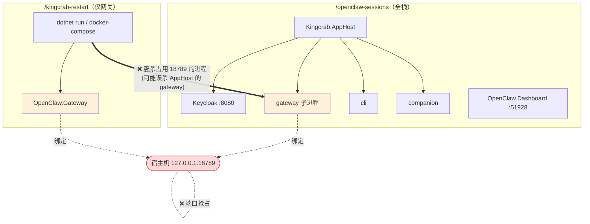

# OpenClaw 会话页与 Kingcrab 重启技能 —— 服务冲突分析

> 分析对象：`/openclaw-sessions` 与 `/kingcrab-restart` 两个技能
> 结论先行：**会冲突。** 两者都会拉起同一个 `OpenClaw.Gateway`，而该网关**始终监听 `127.0.0.1:18789`**，因此二者不能同时启动同一个网关实例。

---

## 1. 两个技能在做什么

| 技能 | 启动的进程 / 资源 | 作用 |
|------|------------------|------|
| `/openclaw-sessions` | **完整 Aspire 栈**（`Kingcrab.AppHost` 编排：keycloak / **gateway** / cli / companion）+ **OpenClaw.Dashboard**（Blazor WASM，独立进程） | 起全栈并打开会话归档页 `/sessions` |
| `/kingcrab-restart` | **仅 OpenClaw.Gateway**（`docker` 或 `dotnet` 两种模式） | 单独重启网关服务 |

两者唯一重叠的服务是 **OpenClaw.Gateway**。Keycloak、Dashboard、Aspire Dashboard 等都只由 `/openclaw-sessions` 负责，`/kingcrab-restart` 完全不碰，因此**不是整体互斥，冲突点只在网关一处**。

---

## 2. 关键发现：网关的"文档端口"与"实际端口"不一致

技能文档与 launchSettings 给人的印象是两条不同端口、互不干扰，但**代码真相不是这样**。

### 2.1 launchSettings 写的是 16823（会误导）

[OpenClaw.Gateway/Properties/launchSettings.json](c:\Users\wayye\Documents\ai4c_Projects\kingcrab\src\OpenClaw.Gateway\Properties\launchSettings.json)：

```json
"applicationUrl": "https://localhost:16823;http://localhost:16824"
```

`/openclaw-sessions` 技能输出里也写着 `Gateway（独立默认）: https://localhost:16823`。

### 2.2 但代码用 RunAsync 显式覆盖，实际监听 18789

[OpenClaw.Gateway/Program.cs:117](c:\Users\wayye\Documents\ai4c_Projects\kingcrab\src\OpenClaw.Gateway\Program.cs#L117)：

```csharp
await app.RunAsync($"http://{startup.Config.BindAddress}:{startup.Config.Port}");
```

`RunAsync(url)` 传入显式 URL，会**覆盖** launchSettings 的 `applicationUrl`、以及 Aspire 注入的 `ASPNETCORE_URLS`。而 `BindAddress` / `Port` 来自配置：

[appsettings.json](c:\Users\wayye\Documents\ai4c_Projects\kingcrab\src\OpenClaw.Gateway\appsettings.json)（Development）：

```json
"OpenClaw": { "BindAddress": "127.0.0.1", "Port": 18789 }
```

**结论：无论谁来启动，网关实际都绑定 `http://127.0.0.1:18789`，launchSettings 里的 16823 形同虚设。**

这也解释了为什么 `/kingcrab-restart` 全程围绕端口 **18789** 做探测、健康检查（`http://localhost:18789/health`）和清理。

---

## 3. 冲突点分析

### 冲突 A：端口 18789 抢占（硬冲突）

- `/openclaw-sessions` → AppHost 编排的 gateway 子进程 → 绑定 `127.0.0.1:18789`
- `/kingcrab-restart`（dotnet 模式）→ `dotnet run` 同一个项目 → 同样绑定 `127.0.0.1:18789`
- `/kingcrab-restart`（docker 模式）→ docker-compose 端口映射 `18789:18789`（见 [docker-compose.yml:12](c:\Users\wayye\Documents\ai4c_Projects\kingcrab\docker-compose.yml#L12)）→ 占用宿主机 `18789`

三条路径都争抢宿主机 **18789**。第二个启动的网关会因端口被占用而**启动失败**，或触发交互式恢复提示"Port 18789 is busy. Use 18790 instead?"（见 [InteractiveStartupRecovery.cs:113](c:\Users\wayye\Documents\ai4c_Projects\kingcrab\src\OpenClaw.Gateway\Bootstrap\InteractiveStartupRecovery.cs#L113)）。在 Aspire 编排下通常没有可交互终端，多半直接失败。

### 冲突 B：进程被强杀（更隐蔽、更危险）

`/kingcrab-restart` 在"清理残留进程"步骤会**强制结束任何占用 18789 的进程**：

```powershell
$portProcess = Get-NetTCPConnection -LocalPort 18789 ...
$portProcess | ForEach-Object { Stop-Process -Id $_.OwningProcess -Force ... }
```

如果此时 `/openclaw-sessions` 的 Aspire 栈正在运行，**这一步会把 AppHost 托管的 gateway 子进程直接杀掉**，导致 Aspire Dashboard 里 gateway 显示崩溃 / 不健康，而 AppHost 本体仍在运行——整个栈进入"半残"状态。

### 非冲突但需注意：两种网关配置不同

- AppHost 起的 gateway 有 `.WithReference(keycloak).WaitFor(keycloak)`（见 [AppHost.cs:20-22](c:\Users\wayye\Documents\ai4c_Projects\kingcrab\Kingcrab.AppHost\AppHost.cs#L20-L22)），会注入 Keycloak 连接信息，可能走 OIDC 安全模式。
- `/kingcrab-restart` 起的独立 gateway **没有**接 Keycloak，安全/鉴权行为可能不同。

即便能错开端口，两个网关也并非等价实例。

---

## 4. 服务 / 端口对照表

| 服务 | `/openclaw-sessions` | `/kingcrab-restart` | 是否冲突 |
|------|----------------------|---------------------|----------|
| **OpenClaw.Gateway** | ✅ 由 AppHost 编排，实际 `127.0.0.1:18789` | ✅ dotnet/docker，均 `18789` | **⚠️ 冲突** |
| Keycloak | ✅ `:8080` | ❌ 不涉及 | 否 |
| OpenClaw.Dashboard | ✅ `https://localhost:51928` | ❌ 不涉及 | 否 |
| Aspire Dashboard | ✅ `https://localhost:17087` | ❌ 不涉及 | 否 |
| CLI / Companion | ✅ | ❌ 不涉及 | 否 |

---

## 5. 冲突关系图



---

## 6. 结论

1. **会冲突，且冲突点明确是 OpenClaw.Gateway（端口 18789）。** 不能同时各起一个网关。
2. 根因：网关用 `app.RunAsync("http://{BindAddress}:{Port}")` 硬编码监听 `127.0.0.1:18789`，launchSettings 里的 16823 不生效——文档/配置具有误导性。
3. 除网关外，两个技能的其它服务（Keycloak / Dashboard / Aspire）互不重叠，并非整体互斥。
4. 额外风险：`/kingcrab-restart` 的清理逻辑会**强杀**占用 18789 的进程，可能误杀 `/openclaw-sessions` 栈里的网关，使 Aspire 栈半残。

---

## 7. 使用建议

- **不要在 `/openclaw-sessions` 全栈运行时再跑 `/kingcrab-restart`。** AppHost 已经包含网关，Dashboard 的 `/sessions` 直接把 "Proxy API Base URL" 指向这个网关即可，无需额外重启。
- **想单独迭代网关时**：先停掉 `/openclaw-sessions` 的 AppHost 窗口（释放 18789），再用 `/kingcrab-restart`；或用 `/openclaw-sessions -SkipAppHost` 只起 Dashboard，自己用 `/kingcrab-restart` 管网关。
- **若确实要并存两个网关**：必须给其中一个改端口（设环境变量 `OpenClaw__Port=18790` 等），并避免 `/kingcrab-restart` 去强杀 18789。
- **建议修正文档**：把 `/openclaw-sessions` 与 launchSettings 里"Gateway = 16823"的说法更正为实际的 `127.0.0.1:18789`，以免再次误判为"不冲突"。

---

## 附录：证据出处

| 结论 | 文件:行 |
|------|---------|
| 网关显式覆盖监听地址 | [Program.cs:117](c:\Users\wayye\Documents\ai4c_Projects\kingcrab\src\OpenClaw.Gateway\Program.cs#L117) |
| 实际端口/绑定来自配置（18789 / 127.0.0.1） | [appsettings.json:3-4](c:\Users\wayye\Documents\ai4c_Projects\kingcrab\src\OpenClaw.Gateway\appsettings.json#L3-L4) |
| launchSettings 写的是 16823（被覆盖） | [launchSettings.json:10](c:\Users\wayye\Documents\ai4c_Projects\kingcrab\src\OpenClaw.Gateway\Properties\launchSettings.json#L10) |
| AppHost 编排 gateway 并接 Keycloak | [AppHost.cs:20-22](c:\Users\wayye\Documents\ai4c_Projects\kingcrab\Kingcrab.AppHost\AppHost.cs#L20-L22) |
| docker-compose 映射 18789 | [docker-compose.yml:12](c:\Users\wayye\Documents\ai4c_Projects\kingcrab\docker-compose.yml#L12) |
| 端口占用时的恢复/换端口提示 | [InteractiveStartupRecovery.cs:111-115](c:\Users\wayye\Documents\ai4c_Projects\kingcrab\src\OpenClaw.Gateway\Bootstrap\InteractiveStartupRecovery.cs#L111-L115) |

*文档生成时间：2026-06-22*
