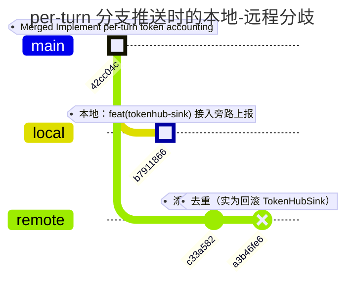
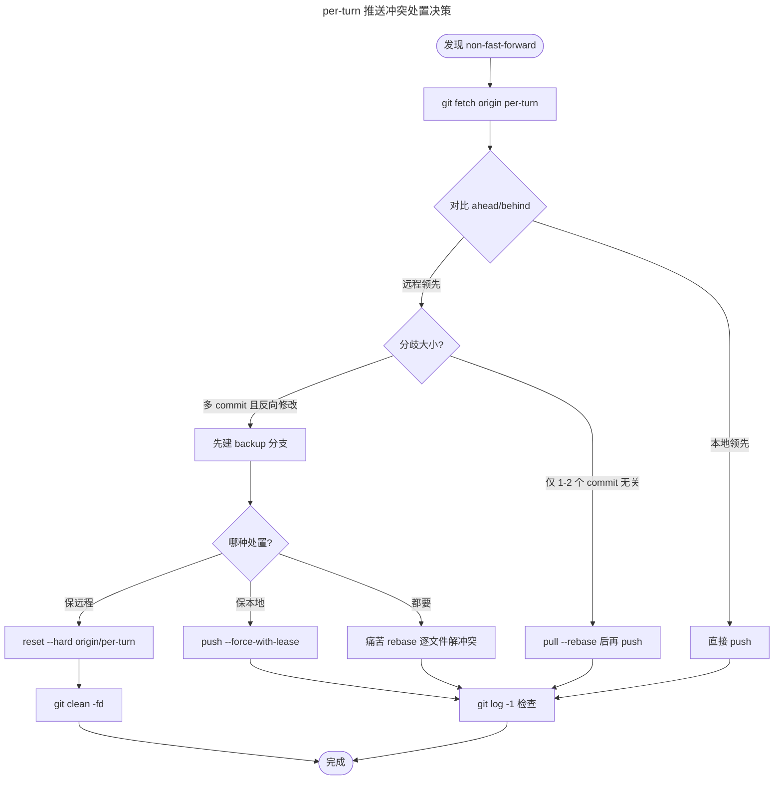

# per-turn 分支推送冲突与代码回滚处理总结

> 记录 2026-06-18 在 `kingcrab` 仓库执行 `git-commit-push-safe` 技能过程中遭遇的 **推送被拒（non-fast-forward）** 事件：本地要推的 `b7911866` 提交被远程 `a3b46fe6` 静默回滚，团队在 `per-turn` 分支上已出现"反向"分歧。

---

## 一、事件背景

| 项目 | 值 |
|---|---|
| 仓库 | `kingcrab` (`https://gitee.com/ai4c/kingcrab.git`) |
| 分支 | `per-turn` |
| 触发的技能 | `git-commit-push-safe`（参数 `target_branch=per-turn`） |
| 提交内容 | `feat(tokenhub-sink): 接入 TokenHub 旁路上报，修正默认模型名` |
| 本地新 commit | `b79118668904b11b7a903af442a0f880c735cb86` |
| 远程 HEAD | `a3b46fe6e733b97892f395bb5f7766b8f72dd2a5` |

技能预期流程共 6 步：检查 → 暂存 → 提交 → 兜底 → 推送 → 汇报。**前 4 步全部顺利完成，第 5 步推送被拒。**

---

## 二、处理时间线

| 步骤 | 内容 | 结果 |
|---|---|---|
| 1. 检查改动 | 14 个 modified + 9 个 untracked | ✅ 主题明确：新增 `OpenClaw.TokenHubSink` 模块 + per-turn 用量事件 + 默认模型修正 |
| 2. 暂存（带排除） | pathspec 排除 `CLAUDE.md` / `*.log` / `tests/**` / `*Tests.cs` / `*.Tests.csproj` / 测试用例 JSON/SQL 等 | ✅ 22 个文件入栈（14M + 8A）；`src/OpenClaw.Tests/TokenHubSinkIntegrationTests.cs` 正确被排除（仍 untracked） |
| 3. 提交（中文） | UTF-8（无 BOM）临时文件 + `git commit -F` | ✅ Hash `b7911866`；标题与正文 5 条要点全部中文 |
| 4. 兜底（去 Co-authored-by） | 检查 `git log -1 --pretty=full` | ✅ 提交对象无 `Co-authored-by`，钩子未追加，跳过 amend 与 Python 改写 |
| 5. 推送 | `git push origin per-turn` | ❌ `! [rejected] per-turn -> per-turn (non-fast-forward)` |
| 6. 汇报 | （卡在 5 后中断） | ⏸ 等待用户决策 |

---

## 三、推送失败原因分析

### 3.1 报错原文

```text
To https://gitee.com/ai4c/kingcrab.git
 ! [rejected]        per-turn -> per-turn (non-fast-forward)
error: failed to push some refs to 'https://gitee.com/ai4c/kingcrab.git'
hint: Updates were rejected because the tip of your current branch is behind
hint: its remote counterpart. ...
```

### 3.2 远程领先于本地的 commits

执行 `git fetch origin per-turn` 后，定位到远程比本地多 **2 个 commit**：

| Remote commit | 标题 | 真实影响 |
|---|---|---|
| `c33a582` | 添加 keycloak 认证 | 新增 Dashboard 登录页、OIDC JS、AuthService 等 |
| `a3b46fe6` | Eliminate duplication between ProviderTurnUsageEntry and TurnTokenUsageRecord | 表面"去重"，**实际把整组 OpenClaw.TokenHubSink / per-turn 用量事件相关代码全删了**（-667 / +633 行） |

### 3.3 Git 历史图谱



> 共同祖先是 `42cc04c`。从那里开始，本地走 1 个 commit，远程走 2 个 commit。两者**没有共同后代**——这就是 `non-fast-forward` 的根因。

### 3.4 为什么"去重"会导致回滚

`git diff HEAD..origin/per-turn --stat` 显示远程新提交**反向修改**了大量文件：

| 路径 | 远程动作 | 备注 |
|---|---|---|
| `src/OpenClaw.TokenHubSink/` 整目录 | 删除 | HttpClientFactory、HttpTokenUsageSink、TokenUsageConfig、TokenUsageEvents、SecretResolver、扩展方法、csproj 全部 -1 |
| `src/OpenClaw.Agent/TokenUsageEventMapper.cs` | 删除 | 42 行 |
| `src/OpenClaw.Agent/IAgentRuntimeFactory.cs` | 删除 TokenUsageEventSink 字段 | -11 行 |
| `src/OpenClaw.Agent/MafExecutionServiceChatClient.cs` | 删除 PublishTokenUsageEvent | -34 行 |
| `src/OpenClaw.Agent/OpenClaw.Agent.csproj` | 删除 TokenHubSink 引用 | -1 行 |
| `src/OpenClaw.Gateway/OpenClaw.Gateway.csproj` | 删除 TokenHubSink 引用 | -1 行 |
| `src/OpenClaw.Gateway/appsettings.json` | 删除 TokenUsage 配置段 | -14 行 |
| `OpenClaw.Net.slnx` | 删除 TokenHubSink 项 | -1 行 |
| `Dockerfile` | 删除 TokenHubSink 相关行 | -1 行 |
| `src/OpenClaw.Dashboard/` | 大幅新增 | LoginDialog、OIDC/OIDC auth.js、AuthService 等 |
| `src/OpenClaw.Core/Models/*.cs` | 修改 | Session / AdminApi / IntegrationApi / OperatorApi 等模型字段调整 |
| `src/OpenClaw.Core/Observability/ProviderUsageTracker.cs` | 修改 | 去重重构 |
| `src/OpenClaw.Core/Setup/MaintenanceCoordinator.cs` | 修改 | |
| `src/OpenClaw.Gateway/Bootstrap/GatewayStartupContext.cs` | 删除 TokenUsageAgentId | |
| `src/OpenClaw.Gateway/Composition/CoreServicesExtensions.cs` | 删除 TokenHubSink 服务注册 | |

> 一句话总结：远程的"去重"在重构 `ProviderUsageTracker` 链路的同时，把 `OpenClaw.TokenHubSink` 这条新增的旁路上报路径当成"无用代码"整体删了。

---

## 四、关键概念：non-fast-forward

```
            42cc04c  ← 共同祖先
           /       \
   b7911866          a3b46fe6
   (本地)            (远程)
```

- **fast-forward**：远程 HEAD 是本地 HEAD 的祖先，git 只需把远程指针"快进"到本地即可，不产生合并。
- **non-fast-forward**：远程 HEAD 不是本地 HEAD 的祖先——远程有本地没有的提交。git 默认拒绝，提示你"先 pull 整合"。
- **为什么 git 要这么设计**：防止你 `git push` 时不小心覆盖掉队友的提交。

---

## 五、处置方案对比

| 方案 | 命令 | 后果 | 风险 |
|---|---|---|---|
| **A. 强推** | `git push --force-with-lease origin per-turn` | 本地 `b7911866` 直接覆盖远程 `a3b46fe6` | ⚠️ **删除队友刚合的 keycloak 认证 + 去重重构** |
| **B. pull --rebase** | `git pull --rebase origin per-turn` 后再 push | 在 `a3b46fe6` 之上重放 `b7911866`，冲突标记交给人工解 | ⚠️ 大面积冲突（双方改了同一批文件，无自动解） |
| **C. 备份后 reset 回远程** | 先 `git branch backup/... b7911866`，再 `git reset --hard origin/per-turn` + `git clean -fd` | 本地工作区对齐远程，TokenHubSink 代码进 backup 分支永久保存 | ✅ 零风险，远程团队工作完全保留 |
| **D. 啥都不做** | （保持现状） | 远程和本地继续分歧；下次再 push 仍会被拒 | ⚠️ 状态错位，IDE 与 CI 可能基于错位提交跑 |

> 推荐：**C**。本地代码 100% 不丢（commit 对象在 `.git/objects` + reflog 90 天 + backup 分支永久），远程团队工作完全保留；后续可在 backup 分支上适配远程的新设计，再用 cherry-pick / 重新设计方式合回 per-turn。

---

## 六、决策流程图



---

## 七、安全性深度分析：reset --hard 会不会丢代码？

这是用户最关心的点，**单独抽出来讲清楚**。

### 7.1 三层"留存"机制

| 层级 | 留存时长 | 找回方式 |
|---|---|---|
| **工作区（IDE 看到的文件）** | reset 后立刻被覆盖 | 无法直接找回，需从下一层恢复 |
| **commit 对象（`.git/objects`）** | 永久（除非 `git gc --prune=now`） | `git cat-file -p <hash>` 直接读 |
| **reflog（HEAD 历史记录）** | 默认 **90 天** | `git reflog` 查看，`git reset --hard <hash>` 一键回去 |
| **backup 分支（推荐自建）** | 永久（除非显式 `git branch -D`） | `git checkout backup/<name> -- <path>` 检出任意文件 |

### 7.2 纯 reset --hard（不建 backup）的真实风险窗口

```
T0  reset --hard
T0~T90天   reflog 完整 → 100% 可恢复
T90~T180天  reflog 可能过期 → 需用 fsck 找 dangling commit
T180+       reflog 几乎肯定过期 → 需 git gc 前的对象池捞取
```

**结论**：90 天内安全，过了 90 天需要做"考古"——找的是 `.git/objects` 里那些"无主 commit"（dangling commit），命令是 `git fsck --lost-found`，但前提是没人手动 `git gc --prune=now`。

### 7.3 推荐的安全版流程（零风险）

```powershell
# 第 1 步：先建 backup 分支（不是 commit，不是 push，零副作用）
git branch backup/per-turn-tokenhub-sink-20260618 b7911866

# 第 2 步：reset 本地到远程
git reset --hard origin/per-turn

# 第 3 步：清理 untracked 文件
git clean -fd

# 验证
git status -sb
git branch --list 'backup/*'
```

走完后：
- IDE 里看不到 TokenHubSink 代码（工作区 = 远程状态）
- `git log backup/per-turn-tokenhub-sink-20260618` 随时能查回 `b7911866` 全部内容
- `git checkout backup/per-turn-tokenhub-sink-20260618 -- src/OpenClaw.TokenHubSink/` 一行命令可把整个目录"捡回来"

---

## 八、经验教训

### 8.1 关于 git-commit-push-safe 技能

1. **pathspec 排除规则很关键**：本次正确挡掉了 `src/OpenClaw.Tests/TokenHubSinkIntegrationTests.cs`，否则会把测试代码一并塞进去。
2. **UTF-8（无 BOM）+ `git commit -F`** 的中文提交信息链路在 Windows PowerShell 下稳定可用，提交对象原文干净。
3. **本技能的"安全同步（`pull --rebase`）"** 假设的是常规的"远程有 1-2 个 fast-forwardable commit"场景；遇到"远程回滚了你的工作"这种**反向分歧**，技能自身没有兜底逻辑，需要人工判断。

### 8.2 关于 per-turn 分支本身

1. **多人维护的"功能分支"很容易出现反向合并**：当 A 和 B 都在 per-turn 上独立开发时，若 A 的设计与 B 的重构冲突，merge 时容易出现"一方整组代码被静默回滚"的情况。
2. **"去重"类重构**（如 `a3b46fe6` 的标题）应单独走一个 PR，并在描述里列出**所有被删除的文件**，方便 reviewer 知道哪些"看似无用代码"其实承载着某条独立功能链路。
3. **建议为 per-turn 这类长寿命功能分支**：
   - 引入 PR + code review 流程（即便小团队）
   - 在 README 写明"正在开发 X 功能，请勿合并与 X 冲突的重构"
   - 每次大改前先在群里通气

### 8.3 关于 push 前的"防雷"小技巧

1. **推送前必看 `git status -sb`**：能立刻看到 `ahead N` / `behind N`，避免"我以为能推"的情况。
2. **`git fetch` 再决定策略**：本地 `git log origin/<branch> ^HEAD` 一行就能看到"远程多了哪些我没拉的 commit"，比"先推再被拒"省一次往返。
3. **`--force-with-lease` 优于 `--force`**：前者会在远程有更新（你不知道的更新）时拒绝执行，强制覆盖前多一道安全网。
4. **重要代码 push 前建 backup 分支**：成本几乎为零，但能避免"误 push 之后追悔莫及"。

---

## 九、附：本次未执行的命令速查

```powershell
# 安全版：备份 + reset + 清理（推荐）
git branch backup/per-turn-tokenhub-sink-20260618 b7911866
git reset --hard origin/per-turn
git clean -fd

# 找回 backup 分支里的任意文件
git checkout backup/per-turn-tokenhub-sink-20260618 -- src/OpenClaw.TokenHubSink/

# 删除 backup 分支（确认不需要保留时）
git branch -D backup/per-turn-tokenhub-sink-20260618

# 查看 reflog（90 天内可恢复误操作）
git reflog --date=iso | Select-Object -First 20

# 强推方案（破坏远程团队工作，不推荐）
git push --force-with-lease origin per-turn

# 痛苦 rebase 方案（冲突大，不推荐）
git pull --rebase origin per-turn
# ... 解决一大堆冲突 ...
git push origin per-turn
```

---

## 十、结语

这次事件的核心教训不是"git 不会用"，而是"功能分支多人维护时，反向合并是真实风险"。无论选哪条处置路径，**核心原则是：让本地代码至少有 1 条 backup 路径能找回**——这是 git 给我们最强的"后悔药"。

后续推进方向（待定）：
- 决定 per-turn 主线是"保 TokenHubSink"还是"保 keycloak + 重构"
- 如要保留 TokenHubSink：在 backup 分支上重新设计以适配远程去重后的 `ProviderUsageTracker` 接口
- 建议给 per-turn 引入 PR 流程，避免类似事件再次发生
