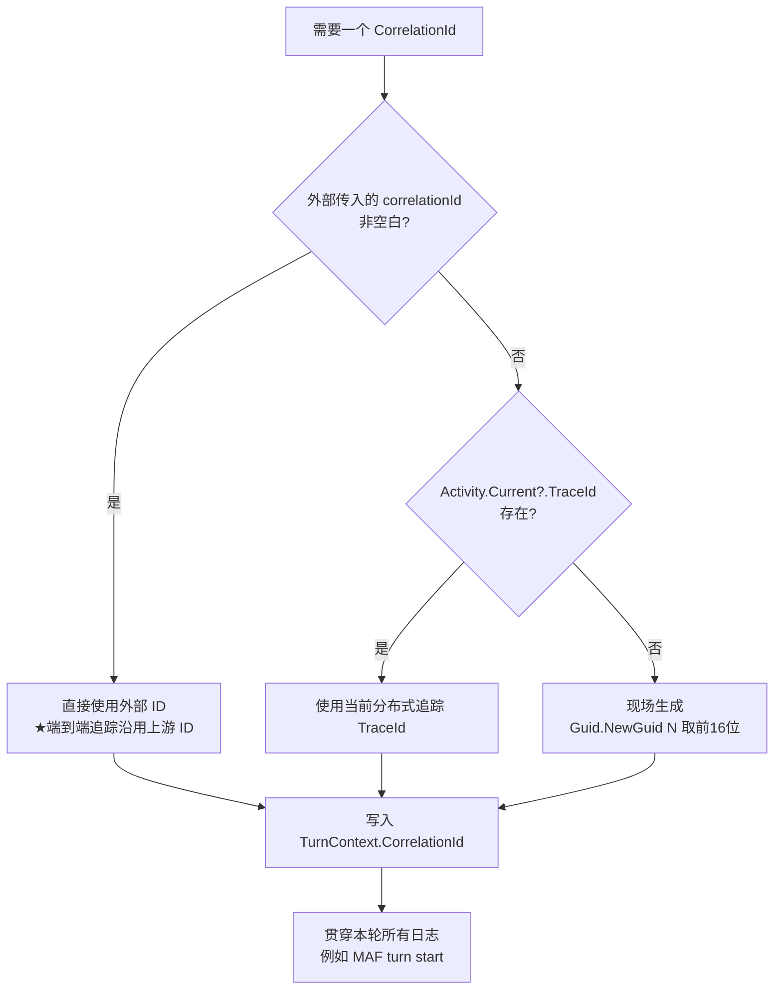
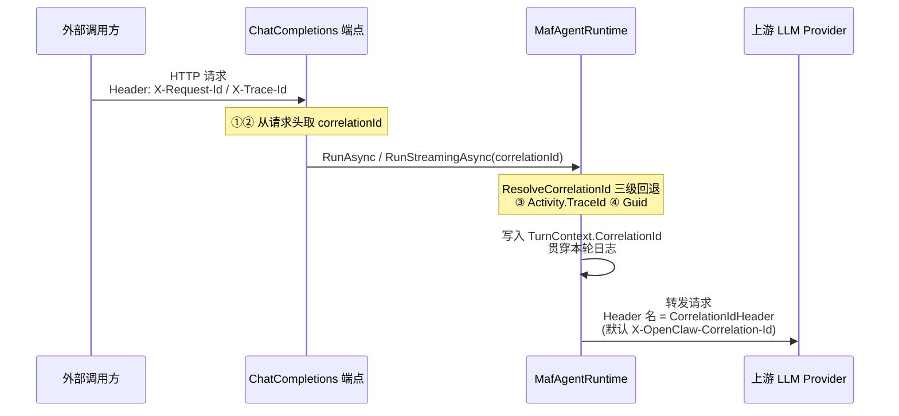

# 请求 ID（Request ID / Trace ID）的生成与获取机制分析

> 参考提交：`3352d0b4989d316a35521f607e4c9a389e0fe78b`
> 提交标题：`refactor(observability): 提取 CorrelationId 解析逻辑，支持外部 Trace ID 注入与按 Profile 配置`
> 作者：geffzhang ｜ 日期：2026-06-25
> 分析对象仓库：`kingcrab`（OpenClaw）

---

## 1. 一句话结论

在 OpenClaw 里，「请求 ID / Trace ID」统一叫 **CorrelationId（关联 ID）**。它的取值遵循一条 **三级回退（fallback）** 规则：

> **优先用外部传进来的 ID → 没有就用当前分布式追踪的 TraceId → 再没有就现场生成一个随机 ID。**

这条规则被这次提交抽取成了一个独立方法 `ResolveCorrelationId`，避免在多个地方重复写。

---

## 2. 先厘清三个容易混淆的概念

很多人会把下面三个东西混为一谈，这里先拆开讲，后面就不绕了：

| 名称 | 是什么 | 在代码里对应 |
| --- | --- | --- |
| **CorrelationId（关联 ID）** | 一次"业务请求/一轮对话"的唯一标识，贯穿日志，用来把一次请求的所有日志串起来 | `TurnContext.CorrelationId` |
| **TraceId（追踪 ID）** | .NET / OpenTelemetry 分布式追踪体系里的 ID，由 `System.Diagnostics.Activity` 管理，遵循 W3C `traceparent` 标准 | `Activity.Current?.TraceId` |
| **CorrelationIdHeader（关联 ID 请求头名）** | 一个**配置项**，指的是"网关再去调用上游 LLM 时，把关联 ID 放在哪个 HTTP 头里带过去"的**头名字**，默认 `X-OpenClaw-Correlation-Id` | `ModelProfile.CorrelationIdHeader` |

> ⚠️ 关键区分：**前两个是"ID 的值"，第三个是"装 ID 的信封名字"。** 这次提交对三者都有改动，初看容易混，分清后逻辑就很顺了。

---

## 3. 请求 ID 是「怎样生成」的？

### 3.1 核心代码：`ResolveCorrelationId`

位置：[src/OpenClaw.Agent/MafAgentRuntime.cs:183](../src/OpenClaw.Agent/MafAgentRuntime.cs)

```csharp
private static string ResolveCorrelationId(string? correlationId)
   => !string.IsNullOrWhiteSpace(correlationId)
       ? correlationId
       : Activity.Current?.TraceId.ToString() ?? Guid.NewGuid().ToString("N")[..16];
```

这段代码就是整个机制的"心脏"。翻译成大白话，它按顺序问三个问题：

1. **「外面有人给我传 ID 了吗？」**
   `correlationId` 参数不为空、也不全是空白 → **直接用这个**。
   （这一步是为了支持"端到端分布式追踪"：上游系统已经有 ID 了，我们就沿用，不另起炉灶。）

2. **「当前有正在进行的分布式追踪吗？」**
   外部没传，就看 `Activity.Current`。这是 .NET 的"环境上下文"，ASP.NET Core 收到带 `traceparent` 头的请求时会自动建立。
   有的话 → 用它的 `TraceId.ToString()`（一个 32 位十六进制字符串）。

3. **「都没有？那我自己造一个。」**
   `Guid.NewGuid().ToString("N")` 生成一个 32 位无连字符的十六进制串，`[..16]` 取**前 16 位**作为一个短 ID。
   （取前 16 位是为了日志里短一点、好读，不需要完整 GUID 那么长。）

### 3.2 用流程图看更直观



### 3.3 这次提交在"生成"上具体改了什么？

改动本质是 **"消除重复代码"** ——把原本写死在两处的 fallback 表达式抽成一个方法。

改之前（`RunAsync` 和 `RunStreamingAsync` 里各写了一遍，一模一样）：

```csharp
CorrelationId = correlationId ?? (Activity.Current?.TraceId.ToString() ?? Guid.NewGuid().ToString("N")[..16]),
```

改之后（两处都改成调用同一个方法）：

```csharp
var resolvedCorrelationId = ResolveCorrelationId(correlationId);
var turnCtx = new TurnContext
{
    CorrelationId = resolvedCorrelationId,
    ...
};
```

> 一个**细节差异**值得注意：旧写法用的是 `??`（空合并，只判断 null），新方法用的是 `string.IsNullOrWhiteSpace`（同时判断 null、空串、纯空格）。所以新逻辑**更严格**：传进来一个 `"   "`（空白字符串）时，旧代码会当成有效值用掉，新代码会跳过它、走 TraceId 兜底。这是一处**行为增强**，不只是单纯重构。

涉及方法：
- [RunAsync](../src/OpenClaw.Agent/MafAgentRuntime.cs)（约 213 行，220 行调用）
- [RunStreamingAsync](../src/OpenClaw.Agent/MafAgentRuntime.cs)（约 360 行，365 行调用）

---

## 4. 请求 ID 「从哪里获取」？

把上面"生成"的三级回退展开，按**来源**重新组织，就是下面这张表（优先级从高到低）：

| 优先级 | 来源 | 取自哪里 | 对应代码 |
| --- | --- | --- | --- |
| ① 最高 | **HTTP 请求头** `X-Request-Id` | 调用方（外部系统/客户端）显式传入 | `OpenAiEndpoints.ChatCompletions.cs` |
| ② 次之 | **HTTP 请求头** `X-Trace-Id` | 调用方显式传入（`X-Request-Id` 缺失时才看它） | `OpenAiEndpoints.ChatCompletions.cs` |
| ③ 兜底 | **分布式追踪上下文** `Activity.Current.TraceId` | ASP.NET Core 依据 W3C `traceparent` 头自动建立 | `MafAgentRuntime.ResolveCorrelationId` |
| ④ 最后 | **本地现场生成** `Guid` 前 16 位 | 进程内部新造 | `MafAgentRuntime.ResolveCorrelationId` |

### 4.1 从 HTTP 头读取（本次提交新增的入口）

位置：[src/OpenClaw.Gateway/Endpoints/OpenAiEndpoints.ChatCompletions.cs:176](../src/OpenClaw.Gateway/Endpoints/OpenAiEndpoints.ChatCompletions.cs)

```csharp
// Accept an external trace/correlation ID from the caller for end-to-end distributed tracing.
var correlationId = ctx.Request.Headers.TryGetValue("X-Request-Id", out var requestIdValues)
    && requestIdValues.Count > 0
    && !string.IsNullOrWhiteSpace(requestIdValues.ToString())
    ? requestIdValues.ToString()
    : ctx.Request.Headers.TryGetValue("X-Trace-Id", out var traceIdValues)
        && traceIdValues.Count > 0
        && !string.IsNullOrWhiteSpace(traceIdValues.ToString())
        ? traceIdValues.ToString()
        : null;
```

通俗解释：

- 这是 OpenAI 兼容的 **Chat Completions** 接口入口。
- 它先看请求头里有没有 `X-Request-Id`，有且非空 → 用它；
- 否则退而看 `X-Trace-Id`，有且非空 → 用它；
- 两个都没有 → `null`（后面交给 `ResolveCorrelationId` 继续走 TraceId / Guid 兜底）。

> 这一步的意义：**让外部调用方能够把自己的链路 ID"注入"进来**，从而实现"调用方 → 网关 → Agent → 上游 LLM"的端到端串联，排查问题时一个 ID 查到底。

### 4.2 端到端来源示意



---

## 5. 第三处改动：`CorrelationIdHeader` 按 Profile 配置

位置：[src/OpenClaw.Gateway/Models/ConfiguredModelProfileRegistry.cs](../src/OpenClaw.Gateway/Models/ConfiguredModelProfileRegistry.cs)

这部分**不是关于"ID 的值"，而是关于"装 ID 的请求头名字"**。

改之前（写死的全局默认）：

```csharp
CorrelationIdHeader = config.Llm.CorrelationIdHeader ?? "X-OpenClaw-Correlation-Id",
```

改之后（支持每个模型 Profile 单独配）：

```csharp
CorrelationIdHeader = NormalizeCorrelationIdHeader(model.CorrelationIdHeader, config.Llm.CorrelationIdHeader),
```

新增的辅助方法：

```csharp
private static string NormalizeCorrelationIdHeader(string? profileValue, string? globalValue)
{
    var normalized = Normalize(profileValue) ?? Normalize(globalValue);
    return normalized ?? "X-OpenClaw-Correlation-Id";
}
```

取值优先级（从高到低）：

1. **该模型 Profile 自己配的** `model.CorrelationIdHeader`
2. **全局** `config.Llm.CorrelationIdHeader`
3. **硬编码默认** `"X-OpenClaw-Correlation-Id"`

> 用途：当网关把请求转发给上游 LLM（OpenAI / Anthropic / 自建服务等）时，会把关联 ID 放进这个名字的请求头里带过去。不同上游可能要求不同的头名，所以现在允许"按模型单独指定"。`Normalize` 会把空串/纯空格当作"没配"，自动落到下一级默认。

---

## 6. ⚠️ 分析中发现的一个疑点（建议你关注）

在通读这次提交时，发现一个**"接了一半"的迹象**，需要提请注意：

- 端点 `OpenAiEndpoints.ChatCompletions.cs` **第 176 行提取了 `correlationId`**（从 `X-Request-Id` / `X-Trace-Id`）；
- 但紧接着的两个调用：
  - 第 250 行 `RunStreamingAsync(session, userText, ctx.RequestAborted, approvalCallback: ...)`
  - 第 333 行 `RunAsync(session, userText, ctx.RequestAborted, approvalCallback: ...)`

  **都没有把这个 `correlationId` 当参数传进去**（`correlationId` 是这两个方法的可选参数，默认 `null`）。

**这意味着什么：**

> 在当前提交里，从 HTTP 头读出来的 `correlationId` 实际上是一个**"提取了但没用上"的变量**。运行时真正生效的，仍然是 `ResolveCorrelationId` 内部的 ③ `Activity.Current.TraceId` 或 ④ 新 `Guid` 兜底。提交信息里说的"实现端到端分布式追踪"，从代码看**链路只铺到了端点入口，最后一公里（把 ID 传给 Runtime）尚未接上**。

可能的解释（需你确认）：

1. 这是**分步提交**，本次先把"读取"和"方法抽取"做好，"接线"留待后续提交；
2. 或者这是一处**遗漏**（提取后忘记传参），属于待修复点。

> 如果期望的是"传入 `X-Request-Id` 就能在 Agent 日志里看到同一个 ID"，那么需要补一行，把端点的 `correlationId` 传进 `RunAsync` / `RunStreamingAsync` 的 `correlationId` 参数。**是否要补这处接线，请你确认后我再动手。**

---

## 7. 相关代码位置清单

| 作用 | 文件 | 关键符号 |
| --- | --- | --- |
| 生成逻辑（三级回退） | `src/OpenClaw.Agent/MafAgentRuntime.cs` | `ResolveCorrelationId`（183 行） |
| 写入轮次上下文 | `src/OpenClaw.Agent/MafAgentRuntime.cs` | `TurnContext.CorrelationId`（220 行、365 行） |
| 从 HTTP 头读取 | `src/OpenClaw.Gateway/Endpoints/OpenAiEndpoints.ChatCompletions.cs` | `X-Request-Id` / `X-Trace-Id`（176 行） |
| 转发上游的头名配置 | `src/OpenClaw.Gateway/Models/ConfiguredModelProfileRegistry.cs` | `NormalizeCorrelationIdHeader` |

---

## 8. 给中级开发的速记

- **"请求 ID 怎么来"** → 一句口诀：**外部头 > 追踪 TraceId > 随机 Guid**。
- **`Activity.Current`** 是 .NET 的分布式追踪当前上下文，不用自己创建，框架会按 `traceparent` 头自动维护。
- **`Guid.NewGuid().ToString("N")[..16]`** = 取一个无连字符 GUID 的前 16 位，做"短 ID"。
- **CorrelationId（值）** 和 **CorrelationIdHeader（头名）** 是两码事，别混。
- 本次提交主要是**重构 + 增强读取入口 + 配置更灵活**，但**端点到 Runtime 的传参可能还没接上**（见第 6 节）。
