# Session Token 用量 Kafka 推送与 Doris 汇聚统计 — 设计文档

> 项目：OpenClaw.NET（kingcrab 本地副本）
> 前置参考：[token_pipeline.mermaid](token_pipeline.mermaid)、[Token用量统计与提示缓存分析.md](Token用量统计与提示缓存分析.md)
> 日期：2026-06-11

---

## 1. 需求与目标

把当前项目每个 Session 的四项 Token 指标——**INPUT TOKENS、OUTPUT TOKENS、CACHE READ TOKENS、TOTAL TOKENS**——实时推送出去：

1. 推送中间件使用 **Kafka 集群**；
2. 数据最终落入 **Apache Doris** 数据库；
3. 在 Doris 中按**数字员工 ID（agent_id）**进行汇聚统计（日/周/月累计、占比、缓存命中率等）。

设计原则：**对现有记账链路零侵入或最小侵入**，推送失败不能影响主对话流程（旁路异步、有界缓冲、可降级）。

## 2. 现状盘点与复用结论（对应需求 #9）

经过对源码的检索确认，结论如下：

### 2.1 可直接复用的模块（不改或只加一行）

| 现有模块 | 位置 | 复用方式 |
|---|---|---|
| **记账中枢 `RecordUsage()`** | [MafExecutionServiceChatClient.cs:134-186](../src/OpenClaw.Agent/MafExecutionServiceChatClient.cs#L134-L186) | 这是全项目**唯一**的用量写入点（流式/非流式都走这里），四项指标在此已是现成的局部变量。只需在方法末尾追加一行 `sink.Publish(...)` 即可拿到全部数据，**这是本方案唯一需要修改的现有文件**。 |
| **会话累计模型 `Session`** | [Session.cs](../src/OpenClaw.Core/Models/Session.cs) | `TotalInputTokens / TotalOutputTokens / TotalCacheReadTokens / GetTotalTokens()` 现成可读，事件中直接携带会话累计快照，无需新增字段。 |
| **缓存提取 `PromptCacheUsageExtractor`** | [PromptCacheUsage.cs](../src/OpenClaw.Core/Observability/PromptCacheUsage.cs) | CACHE READ 的归一化与提取已完成，事件直接消费 `cacheUsage.CacheReadTokens`。 |
| **每轮明细 `ProviderUsageTracker.RecordTurn()`** | [ProviderUsageTracker.cs:47-74](../src/OpenClaw.Core/Observability/ProviderUsageTracker.cs#L47-L74) | `ProviderTurnUsageEntry` 的字段集合就是消息体的蓝本（sessionId / channelId / providerId / modelId / 四类 token / 时间戳），消息模型按它对齐，保证两边口径一致。 |
| **后台推送桥接模式 `MqttEventBridge`** | [MqttEventBridge.cs](../src/OpenClaw.Agent/Integrations/MqttEventBridge.cs) | 项目已有"`BackgroundService` + 指数退避重连 + 配置开关"的外推集成范式，新的 Kafka 发布器完全照此模式编写（结构、日志风格、容错策略一致）。 |
| **配置模式 `MqttConfig`** | [PluginModels.cs:257-271](../src/OpenClaw.Core/Plugins/PluginModels.cs#L257-L271) | 新增 `TokenUsageKafkaConfig` 沿用同样的 `Enabled + 连接参数 + SecretRef` 风格（密钥用 `SecretResolver.Resolve()` 解析，不落明文）。 |
| **DI 注册点 `CoreServicesExtensions`** | [CoreServicesExtensions.cs:119](../src/OpenClaw.Gateway/Composition/CoreServicesExtensions.cs#L119) | `ProviderUsageTracker` 等单例就注册在这里，Kafka 发布器在同处注册。 |

### 2.2 需要新增的模块（项目中不存在）

- **Kafka 客户端**：全仓库检索 `Kafka / Confluent / librdkafka` 均无结果，需新增 NuGet 包 `Confluent.Kafka`。
- **用量事件接口 `ITokenUsageEventSink`**：本地代码尚未引入 PR #151 的 `ITurnTokenUsageObserver` 观察者抽象，本方案新增的接口与其思路一致（可视为其简化落地），未来若合入 PR #151 可平滑替换。
- **Doris 侧**：明细表、聚合表、Routine Load 任务（全部为 Doris 侧 SQL，无需在 .NET 侧写消费者，见 §6）。

### 2.3 关键架构决策

1. **推增量、不推总量**：每次 LLM 调用后推送一条**增量事件**（本次调用的 in/out/cacheRead），Doris 用 `SUM` 聚合即可还原任意时间窗的累计值。如果推会话累计值，Doris 端需要做"取最新值"语义，聚合模型复杂且乱序时易错。事件中同时附带会话累计快照字段（`session_total_*`），便于排查对账。
2. **Doris Routine Load 直接消费 Kafka**：Doris 原生支持以 Routine Load 例行任务持续消费 Kafka topic（内置 Kafka consumer），**不需要自己写 .NET 消费者或部署 Flink/Connect 组件**，运维面最小。
3. **数字员工 ID 的取值**：与 [token_pipeline.mermaid](token_pipeline.mermaid) 的口径一致——每条 Session 的数字员工 ID 取 `Session.SenderId`（websocket 连接身份）；同时支持配置 `AgentId` 把整个 Gateway 实例固定为一个数字员工（一实例一员工的部署形态）。解析优先级：`配置 AgentId` > `Session.SenderId`。

## 3. 总体架构

```
MafExecutionServiceChatClient.RecordUsage()   ←—— 现有记账中枢（唯一接入点，+1 行）
        │  Publish(SessionTokenUsageEvent)        同步、无锁、不阻塞
        ▼
ITokenUsageEventSink（新增接口，Core 层）
        ▼
KafkaTokenUsagePublisher（新增 BackgroundService，Agent/Integrations）
        │  有界 Channel 缓冲（满则丢旧 + 告警日志）
        │  Confluent.Kafka Producer，key = agent_id
        ▼
Kafka 集群  Topic: session-token-metrics（按 agent_id 分区，同员工事件保序）
        ▼
Doris Routine Load（Doris 内置 Kafka 消费，At-Least-Once）
        ▼
明细表 session_token_events（Duplicate 模型，按天动态分区）
        ▼
聚合表 agent_token_usage_agg（Aggregate 模型，按 agent_id + 日期 SUM）→ 报表/看板
```

### 3.1 采集器拆分（把 Kafka 推送移出短命沙箱）

> 架构演进：上面 §3 是“网关进程直连 Kafka”的初版。当网关跑在**真·短命沙箱**（TTL 到点 SIGKILL、跑不可信代码、默认锁网络）里时，直连 Kafka 有三个硬伤：纯内存队列在 TTL 硬杀时丢在途事件；出网白名单要为内网 broker 凿洞；`KAFKA_SASL_*` 经 env 注入到能跑 shell 的容器（confused deputy）。
>
> 因此把链路拆成「沙箱内 HTTP 瘦客户端 + 沙箱外长命采集器」，切口 [ITokenUsageEventSink](../src/OpenClaw.Core/Observability/TokenUsageEvents.cs) 保持不变（只换一个 sink 实现）：

```
[沙箱内 Gateway]                              [沙箱外 / 平台侧，长命]
RecordUsage()
  │ Publish(SessionTokenUsageEvent)   非阻塞/有界/可降级（不变）
  ▼
ITokenUsageEventSink   ←—— 切口，保留不动
  │
  └─ HttpTokenUsageSink（新，仅放行采集器一个地址）
        │  批量 HTTP POST + Bearer
        ▼
   OpenClaw.TokenCollector（新项目，独立镜像）
        │  POST /ingest/token-usage → ITokenUsageEventSink.Publish()
        │  KafkaTokenUsagePublisher（从 Agent 搬来，持有 producer + 密钥 + 有界缓冲）
        ▼
   Kafka session-token-metrics ──▶ Doris Routine Load（完全不变）
```

关键收益：沙箱镜像不再编入 `Confluent.Kafka`、不再注入 Kafka 密钥；出网白名单从“整个 Kafka 集群”收敛到“采集器一个端点”；采集器是长命进程，TTL 不再丢在途数据。Doris 侧（建表 / Routine Load / 物化视图）、Kafka topic 与消息 JSON 契约**完全不变**——采集器只是把同样的消息搬到同一个 topic。下文 §4–§7 的契约与 Doris 设计对“网关直连”和“采集器中转”两种形态同样适用。

## 4. 数据契约（Kafka 消息体）

Topic：`session-token-metrics`；Key：`agent_id`（字符串）；Value：UTF-8 JSON，单条事件 ≈ 400 字节。

```json
{
  "event_id": "a3a2b9a0-7f0e-4c6e-9d2b-1f4f0c8e2d11",
  "event_time": "2026-06-11T08:30:15.123Z",
  "agent_id": "0HNM6MH3JNBU0",
  "session_id": "websocket:0HNM6MH3JNBU0",
  "channel_id": "websocket",
  "provider_id": "anthropic",
  "model_id": "claude-fable-5",
  "input_tokens": 12034,
  "output_tokens": 856,
  "cache_read_tokens": 9800,
  "total_tokens": 12890,
  "session_total_input_tokens": 480210,
  "session_total_output_tokens": 35120,
  "session_total_cache_read_tokens": 391000,
  "session_total_tokens": 515330
}
```

字段口径说明：

- `input/output/cache_read/total_tokens`：**本次 LLM 调用的增量**，是 Doris 聚合的依据；`total_tokens = input + output`，与项目内 `Session.GetTotalTokens()` 口径一致（不含 cache write，详见《Token用量统计与提示缓存分析》§5）。
- `session_total_*`：发出事件时刻的会话累计快照，仅用于对账与排查，**不参与 SUM 聚合**（否则会重复累计）。
- `event_id`：UUID，供下游按需去重（Routine Load 是 At-Least-Once，极端情况下可能重复投递）。

## 5. .NET 侧代码设计

### 5.1 事件模型与接口（新增 `src/OpenClaw.Core/Observability/TokenUsageEvents.cs`）

```csharp
using System.Text.Json.Serialization;

namespace OpenClaw.Core.Observability;

/// <summary>每次 LLM 调用产生的 Token 用量事件（增量口径），推送至外部管道。</summary>
public sealed record SessionTokenUsageEvent
{
    [JsonPropertyName("event_id")]
    public string EventId { get; init; } = Guid.NewGuid().ToString();

    [JsonPropertyName("event_time")]
    public DateTimeOffset EventTime { get; init; } = DateTimeOffset.UtcNow;

    [JsonPropertyName("agent_id")]
    public required string AgentId { get; init; }

    [JsonPropertyName("session_id")]
    public required string SessionId { get; init; }

    [JsonPropertyName("channel_id")]
    public string ChannelId { get; init; } = "";

    [JsonPropertyName("provider_id")]
    public string ProviderId { get; init; } = "";

    [JsonPropertyName("model_id")]
    public string ModelId { get; init; } = "";

    [JsonPropertyName("input_tokens")]
    public long InputTokens { get; init; }

    [JsonPropertyName("output_tokens")]
    public long OutputTokens { get; init; }

    [JsonPropertyName("cache_read_tokens")]
    public long CacheReadTokens { get; init; }

    [JsonPropertyName("total_tokens")]
    public long TotalTokens { get; init; }

    [JsonPropertyName("session_total_input_tokens")]
    public long SessionTotalInputTokens { get; init; }

    [JsonPropertyName("session_total_output_tokens")]
    public long SessionTotalOutputTokens { get; init; }

    [JsonPropertyName("session_total_cache_read_tokens")]
    public long SessionTotalCacheReadTokens { get; init; }

    [JsonPropertyName("session_total_tokens")]
    public long SessionTotalTokens { get; init; }
}

/// <summary>
/// Token 用量事件出口。实现必须非阻塞：Publish 在 LLM 热路径上被调用，
/// 只允许入队，不允许等待网络 IO。
/// </summary>
public interface ITokenUsageEventSink
{
    void Publish(SessionTokenUsageEvent evt);
}

/// <summary>未配置 Kafka 时注入的空实现，调用方无需判空。</summary>
public sealed class NullTokenUsageEventSink : ITokenUsageEventSink
{
    public static readonly NullTokenUsageEventSink Instance = new();
    public void Publish(SessionTokenUsageEvent evt) { }
}

/// <summary>AOT 兼容的 JSON 序列化上下文（项目统一使用 source-generated JSON）。</summary>
[JsonSerializable(typeof(SessionTokenUsageEvent))]
public sealed partial class TokenUsageJsonContext : JsonSerializerContext;
```

### 5.2 配置类（新增，风格对齐 `MqttConfig`）

```csharp
namespace OpenClaw.Core.Models;

public sealed class TokenUsageKafkaConfig
{
    public bool Enabled { get; set; } = false;

    /// <summary>Kafka 集群引导地址，逗号分隔多个 broker。</summary>
    public string BootstrapServers { get; set; } = "localhost:9092";

    public string Topic { get; set; } = "session-token-metrics";

    public string ClientId { get; set; } = "openclaw-token-usage";

    /// <summary>
    /// 数字员工 ID。留空时回退为每条 Session 的 SenderId
    /// （与 token_pipeline.mermaid 中"一个 websocket 连接即一个数字员工"的口径一致）。
    /// </summary>
    public string? AgentId { get; set; }

    /// <summary>内存缓冲队列容量，满后丢弃最旧事件（保护主流程）。</summary>
    public int QueueCapacity { get; set; } = 4096;

    public int LingerMs { get; set; } = 100;

    /// <summary>SASL 凭据引用，经 SecretResolver 解析（env:VAR / file:path），不落明文。</summary>
    public string? SaslUsernameRef { get; set; }
    public string? SaslPasswordRef { get; set; }
    public string SecurityProtocol { get; set; } = "plaintext"; // plaintext | sasl_ssl
}
```

配置文件示例（gateway 配置 JSON 中新增一节）：

```json
"tokenUsageKafka": {
  "enabled": true,
  "bootstrapServers": "kafka-1:9092,kafka-2:9092,kafka-3:9092",
  "topic": "session-token-metrics",
  "agentId": "",
  "queueCapacity": 4096,
  "securityProtocol": "sasl_ssl",
  "saslUsernameRef": "env:KAFKA_SASL_USER",
  "saslPasswordRef": "env:KAFKA_SASL_PASS"
}
```

### 5.3 Kafka 发布器（新增 `src/OpenClaw.Agent/Integrations/KafkaTokenUsagePublisher.cs`）

结构完全仿照现有 `MqttEventBridge`：`BackgroundService` + 配置开关短路 + 失败退避；额外引入有界 Channel 把热路径与网络 IO 解耦。

```csharp
using System.Text.Json;
using System.Threading.Channels;
using Confluent.Kafka;
using Microsoft.Extensions.Hosting;
using Microsoft.Extensions.Logging;
using OpenClaw.Core.Models;
using OpenClaw.Core.Observability;
using OpenClaw.Core.Security;

namespace OpenClaw.Agent.Integrations;

public sealed class KafkaTokenUsagePublisher : BackgroundService, ITokenUsageEventSink
{
    private readonly TokenUsageKafkaConfig _config;
    private readonly ILogger<KafkaTokenUsagePublisher> _logger;
    private readonly Channel<SessionTokenUsageEvent> _queue;
    private long _dropped;

    public KafkaTokenUsagePublisher(TokenUsageKafkaConfig config, ILogger<KafkaTokenUsagePublisher> logger)
    {
        _config = config;
        _logger = logger;
        _queue = Channel.CreateBounded<SessionTokenUsageEvent>(new BoundedChannelOptions(config.QueueCapacity)
        {
            FullMode = BoundedChannelFullMode.DropOldest,
            SingleReader = true,
            SingleWriter = false
        });
    }

    /// <summary>热路径调用：仅入队，永不阻塞、永不抛出。</summary>
    public void Publish(SessionTokenUsageEvent evt)
    {
        if (!_config.Enabled)
            return;
        if (!_queue.Writer.TryWrite(evt) && Interlocked.Increment(ref _dropped) % 100 == 1)
            _logger.LogWarning("Token usage queue full; dropped {Dropped} events so far", Interlocked.Read(ref _dropped));
    }

    protected override async Task ExecuteAsync(CancellationToken stoppingToken)
    {
        if (!_config.Enabled)
        {
            _logger.LogInformation("Kafka token usage publisher disabled.");
            return;
        }

        var backoff = TimeSpan.FromSeconds(1);
        while (!stoppingToken.IsCancellationRequested)
        {
            try
            {
                await PumpAsync(stoppingToken);
                backoff = TimeSpan.FromSeconds(1);
            }
            catch (OperationCanceledException) when (stoppingToken.IsCancellationRequested)
            {
                return;
            }
            catch (Exception ex)
            {
                _logger.LogWarning(ex, "Kafka publisher error; restarting in {Delay}s", backoff.TotalSeconds);
                await Task.Delay(backoff, stoppingToken);
                backoff = TimeSpan.FromSeconds(Math.Min(30, backoff.TotalSeconds * 2));
            }
        }
    }

    private async Task PumpAsync(CancellationToken ct)
    {
        var producerConfig = new ProducerConfig
        {
            BootstrapServers = _config.BootstrapServers,
            ClientId = _config.ClientId,
            Acks = Acks.All,
            EnableIdempotence = true,            // broker 端按 producer 去重，防重试翻倍
            MessageSendMaxRetries = 5,
            LingerMs = _config.LingerMs,         // 小流量场景下做微批，降低请求数
            CompressionType = CompressionType.Lz4
        };

        if (!string.Equals(_config.SecurityProtocol, "plaintext", StringComparison.OrdinalIgnoreCase))
        {
            producerConfig.SecurityProtocol = SecurityProtocol.SaslSsl;
            producerConfig.SaslMechanism = SaslMechanism.ScramSha512;
            producerConfig.SaslUsername = SecretResolver.Resolve(_config.SaslUsernameRef);
            producerConfig.SaslPassword = SecretResolver.Resolve(_config.SaslPasswordRef);
        }

        using var producer = new ProducerBuilder<string, string>(producerConfig)
            .SetErrorHandler((_, e) => _logger.LogWarning("Kafka producer error: {Reason}", e.Reason))
            .Build();

        await foreach (var evt in _queue.Reader.ReadAllAsync(ct))
        {
            var json = JsonSerializer.Serialize(evt, TokenUsageJsonContext.Default.SessionTokenUsageEvent);
            try
            {
                // key = agent_id：同一数字员工的事件落同一分区，分区内保序
                await producer.ProduceAsync(
                    _config.Topic,
                    new Message<string, string> { Key = evt.AgentId, Value = json },
                    ct);
            }
            catch (ProduceException<string, string> ex)
            {
                _logger.LogWarning(
                    "Kafka produce failed (session={SessionId} agent={AgentId}): {Reason}",
                    evt.SessionId, evt.AgentId, ex.Error.Reason);
            }
        }

        producer.Flush(TimeSpan.FromSeconds(5));
    }
}
```

NuGet 依赖（`OpenClaw.Agent.csproj` 新增）：

```xml
<PackageReference Include="Confluent.Kafka" Version="2.6.1" />
```

### 5.4 接入现有记账中枢（唯一改动的现有文件）

`MafExecutionServiceChatClient` 构造函数新增一个 `ITokenUsageEventSink` 依赖（默认 `NullTokenUsageEventSink.Instance`，对现有测试零影响），并在 `RecordUsage()` 末尾追加：

```csharp
// MafExecutionServiceChatClient.RecordUsage() 末尾追加（约 L178 之后）：
var session = executionContext.Session;
_usageSink.Publish(new SessionTokenUsageEvent
{
    AgentId = _kafkaConfig?.AgentId is { Length: > 0 } fixedId ? fixedId : session.SenderId,
    SessionId = session.Id,
    ChannelId = session.ChannelId,
    ProviderId = providerId,
    ModelId = modelId,
    InputTokens = resolvedInputTokens,
    OutputTokens = resolvedOutputTokens,
    CacheReadTokens = cacheUsage.CacheReadTokens,
    TotalTokens = resolvedInputTokens + resolvedOutputTokens,
    SessionTotalInputTokens = session.TotalInputTokens,
    SessionTotalOutputTokens = session.TotalOutputTokens,
    SessionTotalCacheReadTokens = session.TotalCacheReadTokens,
    SessionTotalTokens = session.GetTotalTokens()
});
```

> 说明：摘要/压缩路径（`MafAgentRuntime.RecordSummaryUsage()`）如需纳入统计，在该方法中以同样方式调用 `Publish` 即可，事件可加 `channel_id = "internal:summary"` 区分。

### 5.5 依赖注入注册（`CoreServicesExtensions.cs`，与 `ProviderUsageTracker` 同处）

```csharp
// CoreServicesExtensions.AddOpenClawCoreServices() 内，紧邻 L119 现有注册：
var kafkaConfig = config.TokenUsageKafka ?? new TokenUsageKafkaConfig();
services.AddSingleton(kafkaConfig);
if (kafkaConfig.Enabled)
{
    services.AddSingleton<KafkaTokenUsagePublisher>();
    services.AddSingleton<ITokenUsageEventSink>(sp => sp.GetRequiredService<KafkaTokenUsagePublisher>());
    services.AddHostedService(sp => sp.GetRequiredService<KafkaTokenUsagePublisher>());
}
else
{
    services.AddSingleton<ITokenUsageEventSink>(NullTokenUsageEventSink.Instance);
}
```

## 6. Kafka 集群规划

| 项 | 取值 | 理由 |
|---|---|---|
| Topic | `session-token-metrics` | 与 token_pipeline.mermaid 一致 |
| 分区数 | 6（起步） | 单事件 ~400B，万级 QPS 仍绰绰有余；分区数 ≥ Doris Routine Load 并发度 |
| 副本数 | 3，`min.insync.replicas=2` | 集群标准高可用配置 |
| Key | `agent_id` | 同一数字员工事件保序、聚合时数据局部性好 |
| 保留期 | 72h | Doris 落库后 Kafka 仅作缓冲/重放窗口 |
| 生产端 | `acks=all` + 幂等 producer | 防 broker 切主丢数、防重试重复 |

建 Topic 命令：

```bash
kafka-topics.sh --bootstrap-server kafka-1:9092 --create \
  --topic session-token-metrics --partitions 6 --replication-factor 3 \
  --config retention.ms=259200000 --config min.insync.replicas=2
```

## 7. Doris 侧设计

### 7.1 明细表（Duplicate 模型，按天动态分区）

```sql
CREATE DATABASE IF NOT EXISTS token_metrics;

CREATE TABLE token_metrics.session_token_events (
    event_time          DATETIME(3)   NOT NULL COMMENT "事件时间(UTC)",
    agent_id            VARCHAR(64)   NOT NULL COMMENT "数字员工ID",
    session_id          VARCHAR(128)  NOT NULL COMMENT "会话ID",
    event_id            VARCHAR(36)   NOT NULL COMMENT "事件UUID(去重用)",
    channel_id          VARCHAR(64)            COMMENT "渠道",
    provider_id         VARCHAR(64)            COMMENT "LLM服务商",
    model_id            VARCHAR(128)           COMMENT "模型",
    input_tokens        BIGINT        NOT NULL DEFAULT "0",
    output_tokens       BIGINT        NOT NULL DEFAULT "0",
    cache_read_tokens   BIGINT        NOT NULL DEFAULT "0",
    total_tokens        BIGINT        NOT NULL DEFAULT "0",
    session_total_tokens BIGINT       NOT NULL DEFAULT "0" COMMENT "会话累计快照(对账用)"
)
DUPLICATE KEY(event_time, agent_id, session_id)
PARTITION BY RANGE(event_time) ()
DISTRIBUTED BY HASH(agent_id) BUCKETS 10
PROPERTIES (
    "dynamic_partition.enable"     = "true",
    "dynamic_partition.time_unit"  = "DAY",
    "dynamic_partition.start"      = "-90",
    "dynamic_partition.end"        = "3",
    "dynamic_partition.prefix"     = "p",
    "replication_num"              = "3"
);
```

### 7.2 Routine Load：Doris 直接消费 Kafka（无需自写消费者）

```sql
CREATE ROUTINE LOAD token_metrics.load_session_token_events
ON session_token_events
COLUMNS(event_time, agent_id, session_id, event_id, channel_id,
        provider_id, model_id, input_tokens, output_tokens,
        cache_read_tokens, total_tokens, session_total_tokens)
PROPERTIES (
    "format"                = "json",
    "jsonpaths"             = "[\"$.event_time\",\"$.agent_id\",\"$.session_id\",\"$.event_id\",\"$.channel_id\",\"$.provider_id\",\"$.model_id\",\"$.input_tokens\",\"$.output_tokens\",\"$.cache_read_tokens\",\"$.total_tokens\",\"$.session_total_tokens\"]",
    "desired_concurrent_number" = "3",
    "max_batch_interval"    = "10",
    "max_error_number"      = "1000"
)
FROM KAFKA (
    "kafka_broker_list"     = "kafka-1:9092,kafka-2:9092,kafka-3:9092",
    "kafka_topic"           = "session-token-metrics",
    "property.group.id"     = "doris-token-loader",
    "property.kafka_default_offsets" = "OFFSET_END"
);
```

> Routine Load 语义为 At-Least-Once。报表场景下少量重复通常可接受；若要精确去重，可把明细表改为 `UNIQUE KEY(event_id)` 的 Unique 模型（以 `event_id` 为主键自动去重），代价是失去按时间排序的前缀索引，按需取舍。

### 7.3 按数字员工 ID 汇聚（Aggregate 模型 + 物化视图）

**方案 A（推荐）— 异步物化视图**，自动从明细表滚动聚合：

```sql
CREATE MATERIALIZED VIEW token_metrics.agent_token_usage_daily
BUILD IMMEDIATE REFRESH ASYNC EVERY (INTERVAL 5 MINUTE)
DISTRIBUTED BY HASH(agent_id) BUCKETS 10
AS
SELECT
    agent_id,
    DATE(event_time)            AS stat_date,
    COUNT(*)                    AS llm_calls,
    SUM(input_tokens)           AS input_tokens,
    SUM(output_tokens)          AS output_tokens,
    SUM(cache_read_tokens)      AS cache_read_tokens,
    SUM(total_tokens)           AS total_tokens
FROM token_metrics.session_token_events
GROUP BY agent_id, DATE(event_time);
```

**方案 B — 独立 Aggregate 表**（如果希望 Routine Load 双写或由 ETL 维护）：

```sql
CREATE TABLE token_metrics.agent_token_usage_agg (
    agent_id            VARCHAR(64)  NOT NULL,
    stat_date           DATE         NOT NULL,
    llm_calls           BIGINT SUM   DEFAULT "0",
    input_tokens        BIGINT SUM   DEFAULT "0",
    output_tokens       BIGINT SUM   DEFAULT "0",
    cache_read_tokens   BIGINT SUM   DEFAULT "0",
    total_tokens        BIGINT SUM   DEFAULT "0"
)
AGGREGATE KEY(agent_id, stat_date)
DISTRIBUTED BY HASH(agent_id) BUCKETS 10
PROPERTIES ("replication_num" = "3");
```

### 7.4 典型统计查询

```sql
-- ① 各数字员工最近 7 天 Token 消耗排行
SELECT agent_id,
       SUM(input_tokens)      AS input_tokens,
       SUM(output_tokens)     AS output_tokens,
       SUM(cache_read_tokens) AS cache_read_tokens,
       SUM(total_tokens)      AS total_tokens
FROM token_metrics.agent_token_usage_daily
WHERE stat_date >= DATE_SUB(CURDATE(), INTERVAL 7 DAY)
GROUP BY agent_id
ORDER BY total_tokens DESC;

-- ② 数字员工 Token 占比（当日）
SELECT agent_id,
       total_tokens,
       ROUND(100 * total_tokens / SUM(total_tokens) OVER (), 2) AS pct
FROM token_metrics.agent_token_usage_daily
WHERE stat_date = CURDATE();

-- ③ 缓存命中率分析（cache_read 相对输入侧的占比，按员工）
--    注意方言差异：Anthropic 的 input 不含缓存命中部分，故分母为 input + cache_read
SELECT agent_id,
       ROUND(100 * SUM(cache_read_tokens)
             / NULLIF(SUM(input_tokens) + SUM(cache_read_tokens), 0), 2) AS cache_hit_pct
FROM token_metrics.agent_token_usage_daily
WHERE stat_date >= DATE_SUB(CURDATE(), INTERVAL 30 DAY)
GROUP BY agent_id;

-- ④ 单个数字员工的日趋势
SELECT stat_date, total_tokens, cache_read_tokens
FROM token_metrics.agent_token_usage_daily
WHERE agent_id = '0HNM6MH3JNBU0'
ORDER BY stat_date;
```

## 8. 端到端时序图（Mermaid）

```mermaid
sequenceDiagram
    autonumber
    participant U as 用户/渠道
    participant C as MafExecutionServiceChatClient<br/>(现有记账中枢)
    participant P as LLM Provider API
    participant S as Session / Tracker / Metrics<br/>(现有四本账)
    participant K as KafkaTokenUsagePublisher<br/>(新增 BackgroundService)
    participant Q as 有界 Channel 队列<br/>(容量 4096, 满丢旧)
    participant KF as Kafka 集群<br/>Topic: session-token-metrics
    participant RL as Doris Routine Load<br/>(内置 Kafka 消费)
    participant DT as Doris 明细表<br/>session_token_events
    participant DA as Doris 聚合视图<br/>agent_token_usage_daily
    participant BI as 报表/看板

    U->>C: 发送消息（触发 LLM 调用）
    C->>P: HTTP 调用 LLM API
    P-->>C: 响应 + usage<br/>(input / output / cache_read)
    Note over C: RecordUsage() —— 唯一接入点
    C->>S: 现有记账（轮/会话/Provider/进程）<br/>—— 完全不变
    C->>K: 新增一行：Publish(事件)<br/>含 agent_id + 四项指标增量
    K->>Q: TryWrite 入队（微秒级，不阻塞）
    C-->>U: 回复用户（主流程不受推送影响）

    rect rgb(67, 20, 7)
    Note over Q,KF: 异步推送（与主流程解耦）
    Q->>K: ReadAllAsync 取事件
    K->>KF: ProduceAsync<br/>key=agent_id, acks=all, 幂等
    KF-->>K: ack（失败仅记日志，不影响对话）
    end

    rect rgb(46, 16, 101)
    Note over KF,DA: Doris 侧（无需自写消费者）
    loop 每 10s 一批
        RL->>KF: 拉取分区消息
        RL->>DT: Stream Load 写入明细<br/>(按天分区, At-Least-Once)
    end
    DT->>DA: 异步物化视图每 5 分钟刷新<br/>GROUP BY agent_id, 日期 → SUM 四项指标
    end

    BI->>DA: 按数字员工查询<br/>排行 / 占比 / 缓存命中率 / 日趋势
    DA-->>BI: 汇聚统计结果
```



## 9. 可靠性与运维要点

| 风险 | 对策 |
|---|---|
| Kafka 不可用拖垮对话主流程 | `Publish` 仅入有界队列（`TryWrite`，微秒级）；网络 IO 全部在后台服务；发布器崩溃按 `MqttEventBridge` 同款指数退避重启 |
| 队列溢出 | `DropOldest` 丢旧保新 + 抽样告警日志；监控丢弃计数。Token 统计属可观测性数据，丢少量事件优于阻塞对话 |
| broker 切主丢消息 | `acks=all` + `min.insync.replicas=2` |
| 重试导致重复 | producer 幂等开启；Doris 端保留 `event_id`，需要精确口径时用 Unique 模型去重 |
| 进程退出丢缓冲 | `ExecuteAsync` 退出前 `producer.Flush(5s)`；接受极端 crash 下丢失少量在途事件 |
| 多 Provider 方言口径差异 | 事件携带 `provider_id`，Doris 端可分方言折算（OpenAI: input 含缓存；Anthropic: 不含），见原分析文档 §5 |
| 监控 | Kafka：consumer lag（`doris-token-loader` 组）；Doris：`SHOW ROUTINE LOAD` 任务状态与 error rows；.NET：丢弃计数、produce 失败日志 |

## 10. 测试要点

1. **单元测试**：`KafkaTokenUsagePublisher.Publish` 在 `Enabled=false` 时零开销；队列满时丢旧不阻塞；事件 JSON 字段名与 Routine Load 的 jsonpaths 一致（黄金样本对比）。
2. **集成测试**：Testcontainers 起单节点 Kafka，断言一次 `RecordUsage` 产出一条 key=agent_id 的消息；kill broker 验证主对话不受影响。
3. **端到端对账**：跑 N 轮对话后，比对 `/usage` 命令显示的会话累计 与 Doris `SUM(增量)`，误差应为 0（同一进程内无丢弃时）。

## 11. 实施清单

| # | 改动 | 文件 | 类型 |
|---|---|---|---|
| 1 | 事件模型 + 接口 + JSON 上下文 | `src/OpenClaw.Core/Observability/TokenUsageEvents.cs` | 新增 |
| 2 | 配置类 `TokenUsageKafkaConfig` | `src/OpenClaw.Core/Models/`（或随 GatewayConfig） | 新增 |
| 3 | Kafka 发布器 | `src/OpenClaw.Agent/Integrations/KafkaTokenUsagePublisher.cs` | 新增 |
| 4 | NuGet `Confluent.Kafka` | `src/OpenClaw.Agent/OpenClaw.Agent.csproj` | 新增 |
| 5 | `RecordUsage()` 末尾 Publish | `src/OpenClaw.Agent/MafExecutionServiceChatClient.cs` | 修改（约 +15 行） |
| 6 | DI 注册 | `src/OpenClaw.Gateway/Composition/CoreServicesExtensions.cs` | 修改（约 +10 行） |
| 7 | Kafka topic 创建 | 运维脚本 | 新增 |
| 8 | Doris 建表 + Routine Load + 物化视图 | Doris SQL（见 §7） | 新增 |

### 11.1 采集器拆分增量清单（§3.1 架构演进）

| # | 改动 | 文件 | 类型 |
|---|---|---|---|
| 9  | `TokenUsageJsonContext` 增加 `SessionTokenUsageEvent[]` 批量类型 | `src/OpenClaw.Core/Observability/TokenUsageEvents.cs` | 修改 |
| 10 | `TokenUsageKafkaConfig` → 拆为网关侧 `TokenUsageConfig` + `TokenUsageHttpConfig`；`GatewayConfig.TokenUsageKafka` → `TokenUsage` | `src/OpenClaw.Core/Models/GatewayConfig.cs` | 修改 |
| 11 | 网关侧新 sink（批量 HTTP POST + Bearer + 有界队列 + 退避） | `src/OpenClaw.Agent/Integrations/HttpTokenUsageSink.cs` | 新增 |
| 12 | DI 改为按 `TokenUsage.Sink == "http"` 注册 `HttpTokenUsageSink` | `src/OpenClaw.Gateway/Composition/CoreServicesExtensions.cs` | 修改 |
| 13 | Agent 去 `Confluent.Kafka` 依赖；`KafkaTokenUsagePublisher` 移出 | `src/OpenClaw.Agent/OpenClaw.Agent.csproj` | 修改 |
| 14 | 沙箱外采集器（minimal API ingest + 迁入的 Kafka 发布器 + 配置 + Dockerfile） | `src/OpenClaw.TokenCollector/` | 新增 |
| 15 | 采集器加入解决方案；网关 `appsettings.json` 段 `TokenUsageKafka` → `TokenUsage` | `OpenClaw.Net.slnx` / `src/OpenClaw.Gateway/appsettings.json` | 修改 |
| 16 | 部署编排：`token-collector` 服务 + 镜像构建脚本 | `../setting_Install/kafka-doris-deploy/docker-compose.yml` / `scripts/build-token-collector-image.ps1` | 新增 |

> 后续增强（本次不做）：采集器磁盘/WAL 持久缓冲（进程崩溃也不丢在途事件）、采集器横向扩展与 consumer lag 监控。

## 12. 配图

- 调用堆栈层次图（SVG）：[Session-Token用量Kafka推送与Doris汇聚统计-调用堆栈层次图.svg](Session-Token用量Kafka推送与Doris汇聚统计-调用堆栈层次图.svg)
- 分析总结：[Session-Token用量Kafka推送与Doris汇聚统计-分析总结.md](Session-Token用量Kafka推送与Doris汇聚统计-分析总结.md)
- 既有数据流参考：[token_pipeline.mermaid](token_pipeline.mermaid)
