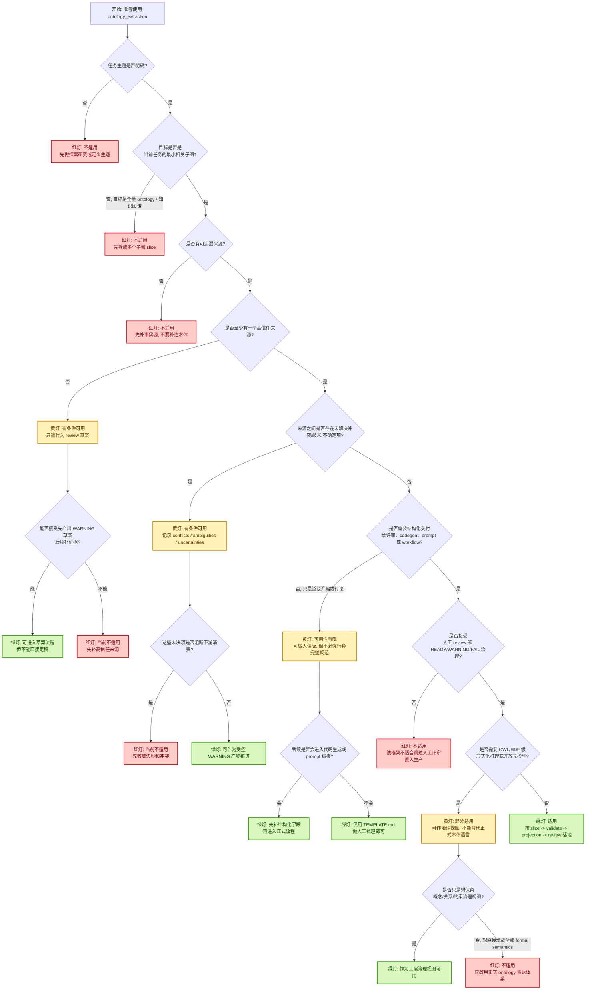

# ontology_extraction 红黄绿决策指南

本文档把 `ontology_extraction` 的适用性矩阵压缩成一张红黄绿决策图，方便团队在真正开始切片前，先判断当前任务到底适不适合使用这套规范。

适用目标：

- 快速判断当前任务是否应该进入 ontology slice 流程
- 区分当前产物应当是 `READY` 候选、`WARNING` 草案，还是暂时不该用本规范
- 区分“受控语义切片”任务与“全量本体建模 / formal ontology”任务

---

## 红黄绿含义

- `绿灯`：适合按本规范继续做 slice / projection / review。
- `黄灯`：可以用，但只能作为受控草案、局部治理视图，或需要补证据后再推进。
- `红灯`：当前不适合，应先补主题、补来源，或改用其他 ontology / knowledge modeling 方法。

---

## 红黄绿决策图

---

## 快速判定口径

- 看到 `绿灯`：说明当前场景符合本规范的核心前提，可以继续按 `slice -> validate -> projection -> review` 流程推进。
- 看到 `黄灯`：说明结构化切片仍然有价值，但当前更适合作为 `WARNING` 草案、局部治理视图，或等待补证据后再定稿。
- 看到 `红灯`：说明当前问题不该直接交给 `ontology_extraction`；先缩范围、补事实源，或改用更适合的 ontology / knowledge modeling 方法。

## 这张图最适合回答的问题

- 当前任务到底该不该做 ontology slice？
- 当前阶段能不能直接用本规范沉淀结果？
- 这次产出应当是 `READY` 候选、`WARNING` 草案，还是先不要做？
- 当前需求更像“受控语义切片”，还是“全量本体建模 / formal ontology”任务？

## 推荐用法

1. 先用这张图判断当前任务是红灯、黄灯还是绿灯。
2. 如果是绿灯，再回到 [../README.md](../README.md) 继续看模板、样例、校验脚本和评审流程。
3. 如果是黄灯，优先补 `sources`、`conflicts`、`ambiguities` 和 `uncertainties`，不要直接往下游硬推。
4. 如果是红灯，先换问题定义方式，再决定是否回到本规范。

## 相关入口

- [../README.md](../README.md)：规范包总览与使用路径
- [./FIELD_GUIDE.md](./FIELD_GUIDE.md)：字段语义和填报口径
- [./REVIEW_CHECKLIST.md](./REVIEW_CHECKLIST.md)：slice / projection 统一评审标准
- [./DOWNSTREAM_MAPPING_GUIDE.md](./DOWNSTREAM_MAPPING_GUIDE.md)：下游映射规则
